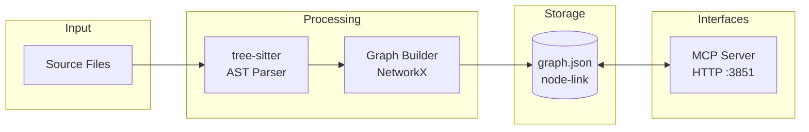

# Graphify

Static, file-based code knowledge graph for semantic code understanding, relationship mapping, and intelligent code navigation.

## Overview

Graphify parses your codebase with tree-sitter into a static `graph.json` (NetworkX node-link format), enabling:

- **Structural Code Search** - Find code by relationship, not just text matching
- **Relationship Mapping** - Understand how functions, classes, and modules connect
- **Call Graph Analysis** - Trace function calls and dependencies
- **Impact Analysis** - Identify what code is affected by changes

There is **no database, no Cypher, and no embeddings** — the entire graph is a single JSON file that is served over an HTTP MCP endpoint. All Python runs inside the `coding-services` container.

## Architecture



**Components:**
- **tree-sitter Parser** - Extracts AST/syntax tree from source files
- **Graph Builder** - Builds a NetworkX graph of code elements and relationships
- **graph.json** - Static node-link JSON at `.data/graphify/graphify-out/graph.json`, stamped with `built_at_commit`
- **MCP Server** - HTTP MCP endpoint providing query tools for Claude Code / Copilot / OpenCode

## Where It Runs

Graphify runs **inside the `coding-services` container** as the supervisord program `mcp-servers:graphify`. It serves an HTTP MCP endpoint at:

| Service | Endpoint | Description |
|---------|----------|-------------|
| Graphify MCP | `http://localhost:3851/mcp` | HTTP MCP tools over the static graph |

**MCP tools**: `query_graph`, `get_node`, `get_neighbors`, `shortest_path`, `graph_stats`, `god_nodes`.

All Python stays in the container. The host talks to it through the `bin/graphify` shim, which forwards to `docker exec coding-services graphify …`.

## Extraction Scope

What graphify parses is controlled by a repo-root `.graphifyignore` file (same semantics as `.gitignore`). Add paths there to keep large or irrelevant trees out of the graph.

## Installation

Graphify is a git submodule built into the `coding-services` Docker image — it ships with the container. No separate install or database provisioning is required. Bringing up the stack starts it automatically:

```bash
cd docker && docker-compose up -d coding-services
```

The graph output directory (`.data/graphify/graphify-out/`) is bind-mounted, so the built `graph.json` persists on the host across container restarts.

## Usage

### Via MCP Tools

Graphify exposes MCP tools accessible in Claude Code / Copilot / OpenCode:

```javascript
// Ask a structural question (BFS over the graph)
mcp__graphify__query_graph({
  query: "What functions call captureForegroundTokens?"
})

// Fetch a single node
mcp__graphify__get_node({ id: "ObservationWriter" })

// Explore neighbours of a node
mcp__graphify__get_neighbors({ id: "ObservationWriter" })

// Shortest path between two concepts
mcp__graphify__shortest_path({ source: "ObservationWriter", target: "obs-api" })

// Graph statistics / most-connected hubs
mcp__graphify__graph_stats()
mcp__graphify__god_nodes({ top: 20 })
```

### Via the Host CLI

The `bin/graphify` shim forwards to the container:

```bash
graphify query "How does the ETM watchdog reclaim a stalled session?"   # BFS, broad context
graphify query "what calls captureForegroundTokens" --dfs               # DFS, trace a path
graphify path "ObservationWriter" "obs-api"                             # shortest path between two concepts
graphify explain "CodeGraphAgent"                                       # plain-language node explanation
graphify god-nodes --top 20                                            # most-connected hubs
```

A `/graphify` skill is registered for claude / copilot / opencode as the preferred entry point for structural codebase questions.

## Rebuilding the Graph

The `graph.json` is a static snapshot stamped with `built_at_commit`; rebuild it when it drifts behind `HEAD`.

```bash
graphify update /workspace/coding        # incremental (AST only, no LLM) — fast, use this most of the time
graphify extract /workspace/coding       # full re-extract incl. docs/PDF semantic pass (routes docs LLM via the proxy)
graphify extract /workspace/coding --code-only   # full code re-extract, no LLM/network
```

Paths are **container paths** — the repo is mounted read-only at `/workspace/coding`; output is written to the bind-mounted `.data/graphify`.

### Dashboard Re-index Button

The System Health Dashboard shows how many commits behind the graph is and provides a **Re-index** button. That button runs `graphify update` (incremental AST) via `scripts/graphify-reindex.sh`.

## Health Monitoring

Graph freshness is monitored by the system health dashboard:

- **Freshness Check**: Compares the graph's `built_at_commit` against current `HEAD`
- **Dashboard**: Visible in the System Health Dashboard (`http://localhost:3032`)

### Graph Freshness Status

| Status | Commits Behind | Action |
|--------|---------------|--------|
| Fresh | 0-50 | None needed |
| Stale | >50 | Re-index recommended (`graphify update`) |
| Diverged | N/A (not in history) | Re-index required |
| No Graph | N/A | Initial extraction needed (`graphify extract`) |

## Integration with Semantic Analysis

The `analyze_code_graph` tool exposed by the semantic-analysis MCP server reads the **same** `graph.json` — there is no separate database to keep in sync.

## Troubleshooting

### Container Not Running

```bash
# Symptom: "graphify: container 'coding-services' is not running"
cd docker && docker-compose up -d coding-services
```

### Graph Missing or Empty

```bash
# Verify the graph exists and check its built_at_commit stamp
ls -la .data/graphify/graphify-out/graph.json

# Build it from scratch
graphify extract /workspace/coding
```

### Graph Out of Date

```bash
# Incremental rebuild (fast)
graphify update /workspace/coding
```

## Related Documentation

- [Health System](../health-system/README.md) - System health monitoring including graph freshness
- [Getting Started](../getting-started.md) - Installation and configuration
- [System Overview](../system-overview.md) - How Graphify fits into the system
