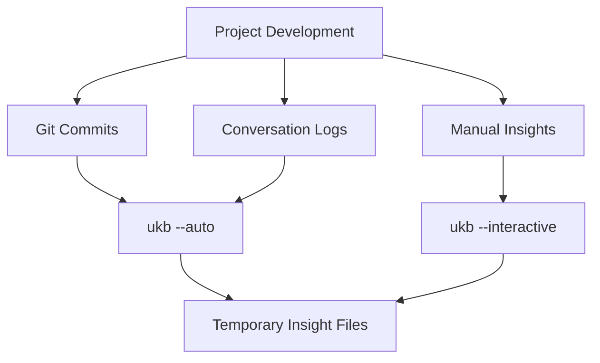
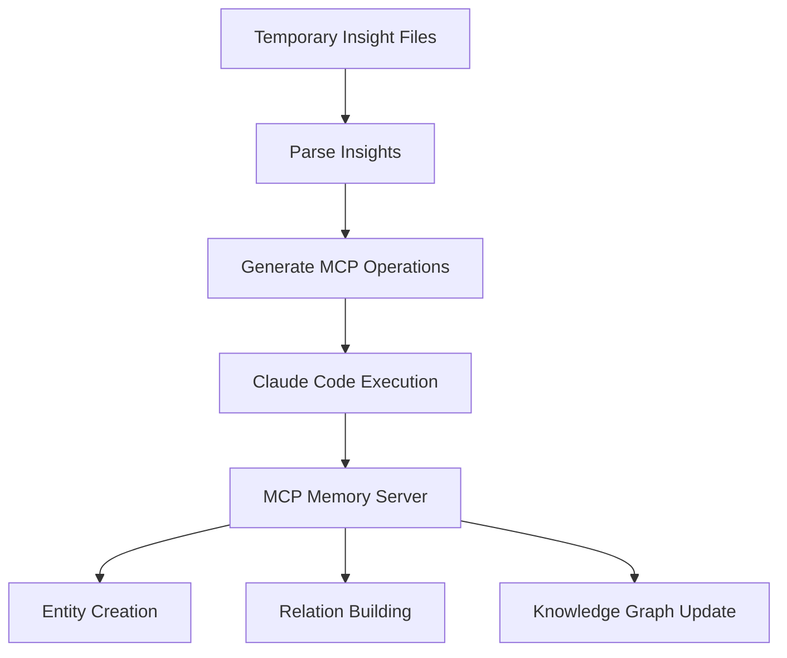
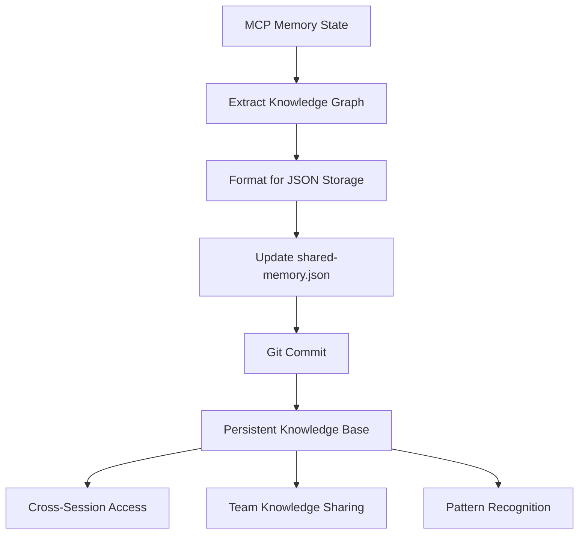

# Knowledge Flow Architecture

## Overview

This document describes the comprehensive flow of information from project insights through MCP memory to persistent git storage in the Claude knowledge management system.

## Architecture Components

### 1. **Project Insights Capture**
- **Source**: Development sessions, git commits, conversation logs
- **Tools**: `ukb` (Update Knowledge Base) script
- **Modes**: Interactive and automatic capture
- **Location**: Any project directory

### 2. **MCP Memory Layer** 
- **Purpose**: Runtime knowledge graph storage and operations
- **Technology**: Model Context Protocol (MCP) memory server
- **Scope**: Session-persistent and cross-session knowledge
- **Operations**: Create entities, add observations, create relations

### 3. **Local Storage Sync**
- **File**: `shared-memory.json` in the Claude project
- **Purpose**: Git-trackable persistent storage
- **Format**: Structured JSON with entities, relations, and metadata
- **Versioning**: Git history provides knowledge evolution tracking

## Detailed Information Flow

### Phase 1: Insight Capture



**Process**:
1. **Automatic Mode** (`ukb --auto`):
   - Analyzes recent git commits for patterns
   - Extracts architectural insights from commit messages
   - Identifies performance optimizations and bug fixes
   - Generates insights based on file changes and patterns

2. **Interactive Mode** (`ukb --interactive`):
   - Prompts developer for deep insights
   - Captures thought processes and decision rationale
   - Documents architectural decisions and trade-offs
   - Records learning experiences and gotchas

### Phase 2: MCP Memory Integration



**Process**:
1. **Insight Processing**:
   - Parse temporary JSON files containing captured insights
   - Convert insights to MCP-compatible entity format
   - Generate observations and metadata for each insight

2. **MCP Operations** (via Claude Code):
   ```bash
   # These operations are executed by Claude Code:
   mcp__memory__create_entities    # Create new knowledge entities
   mcp__memory__add_observations   # Add details to existing entities
   mcp__memory__create_relations   # Connect related concepts
   mcp__memory__search_nodes       # Find existing related entities
   ```

3. **Knowledge Graph Building**:
   - Creates bidirectional relationships between concepts
   - Links project-specific insights to transferable patterns
   - Maintains significance rankings for insight prioritization

### Phase 3: Persistent Storage Sync



**Process**:
1. **Memory Extraction**:
   - Query MCP memory for complete knowledge graph
   - Extract entities, relations, and metadata
   - Preserve significance rankings and timestamps

2. **JSON Serialization**:
   - Convert MCP memory format to structured JSON
   - Maintain backward compatibility with existing tools
   - Include metadata for versioning and provenance

3. **Git Integration**:
   - Update `shared-memory.json` with latest knowledge state
   - Commit changes to git with descriptive messages
   - Enable diff viewing of knowledge evolution

## Data Flow Specifications

### Insight Format
```json
{
  "name": "InsightName",
  "entityType": "TransferablePattern|CodingInsight|Architecture",
  "observations": [
    "Detailed description of the insight",
    "Implementation approach",
    "Benefits and trade-offs"
  ],
  "significance": 8,
  "project": "source-project",
  "technologies": ["React", "TypeScript"],
  "created": "2025-06-10T18:53:07Z"
}
```

### MCP Memory Operations
```javascript
// Entity Creation
mcp__memory__create_entities({
  entities: [{
    name: "ReduxStateManagementPattern",
    entityType: "TransferablePattern",
    observations: [
      "Redux Toolkit with typed hooks for React applications",
      "Feature-based slice organization improves maintainability"
    ]
  }]
})

// Relation Creation
mcp__memory__create_relations({
  relations: [{
    from: "ReduxStateManagementPattern",
    to: "TimelineProject", 
    relationType: "implemented in"
  }]
})
```

### Shared Memory JSON Structure
```json
{
  "metadata": {
    "version": "2.0.0",
    "last_updated": "2025-06-10T18:53:07Z",
    "total_entities": 12,
    "total_relations": 21,
    "last_mode": "interactive"
  },
  "entities": [...],
  "relations": [...]
}
```

## Workflow Integration

### Developer Workflow
1. **Development Session**: Code, commit, iterate
2. **Insight Capture**: Run `ukb --auto` or `ukb --interactive`
3. **MCP Sync**: Claude Code processes MCP operations
4. **Persistence**: Knowledge automatically syncs to git
5. **Sharing**: Team members get latest knowledge on pull

### Claude Code Integration
1. **Session Start**: Load knowledge from `shared-memory.json`
2. **Runtime**: Access MCP memory for context-aware assistance
3. **Insight Processing**: Execute MCP operations from `ukb` script
4. **Session End**: Sync MCP state back to persistent storage

### Knowledge Evolution
1. **Capture**: New insights added continuously
2. **Refine**: Existing insights enhanced with new observations
3. **Connect**: Relationships discovered and documented
4. **Transfer**: Patterns generalized across projects

## Bidirectional Sync Mechanism

### MCP → Local Storage
- **Trigger**: `ukb --auto` completion, session end
- **Process**: Extract complete MCP memory state
- **Output**: Updated `shared-memory.json`
- **Verification**: Compare entity/relation counts

### Local Storage → MCP  
- **Trigger**: Claude Code session start, manual sync
- **Process**: Load `shared-memory.json` into MCP memory
- **Validation**: Ensure all entities and relations exist
- **Recovery**: Handle missing or corrupted data gracefully

## Error Handling and Recovery

### Sync Failures
- **Detection**: Compare timestamps and entity counts
- **Recovery**: Manual sync via `ukb --sync` command
- **Validation**: Verify bidirectional consistency

### Data Corruption
- **Prevention**: JSON schema validation before writes
- **Detection**: Parse errors during load operations
- **Recovery**: Restore from git history, rebuild from MCP

### Missing Dependencies
- **MCP Server**: Graceful degradation to local-only mode
- **Claude Code**: Standalone operation with limited functionality
- **Git**: Warning messages, continue with local storage

## Performance Considerations

### Optimization Strategies
- **Incremental Sync**: Only transfer changed entities
- **Batched Operations**: Group MCP calls for efficiency
- **Lazy Loading**: Load knowledge on-demand
- **Caching**: Cache frequently accessed patterns

### Scalability Limits
- **Entity Count**: ~1000 entities before performance impact
- **Relation Density**: Optimize for <10 relations per entity
- **Observation Size**: Limit observations to <500 words each
- **Sync Frequency**: Balance between freshness and performance

## Security and Privacy

### Data Protection
- **Local Storage**: No external transmission required
- **Git History**: Standard git security practices apply
- **MCP Memory**: Session-scoped, no persistent external storage
- **Sensitive Data**: Exclude personal/proprietary information

### Access Control
- **File Permissions**: Standard filesystem permissions
- **Git Repository**: Repository-level access control
- **MCP Operations**: Claude Code session-scoped access
- **Sharing**: Explicit git push required for team sharing

## Monitoring and Diagnostics

### Health Checks
```bash
# Verify sync status
ukb --status

# Compare MCP vs local storage
ukb --validate

# Show knowledge graph statistics  
vkb --stats
```

### Debugging Tools
- **Verbose Logging**: `ukb --debug --interactive`
- **Sync Validation**: `ukb --validate --verbose`
- **MCP Inspection**: Direct MCP memory queries via Claude Code
- **Git History**: Track knowledge evolution over time

## Future Enhancements

### Planned Improvements
1. **Real-time Sync**: Automatic MCP ↔ storage synchronization
2. **Conflict Resolution**: Handle concurrent modifications gracefully
3. **Pattern Recognition**: ML-assisted insight categorization
4. **Cross-Project Transfer**: Automated pattern application suggestions
5. **Team Collaboration**: Multi-user knowledge contribution workflows

### Integration Opportunities
- **IDE Plugins**: Direct insight capture from development environment
- **CI/CD Integration**: Automatic insight extraction from build processes
- **Documentation Tools**: Auto-generate docs from knowledge patterns
- **Code Review**: Surface relevant patterns during review process

---

This architecture ensures that valuable development insights are captured, organized, and made accessible across development sessions while maintaining data integrity and enabling team collaboration through git-based sharing.