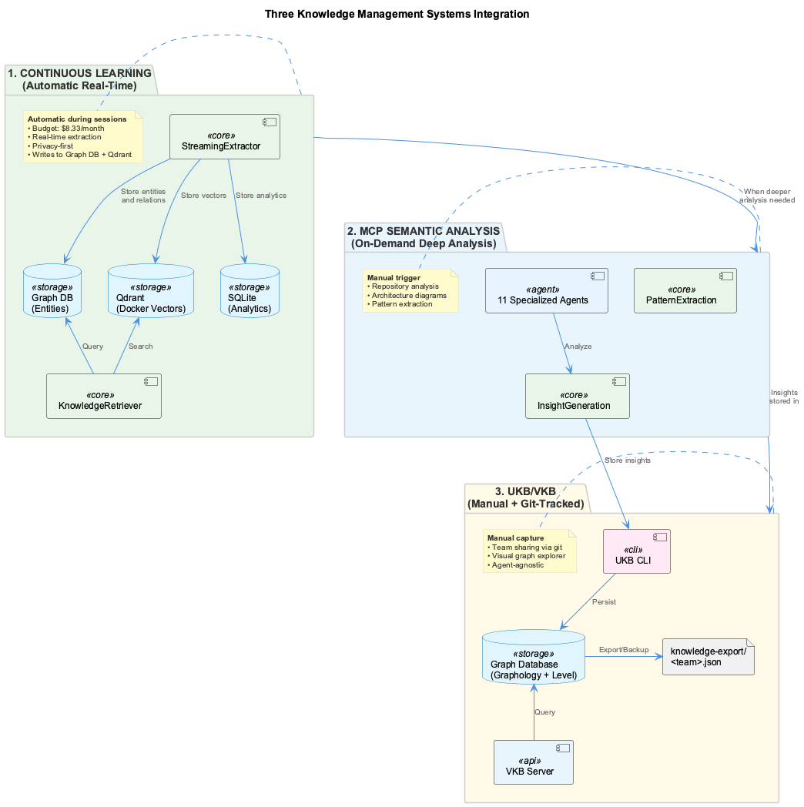
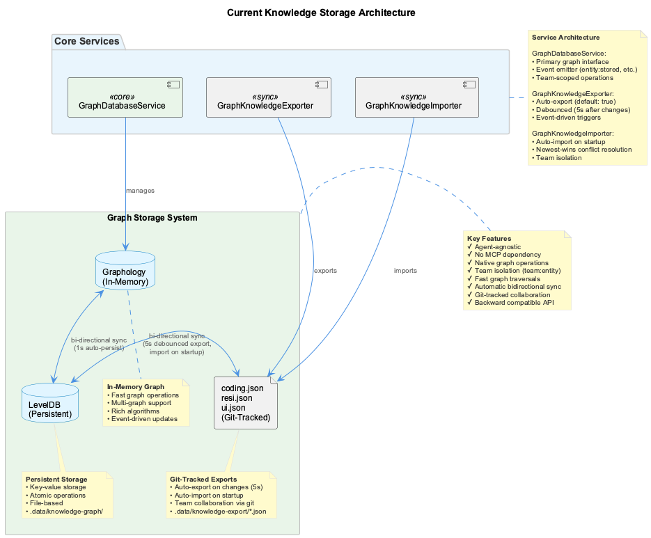

# Knowledge Management

**Purpose**: Comprehensive knowledge management through **three complementary systems**.

---

## 🚀 Quick Navigation

**New to knowledge management?** Start here:

| Document | Purpose | Audience |
|----------|---------|----------|
| **[System Comparison](system-comparison.md)** | **START HERE** - Understand all three knowledge systems | All users |
| **[Continuous Learning System](continuous-learning-system.md)** | Real-time session learning (NEW) | Developers |
| **UKB/VKB** (this document) | Manual knowledge capture & visualization | Team leads |
| **[MCP Semantic Analysis](../integrations/mcp-semantic-analysis.md)** | Deep code analysis with 11 agents | Architects |

---

## Three Complementary Knowledge Systems

The coding project provides **three knowledge management systems** that work together:

### 1. UKB/VKB (Manual Knowledge Capture)

**This Document** - Manual knowledge capture and visualization:

- **UKB**: Command-line tool for capturing and updating knowledge
- **VKB**: Web-based visualization server for exploring knowledge graphs
- **Graph Database Storage**: Agent-agnostic persistent storage (Graphology + Level)
- **Multi-Project Support**: Domain-specific knowledge bases with team isolation

**When to use**: Manual capture of architectural decisions, team-wide knowledge sharing

**Storage Architecture**: See [Graph Storage Architecture](#graph-storage-architecture) below.

### 2. Continuous Learning System (Automatic Real-Time)

**[Documentation](continuous-learning-system.md)** - Automatic real-time learning:

- **Automatic extraction** from live coding sessions
- **Budget-conscious** ($8.33/month limit)
- **Privacy-first** (sensitive data → local models)
- **Agent-agnostic** (Claude/Copilot/Cursor)

**When to use**: Real-time learning, budget control, privacy-critical work

### 3. MCP Semantic Analysis (Deep Code Analysis)

**[Documentation](../integrations/mcp-semantic-analysis.md)** - 11-agent deep analysis:

- **11 specialized agents** for comprehensive code analysis
- **On-demand analysis** via MCP tools
- **Repository-wide** pattern extraction
- **Architecture diagrams** with PlantUML

**When to use**: Full repository analysis, architecture review, pattern extraction

---

## How the Three Systems Work Together



The three systems form a complementary knowledge management pipeline:

1. **Continuous Learning** extracts knowledge automatically during coding sessions
2. **MCP Semantic Analysis** provides deep repository analysis when needed
3. **UKB/VKB** stores manual insights and analysis results in the graph database

**Data Flow** (as of 2025-10-22):
- Continuous Learning → Graph DB + Qdrant (entities/relations + vector search)
- MCP Semantic Analysis → UKB/VKB (deep insights and patterns)
- UKB/VKB → Graph Database (persistent storage)
- SQLite → Analytics only (budget tracking, session metrics)

**See [System Comparison](system-comparison.md) for detailed comparison.**

---

## What This Document Covers (UKB/VKB)

This document focuses on the **UKB/VKB system** for manual knowledge capture and visualization.

### Core Capabilities

- **Knowledge Capture** - Interactive and automated insight extraction
- **Graph Visualization** - Interactive web-based knowledge graph explorer
- **Cross-Project Learning** - Share patterns across multiple projects
- **Semantic Search** - Find relevant knowledge quickly
- **Git Integration** - Automatic knowledge updates from commits

---

## Quick Start

### Basic Usage

```bash
# Update knowledge base (auto-analyzes recent git commits)
ukb

# Interactive deep insight capture
ukb --interactive

# Start visualization server
vkb

# View knowledge graph at http://localhost:8080
```

### Common Workflows

**Daily Development:**
```bash
# Morning - view accumulated knowledge
vkb

# Throughout day - normal development
git commit -m "implement feature"

# End of day - capture insights
ukb
```

**Team Knowledge Sharing:**
```bash
# Capture architectural decisions
ukb --interactive

# Share via git
git add shared-memory*.json
git commit -m "docs: update knowledge base"
git push

# Team members get updates
git pull
vkb restart  # Refresh visualization
```

---

## Knowledge Management Components

### [UKB - Update Knowledge Base](./ukb-update.md)

Command-line tool for capturing development insights:

- **Auto Mode**: Analyzes recent git commits for patterns
- **Interactive Mode**: Guided prompts for structured insight capture
- **Search**: Find relevant knowledge by keyword
- **Management**: Add, remove, rename entities and relations

**Key Features:**
- Cross-platform Node.js implementation
- Git history analysis with pattern detection
- Structured problem-solution-rationale capture
- Real-time validation and quality assurance
- Graph database persistence for agent-agnostic access

### [VKB - Visualize Knowledge Base](./vkb-visualize.md)

Web-based knowledge graph visualization server:

- **Interactive Visualization**: Explore knowledge graphs in browser
- **Server Management**: Start, stop, restart with automatic recovery
- **Real-time Updates**: Refresh data without restart
- **Health Monitoring**: Automatic health checks and status reporting
- **Programmatic API**: Control server from Node.js code

**Key Features:**
- Cross-platform server management
- Process lifecycle control with PID tracking
- Port conflict resolution
- Comprehensive logging and diagnostics
- Browser integration (auto-open on start)

### [Knowledge Workflows](./workflows.md)

Orchestrated analysis workflows for comprehensive knowledge gathering:

- **Repository Analysis**: Comprehensive codebase analysis
- **Conversation Analysis**: Extract insights from discussions
- **Technology Research**: Automated research on technologies
- **Cross-Project Learning**: Share knowledge across projects

---

## Domain-Specific Knowledge Bases

The system automatically creates domain-specific knowledge bases for multi-project teams:

```
/Users/<username>/Agentic/coding/
├── shared-memory-coding.json     # Cross-team patterns
├── shared-memory-raas.json       # RaaS domain knowledge
├── shared-memory-ui.json         # UI team knowledge
└── shared-memory-resi.json       # Resilience team knowledge
```

**Benefits:**
- Domain isolation - specialized knowledge per team
- Cross-project patterns - shared architectural patterns
- Team-specific expertise - domain expert knowledge repositories
- Onboarding efficiency - domain-specific guidance for new members

### Creating Domain Knowledge Base

```bash
# Navigate to domain project directory
cd /path/to/raas-project

# First ukb command automatically creates domain-specific file
ukb --list-entities
# Creates: /Users/<username>/Agentic/coding/shared-memory-raas.json

# Add domain entity
ukb --interactive
```

---

## Knowledge Types

### Entity Types

- **Pattern**: Reusable solutions and approaches
- **Solution**: Specific problem fixes
- **Architecture**: System design insights
- **Tool**: Technology and framework usage
- **Workflow**: Process and methodology insights
- **Problem**: Challenges and issues encountered

### Relation Types

- **implements**: Pattern implements architecture
- **solves**: Solution solves problem
- **uses**: Component uses tool
- **depends_on**: Dependency relationship
- **related_to**: General relationship
- **improves**: Enhancement relationship

---

## Integration with Coding Workflows

### Claude Code Integration

```javascript
// MCP tools available in Claude Code
const tools = [
  'mcp__memory__create_entities',      // Create knowledge entities
  'mcp__memory__search_nodes',         // Search knowledge graph
  'mcp__semantic-analysis__analyze_repository',  // Analyze codebase
  'mcp__semantic-analysis__analyze_conversation' // Extract insights
];
```

### VSCode CoPilot Integration

```bash
# Start CoPilot with knowledge management
coding --copilot

# HTTP endpoints
POST /api/knowledge/update      # Update knowledge base
GET  /api/knowledge/search      # Search knowledge
GET  /api/knowledge/stats       # Get statistics
POST /api/semantic/analyze-repository  # Analyze code
```

### Direct CLI Fallback

```bash
# Direct knowledge management
ukb --interactive              # Capture knowledge
ukb --auto                    # Analyze git commits
vkb                          # View knowledge graph
```

---

## Data Structure

### Entity Structure

```json
{
  "id": "unique-identifier",
  "name": "EntityName",
  "entityType": "Pattern|Solution|Architecture|Tool",
  "significance": 8,
  "observations": [
    {
      "type": "insight",
      "content": "Key learning or observation",
      "date": "ISO-8601 timestamp"
    }
  ],
  "metadata": {
    "technologies": ["React", "Node.js"],
    "files": ["src/component.js"],
    "references": ["https://docs.example.com"]
  }
}
```

### Relation Structure

```json
{
  "id": "unique-identifier",
  "from": "SourceEntityName",
  "to": "TargetEntityName",
  "relationType": "implements|solves|uses",
  "significance": 7,
  "created": "ISO-8601 timestamp"
}
```

---

## Graph Storage Architecture

The knowledge management system uses a **graph-first storage architecture** that is agent-agnostic and works with any AI coding assistant (Claude Code, Copilot, Cursor, etc.).

### Storage Components


**Primary Storage**: **Graphology + Level**

1. **Graphology** (In-Memory Graph)
   - Fast graph operations and traversals
   - Multi-graph support (multiple edges between nodes)
   - Rich graph algorithms ecosystem
   - Native JavaScript implementation

2. **Level v10.0.0** (Persistent Storage)
   - Key-value persistence layer
   - Atomic operations
   - File-based storage in `.data/knowledge-graph/`
   - Automatic persistence of graph state

**Key Benefits**:
- ✅ **Agent-agnostic**: No dependency on Claude Code or MCP Memory
- ✅ **Team isolation**: Node ID pattern `${team}:${entityName}`
- ✅ **Persistent**: Automatic file-based persistence
- ✅ **Fast**: In-memory graph operations
- ✅ **Backward compatible**: API matches previous SQLite format

### Data Flow


**Entity Creation**:
```typescript
// UKB command
ukb add "Pattern" "API Design Pattern"

// Flows to DatabaseManager
→ GraphDatabaseService.storeEntity(entity, {team: 'coding'})

// Creates graph node
→ graphology.addNode('coding:APIDesignPattern', {
    name: 'API Design Pattern',
    entityType: 'Pattern',
    observations: [...],
    team: 'coding',
    source: 'manual'
  })

// Persists to disk
→ level.put('coding:APIDesignPattern', nodeData)
```

**Entity Query**:
```typescript
// VKB HTTP API
GET /api/entities?team=coding

// Fast in-memory graph traversal
→ graphology.filterNodes(node => node.startsWith('coding:'))

// Returns SQLite-compatible format
→ JSON response with entity_name, entity_type, observations, etc.
```

### Storage Evolution



**Phase 1: JSON Storage** (2024)
- Manual `shared-memory.json` files
- Limited querying capability
- No relationship modeling

**Phase 2: SQLite + Qdrant** (Early 2025 - DEPRECATED)
- Relational database for entities
- Vector search with Qdrant
- Complex joins for relationships
- MCP Memory dependency

**Phase 3: Graph DB + Qdrant** (Current - October 2025)
- Native graph database (Graphology + Level) for entities/relations
- Qdrant for vector search
- Agent-agnostic architecture
- No MCP Memory dependency
- Team isolation via node IDs
- SQLite retained for analytics only (budget, sessions, cache)

### Node ID Pattern

All graph nodes use a **team-scoped ID pattern**:

```
${team}:${entityName}
```

**Examples**:
- `coding:ReactHooksPattern`
- `project-x:AuthenticationSolution`
- `data-team:ETLPipeline`

This provides:
- **Team isolation**: Each team's knowledge is separate
- **No conflicts**: Different teams can have entities with same names
- **Multi-team support**: Single graph database serves all teams
- **Fast filtering**: Prefix-based team queries

### API Compatibility

The GraphDatabaseService maintains **backward compatibility** with the previous SQLite API:

**Entity Format** (SQLite-compatible):
```json
{
  "id": "auto-generated-uuid",
  "entity_name": "Pattern Name",
  "entity_type": "Pattern",
  "team": "coding",
  "observations": ["observation 1", "observation 2"],
  "confidence": 0.9,
  "source": "manual",
  "metadata": {}
}
```

This ensures:
- ✅ VKB frontend works without changes
- ✅ Existing tools and scripts continue to function
- ✅ Gradual migration path from SQLite

### Configuration

**Current Configuration** (as of 2025-10-22):

```javascript
// DatabaseManager configuration
{
  sqlite: {
    path: '.data/knowledge.db',
    enabled: true  // Analytics only: budget_events, session_metrics, embedding_cache
  },
  qdrant: {
    enabled: true  // Vector search
  },
  graphDbPath: '.data/knowledge-graph'  // Primary knowledge storage
}
```

**Storage Responsibilities**:
- **Graph DB**: All knowledge entities and relations
- **Qdrant**: Vector embeddings for semantic search
- **SQLite**: Analytics only (no knowledge tables)

---

## Full Documentation

### Detailed Guides

- **[UKB - Update Knowledge Base](./ukb-update.md)** - Complete UKB documentation with API reference and use cases
- **[VKB - Visualize Knowledge Base](./vkb-visualize.md)** - Complete VKB documentation with server management and API reference
- **[Knowledge Workflows](./workflows.md)** - Orchestrated analysis workflows and cross-project learning

### Integration Documentation

- **[MCP Semantic Analysis](../integrations/mcp-semantic-analysis.md)** - 11-agent AI-powered analysis system
- **[VSCode CoPilot](../integrations/vscode-copilot.md)** - VSCode extension with knowledge management
- **[Browser Access](../integrations/browser-access.md)** - Web research and data extraction

---

## See Also

- [System Overview](../system-overview.md#knowledge-management)
- [Getting Started](../getting-started.md)
- [Integration Overview](../integrations/README.md)
