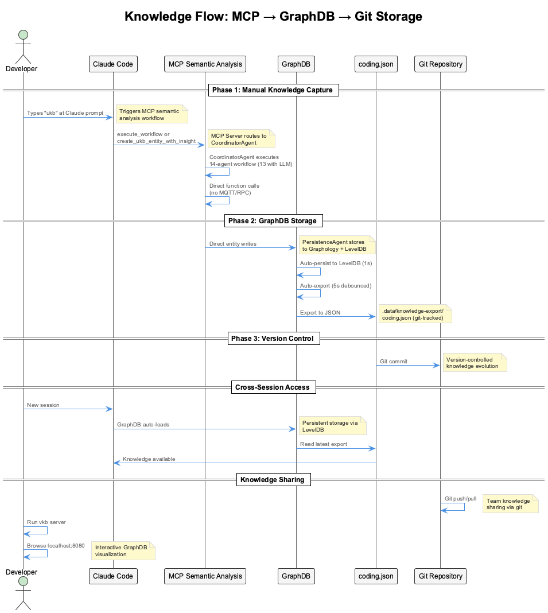
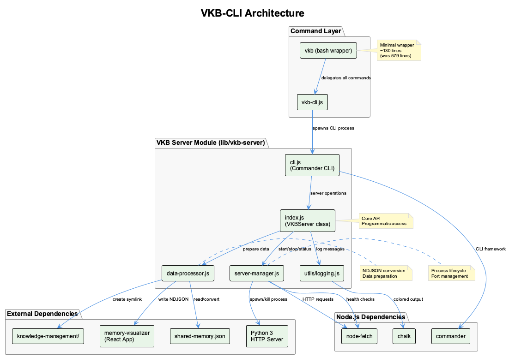

# Knowledge Management - Two Complementary Approaches

Comprehensive knowledge capture and retrieval through dual systems: manual/batch knowledge curation (UKB) and real-time session learning (Continuous Learning).

## What It Does

The Knowledge Management system provides **two complementary approaches** for capturing and leveraging development insights:

- **Manual/Batch Approach (UKB)** - User-initiated knowledge capture for team sharing and architectural insights
- **Online Approach (Continuous Learning)** - Real-time session learning with semantic search and retrieval
- **Unified Visualization (VKB)** - Web-based visualization for knowledge from both sources
- **Ontology Classification** - Automatic categorization into 5 entity classes

**Critical**: These are **NOT parallel systems** - they serve different purposes and work together:
- **UKB**: Manual curation, team collaboration, git-tracked sharing
- **Continuous Learning**: Real-time session learning, semantic retrieval, budget-aware

## Architecture

### Two Complementary Systems



**System 1: Manual/Batch (UKB - Update Knowledge Base)**
- **Trigger**: Manual `ukb` command
- **Input**: Git commits or interactive prompts
- **Processing**: Pattern detection, significance scoring, ontology classification
- **Storage**: GraphDB (Graphology + LevelDB + JSON export)
- **Purpose**: Team sharing, architectural documentation, curated insights
- **Collaboration**: Git-tracked JSON exports for PR reviews

**System 2: Online (Continuous Learning)**
- **Trigger**: Automatic during Claude Code sessions
- **Input**: Live Session Logs (LSL) real-time exchanges
- **Processing**: Embedding generation, semantic analysis, temporal decay
- **Storage**: Qdrant (vectors) + SQLite (analytics)
- **Purpose**: Session learning, semantic retrieval, cross-session continuity
- **Privacy**: Local models for sensitive data

**Visualization: VKB (Visualize Knowledge Base)**
- **Web UI**: http://localhost:8080
- **Displays**: Knowledge from both UKB (GraphDB) and Continuous Learning (Qdrant)
- **Features**: Graph visualization, search, entity relationships

## Manual/Batch Approach (UKB)


### What It Is

UKB is a **command-line tool** for deliberate knowledge capture through git analysis or interactive prompts.

**Primary Use Cases**:
- Documenting architectural decisions
- Capturing bug fix patterns
- Recording lessons learned
- Creating team knowledge base
- Post-mortem analysis

### How It Works

**1. Git Analysis Mode** (Default):
```bash
ukb
```

Process flow:
1. Analyzes recent git commits for patterns
2. Incremental processing to avoid duplicate work
3. Automatic pattern detection with significance scoring
4. Categorizes commits (feature, fix, refactor, etc.)
5. Stores in GraphDB with ontology classification
6. Auto-exports to JSON for git tracking

**2. Interactive Mode** (Structured Capture):
```bash
ukb --interactive
```

Process flow:
1. Prompts for problem description
2. Prompts for solution approach
3. Prompts for rationale and learnings
4. Prompts for applicability and technologies
5. Validates URLs and technology names
6. Stores with significance score (1-10)
7. Applies ontology classification

### Storage Architecture

**GraphDB (Graphology + LevelDB)**:
```
.data/knowledge-graph/
  Level database files (persistent storage)

.data/knowledge-export/
  coding.json (git-tracked export)
  curriculum-alignment.json
  nano-degree.json
```

**Automatic JSON Export** (REQUIRED, not optional):
- Event-driven: Triggers on entity/relationship changes
- Debounced: 5-second delay to minimize I/O
- Team-based files for each project
- Git-tracked for team collaboration and PR reviews
- Keeps all three layers in sync (Graphology, LevelDB, JSON)

### Ontology Classification (4-Layer Pipeline)

**Classification Layers**:
1. **Heuristic Patterns** - Fast pattern matching (>10,000/sec)
2. **Keyword Matching** - Domain-specific keyword detection
3. **Semantic Similarity** - Embedding-based classification (~1,000/sec)
4. **LLM Analysis** - Fallback for ambiguous cases (<500ms)

**Entity Classes**:
- `ImplementationPattern` - Code patterns and best practices
- `ArchitecturalDecision` - System design choices
- `TechnicalSolution` - Problem-solving approaches
- `WorkflowPattern` - Development process patterns
- `ConfigurationPattern` - Setup and configuration knowledge

### Usage Examples

**End of Sprint Knowledge Capture**:
```bash
# Automatic git analysis
ukb

# Review what was captured
ukb --list-entities
```

**Document Architectural Decision**:
```bash
# Interactive mode with guided prompts
ukb --interactive

# Prompts guide you through:
# - Problem description
# - Solution approach
# - Rationale
# - Learnings
# - Applicability
# - Technologies
# - References (with URL validation)
```

**Search and Query**:
```bash
# Search by keyword
ukb search "authentication pattern"

# List by entity type
ukb --list-entities --type ArchitecturalDecision

# Show specific entity
ukb entity show "ReactHookPattern" --verbose
```

## Online Approach (Continuous Learning)


### What It Is

The Continuous Learning system **automatically learns** from your coding sessions in real-time, extracting knowledge from LSL exchanges without manual intervention.

**Primary Use Cases**:
- Real-time knowledge extraction during development
- Semantic search for relevant past insights
- Cross-session learning and continuity
- Pattern recognition across projects
- Budget-aware LLM usage tracking

### How It Works

**Automatic Operation** (No User Action Required):

1. **Session Monitoring**: Enhanced Transcript Monitor captures LSL exchanges
2. **Knowledge Extraction**: StreamingKnowledgeExtractor identifies valuable insights
3. **Embedding Generation**: Creates 384-dim (fast) or 1536-dim (accurate) vectors
4. **Storage**: Saves to Qdrant (vectors) + SQLite (metadata)
5. **Semantic Retrieval**: Available for future session queries
6. **Temporal Decay**: Knowledge ages over time, recent insights prioritized

**Processing Pipeline**:
```
LSL Exchange → Significance Detection → Knowledge Extraction →
Embedding Generation → Vector Storage (Qdrant) → Metadata Storage (SQLite) →
Available for Semantic Search
```

### Storage Architecture

**Qdrant (Vector Database)**:
```
Collections:
  knowledge_patterns (1536-dim)       # High-quality embeddings
  knowledge_patterns_small (384-dim)  # Fast local embeddings
  trajectory_analysis (384-dim)       # Session trajectory data
  session_memory (384-dim)            # Short-term session context
```

**SQLite (Analytics Database)**:
```
.cache/knowledge.db
  Tables:
    budget_events          # LLM cost tracking
    knowledge_extractions  # Extracted insights metadata
    session_metrics        # Performance and usage stats
    embedding_cache        # Cached embeddings for efficiency
```

### System Components

**UnifiedInferenceEngine**:
- Multi-provider LLM routing (Groq → OpenRouter → Local)
- Budget tracking ($8.33/month enforcement)
- Circuit breaker for provider failover
- Privacy-aware routing (sensitive data to local models)

**StreamingKnowledgeExtractor**:
- Real-time extraction from LSL exchanges
- Buffering for batch processing
- Significance filtering
- Context-aware extraction

**EmbeddingGenerator**:
- Dual-vector support: 384-dim (fast) and 1536-dim (accurate)
- Native JavaScript (Transformers.js) for local embeddings
- OpenAI API for high-quality embeddings
- Caching for efficiency

**KnowledgeRetriever**:
- Semantic search via vector similarity
- Temporal decay (recent knowledge prioritized)
- Cross-session retrieval
- Context-aware ranking

**DatabaseManager**:
- Coordinates Qdrant (vectors) + SQLite (analytics)
- Health monitoring and status reporting
- Automatic initialization
- Connection pooling

### Budget Management

**Cost Tracking**:
- Hard limit: $8.33/month
- Per-request cost calculation
- Budget alerts at 80% threshold
- Automatic fallback to local models when limit reached

### Privacy-First Architecture

**5-Layer Sensitivity Classification**:
1. API keys and secrets
2. Personal identifiable information (PII)
3. Business-sensitive data
4. Internal infrastructure details
5. Public/safe data

**Routing Logic**:
- Sensitive data → Local models (free, private)
- Safe data → Remote models (fast, accurate)
- Budget-aware fallback chain

## Visualization (VKB)



### What It Is

VKB (Visualize Knowledge Base) is a **web-based visualization tool** that displays knowledge from **both** UKB and Continuous Learning systems.

**Start VKB**:
```bash
cd /Users/q284340/Agentic/coding
vkb

# Opens browser at http://localhost:8080
```

### Features

**Graph Visualization**:
- Interactive force-directed graph
- Nodes: Entities from GraphDB or Qdrant
- Edges: Relationships between entities
- Color-coding by entity type
- Zoom, pan, and filter controls

**Knowledge Sources**:
- **UKB (GraphDB)**: Manual insights, git-analyzed patterns, team knowledge
- **Continuous Learning (Qdrant)**: Session-learned insights, embedded knowledge

**Search and Filter**:
- Full-text search across entities
- Filter by entity type
- Filter by significance score
- Filter by source (UKB vs Continuous Learning)
- Date range filtering

**Entity Details**:
- View complete entity information
- See relationships and connections
- Access source code references
- Review observations and learnings

## Comparison: UKB vs Continuous Learning

| Aspect | UKB (Manual/Batch) | Continuous Learning (Online) |
|--------|-------------------|------------------------------|
| **Trigger** | Manual `ukb` command | Automatic during sessions |
| **Input** | Git commits or prompts | LSL real-time exchanges |
| **Storage** | GraphDB (Graphology + LevelDB) | Qdrant (vectors) + SQLite |
| **Purpose** | Team sharing, curation | Session learning, retrieval |
| **Classification** | 4-layer ontology pipeline | Embedding similarity |
| **Collaboration** | Git-tracked JSON exports | Local, private |
| **Use Case** | Architectural docs, team knowledge | Cross-session continuity |
| **Visualization** | VKB (http://localhost:8080) | VKB (http://localhost:8080) |
| **Entities** | Named, curated | Embedded, automatic |
| **Search** | Name-based, type-based | Semantic similarity |

**When to Use UKB**:
- Documenting important architectural decisions
- Creating team knowledge base
- Post-sprint knowledge capture
- Recording bug fix patterns
- Manual curation for specific insights

**When to Use Continuous Learning**:
- Automatic session learning (always on)
- Semantic search during development
- Cross-session continuity
- No manual intervention needed
- Private, local-first learning

## Key Files

**UKB (Manual/Batch)**:
- `lib/knowledge-api/` - UKB core implementation
- `bin/ukb` - Command-line interface
- `.data/knowledge-graph/` - GraphDB storage (Graphology + LevelDB)
- `.data/knowledge-export/` - Git-tracked JSON exports
- `lib/ontology-classifier/` - 4-layer classification pipeline

**Continuous Learning (Online)**:
- `src/live-logging/StreamingKnowledgeExtractor.js` - Real-time extraction
- `src/knowledge-management/EmbeddingGenerator.js` - Vector embeddings
- `src/databases/DatabaseManager.js` - Qdrant + SQLite coordination
- `src/inference/UnifiedInferenceEngine.js` - Multi-provider LLM routing
- `.cache/knowledge.db` - SQLite analytics database

**VKB (Visualization)**:
- `bin/vkb` - Start VKB server
- `integrations/vkb-visualizer/` - Web UI implementation
- Port 8080 - VKB web interface

**Configuration**:
- `config/knowledge-system.json` - Continuous Learning configuration
- `config/live-logging-config.json` - LSL and extraction settings

## Integration

**Related Systems**:
- [LSL](../lsl/) - Provides real-time data for Continuous Learning
- [Health System](../health-system/) - Monitors knowledge system health
- [Ontology](./ontology.md) - 4-layer classification system documentation
- [Trajectories](../trajectories/) - Uses knowledge for trajectory analysis

**Related Tools**:
- [MCP Semantic Analysis](../integrations/mcp-semantic-analysis.md) - Deep code analysis (separate from knowledge management)

## See Also

- [UKB User Guide](./ukb-update.md) - Comprehensive UKB documentation
- [Continuous Learning System](./continuous-learning-system.md) - Full Continuous Learning docs
- [System Comparison](./system-comparison.md) - Detailed comparison of both approaches
- [VKB Visualization](./vkb-visualize.md) - VKB usage guide
