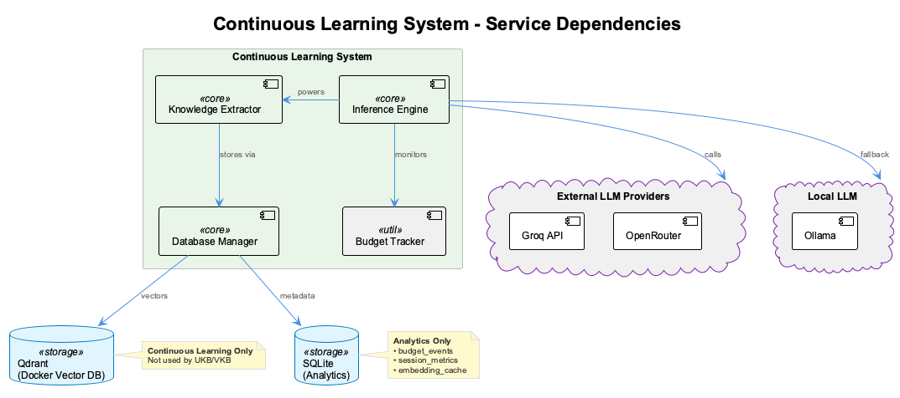

# Continuous Learning Knowledge System - Developer Documentation

**Version**: 1.0.0
**Last Updated**: 2025-10-19
**Status**: Production Ready

## Table of Contents

1. [Overview](#overview)
2. [System Architecture](#system-architecture)
3. [Getting Started](#getting-started)
4. [Configuration Guide](#configuration-guide)
5. [Usage Examples](#usage-examples)
6. [Integration Guide](#integration-guide)
7. [API Reference](#api-reference)
8. [Troubleshooting](#troubleshooting)
9. [Performance Tuning](#performance-tuning)

---

## Overview

The Continuous Learning Knowledge System is an agent-agnostic framework that extracts, stores, and retrieves knowledge from coding sessions. It learns from your development conversations and makes that knowledge available for future sessions.

**Important**: This system **complements** the [MCP Semantic Analysis Server](../integrations/mcp-semantic-analysis.md) (10-agent system). They are **NOT parallel implementations** but work together:

- **MCP Semantic Analysis**: Deep, on-demand code analysis with 10 specialized agents
- **Continuous Learning**: Real-time session learning with budget control and privacy-first architecture

See [System Comparison](system-comparison.md) for detailed comparison and how they work together.

### Key Features

- **Agent-Agnostic**: Works with Claude Code, GitHub Copilot, and other AI coding assistants
- **Real-Time Extraction**: Learns as you code, not after the fact
- **Semantic Search**: Find relevant knowledge using vector similarity
- **Budget-Aware**: Tracks LLM costs and enforces monthly limits
- **Privacy-First**: Automatically routes sensitive data to local models
- **Cross-Session Learning**: Share knowledge across different coding sessions

### System Components

**Note**: This is a **complementary system** to the [MCP Semantic Analysis Server](../integrations/mcp-semantic-analysis.md). See [System Comparison](system-comparison.md) for details on how they work together.


*Note: A [presentation-optimized version](../images/continuous-learning-architecture-presentation.png) (horizontal layout) is available for slides.*

The architecture consists of several layers:

- **Coding Session Layer**: Agent-agnostic interface (Claude Code, Copilot, Cursor, etc.)
- **Unified Inference Engine**: Multi-provider LLM routing with circuit breaker and budget enforcement
- **Knowledge Management**: Real-time extraction, retrieval, concept abstraction, temporal decay
- **Trajectory Tracking**: Intent classification and trajectory state analysis
- **Caching Layer**: Agent-agnostic cache with file/HTTP/MCP backends
- **Database Layer**: Dual-database (Qdrant for vectors, SQLite for analytics)

### Operational Dependencies



The system relies on the following operational services:

- **Qdrant** (vector database): Semantic search and knowledge retrieval
- **SQLite** (analytics database): Analytics, budget tracking, and temporal metadata
- **Groq**: Primary LLM provider for fast, cost-effective inference
- **OpenRouter**: Multi-model access for fallback and specialized tasks
- **Ollama**: Local models for sensitive data processing

---

## System Architecture

### Component Overview


The system is built around several key components:

**Inference Layer**:
- `UnifiedInferenceEngine` - Central LLM inference with multi-provider support
- `BudgetTracker` - Cost tracking and $8.33/month enforcement
- `SensitivityClassifier` - 5-layer privacy detection
- `CircuitBreaker` - Failure detection and provider failover

**Knowledge Management**:
- `StreamingKnowledgeExtractor` - Real-time knowledge extraction with buffering
- `KnowledgeRetriever` - Semantic search with temporal decay
- `ConceptAbstractionAgent` - Pattern generalization (3+ instances)
- `TemporalDecayTracker` - Knowledge aging and freshness management

**Trajectory & Caching**:
- `RealTimeTrajectoryAnalyzer` - Intent classification and trajectory tracking
- `AgentAgnosticCache` - Universal caching (file/HTTP/MCP backends)
- `DatabaseManager` - Dual-database coordination (Qdrant + SQLite)
- `EmbeddingGenerator` - Vector embedding generation (384-dim/1536-dim)

### Architectural Decisions

#### 1. Dual-Database Strategy

**Decision**: Use Qdrant for vector search + SQLite for analytics

**Rationale**:
- Qdrant: Optimized for semantic similarity search with HNSW indexing
- SQLite: Lightweight, zero-config, perfect for temporal queries and aggregations
- Both databases are embedded, eliminating deployment complexity

**Trade-offs**:
- Pro: No external database servers required
- Pro: Fast local queries
- Con: Limited to single-machine deployment (acceptable for our use case)

#### 2. Dual Vector Dimensions

**Decision**: Support both 384-dim (fast) and 1536-dim (accurate) embeddings

**Rationale**:
- 384-dim: Fast local embedding models (all-MiniLM-L6-v2), low cost, good for real-time
- 1536-dim: OpenAI text-embedding-3-small, high quality, good for long-term storage

**Usage**:
```javascript
// Fast, local embeddings for real-time extraction
const fastEmbedding = await embeddingGen.generate(text, { model: '384-dim' });

// High-quality embeddings for important knowledge
const accurateEmbedding = await embeddingGen.generate(text, { model: '1536-dim' });
```

#### 3. Local-First LLM Strategy

**Decision**: Default to local models, use remote only when necessary

**Rationale**:
- Cost savings: Local models are free
- Privacy: Sensitive data never leaves the machine
- Budget enforcement: Hard $8.33/month limit prevents overspending

**Fallback Chain**:
```
groq (remote, fast) → openrouter (remote, accurate) → local (free, private)
```

#### 4. Circuit Breaker Pattern

**Decision**: Implement circuit breaker for LLM providers

**Rationale**:
- Prevents cascading failures
- Automatic failover to backup providers
- Quick recovery when service restored

**Configuration**:
```javascript
{
  failureThreshold: 5,    // Open after 5 failures
  resetTimeout: 60000     // Try again after 1 minute
}
```

---

## Getting Started

### Prerequisites

- Node.js 18+ or Bun
- Qdrant server (optional - for vector search features)
- SQLite (built-in with better-sqlite3)

### Installation

The knowledge management system is **automatically initialized** during fresh installations:

```bash
# Run the installer (automatically initializes knowledge system)
./install.sh

# Or initialize manually if needed
node scripts/initialize-knowledge-system.js
```

The initialization script:
1. Creates configuration from template (`.specstory/config/knowledge-system.json`)
2. Initializes Qdrant collections (if Qdrant is running)
3. Creates SQLite database schemas
4. Verifies all components

### Verification

Check that the knowledge system is active:

```bash
# Check health status
cat .health/coding-transcript-monitor-health.json | jq '.knowledgeExtraction'

# Check status line
CODING_REPO=/path/to/coding node scripts/combined-status-line.js

# Run E2E tests
node scripts/test-knowledge-extraction.js [--verbose]
```

**Expected status line**: `[📚✅]` - Knowledge extraction ready and operational

**Expected test results**: 6/8 tests pass (2 tests require actual session data)

### Status Line States

The status line shows the current state of the knowledge management system:

| Status | Icon | Meaning |
|--------|------|---------|
| Ready | `[📚✅]` | Knowledge extraction ready and operational |
| Processing | `[📚⏳]` | Actively extracting knowledge from session |
| Idle | `[📚💤]` | Operational but waiting/sleeping |
| Warning | `[📚⚠️ ⚠️N]` | Has N errors but still operational |
| Paused/Disabled | `[📚⏸️ ]` | Knowledge extraction disabled in config |
| Offline | `[📚❌]` | System offline or initialization failed |

### Automatic Operation

Knowledge extraction happens **automatically** during Claude Code sessions:

1. Start a coding session with `coding` or `coding --claude`
2. The transcript monitor runs in the background
3. Knowledge is extracted in real-time from exchanges
4. Embeddings are generated and stored in Qdrant + SQLite
5. Knowledge is searchable via semantic queries during the session

**Note**: This system stores knowledge in **Qdrant + SQLite** for real-time retrieval. For manual knowledge capture and team sharing, use **UKB/VKB** which stores in the **Graph Database**. See [System Comparison](system-comparison.md) for how these systems work together.

The system operates with:
- **DatabaseManager** - Manages Qdrant (vectors) + SQLite (metadata) for Continuous Learning
- **EmbeddingGenerator** - Generates embeddings (384-dim local, 1536-dim remote)
- **UnifiedInferenceEngine** - Handles LLM inference across providers
- **StreamingKnowledgeExtractor** - Real-time knowledge extraction during sessions

### Database Configuration

**Qdrant (Optional)**:
- Host: localhost:6333
- Collections: `knowledge_patterns` (1536-dim), `knowledge_patterns_small` (384-dim), `trajectory_analysis` (384-dim), `session_memory` (384-dim)
- Without Qdrant: System works but no semantic search

**SQLite (Required)**:
- Path: `.cache/knowledge.db`
- Tables: `budget_events`, `knowledge_extractions`, `session_metrics`, `embedding_cache`

### Programmatic Quick Start

```javascript
import { KnowledgeLearningSystem } from './src/KnowledgeLearningSystem.js';

// Initialize system
const system = new KnowledgeLearningSystem({
  projectPath: '/path/to/your/project',
  budgetLimit: 8.33,  // $8.33/month
  qdrantUrl: 'http://localhost:6333'
});

await system.initialize();

// Start a coding session
const session = await system.startSession({
  project: 'my-app',
  agent: 'claude'
});

// Process coding exchanges
await system.processExchange(
  'How do I implement caching?',
  'Use a Map for simple in-memory caching with TTL'
);

// End session
await system.endSession();

// Search for knowledge
const results = await system.searchKnowledge('caching patterns');
console.log(results);
```

---

## Configuration Guide

### Budget Configuration

Control LLM costs with budget limits:

```javascript
const system = new KnowledgeLearningSystem({
  budgetLimit: 8.33,  // Monthly limit in USD
  budgetAlerts: [
    { threshold: 50, action: 'log' },
    { threshold: 80, action: 'warn' },
    { threshold: 90, action: 'notify' }
  ],
  budgetAwareRouting: true  // Prefer cheaper providers when budget tight
});
```

**Budget Tracking**:
```javascript
const budget = await system.getBudgetStatus();
console.log({
  used: budget.used,           // $1.23
  remaining: budget.remaining, // $7.10
  percentage: budget.percentage // 14.8%
});
```

### Sensitivity Configuration

Define topics that should stay local:

```javascript
const system = new KnowledgeLearningSystem({
  sensitivityTopics: [
    'api-keys',
    'passwords',
    'tokens',
    'credentials',
    'ssh-keys',
    'private-keys',
    'connection-strings',
    'environment-variables'
  ],
  sensitivityRouting: true  // Auto-route sensitive data to local models
});
```

**Custom Sensitivity Detection**:
```javascript
system.addSensitivityPattern(/sk_[a-zA-Z0-9]{48}/);  // API key pattern
system.addSensitivityPattern(/mongodb:\/\/.+:.+@/);  // MongoDB connection string
```

### Provider Configuration

Configure LLM providers and fallback chain:

```javascript
const system = new KnowledgeLearningSystem({
  providers: {
    groq: {
      apiKey: process.env.GROQ_API_KEY,
      model: 'llama-3.3-70b-versatile',
      enabled: true
    },
    openrouter: {
      apiKey: process.env.OPENROUTER_API_KEY,
      model: 'anthropic/claude-3.5-sonnet',
      enabled: true
    },
    local: {
      url: 'http://localhost:11434',  // Ollama
      model: 'llama3.2:3b',
      enabled: true
    }
  },
  fallbackChain: ['groq', 'openrouter', 'local'],
  defaultProvider: 'groq'
});
```

### Embedding Configuration

Configure embedding models:

```javascript
const system = new KnowledgeLearningSystem({
  embeddings: {
    fast: {
      model: 'all-MiniLM-L6-v2',
      dimensions: 384,
      provider: 'local'
    },
    accurate: {
      model: 'text-embedding-3-small',
      dimensions: 1536,
      provider: 'openai'
    }
  },
  defaultEmbedding: 'fast'  // Use fast for real-time
});
```

### Knowledge Decay Configuration

Configure how knowledge ages:

```javascript
const system = new KnowledgeLearningSystem({
  decay: {
    fresh: { maxAge: 30, boost: 0.2 },      // <30 days: +20% rank
    aging: { maxAge: 90, boost: 0 },        // 30-90 days: no change
    stale: { maxAge: 180, boost: -0.3 },    // 90-180 days: -30% rank
    deprecated: { maxAge: 365, boost: -0.7 } // >180 days: -70% rank
  },
  decayExceptions: [
    'coding_principle',   // Never decay
    'architecture_pattern'
  ]
});
```

---

## Usage Examples

### Example 1: Real-Time Knowledge Extraction


The diagram above shows the complete flow of real-time knowledge extraction, including:
1. **Exchange Processing**: Developer interacts with coding agent
2. **Intent Classification**: Trajectory analyzer classifies developer intent
3. **Budget Check**: Budget tracker verifies cost allowance
4. **Sensitivity Detection**: Classifier routes sensitive data to local models
5. **Knowledge Extraction**: Buffered exchanges are processed and stored
6. **Budget Fallback**: Automatic fallback to local models when budget exceeded

```javascript
import { StreamingKnowledgeExtractor } from './src/knowledge-management/StreamingKnowledgeExtractor.js';

const extractor = new StreamingKnowledgeExtractor({
  projectPath: '/path/to/project',
  bufferSize: 5,           // Maintain 5-exchange context
  debounceMs: 2000,        // Batch rapid exchanges
  inferenceEngine,
  databaseManager
});

// Start watching a session
await extractor.startSession('session-123');

// Process exchanges in real-time
await extractor.processExchange({
  user: 'How do I handle errors in async functions?',
  assistant: 'Use try/catch blocks with async/await for clean error handling'
});

// Knowledge is immediately available
const knowledge = await extractor.getRecentKnowledge({ limit: 10 });
```

### Example 2: Semantic Knowledge Search


The diagram above illustrates the knowledge retrieval flow:
1. **Search Request**: Developer queries for knowledge patterns
2. **Cache Check**: System checks for cached results first
3. **Embedding Generation**: Query converted to vector embedding
4. **Vector Search**: Qdrant performs HNSW search with filters
5. **Temporal Decay**: Results adjusted based on knowledge age
6. **Ranking & Filtering**: Results ranked by relevance and filtered by threshold
7. **Cache Storage**: Results cached for future queries (5-minute TTL)

**Performance**: Cache hits return results in ~20ms vs ~300ms for vector search.

```javascript
import { KnowledgeRetriever } from './src/knowledge-management/KnowledgeRetriever.js';

const retriever = new KnowledgeRetriever({
  databaseManager,
  embeddingGenerator
});

// Search with semantic similarity
const results = await retriever.search('error handling patterns', {
  limit: 5,
  threshold: 0.7,           // Minimum similarity
  filters: {
    type: 'coding_pattern',
    project: 'my-app'
  },
  boostRecent: true          // Prefer recent knowledge
});

results.forEach(result => {
  console.log(`[${result.relevance.toFixed(2)}] ${result.content}`);
});
```

### Example 3: Trajectory Tracking

```javascript
import { RealTimeTrajectoryAnalyzer } from './src/trajectory/RealTimeTrajectoryAnalyzer.js';

const analyzer = new RealTimeTrajectoryAnalyzer({
  inferenceEngine,
  historyService
});

// Analyze coding trajectory
const state = await analyzer.analyzeState({
  user: 'I need to fix this authentication bug',
  assistant: 'Let me help you debug the auth flow'
});

console.log({
  intent: state.intent,     // 'debugging'
  state: state.state,       // 'implementing'
  goal: state.goal,         // 'Fix authentication bug'
  confidence: state.confidence
});

// Get trajectory analytics
const analytics = await analyzer.getAnalytics({
  sessionId: 'session-123',
  timeRange: { start: Date.now() - 86400000, end: Date.now() }
});

console.log({
  intentDistribution: analytics.intentCounts,
  averageTimeInState: analytics.averageTimePerState,
  mostCommonIntent: analytics.dominantIntent
});
```

### Example 4: Concept Abstraction

```javascript
import { ConceptAbstractionAgent } from './src/knowledge-management/ConceptAbstractionAgent.js';

const abstractor = new ConceptAbstractionAgent({
  inferenceEngine,
  embeddingGenerator,
  databaseManager,
  minInstances: 3  // Need at least 3 similar items
});

// Abstract patterns from knowledge base
const concepts = await abstractor.abstractFromKnowledgeBase({
  projectId: 'my-app',
  timeRange: { start: Date.now() - 86400000 * 30 }  // Last 30 days
});

concepts.forEach(concept => {
  console.log(`Pattern: ${concept.pattern}`);
  console.log(`Instances: ${concept.instanceIds.length}`);
  console.log(`Confidence: ${concept.confidence}`);
});
```

### Example 5: Budget-Aware Operations

```javascript
import { BudgetTracker } from './src/inference/BudgetTracker.js';

const budget = new BudgetTracker({
  monthlyLimit: 8.33,
  costPerProvider: {
    'groq': { input: 0.0004, output: 0.0006 },      // Per 1K tokens
    'openrouter': { input: 0.001, output: 0.001 },
    'local': { input: 0, output: 0 }
  }
});

// Check before expensive operation
const canAfford = await budget.canAfford({
  provider: 'openrouter',
  estimatedTokens: 5000
});

if (!canAfford.allowed) {
  console.log('Budget exceeded, using local model instead');
  // Fall back to local model
}

// Track actual cost
await budget.trackCost({
  provider: 'groq',
  model: 'llama-3.3-70b',
  tokens: { input: 1000, output: 500 },
  cost: 0.0007
});
```

---

## Integration Guide

### Integrating with New Coding Agents

The system is designed to work with any coding agent that can provide transcript data.

#### Step 1: Create Agent Adapter

```javascript
import { AgentAdapter } from './src/adapters/AgentAdapter.js';

class MyCodingAgentAdapter extends AgentAdapter {
  constructor(options) {
    super(options);
    this.agentName = 'my-agent';
  }

  // Convert agent's transcript format to standard format
  async parseTranscript(transcriptPath) {
    const content = await fs.readFile(transcriptPath, 'utf-8');

    // Parse your agent's format
    const exchanges = this.extractExchanges(content);

    return exchanges.map(ex => ({
      user: ex.userMessage,
      assistant: ex.agentResponse,
      timestamp: ex.timestamp,
      metadata: ex.additionalData
    }));
  }

  extractExchanges(content) {
    // Your parsing logic here
    // Return array of { userMessage, agentResponse, timestamp }
  }
}
```

#### Step 2: Configure Cache Backend

```javascript
import { AgentAgnosticCache } from './src/caching/AgentAgnosticCache.js';

// For agents without MCP support
const cache = new AgentAgnosticCache({
  backend: 'file',
  cacheDir: './.agent-cache'
});

// For agents with MCP support
const cache = new AgentAgnosticCache({
  backend: 'mcp',
  mcpClient: myMcpClient
});

// For remote agents
const cache = new AgentAgnosticCache({
  backend: 'http',
  httpClient: myHttpClient
});
```

#### Step 3: Integrate with System

```javascript
const adapter = new MyCodingAgentAdapter({
  transcriptDir: '/path/to/agent/transcripts'
});

const system = new KnowledgeLearningSystem({
  adapter,
  cache,
  projectPath: '/path/to/project'
});

// System will now work with your agent
await system.watchTranscripts();
```

### Cross-Agent Knowledge Sharing

```javascript
// Agent 1 (Claude) exports knowledge
const claudeSystem = new KnowledgeLearningSystem({
  agent: 'claude',
  projectPath: '/path/to/project'
});

const exported = await claudeSystem.exportKnowledge();
await fs.writeFile('shared-knowledge.json', JSON.stringify(exported));

// Agent 2 (Copilot) imports knowledge
const copilotSystem = new KnowledgeLearningSystem({
  agent: 'copilot',
  projectPath: '/path/to/project'
});

const sharedKnowledge = JSON.parse(await fs.readFile('shared-knowledge.json'));
await copilotSystem.importKnowledge(sharedKnowledge);
```

---

## API Reference

### KnowledgeLearningSystem

Main entry point for the continuous learning system.

#### Constructor

```typescript
constructor(options: {
  projectPath: string;
  budgetLimit?: number;
  qdrantUrl?: string;
  adapter?: AgentAdapter;
  cache?: AgentAgnosticCache;
})
```

#### Methods

**`initialize(): Promise<void>`**
- Initializes all subsystems (database, inference, extraction)
- Must be called before using the system

**`startSession(metadata: object): Promise<Session>`**
- Starts a new coding session
- Returns session object with ID

**`processExchange(user: string, assistant: string): Promise<Exchange>`**
- Processes a user/assistant exchange
- Extracts knowledge in real-time
- Returns exchange object

**`endSession(): Promise<Session>`**
- Ends current session
- Returns completed session with duration

**`searchKnowledge(query: string, options?: SearchOptions): Promise<KnowledgeResult[]>`**
- Searches knowledge base semantically
- Options: limit, threshold, filters, boostRecent

**`getBudgetStatus(): Promise<BudgetStatus>`**
- Returns current budget usage
- Fields: used, remaining, percentage, totalCosts

---

## Troubleshooting

### Common Issues

#### 1. Qdrant Connection Errors

**Symptom**: `Error: Failed to connect to Qdrant`

**Solution**:
```bash
# Check if Qdrant is running
curl http://localhost:6333/health

# Start Qdrant with Docker
docker run -p 6333:6333 qdrant/qdrant

# Or use in-memory mode (testing only)
const system = new KnowledgeLearningSystem({
  qdrantUrl: ':memory:'
});
```

#### 2. Budget Exceeded

**Symptom**: Knowledge extraction stops working

**Solution**:
```javascript
// Check budget status
const budget = await system.getBudgetStatus();
console.log(budget);

// Increase limit or reset
await system.setBudgetLimit(16.66);  // Double the limit

// Or force heuristic mode (no LLM costs)
const system = new KnowledgeLearningSystem({
  forceHeuristic: true
});
```

#### 3. Slow Vector Search

**Symptom**: Searches take >500ms

**Solution**:
```javascript
// Enable quantization
await qdrantClient.updateCollection('knowledge_patterns', {
  quantization_config: {
    scalar: {
      type: 'int8',
      quantile: 0.99
    }
  }
});

// Reduce search limit
const results = await system.searchKnowledge('query', {
  limit: 5  // Instead of 10
});
```

#### 4. Memory Usage Growing

**Symptom**: Node process using excessive RAM

**Solution**:
```javascript
// Enable cache size limits
const system = new KnowledgeLearningSystem({
  cache: new AgentAgnosticCache({
    maxSize: 1000,  // Limit to 1000 entries
    ttl: 3600000    // 1 hour TTL
  })
});

// Periodically clean old knowledge
await system.archiveOldKnowledge({ olderThan: 90 });  // 90 days
```

---

## Performance Tuning

### Database Optimization

```javascript
// Add indexes for common queries
await db.exec(`
  CREATE INDEX IF NOT EXISTS idx_type_timestamp
  ON knowledge_extractions(type, created_at DESC);

  CREATE INDEX IF NOT EXISTS idx_project_type
  ON knowledge_extractions(project, type);
`);

// Enable WAL mode for better concurrency
await db.pragma('journal_mode = WAL');
await db.pragma('synchronous = NORMAL');
```

### Embedding Caching

```javascript
const embeddingGen = new EmbeddingGenerator({
  cache: true,           // Enable embedding cache
  cacheTTL: 86400000,   // 24 hours
  cacheSize: 10000      // Max 10K cached embeddings
});
```

### Batch Processing

```javascript
// Extract knowledge in batches
const extractor = new KnowledgeExtractor({
  batchSize: 50,        // Process 50 exchanges at once
  parallelBatches: 3    // Run 3 batches in parallel
});

await extractor.processBatch(exchanges);
```

### Circuit Breaker Tuning

```javascript
const system = new KnowledgeLearningSystem({
  circuitBreaker: {
    failureThreshold: 3,     // Open after 3 failures
    resetTimeout: 30000,     // Try again after 30s
    monitoringPeriod: 60000  // 1 minute window
  }
});
```
