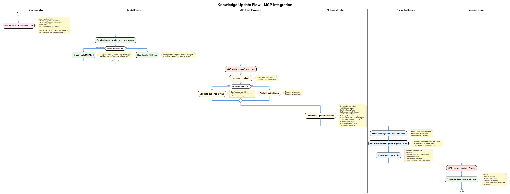

# MCP Semantic Analysis - Knowledge Base Updates

## Overview

The **MCP Semantic Analysis** system provides automated knowledge base updates through a 10-agent workflow. Users trigger updates by typing **"ukb"** in Claude chat, which causes Claude to call the MCP semantic-analysis server.

**IMPORTANT**: `ukb` is **NOT a shell command**. It's a keyword that triggers Claude to execute the semantic analysis workflow via MCP tools.

## How It Works

### User Interaction

```
User types in Claude chat: "ukb"
                          ↓
Claude detects knowledge update request
                          ↓
Claude decides: incremental or full analysis
                          ↓
Claude calls MCP tool: mcp__semantic-analysis__execute_workflow
                          ↓
10-Agent workflow executes
                          ↓
Results stored to GraphDB + JSON export
                          ↓
Claude displays summary to user
```

### Trigger Variations

Users can type any of these to trigger the workflow:
- `ukb` (incremental analysis)
- `ukb full` (complete analysis)
- `run ukb`
- `update knowledge base`

Claude intelligently detects the intent and chooses the appropriate workflow.

## 10-Agent Workflow

When triggered, the MCP semantic-analysis server executes a coordinated workflow:

### 1. **GitHistoryAgent**
- Analyzes git commits since last checkpoint
- Identifies architectural changes
- Extracts technical decisions

### 2. **VibeHistoryAgent**
- Analyzes session logs (.specstory/history/)
- Extracts conversation patterns
- Identifies problem-solution pairs

### 3. **SemanticAnalysisAgent**
- Deep semantic analysis of code and conversations
- Pattern extraction
- Significance scoring
- Uses LLM fallback chain: Groq → Gemini → Custom → Anthropic → OpenAI

### 4. **WebSearchAgent**
- Researches technical patterns (DuckDuckGo)
- Finds best practices
- Validates approaches

### 5. **InsightGenerationAgent**
- Creates structured insights
- Generates documentation
- Formats knowledge entities

### 6. **ObservationGenerationAgent**
- Adds observations to entities
- Links related concepts
- Enriches knowledge graph

### 7. **QualityAssuranceAgent**
- Validates insight quality
- Checks for completeness
- Ensures consistency

### 8. **PersistenceAgent**
- Stores entities to GraphDB
- Creates relations
- Updates knowledge graph

### 9. **DeduplicationAgent**
- Prevents duplicate entities
- Merges similar patterns
- Uses OpenAI embeddings for similarity

### 10. **CoordinatorAgent**
- Orchestrates all agents
- Manages workflow execution
- Aggregates results

### Workflow Visualization

The System Health Dashboard provides real-time visualization of workflow execution:


**Dashboard Features:**
- **Visual Workflow Graph** - Shows agent execution flow, dependencies, and feedback loops
- **Pipeline Statistics** - Commits processed, sessions analyzed, deduplication metrics
- **Entity Breakdown** - Final counts by type (GraphDatabase, MCPAgent, Pattern, etc.)
- **Execution Details** - Duration, LLM provider, completion status

Access via `http://localhost:3032` → UKB Workflow Monitor.

## Storage Architecture

### Three-Layer Synchronization

```
Graphology (in-memory)
        ↕ (1s auto-persist)
    LevelDB (persistent)
        ↕ (5s debounced export)
JSON Files (git-tracked)
```

**GraphDB**:
- In-memory: Graphology graph structure
- Persistent: LevelDB at `.data/knowledge-graph/`
- Auto-persist interval: 1 second

**JSON Export**:
- Path: `.data/knowledge-export/coding.json`
- Auto-export: 5 seconds (debounced)
- Git-tracked for team synchronization

**Checkpoint**:
- Path: `.data/ukb-last-run.json`
- Git-tracked for team-wide incremental processing
- Records: lastSuccessfulRun, lastCommit, lastSession, stats

## Incremental vs Full Analysis

### Incremental Analysis (Default)

When user types `ukb`:

1. **Load checkpoint** from `.data/ukb-last-run.json`
2. **Calculate gap** since last run:
   - New commits since lastCommit
   - New session logs since lastSession
3. **Process only the gap** (efficient)
4. **Update checkpoint** with new timestamp

**Use when**: Regular updates, daily/weekly knowledge capture

### Full Analysis

When user types `ukb full`:

1. **Ignore checkpoint** (analyze everything)
2. **Process entire history**:
   - All git commits
   - All session logs
3. **Update checkpoint** with completion timestamp

**Use when**: First-time setup, major refactoring, comprehensive review

## Team Synchronization

### How Team Sync Works

```
Developer A:
  1. Types "ukb" in Claude
  2. Workflow executes
  3. Updates: .data/knowledge-export/coding.json
  4. Updates: .data/ukb-last-run.json
  5. Git commits both files
  6. Git pushes to remote

Developer B:
  1. Git pulls from remote
  2. Gets updated coding.json (knowledge)
  3. Gets updated ukb-last-run.json (checkpoint)
  4. Types "ukb" in Claude
  5. Only processes commits/sessions since checkpoint
     (avoiding duplicate work)
```

### Bi-Directional Sync

**Forward Flow** (Local → Team):
```
Graphology → LevelDB (1s) → JSON export (5s) → Git commit → Git push
```

**Backward Flow** (Team → Local):
```
Git pull → JSON import (on startup) → LevelDB → Graphology
```

**Conflict Resolution**: Newest-wins strategy on startup import

## MCP Tool Reference

### execute_workflow

Primary tool for running semantic analysis workflows.

```javascript
mcp__semantic-analysis__execute_workflow({
  workflow_name: "incremental-analysis",  // or "complete-analysis"
  parameters: {
    // optional parameters
  }
})
```

**Workflows Available**:
- `incremental-analysis`: Gap-based processing (default)
- `complete-analysis`: Full history processing

### create_ukb_entity_with_insight

Create a single entity with insight document.

```javascript
mcp__semantic-analysis__create_ukb_entity_with_insight({
  entity_name: "CachingPattern",
  entity_type: "TechnicalPattern",
  insights: "Detailed insight content...",
  significance: 8,
  tags: ["caching", "performance"]
})
```

**Use when**: Creating specific entities programmatically

## Integration with Claude Code

### Constraint System

The constraint monitor enforces that `ukb` is never executed as a shell command:

**Pattern**: `^\s*ukb\s+(?:--help|-h|status|entity|...)`

**Blocks**:
- `ukb --help` ❌
- `ukb status` ❌
- `ukb entity list` ❌

**Allows**:
- `plantuml ukb-cli-data-flow.puml` ✅ (filename)
- `grep ukb docs/*.md` ✅ (search term)
- User typing "ukb" in chat ✅ (triggers MCP)

### Claude's Decision Process

```javascript
// When user types "ukb", Claude's internal logic:
if (message.includes("ukb full")) {
  workflow = "complete-analysis";
} else if (message.includes("ukb")) {
  workflow = "incremental-analysis";
}

// Claude calls MCP tool:
await mcp__semantic_analysis__execute_workflow({
  workflow_name: workflow
});
```

## Visualization

### VKB Server Integration

The VKB (Visualize Knowledge Base) server provides a web UI:

```bash
# Start VKB server
vkb server start

# Open browser to http://localhost:8080
```

**Features**:
- Interactive graph visualization
- Entity browsing and search
- Relation exploration
- Real-time updates via WebSocket

### Knowledge Architecture Diagram



Shows the complete flow from user typing "ukb" through MCP integration to storage.

## Common Workflows

### Daily Knowledge Update

```
# In Claude chat:
User: "ukb"

# Claude executes incremental workflow
# Shows summary:
✅ Knowledge base updated!
📊 Total entities: 234
🔗 Total relations: 567
💾 Exports: .data/knowledge-export/coding.json
📁 Checkpoint: .data/ukb-last-run.json

Entities created: 5
Relations created: 8
Insights generated: 3
Commits analyzed: 12
Sessions analyzed: 3
Duration: 45s
```

### First-Time Setup

```
# In Claude chat:
User: "ukb full"

# Claude executes complete analysis
# Processes entire git history and all sessions
# May take several minutes for large projects
```

### Check What Will Be Analyzed

```
# In Claude chat:
User: "What would ukb analyze?"

# Claude can check checkpoint and report:
Since last run (2024-11-22T10:00:00Z):
- 12 new commits
- 3 new session logs
```

## Troubleshooting

### No New Knowledge Created

**Possible causes**:
1. No new commits since last checkpoint
2. No new session logs since last checkpoint
3. Semantic analysis didn't identify significant patterns

**Solution**: Run `ukb full` to force complete analysis

### Checkpoint Issues

**Reset checkpoint**:
```bash
# Manually delete checkpoint to force full analysis next run
rm .data/ukb-last-run.json

# Next "ukb" will process everything
```

### GraphDB Corruption

**Recovery**:
1. Stop all processes accessing GraphDB
2. Backup: `cp -r .data/knowledge-graph .data/knowledge-graph.backup`
3. Delete corrupted DB: `rm -rf .data/knowledge-graph`
4. Restart and let auto-import rebuild from JSON

### MCP Server Not Responding

**Check MCP server status**:
```bash
# In terminal (NOT Claude chat):
./bin/mcp-status

# If semantic-analysis not running:
# Restart Claude Code via: ./bin/coding --claude
```

## Advanced Usage

### Programmatic Access

For automation or scripting, use MCP tools directly:

```javascript
// Example: Node.js script using MCP client
const result = await mcpClient.call_tool({
  name: "mcp__semantic-analysis__execute_workflow",
  arguments: {
    workflow_name: "incremental-analysis"
  }
});

console.log(`Created ${result.stats.entitiesCreated} entities`);
```

### Custom Workflows

The semantic-analysis server supports custom workflow definitions. See `integrations/mcp-server-semantic-analysis/workflows/` for examples.

## Related Documentation

- [Cross-Project Knowledge System](../architecture/cross-project-knowledge.md)
- [Continuous Learning System](./continuous-learning-system.md)
- [Graph Database Architecture](../architecture/graph-storage-architecture.md)
- [MCP Server Integration](../architecture/mcp-server-integration.md)

## Historical Context

**Previous System (Deprecated)**: The original `ukb` CLI tool existed as a shell command in earlier versions. This was removed and replaced with the MCP integration to:
- Provide AI-driven semantic analysis
- Enable Claude to make intelligent decisions about analysis scope
- Integrate seamlessly with Claude Code workflow
- Eliminate manual command-line operations

**Archived Documentation**: See `docs/archive/historical/` for documentation of the previous CLI-based system.
