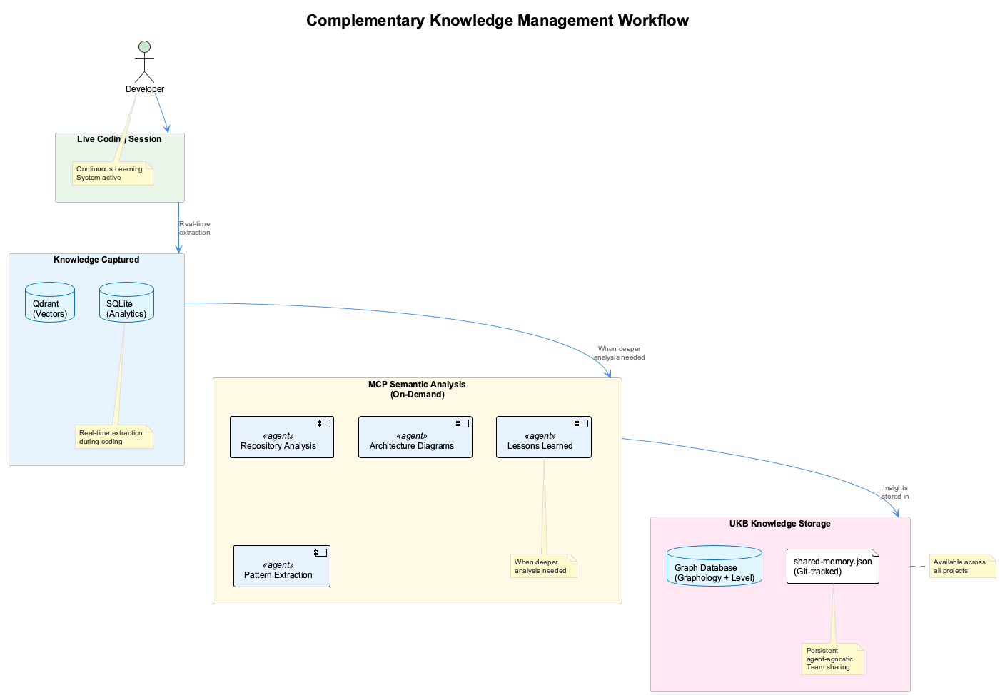
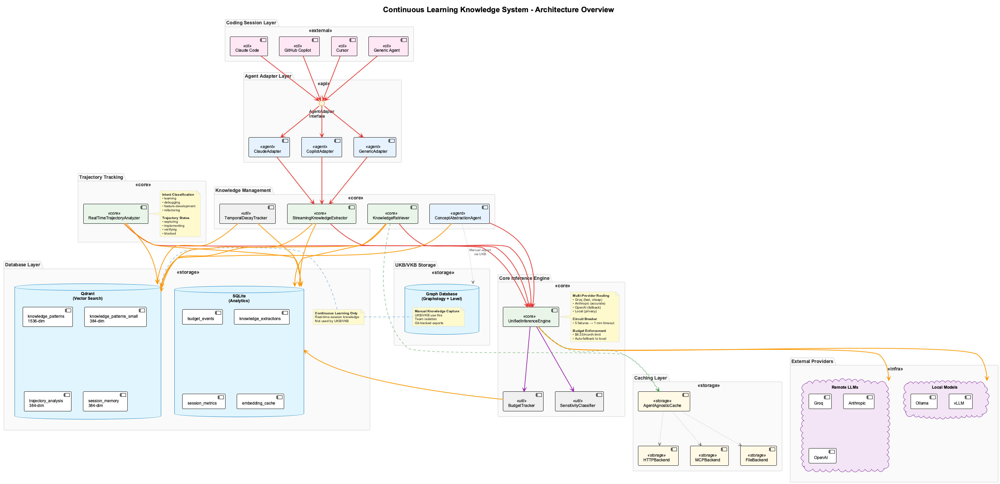
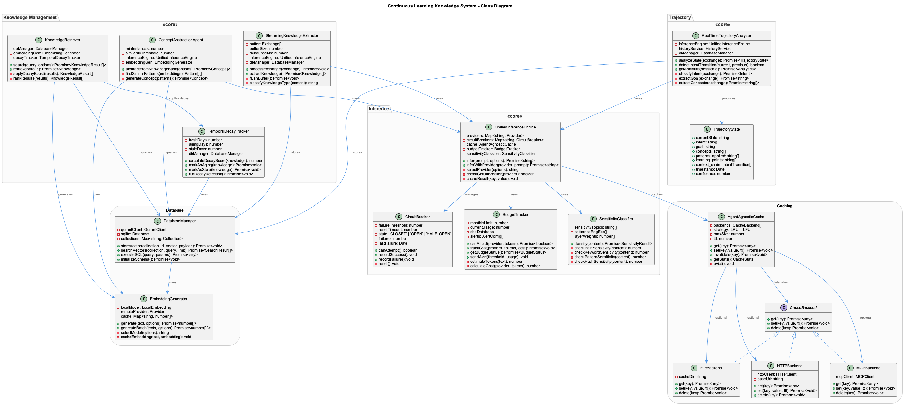
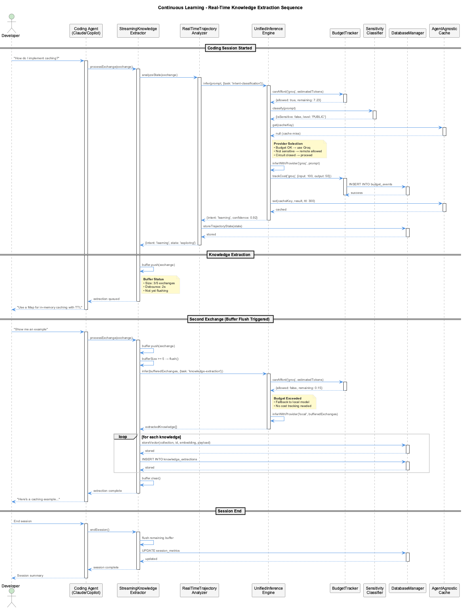
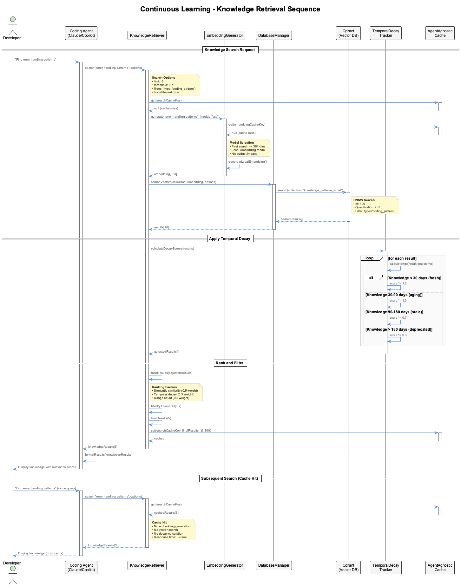

# Knowledge Management Systems - Comparison

**Last Updated**: 2025-10-19

---

## Overview

The coding project contains **TWO COMPLEMENTARY knowledge management systems** that work together to provide comprehensive code intelligence and learning capabilities:

1. **MCP Semantic Analysis Server** - Deep code analysis with 11 specialized agents
2. **Continuous Learning Knowledge System** - Real-time session learning with agent-agnostic architecture

**Important**: These are **NOT parallel implementations** but **complementary systems** designed to work together.

---

## System Comparison Matrix

| Aspect | MCP Semantic Analysis Server | Continuous Learning System |
|--------|------------------------------|---------------------------|
| **Primary Purpose** | Deep code analysis & insight generation | Real-time knowledge extraction from coding sessions |
| **Agents** | 11 specialized agents | 1 agent (ConceptAbstractionAgent) |
| **Focus** | Repository analysis, git history, patterns | Live coding session learning |
| **Activation** | On-demand via MCP tools | Automatic during coding sessions |
| **Integration** | MCP Protocol (Claude Code) | Agent-agnostic (Claude, Copilot, Cursor, etc.) |
| **Storage** | UKB (shared-memory.json + Graph DB) | Qdrant (vectors) + SQLite (analytics) |
| **LLM Usage** | Ad-hoc analysis tasks | Continuous with budget tracking |
| **Budget Control** | No built-in budget tracking | Strict $8.33/month limit enforced |
| **Privacy** | Standard semantic analysis privacy | 5-layer sensitivity detection, local fallback |
| **Caching** | Agent-agnostic graph database | Agent-agnostic cache (file/HTTP/MCP) |
| **Analysis Speed** | 1-5 minutes (full repository) | Real-time (<2s for intent classification) |
| **Deployment** | MCP server process | Embedded in coding workflow |

---

## System 1: MCP Semantic Analysis Server

### What It Does

Provides **deep, on-demand code analysis** through 11 specialized AI agents via the Model Context Protocol.

### 11 Specialized Agents

1. **GitHistoryAgent** - Analyzes git commits and architectural decisions from repository history
2. **VibeHistoryAgent** - Processes conversation files (.vibe, .claude) for contextual understanding
3. **SemanticAnalysisAgent** - Deep code analysis correlating git history with conversations
4. **WebSearchAgent** - External pattern research and reference gathering
5. **InsightGenerationAgent** - Generates insights with PlantUML diagrams
6. **ObservationGenerationAgent** - Creates structured UKB-compatible observations
7. **QualityAssuranceAgent** - Validates outputs with auto-correction
8. **PersistenceAgent** - Manages knowledge base persistence
9. **SynchronizationAgent** - Multi-source data synchronization
10. **DeduplicationAgent** - Semantic duplicate detection and merging
11. **CoordinatorAgent** - Workflow orchestration and agent coordination

### When to Use

- **Full repository analysis** - "Analyze this entire codebase"
- **Pattern extraction** - "What design patterns are used here?"
- **Architecture review** - "Generate architecture diagrams"
- **Insight generation** - "Create lessons learned document"
- **Git history analysis** - "Analyze architectural decisions from commits"

### Example Usage

```javascript
// Via MCP tools in Claude Code
await mcp.execute_workflow({
  workflow_name: 'complete-analysis'
});

await mcp.analyze_repository({
  repository_path: '.',
  include_patterns: ['*.js', '*.ts']
});

await mcp.extract_patterns({
  source: 'authentication module',
  pattern_types: ['design', 'security']
});
```

### Storage

- **UKB (Universal Knowledge Base)**: shared-memory.json + Graph Database (Graphology + Level)
- **Git-tracked**: Team-wide knowledge sharing via shared-memory.json
- **Graph Database**: Agent-agnostic persistent storage in `.data/knowledge-graph/`

---

## System 2: Continuous Learning Knowledge System

### What It Does

Provides **real-time knowledge extraction** from live coding sessions with budget control and privacy-first architecture.

### 1 Agent (+ Core Components)

1. **ConceptAbstractionAgent** - Generalizes patterns from repeated observations (3+ instances)

**Note**: This system has only **ONE agent** but many **core components** that handle different aspects of the learning pipeline.

### Core Components (NOT Agents)

- **StreamingKnowledgeExtractor** - Buffers and extracts knowledge in real-time
- **KnowledgeRetriever** - Semantic search with temporal decay
- **RealTimeTrajectoryAnalyzer** - Intent classification and trajectory tracking
- **UnifiedInferenceEngine** - Multi-provider LLM routing with circuit breaker
- **BudgetTracker** - Cost tracking and $8.33/month enforcement
- **SensitivityClassifier** - 5-layer privacy detection
- **TemporalDecayTracker** - Knowledge aging and freshness management
- **AgentAgnosticCache** - Universal caching (file/HTTP/MCP backends)

### When to Use

- **Real-time learning** - Automatically during all coding sessions
- **Knowledge search** - "Find error handling patterns I've used before"
- **Budget-conscious** - Operations with strict cost limits
- **Privacy-critical** - Sensitive code that must stay local
- **Cross-agent** - Works with Claude Code, Copilot, Cursor, etc.

### Example Usage

```javascript
// Automatic during session
const system = new KnowledgeLearningSystem({
  projectPath: '/path/to/project',
  budgetLimit: 8.33
});

await system.initialize();

// Processes exchanges automatically
await system.processExchange(
  'How do I implement caching?',
  'Use a Map for in-memory caching with TTL'
);

// Search knowledge
const results = await system.searchKnowledge('caching patterns');
```

### Storage

- **Qdrant** (vector search): 4 collections with HNSW + int8 quantization
- **SQLite** (analytics): Budget tracking, session metrics, temporal queries
- **AgentAgnosticCache**: Multi-backend caching (file/HTTP/MCP)

---

## How They Work Together

### Complementary Workflow



The three systems work together in a complementary pipeline:

1. **Live Coding Session** → Continuous Learning System actively extracts knowledge
2. **Knowledge Captured** → Real-time storage in Qdrant (vectors) + SQLite (analytics)
3. **MCP Semantic Analysis** → Triggered when deeper repository analysis is needed
4. **UKB Storage** → Final insights stored in Graph Database + shared-memory.json for team sharing

### Example Combined Usage

**Scenario**: Building a new authentication system

1. **During coding** (Continuous Learning System):
   ```
   Developer: "How do I hash passwords securely?"
   Claude: "Use bcrypt with cost factor 12..."

   → Continuous Learning extracts this pattern
   → Stores in Qdrant with intent: 'learning'
   → Budget tracker logs cost ($0.002)
   → Sensitivity detector marks as 'CONFIDENTIAL'
   ```

2. **After implementation** (MCP Semantic Analysis):
   ```
   Developer: "Analyze the auth patterns in this codebase"
   Claude uses MCP: execute_workflow({workflow_name: 'complete-analysis'})

   → GitHistoryAgent analyzes auth-related commits
   → SemanticAnalysisAgent correlates code with patterns
   → InsightGenerationAgent creates PlantUML diagrams
   → PersistenceAgent stores in UKB (shared-memory.json)
   ```

3. **Next session** (Both systems):
   ```
   Continuous Learning: Retrieves previous auth patterns (from Qdrant)
   Graph Database: Provides UKB insights (from .data/knowledge-graph/)

   Combined knowledge: "Here's what you learned about auth,
   plus architecture patterns from repository analysis"
   ```

---

## Key Differences

### Architecture Style

**MCP Semantic Analysis**:
- **Agent-based architecture** (11 specialized agents)
- **Coordinator pattern** (CoordinatorAgent orchestrates workflows)
- **MCP protocol** (Model Context Protocol for communication)
- **On-demand execution** (triggered by MCP tool calls)

**Continuous Learning**:
- **Component-based architecture** (modular components, 1 agent)
- **Streaming pipeline** (real-time buffering and extraction)
- **Agent-agnostic** (works with any coding agent)
- **Continuous execution** (always active during sessions)

### Storage Philosophy

**MCP Semantic Analysis**:
- **Centralized UKB** (shared-memory.json)
- **Git-tracked** (version control for team sharing)
- **Human-readable JSON** (easy to inspect and edit)
- **Cross-project by default** (one knowledge base for all projects)

**Continuous Learning**:
- **Dual-database** (Qdrant for vectors, SQLite for analytics)
- **Optimized for search** (HNSW indexing, quantization)
- **Binary storage** (embeddings, not human-readable)
- **Project-scoped** (can filter by project)

### Budget & Privacy

**MCP Semantic Analysis**:
- **No budget tracking** (assumes usage is occasional)
- **Standard privacy** (relies on MCP server isolation)
- **Provider-agnostic** (uses Anthropic Claude primarily)

**Continuous Learning**:
- **Strict budget limits** ($8.33/month, alerts at 80%)
- **5-layer privacy detection** (path/keyword/pattern/hash/LLM)
- **Fail-safe routing** (sensitive data → local models only)
- **Multi-provider** (Groq/Anthropic/OpenAI/Local with failover)

---

## When to Use Which System

### Use MCP Semantic Analysis When:

✅ You need **comprehensive repository analysis**
✅ You want to **generate architecture diagrams**
✅ You need **git history correlation** with code patterns
✅ You're creating **lessons learned documentation**
✅ You want **team-wide knowledge sharing** via git
✅ You need **one-time deep analysis** (not continuous)

### Use Continuous Learning When:

✅ You want **real-time learning** during coding sessions
✅ You need **budget-conscious operations** ($8.33/month limit)
✅ You're working with **sensitive code** (local-first privacy)
✅ You want **agent-agnostic** compatibility (Claude/Copilot/Cursor)
✅ You need **fast semantic search** (<500ms)
✅ You want **automatic knowledge decay** (freshness tracking)

### Use BOTH When:

✅ You want **maximum knowledge capture** (real-time + deep analysis)
✅ You need **complementary insights** (session learning + repository patterns)
✅ You want **team collaboration** (UKB sharing) + **personal learning** (Qdrant)

---

## Migration & Compatibility

### No Migration Needed

These systems **do NOT replace each other**. They are designed to coexist:

- **Keep using MCP Semantic Analysis** for deep, on-demand analysis
- **Enable Continuous Learning** for real-time session learning
- **Both systems work independently** and complement each other

### Integration Points

1. **Graph Database** (shared):
   - UKB/VKB store and query knowledge via GraphDatabaseService
   - MCP Semantic Analysis can store insights in graph database
   - Agent-agnostic: works with Claude Code, Copilot, Cursor

2. **shared-memory.json** (legacy/backup):
   - MCP Semantic Analysis can write to this (UKB format)
   - Continuous Learning does NOT write to this
   - They use different storage systems by design

3. **AI Agents** (clients):
   - Can use UKB commands (any CLI-based agent)
   - Can use VKB HTTP API (any agent with HTTP access)
   - MCP Semantic Analysis via MCP tools (Claude Code)

---

## Architecture Diagrams

### Continuous Learning System Architecture



### Continuous Learning Class Diagram



### Real-Time Knowledge Extraction Sequence



### Knowledge Retrieval Sequence



---

## Summary

| System | Purpose | Agents | Storage | Activation |
|--------|---------|--------|---------|------------|
| **MCP Semantic Analysis** | Deep code analysis | 11 agents | UKB (Graph DB + JSON) | On-demand (MCP tools) |
| **Continuous Learning** | Real-time session learning | 1 agent | Qdrant + SQLite | Automatic (always on) |

**Recommendation**: **Use BOTH systems** for maximum knowledge management capabilities. They complement each other and do not conflict.

---

## See Also

- [MCP Semantic Analysis Documentation](../integrations/mcp-semantic-analysis.md)
- [Continuous Learning System Documentation](continuous-learning-system.md)
- [Cross-Project Knowledge System](../architecture/cross-project-knowledge.md)
