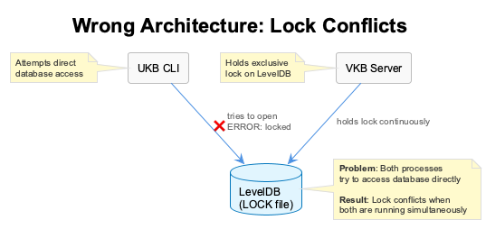
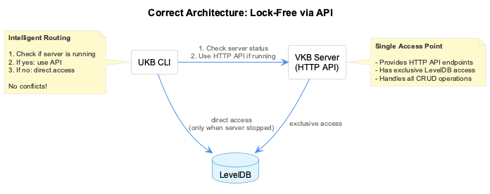

# UKB Lock-Free Architecture

## Overview

This document explains the architecture solution for concurrent access to the knowledge base without LevelDB lock conflicts.

## The Problem

### Root Cause

**LevelDB is a single-writer database** - it uses file-based locking and does not support concurrent write access from multiple processes.

When multiple processes try to access the same LevelDB instance:
1. First process opens LevelDB and creates `LOCK` file
2. Second process tries to open and fails with "database is locked" error
3. Only one process can have write access at a time

### Previous Architecture (Broken)



Both VKB server and UKB CLI tried to open the database directly, causing conflicts whenever both were running simultaneously.

**Result**: UKB CLI commands failed whenever VKB server was running.

### Misleading SQLite Fallback

The DatabaseManager showed: "Knowledge queries will fall back to SQLite"

**This was misleading because:**
- SQLite no longer stores knowledge (only analytics: budget tracking, session metrics)
- There is no fallback for entity/relation operations
- The message gave false hope that operations would work

## The Solution

### Architecture: API-Based Access



**Single database access point** - VKB server has exclusive access, UKB CLI uses API when server is running.

### Request Flow


**Intelligent routing in UKB CLI:**

1. **Check VKB server availability** (ping `GET /api/health`)
2. **Route accordingly**:
   - If server running → Use HTTP API (DELETE `/api/entities/:name`)
   - If server stopped → Direct database access
3. **No conflicts** - only one process accesses LevelDB at a time

## Implementation

### Components Created

#### 1. VKB API Delete Endpoints

**File**: `lib/vkb-server/api-routes.js:317-501`

Added missing DELETE endpoints to VKB server:

```javascript
// Entity deletion
app.delete('/api/entities/:name', (req, res) =>
  this.handleDeleteEntity(req, res));

// Relation deletion
app.delete('/api/relations', (req, res) =>
  this.handleDeleteRelation(req, res));
```

**DELETE /api/entities/:name?team=coding**
- Deletes entity from graph database
- Removes all associated relationships
- Persists changes to LevelDB
- Returns: `{ success, deleted, team, message }`

**DELETE /api/relations?from=A&to=B&team=coding&type=X&all=false**
- Deletes relationship(s) between entities
- Options: specific type, all relations, or first only
- Persists changes to LevelDB
- Returns: `{ success, deleted, from, to, edges }`

#### 2. VKB API Client

**File**: `lib/ukb-unified/core/VkbApiClient.js`

HTTP client for UKB CLI to access VKB server:

```javascript
class VkbApiClient {
  // Check if server is running
  async isServerAvailable() {
    // Quick ping to GET /api/health
    // Returns true if server has graph DB available
  }

  // CRUD operations via HTTP
  async deleteEntity(name, params)
  async deleteRelation(from, to, params)
  async getEntities(params)
  async searchEntities(query, params)
  // ... etc
}
```

#### 3. Intelligent Routing in Commands

**Files**:
- `lib/ukb-unified/commands/entity.js`
- `lib/ukb-unified/commands/relation.js`

Both commands now use intelligent routing:

```javascript
async delete(name, options) {
  const useApi = await this.determineAccessMethod();

  if (useApi) {
    // VKB server is running - use API
    return await this.apiClient.deleteEntity(name, options);
  } else {
    // VKB server is stopped - direct access
    await this.initializeDirectAccess();
    // ... direct GraphDB operations
  }
}
```

**Benefits**:
- **No lock conflicts** - server mediates all access when running
- **Seamless UX** - commands work whether server is running or not
- **Single source of truth** - server enforces data integrity
- **Clean architecture** - proper client-server separation

### Fixed Messages

**Before**:
```
[DatabaseManager] Graph database not available: <error>
[DatabaseManager] Knowledge queries will fall back to SQLite
```

**After**:
```
[DatabaseManager] Graph database not available: <error>
[DatabaseManager] Knowledge operations (entities/relations) are unavailable
[DatabaseManager] Note: SQLite is only used for analytics (budget tracking, session metrics)
```

## Usage

### With VKB Server Running

```bash
# VKB server holds the database lock
$ vkb server start

# UKB commands use HTTP API - no conflicts!
$ ukb entity list
[EntityCommand] Using VKB server API (server is running)
📦 Entities (35 total): ...

$ ukb entity delete "TestEntity"
[EntityCommand] Using VKB server API (server is running)
✓ Entity deleted: TestEntity
```

### With VKB Server Stopped

```bash
# Stop the server
$ pkill -f vkb-server

# UKB commands use direct database access
$ ukb entity list
[EntityCommand] Using direct database access (server is stopped)
📦 Entities (35 total): ...

$ ukb entity delete "TestEntity"
[EntityCommand] Using direct database access (server is stopped)
✓ Entity deleted: TestEntity
```

## API Reference

### VKB Server DELETE Endpoints

#### DELETE /api/entities/:name

Delete an entity from the knowledge base.

**Parameters**:
- `name` (path, required): Entity name
- `team` (query, optional): Team scope (default: "coding")

**Response**:
```json
{
  "success": true,
  "deleted": "EntityName",
  "team": "coding",
  "message": "Deleted entity: EntityName"
}
```

**Errors**:
- `400` - Missing entity name
- `404` - Entity not found
- `500` - Deletion failed
- `503` - Graph database unavailable

#### DELETE /api/relations

Delete relationship(s) between entities.

**Parameters**:
- `from` (query, required): Source entity name
- `to` (query, required): Target entity name
- `team` (query, optional): Team scope (default: "coding")
- `type` (query, optional): Delete only relations of this type
- `all` (query, optional): Delete all relations (default: false = first only)

**Response**:
```json
{
  "success": true,
  "deleted": 2,
  "from": "EntityA",
  "to": "EntityB",
  "team": "coding",
  "edges": [
    { "type": "implements", "edgeId": "..." },
    { "type": "extends", "edgeId": "..." }
  ],
  "message": "Deleted 2 relationship(s) from EntityA to EntityB"
}
```

**Errors**:
- `400` - Missing from/to parameters
- `404` - Entities or relations not found
- `500` - Deletion failed
- `503` - Graph database unavailable

## Benefits of This Architecture

### 1. No Lock Conflicts
Only one process accesses LevelDB at a time - either VKB server (exclusive) or UKB CLI (when server is stopped).

### 2. Consistent Data Access
VKB server enforces data integrity and business rules for all API operations.

### 3. Seamless User Experience
UKB commands work regardless of server state - automatic detection and routing.

### 4. Clean Separation of Concerns
- **VKB Server**: Database management, API endpoints, web visualization
- **UKB CLI**: Command-line interface, intelligent routing
- **GraphDB**: Persistent storage (single access point)

### 5. Future-Proof
Easy to add:
- Rate limiting on API
- Authentication/authorization
- Audit logging
- Caching layers
- Read replicas (if needed)

## Testing

### Test Scenarios

**Scenario 1: Server Running**
```bash
# Start server
./bin/vkb server start &

# Test entity operations
./bin/ukb entity list          # ✓ Uses API
./bin/ukb entity delete "Test"  # ✓ Uses API

# Verify: Check console output for "[EntityCommand] Using VKB server API"
```

**Scenario 2: Server Stopped**
```bash
# Stop all servers
pkill -f vkb-server

# Test entity operations
./bin/ukb entity list          # ✓ Uses direct access
./bin/ukb entity delete "Test"  # ✓ Uses direct access

# Verify: Check console output for "[EntityCommand] Using direct database access"
```

**Scenario 3: Server Restart**
```bash
# Commands work through server
./bin/ukb entity list  # Uses API

# Stop server mid-operation
pkill -f vkb-server

# Next command adapts automatically
./bin/ukb entity list  # Uses direct access
```

## Troubleshooting

### "Database is locked" Error

**Symptoms**: Error message about LevelDB being locked by another process

**Diagnosis**:
```bash
# Check for VKB server process
ps aux | grep vkb-server

# Check LOCK file ownership
lsof /Users/q284340/Agentic/coding/.data/knowledge-graph/LOCK
```

**Resolution**:
1. This should not happen with the new architecture
2. If it does, check that both EntityCommand and RelationCommand are using `determineAccessMethod()`
3. Verify VkbApiClient is correctly detecting server availability

### API Connection Failures

**Symptoms**: UKB CLI cannot connect to VKB server

**Diagnosis**:
```bash
# Check if server is running
curl http://localhost:8080/api/health

# Check server logs
tail -f ~/.local/share/vkb-server/logs/server.log
```

**Resolution**:
- Ensure VKB server is actually running
- Verify server is listening on port 8080
- Check firewall settings (if applicable)

### Direct Access Failures

**Symptoms**: UKB CLI fails even when server is stopped

**Diagnosis**:
```bash
# Check database file permissions
ls -la /Users/q284340/Agentic/coding/.data/knowledge-graph/

# Check for stale LOCK files
ls -la /Users/q284340/Agentic/coding/.data/knowledge-graph/LOCK
```

**Resolution**:
- Remove stale LOCK file if process no longer exists
- Check file permissions (should be readable/writable by user)
- Verify LevelDB directory is not corrupted

## Related Documentation

- [Knowledge Management System](./knowledge-management-system.md)
- [VKB Server API](./vkb-server-api.md)
- [UKB CLI Reference](./ukb-cli-reference.md)
- [Graph Database Architecture](./graph-database-architecture.md)
