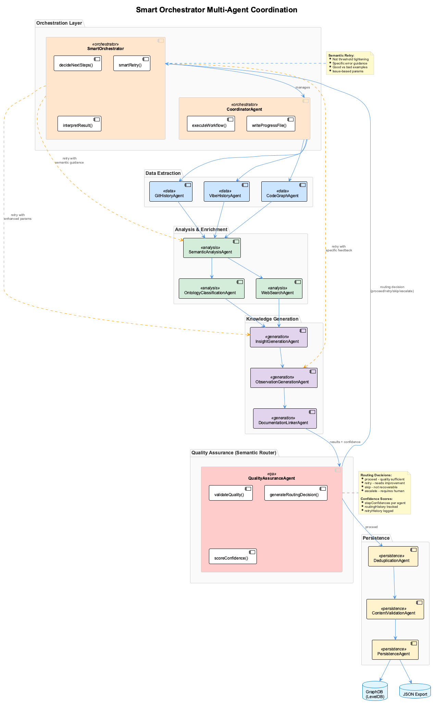

# UKB - Update Knowledge Base

> **⚠️ IMPORTANT SYSTEM CHANGE**
>
> The UKB CLI tool has been **completely removed** from the system and replaced with MCP (Model Context Protocol) integration.
>
> **What this means:**
> - `ukb` is NO LONGER a shell command
> - Type "ukb" in **Claude chat** to trigger knowledge updates
> - Claude calls the MCP semantic-analysis server automatically
> - All documentation below is **archived for historical reference only**

---

## Current System: MCP Semantic Analysis

**When you type "ukb" in Claude chat**, Claude detects your intent and calls the MCP semantic-analysis server to execute a comprehensive 14-agent workflow with SmartOrchestrator semantic coordination.

### Quick Start

```
# In Claude chat (NOT terminal):
User: "ukb"

# Claude executes incremental analysis automatically
# Shows summary of entities created, relations, insights generated
```

**For full documentation, see:**
- **[MCP Semantic Analysis Documentation](./mcp-semantic-analysis.md)** - Complete guide to current system
- **[Cross-Project Knowledge System](../architecture/cross-project-knowledge.md)** - Architecture overview

---

## What Changed?

### Old System (Deprecated)
- `ukb` was a shell command
- Manual execution: `ukb --interactive` or `ukb --auto`
- CLI-based knowledge capture
- Direct JSON file manipulation

### New System (Current)
- `ukb` is a **keyword in Claude chat**
- Claude decides: incremental or full analysis
- **14-agent multi-agent system** with **SmartOrchestrator** semantic coordination
- **MCP tool integration**: `mcp__semantic-analysis__execute_workflow`
- **Team synchronization** via git-tracked checkpoint files
- **Semantic routing**: QA agent acts as central coordinator with confidence scoring

---

## How to Use UKB Now

### Trigger Knowledge Update

Simply type in Claude chat:

```
User: "ukb"
```

Claude will:
1. Detect knowledge update request
2. Decide: incremental or full analysis
3. Call MCP semantic-analysis tool
4. Execute 14-agent workflow with SmartOrchestrator
5. QA agent provides semantic routing (proceed/retry/skip/escalate)
6. Store to GraphDB → LevelDB → JSON export
7. Show you a summary with confidence metrics

### Full Analysis

```
User: "ukb full"
```

This processes entire git history and all session logs (instead of just changes since last checkpoint).

### Check What Will Be Analyzed

```
User: "What would ukb analyze?"
```

Claude checks the checkpoint and reports new commits/sessions since last run.

---

## 14-Agent Multi-Agent System with SmartOrchestrator

When triggered, the MCP semantic-analysis server executes a coordinated workflow with **semantic routing**:

**Orchestration Layer:**
- **SmartOrchestrator** - Semantic coordination with confidence propagation and intelligent retry
- **CoordinatorAgent** - Executes workflow definitions, manages agent lifecycle

**Data Extraction Agents:**
1. **GitHistoryAgent** - LLM-powered commit pattern analysis and evolution extraction
2. **VibeHistoryAgent** - Analyzes session logs with LLM context extraction
3. **CodeGraphAgent** - AST-based indexing via Memgraph (requires Docker)

**Analysis & Enrichment Agents:**
4. **SemanticAnalysisAgent** - Deep semantic analysis with LLM fallback chain
5. **OntologyClassificationAgent** - Maps entities to project ontology
6. **WebSearchAgent** - Researches patterns with optional LLM result ranking

**Knowledge Generation Agents:**
7. **InsightGenerationAgent** - Creates structured insights with PlantUML diagrams
8. **ObservationGenerationAgent** - Adds observations using LLM structuring
9. **DocumentationLinkerAgent** - LLM-powered semantic doc-to-code matching

**Quality & Persistence Agents:**
10. **QualityAssuranceAgent** - **Semantic Router**: validates quality, generates routing decisions (proceed/retry/skip/escalate), provides confidence scoring
11. **DeduplicationAgent** - Semantic duplicate detection using OpenAI embeddings
12. **ContentValidationAgent** - Final validation and entity refresh
13. **PersistenceAgent** - Stores entities to GraphDB

**SmartOrchestrator Features:**
- **Semantic Retry**: Not mechanical threshold tightening - provides specific guidance on what went wrong
- **Confidence Propagation**: Each step reports confidence; downstream agents are aware of upstream quality
- **Routing Decisions**: QA generates proceed/retry/skip/escalate based on semantic analysis
- **LLM-Assisted Decisions**: Uses AI to interpret failures and suggest remediation



### Workflow Visualization

The System Health Dashboard provides a visual DAG workflow graph with multi-agent data:


**Dashboard Features:**
- **Visual DAG Workflow Graph** - Shows QA as central coordinator with routing edges
- **Confidence Bars** - Per-agent confidence levels (green ≥80%, amber ≥50%, red <50%)
- **Routing Decision Badges** - Shows proceed (✓), retry (↻), skip (⊘), or escalate (!) per step
- **Retry Count Badges** - Displays semantic retry iterations per agent
- **Pipeline Totals** - Commits processed, sessions analyzed, candidates discovered
- **Deduplication Stats** - Shows reduction percentage (e.g., 86.9% reduction from raw to final)
- **Entity Breakdown** - Final entity counts by type (GraphDatabase, MCPAgent, etc.)
- **Multi-Agent Data** - stepConfidences, routingHistory, workflowModifications

Access via System Health Dashboard at `http://localhost:3032` → UKB Workflow Monitor card.

---

## Storage Architecture

```
Graphology (in-memory)
        ↕ (1s auto-persist)
    LevelDB (persistent)
        ↕ (5s debounced export)
JSON Files (git-tracked)
```

**GraphDB**: In-memory Graphology + LevelDB at `.data/knowledge-graph/`
**JSON Export**: Auto-exports to `.data/knowledge-export/coding.json` (git-tracked)
**Checkpoint**: `.data/ukb-last-run.json` (git-tracked for team sync)

---

## Team Synchronization

```
Developer A:
  1. Types "ukb" in Claude
  2. Workflow executes
  3. Updates: .data/knowledge-export/coding.json
  4. Updates: .data/ukb-last-run.json
  5. Git commits both files
  6. Git pushes to remote

Developer B:
  1. Git pulls from remote
  2. Gets updated coding.json (knowledge)
  3. Gets updated ukb-last-run.json (checkpoint)
  4. Types "ukb" in Claude
  5. Only processes commits/sessions since checkpoint
     (avoiding duplicate work)
```

---

## Visualization

To browse the knowledge base visually:

```bash
# In terminal:
vkb server start

# Open browser to http://localhost:8080
```

The VKB server provides:
- Interactive graph visualization
- Entity browsing and search
- Relation exploration
- Real-time updates via WebSocket

---

## Migration Guide

If you were using the old UKB CLI system:

### What to Stop Doing
- ❌ `ukb --interactive` (command doesn't exist)
- ❌ `ukb --auto` (command doesn't exist)
- ❌ `ukb entity add ...` (command doesn't exist)
- ❌ Manual JSON file editing

### What to Start Doing
- ✅ Type "ukb" in Claude chat
- ✅ Let Claude call MCP semantic-analysis tool
- ✅ Trust the 14-agent workflow with SmartOrchestrator
- ✅ Review auto-generated insights and confidence metrics
- ✅ Commit .data/knowledge-export/*.json and .data/ukb-last-run.json

---

## Complete Documentation

**Primary Documentation (Current System)**:
- [MCP Semantic Analysis](./mcp-semantic-analysis.md) - Complete MCP integration guide
- [Cross-Project Knowledge System](../architecture/cross-project-knowledge.md) - Architecture overview
- [Continuous Learning System](./continuous-learning-system.md) - Automatic knowledge capture

**Historical Documentation (Archived)**:
- [UKB Lock-Free Architecture](../archive/historical/ukb-lock-free-architecture.md) - v2.0 architecture (deprecated)
- [UKB Issues Analysis](../archive/historical/ukb-issues-analysis.md) - Historical analysis

---

## Why the Change?

The migration from CLI to MCP integration with SmartOrchestrator provides:

✅ **AI-Driven Analysis**: Claude makes intelligent decisions about analysis scope
✅ **Semantic Orchestration**: 14-agent system with SmartOrchestrator for intelligent coordination
✅ **Confidence Propagation**: Upstream quality informs downstream processing
✅ **Semantic Routing**: QA agent drives proceed/retry/skip/escalate decisions
✅ **Zero Manual Effort**: Just type "ukb" - no command-line arguments
✅ **Better Integration**: Seamless Claude Code workflow
✅ **Team Synchronization**: Git-tracked checkpoint ensures no duplicate work
✅ **Visual Feedback**: Dashboard shows confidence bars, routing decisions, retry counts

---

*For questions about the current MCP-based system, see [mcp-semantic-analysis.md](./mcp-semantic-analysis.md)*
