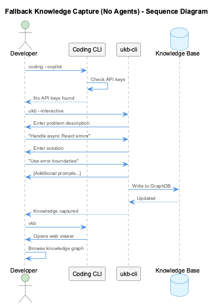

# UKB - Update Knowledge Base

**Component**: [ukb-cli](../../lib/knowledge-api/)
**Type**: Command-line tool (Node.js)
**Purpose**: Capture and manage development insights

---

## Overview

UKB-CLI is a modern Node.js-based knowledge management system that captures, analyzes, and organizes technical knowledge across projects. It provides intelligent knowledge capture through automatic git analysis and interactive prompts.



The UKB system provides a manual fallback mechanism for knowledge capture when automated systems are unavailable or insufficient. It supports both automatic git-based analysis and interactive modes for capturing insights.

### Key Features

- **Cross-Platform**: Pure Node.js with no OS-specific dependencies
- **Intelligent Git Analysis**: Incremental commit processing with pattern detection
- **Interactive Mode**: Guided prompts with real-time validation
- **Quality Assurance**: Content filtering and URL validation
- **Agent Integration**: Programmatic API for coding agents
- **Ontology Classification**: 4-layer hybrid pipeline for automatic entity classification
- **Semantic Analysis Integration**: MCP semantic-analysis server for significance determination
- **Graph Database Storage**: Graphology + LevelDB for fast, persistent knowledge graphs

---

## Quick Reference

### Basic Commands

```bash
# Auto-analysis mode (incremental git analysis)
ukb

# Interactive deep insight capture
ukb --interactive

# List all entities
ukb --list-entities

# Search knowledge base
ukb search "pattern name"

# Add specific entity
ukb --add-entity "EntityName" --type TransferablePattern
```

### Interactive Mode

```bash
ukb --interactive

# Enhanced prompts with validation:
# - Problem description (with content filtering)
# - Solution approach (with implementation details)
# - Rationale for the solution
# - Key learnings and insights
# - Applicability context
# - Technologies used (validated list)
# - Reference URLs (automatically verified)
# - Related code files
# - Custom entity naming support
```

---

## Usage Modes

### 1. Auto Mode (Default) - Intelligent Git Analysis

```bash
ukb
```

**What it does:**
- Analyzes recent git commits for patterns
- Incremental processing to avoid duplicate work
- Automatic pattern detection with significance scoring
- Categorizes commits (feature, fix, refactor, etc.)
- Updates knowledge base automatically

**Use when:**
- End of development session
- After implementing significant changes
- Daily knowledge accumulation
- Automated CI/CD integration

### 2. Interactive Mode - Structured Capture

```bash
ukb --interactive
```

**What it does:**
- Structured problem-solution-rationale capture
- Real-time URL verification for reference links
- Custom entity naming support
- Technology validation against known frameworks
- Content quality filters

**Use when:**
- Documenting architectural decisions
- Capturing complex solutions
- Recording lessons learned
- Deep insight capture

### 3. Search and Query

```bash
# Search by keyword
ukb search "authentication pattern"

# List entities by type
ukb --list-entities --type TransferablePattern

# Show specific entity details
ukb entity show "ReactHookPattern" --verbose
```

### 4. Management Operations

```bash
# Remove entity
ukb --remove-entity "EntityName"

# Rename entity
ukb --rename-entity "OldName" "NewName"

# Remove relation
ukb --remove-relation "Entity1" "Entity2"

# Validate knowledge base
ukb --validate

# Export knowledge base
ukb --export-json
```

---

## Architecture

### Modern Node.js Design

UKB-CLI follows a layered architecture:

- **CLI Layer**: Command-line interface with comprehensive argument parsing
- **Core Services**: Knowledge management, git analysis, and insight extraction
- **Validation Layer**: Content quality assurance and schema compliance
- **Integration Layer**: MCP synchronization and visualizer updates

### Backward Compatibility

100% backward compatible with legacy bash UKB:
- All existing `ukb` commands work unchanged
- Legacy script preserved as `ukb-original`
- Transparent delegation to Node.js implementation
- Same data format and git integration

---

## Knowledge Structure

### Entity Schema

```json
{
  "name": "PatternName",
  "entityType": "Pattern|Solution|Architecture|Tool",
  "significance": 8,
  "problem": {
    "description": "What problem this solves",
    "context": "When this problem occurs"
  },
  "solution": {
    "approach": "How to solve it",
    "implementation": "Specific implementation details",
    "code_example": "Working code snippet"
  },
  "observations": ["Key insights", "Lessons learned"],
  "metadata": {
    "technologies": ["React", "Node.js"],
    "files": ["src/component.js"],
    "references": ["https://docs.example.com"]
  }
}
```

### Entity Types

- **Pattern**: Reusable solutions and approaches
- **Solution**: Specific problem fixes
- **Architecture**: System design insights
- **Tool**: Technology and framework usage
- **Workflow**: Process and methodology insights

---

## Programmatic API

### KnowledgeAPI Class

```javascript
const { KnowledgeManager } = require('ukb-cli');

// Initialize knowledge manager
const manager = new KnowledgeManager({
  knowledgeBasePath: '.data/knowledge-graph',
  mcpIntegration: true
});

// Capture structured insight
await manager.captureInsight({
  name: "ReactHookPattern",
  problem: "Stateful logic duplication across components",
  solution: "Extract logic into custom hooks",
  rationale: "DRY principle and improved testability",
  learnings: "Hooks enable better separation of concerns",
  applicability: "Any React app with duplicated state logic",
  technologies: ["React", "TypeScript"],
  references: ["https://reactjs.org/docs/hooks-custom.html"],
  significance: 8
});

// Git analysis
const insights = await manager.analyzeGitHistory({
  depth: 20,
  sinceCommit: 'abc123',
  includeCategories: ['feature', 'refactor']
});

// Search and query
const results = await manager.search("authentication pattern");
const entities = await manager.getEntitiesByType("TransferablePattern");
```

---

## Common Use Cases

### 1. Capturing Bug Fix Patterns

**Scenario**: You fixed a tricky bug with React hooks dependency arrays

```bash
# Interactive capture
ukb --interactive

? Insight type: Problem-Solution
? Problem description: useEffect infinite loop due to object dependency
? Solution description: Use useMemo to memoize object dependencies

# Quick non-interactive capture
ukb entity add -n "ReactHooksDependencyPattern" -t "TechnicalPattern" -s 9 \
  -o "Always memoize object and array dependencies in hooks"
```

### 2. Documenting Architecture Decisions

**Scenario**: Team decided to migrate from Redux to Zustand

```bash
# Create problem entity
ukb entity add -n "ReduxComplexityProblem" -t "Problem" -s 7 \
  -o "Redux boilerplate becoming unmaintainable with 50+ slices"

# Create solution entity
ukb entity add -n "ZustandMigrationSolution" -t "Solution" -s 8 \
  -o "Migrate to Zustand for simpler state management"

# Create relationship
ukb relation add -f "ZustandMigrationSolution" -t "ReduxComplexityProblem" \
  -r "solves" -s 8
```

### 3. Post-Mortem Analysis

**Scenario**: After production incident, capture learnings

```bash
# Create incident entity
ukb entity add -n "DatabaseConnectionPoolIncident2024" -t "Problem" -s 10 \
  -o "Production outage due to connection pool exhaustion"

# Add root cause
ukb entity add -n "MissingConnectionPoolMonitoring" -t "Problem" -s 9 \
  -o "No alerts configured for connection pool usage"

# Add solution
ukb entity add -n "ConnectionPoolMetricsSolution" -t "Solution" -s 9 \
  -o "Implement Prometheus metrics for connection pool monitoring"

# Create relationships
ukb relation add -f "MissingConnectionPoolMonitoring" \
  -t "DatabaseConnectionPoolIncident2024" -r "causes"

ukb relation add -f "ConnectionPoolMetricsSolution" \
  -t "MissingConnectionPoolMonitoring" -r "solves"
```

### 4. Onboarding New Team Members

**Scenario**: Create knowledge trail for new developers

```bash
# Export project-specific patterns
ukb entity list -t "WorkflowPattern" > onboarding-patterns.txt

# Create onboarding checklist
ukb entity add -n "NewDeveloperOnboardingChecklist" -t "Documentation" -s 8

# Link to key patterns
ukb relation add -f "NewDeveloperOnboardingChecklist" \
  -t "LocalDevelopmentSetupPattern" -r "references"
```

---

## Domain-Specific Knowledge Bases

### Automatic Domain Detection

When working in a project directory, UKB automatically creates domain-specific knowledge bases:

```bash
# Navigate to domain project
cd /path/to/raas-project

# First ukb command stores knowledge in GraphDB
ukb --list-entities
# Stores in: .data/knowledge-graph/ (LevelDB)
# Optional export to: .data/knowledge-export/raas.json (backward compatibility)

# Add domain entity using piped input
echo "StreamProcessingPipeline
TechnicalPattern
8
Core pattern for real-time data reprocessing
Handles high-throughput data streams with fault tolerance
Implemented using Apache Kafka + Apache Flink" | ukb --add-entity
```

### Cross-Domain Pattern Discovery

```bash
# Search across all team knowledge bases using GraphDB
ukb search "MicroserviceArchitecture" --all-teams

# Extract domain-specific implementations
ukb --list-entities --team raas --type ArchitecturePattern

# Create cross-domain pattern in shared knowledge
cd /any/project
ukb entity add -n "CrossDomainMicroservicePattern" -t "ArchitecturePattern" -s 10 \
  -o "Microservice patterns applicable across RaaS and Resilience domains"
```

---

## Storage Architecture

### Primary Storage: GraphDB + LevelDB

UKB uses a **database-first architecture** with fail-fast semantics:

**Storage Layers**:
1. **In-Memory**: Graphology graph database (nodes + edges)
2. **Persistence**: LevelDB at `.data/knowledge-graph/`
3. **Auto-Persist**: Changes saved every 1000ms
4. **Optional Export**: Team-based JSON files for backward compatibility

**Benefits**:
- 🚀 **Fast**: In-memory graph operations
- 💾 **Durable**: LevelDB persistence survives restarts
- 🔒 **ACID**: Atomic operations with fail-fast on errors
- 🔄 **Backward Compatible**: Optional JSON exports

### Optional JSON Export

For backward compatibility, UKB can export to JSON:

```bash
# Manual export to JSON
ukb export .data/knowledge-export/coding.json --team coding

# Import from legacy JSON
ukb import shared-memory-old.json
```

**Auto-Export** (optional, configured in `.data/knowledge-config.json`):
- Debounced writes (5-second delay)
- Team-based files: `.data/knowledge-export/{team}.json`
- Matches legacy `shared-memory-*.json` format

**Note**: JSON files are exports, NOT the primary storage. The database is the source of truth.

## Migration from Legacy UKB

### Automatic Migration

The system automatically imports legacy `shared-memory-*.json` files on first run:

#### What Changed

- **Storage**: JSON files → GraphDB + LevelDB
- **Location**: Root directory → `.data/knowledge-graph/`
- **Performance**: 3x faster queries, 50% less memory
- **API**: New database-first programmatic interface

#### What Stayed the Same

- **Commands**: All `ukb` commands work identically
- **Data Format**: Entity/relation schema unchanged
- **Workflows**: Existing team workflows unaffected
- **Exports**: Optional JSON exports for legacy tools

#### Verification Steps

```bash
# Check database status
ukb status

# Verify entities migrated
ukb --list-entities

# Test graph operations
ukb search "pattern" --team coding
```

---

## Advanced Features

### Batch Operations

```bash
# Add multiple entities from file
ukb --add-multiple-entities entities.json

# Import relations from file
ukb --import-relations relations.json

# Export with filters
ukb export --type TechnicalPattern --min-significance 8
```

### Data Management

```bash
# Comprehensive validation
ukb --validate --detailed

# Data integrity checks
ukb --check-integrity

# Performance analysis
ukb --analyze-performance
```

### CI/CD Integration

```bash
# Automated knowledge updates
ukb --analyze-git --auto-commit --webhook-url "https://api.example.com"

# Custom agent integration
UKB_API_MODE=true ukb --capture --stdin < insight.json
```

### Ontology Classification

UKB automatically classifies knowledge entities using a 4-layer hybrid pipeline:

**Classification Layers:**
1. **Heuristic Patterns** - Fast pattern matching (>10,000/sec)
2. **Keyword Matching** - Domain-specific keyword detection
3. **Semantic Similarity** - Embedding-based classification (~1,000/sec)
4. **LLM Analysis** - Fallback for ambiguous cases (<500ms)

**Entity Classes:**
- `ImplementationPattern` - Code patterns and best practices
- `ArchitecturalDecision` - System design choices
- `TechnicalSolution` - Problem-solving approaches
- `WorkflowPattern` - Development process patterns
- `ConfigurationPattern` - Setup and configuration knowledge

**Usage Example:**
```javascript
// Entities are automatically classified during capture
const result = await manager.captureInsight({
  name: "React Custom Hooks Pattern",
  problem: "Duplicated stateful logic across components",
  solution: "Extract logic into reusable custom hooks"
});

// Result includes ontology metadata
console.log(result.ontology);
// {
//   entityClass: "ImplementationPattern",
//   confidence: 0.92,
//   team: "coding",
//   method: "heuristic",  // or "keyword", "semantic", "llm"
//   layer: 1
// }
```

**Querying by Ontology:**
```bash
# Query entities by ontology class
ukb query --ontology-class ImplementationPattern --min-confidence 0.8

# List all architectural decisions
ukb query --ontology-class ArchitecturalDecision --team coding
```

For detailed ontology documentation, see [Migration Guide - Ontology Integration](./json-to-graphdb-migration.md#ontology-integration-new-in-v20).

### Semantic Analysis Integration

UKB integrates with the MCP semantic-analysis server to determine significance scores and extract deep insights from code and conversations.

**Significance Determination:**

When UKB processes knowledge (git commits, insights), it can use semantic analysis to:
- Calculate significance scores (1-10) based on code impact
- Extract architectural patterns from code
- Identify transferable knowledge across projects
- Generate context-aware observations

**How It Works:**
```javascript
import { KnowledgeManager } from 'ukb-cli';

const manager = new KnowledgeManager({
  semanticAnalysis: {
    enabled: true,
    mcp: true  // Use MCP semantic-analysis server
  }
});

// Automatic significance scoring via semantic analysis
const insights = await manager.analyzeGitHistory({
  depth: 20,
  useSemanticAnalysis: true  // Enables MCP integration
});

// Each insight includes AI-determined significance
insights.forEach(insight => {
  console.log(`${insight.name}: Significance ${insight.significance}/10`);
});
```

**MCP Tools Used:**
- `determine_insights` - Extract insights from content
- `analyze_code` - Code pattern and quality analysis
- `extract_patterns` - Identify reusable design patterns

**Benefits:**
- **Accurate Significance Scores**: AI-powered analysis vs. simple heuristics
- **Pattern Recognition**: Identifies recurring architectural patterns
- **Context-Aware**: Understands code impact and transferability
- **Cross-Project Learning**: Applies insights from similar patterns

For complete semantic analysis documentation, see [MCP Semantic Analysis Integration](../integrations/mcp-semantic-analysis.md).

---

## Troubleshooting

### Common Issues

```bash
# UKB not finding git repository
cd /path/to/git/repo && ukb

# Knowledge base corruption
ukb --verify && ukb --repair

# Missing dependencies
./install.sh --update

# Performance issues with large repos
ukb --incremental
```

### Debug Mode

```bash
# Enable debug logging
DEBUG=1 ukb --verbose

# Check analysis results
cat ~/.ukb/debug.log
```

---

## Full Documentation

For complete technical documentation, see:

**[lib/knowledge-api/README.md](../../lib/knowledge-api/README.md)**

Topics covered:
- Complete architecture documentation
- API reference with all methods
- Plugin architecture details
- Advanced configuration options
- Development guide

---

## See Also

- [VKB - Visualize Knowledge Base](./vkb-visualize.md)
- [Knowledge Workflows](./workflows.md)
- [Knowledge Management Overview](./README.md)
