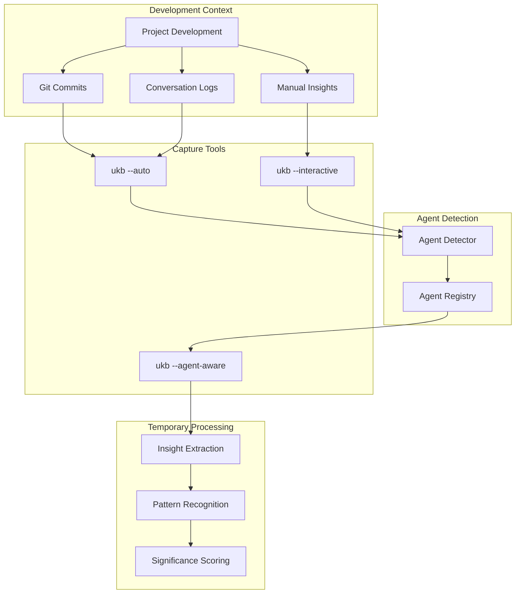
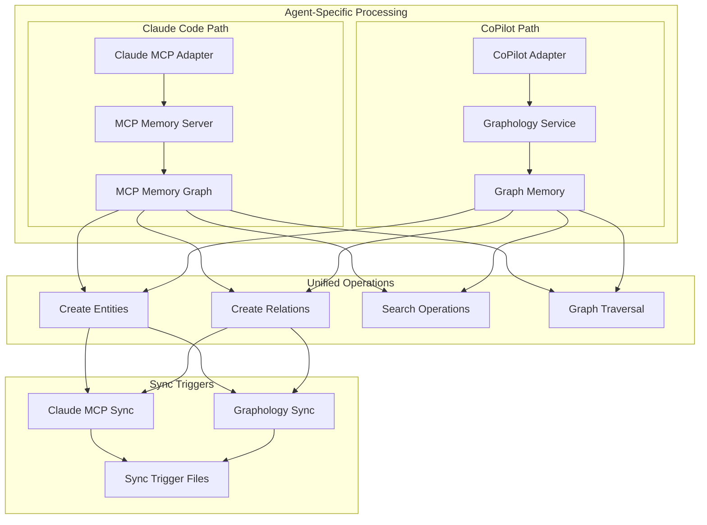
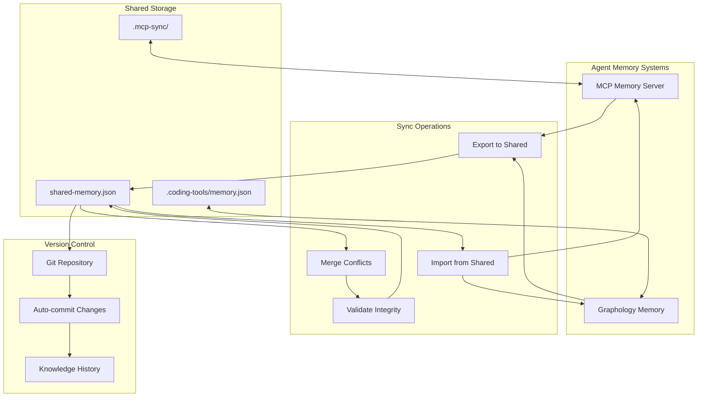
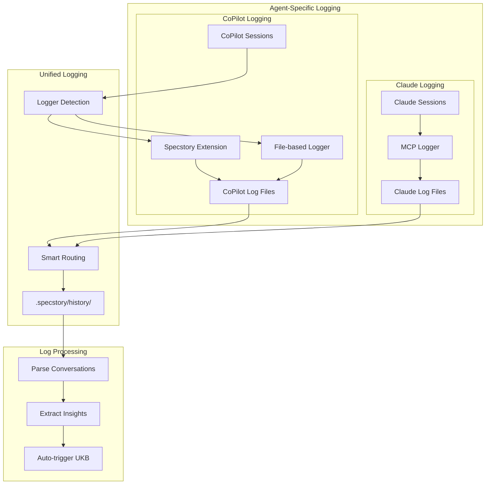
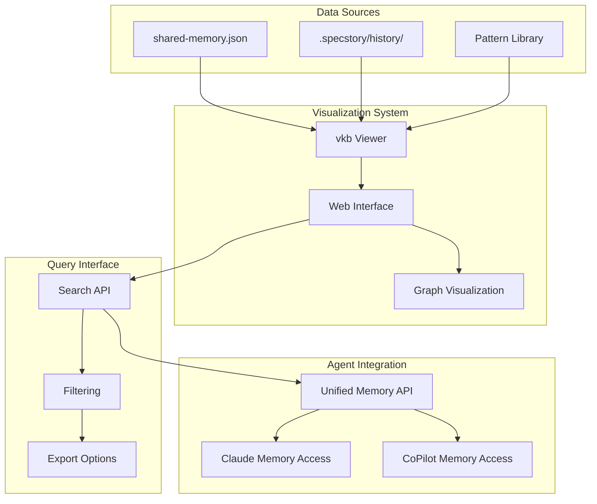
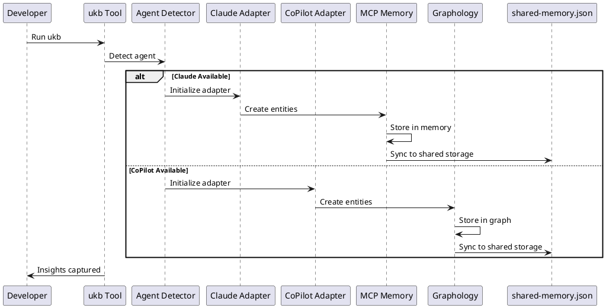
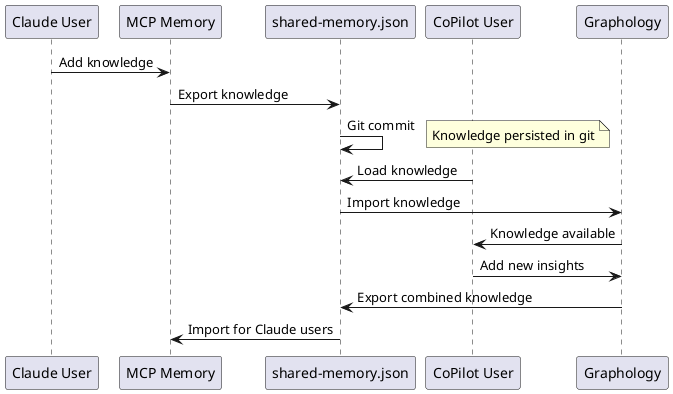
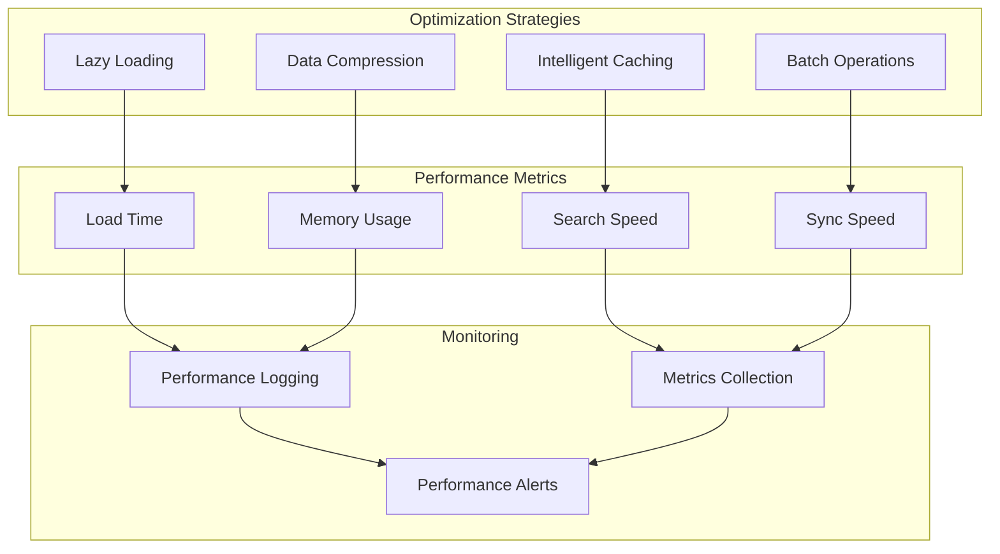
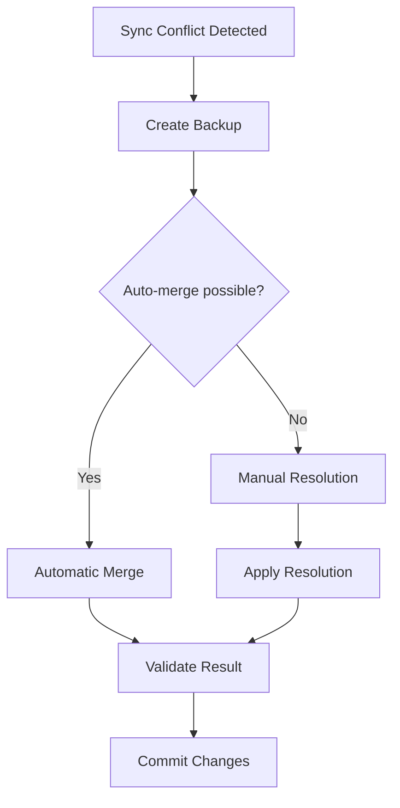
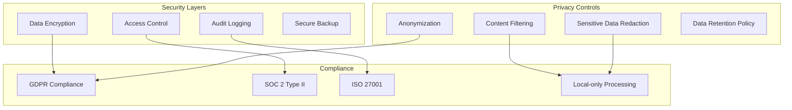

# Agent-Agnostic Knowledge Flow Architecture

## Overview

This document describes the comprehensive flow of information from project insights through agent-specific memory systems to persistent git storage in the agent-agnostic coding tools system. The architecture supports both Claude Code (with MCP) and GitHub CoPilot (with fallback services) while maintaining a unified knowledge base.

## Architecture Components

### 1. **Unified Insight Capture**
- **Source**: Development sessions, git commits, conversation logs
- **Tools**: Agent-aware `ukb` (Update Knowledge Base) script
- **Modes**: Interactive and automatic capture
- **Location**: Any project directory
- **Agents**: Works with Claude Code, GitHub CoPilot, or any detected agent

### 2. **Agent-Specific Memory Layer**
- **Claude Code**: MCP memory server for runtime knowledge graph
- **CoPilot**: Graphology.js for in-memory graph operations
- **Purpose**: Session-persistent and cross-session knowledge
- **Operations**: Create entities, add observations, create relations
- **Compatibility**: Both systems use same data format

### 3. **Unified Storage Sync**
- **File**: `shared-memory.json` in the coding project
- **Purpose**: Git-trackable persistent storage shared across agents
- **Format**: Structured JSON with entities, relations, and metadata
- **Versioning**: Git history provides knowledge evolution tracking
- **Agent-Agnostic**: Same format regardless of source agent

## Detailed Information Flow

### Phase 1: Agent-Aware Insight Capture



**Process**:
1. **Agent Detection**: System automatically detects available agents
2. **Automatic Mode** (`ukb --auto`):
   - Analyzes recent git commits for patterns
   - Extracts architectural insights from commit messages
   - Identifies performance optimizations and bug fixes
   - Generates insights based on file changes and patterns

3. **Interactive Mode** (`ukb --interactive`):
   - Guided insight capture with prompts
   - Significance ranking (1-10 scale)
   - Structured observation entry
   - Real-time validation and suggestions

### Phase 2: Agent-Specific Memory Operations



**Claude Code Process**:
1. **MCP Integration**: Direct integration with MCP memory server
2. **Sync Triggers**: Creates `.mcp-sync/sync-required.json` for session startup
3. **Persistence**: Memory persists across Claude sessions via MCP
4. **Bidirectional Sync**: MCP memory ↔ shared-memory.json

**CoPilot Process**:
1. **Graphology Integration**: Pure JavaScript graph operations
2. **Immediate Persistence**: Direct save to `.coding-tools/memory.json`
3. **Import/Export**: Compatible with MCP memory format
4. **Real-time Sync**: Graphology memory ↔ shared-memory.json

### Phase 3: Cross-Agent Memory Synchronization



**Synchronization Process**:
1. **Export Phase**: Each agent exports its memory to shared format
2. **Merge Phase**: Intelligent merging of insights from different agents
3. **Validation Phase**: Consistency checks and duplicate resolution
4. **Import Phase**: All agents can import the unified knowledge base

### Phase 4: Conversation Logging Integration



**Logging Integration**:
1. **Agent Detection**: Automatically detects available logging systems
2. **Smart Routing**: Routes logs to appropriate directories based on content
3. **Format Unification**: All logs stored in compatible format
4. **Insight Extraction**: Automated extraction of insights from conversations

### Phase 5: Knowledge Visualization and Access



## Data Flow Patterns

### Entity Creation Flow



### Cross-Agent Knowledge Sharing



## Performance Considerations

### Memory Optimization



### Scalability Metrics

| Component | Small Project | Medium Project | Large Project |
|-----------|---------------|----------------|---------------|
| **Entities** | <100 | 100-1000 | 1000+ |
| **Relations** | <200 | 200-2000 | 2000+ |
| **Load Time** | <100ms | <500ms | <2s |
| **Search Time** | <50ms | <200ms | <1s |
| **Sync Time** | <200ms | <1s | <5s |

## Error Handling and Recovery

### Sync Conflict Resolution



### Failure Recovery

```javascript
class KnowledgeFlowRecovery {
  async recoverFromFailure(error) {
    switch (error.type) {
      case 'SYNC_FAILURE':
        return await this.recoverSync();
      case 'MEMORY_CORRUPTION':
        return await this.recoverFromBackup();
      case 'AGENT_UNAVAILABLE':
        return await this.fallbackToAlternativeAgent();
      default:
        return await this.genericRecovery(error);
    }
  }
  
  async recoverSync() {
    // Restore from last known good state
    const backup = await this.getLastValidBackup();
    await this.restoreFromBackup(backup);
    return { recovered: true, method: 'backup_restore' };
  }
}
```

## Security and Privacy

### Data Protection



This agent-agnostic knowledge flow architecture ensures that insights and knowledge are captured, processed, and shared efficiently across different AI coding agents while maintaining data integrity, performance, and security.