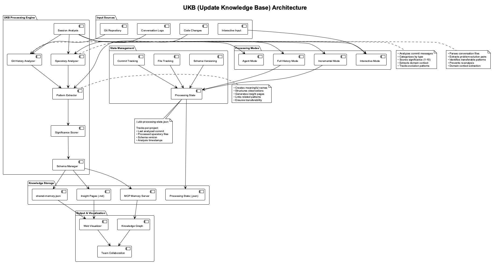
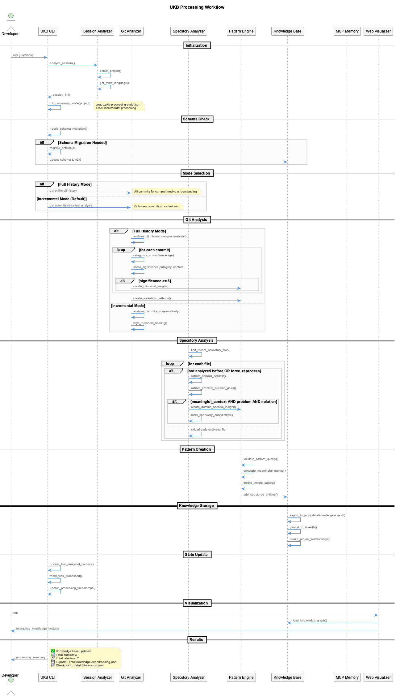
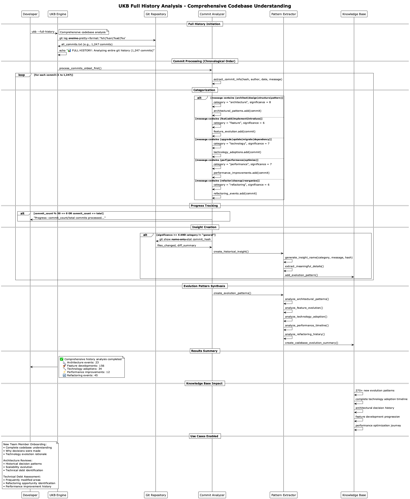
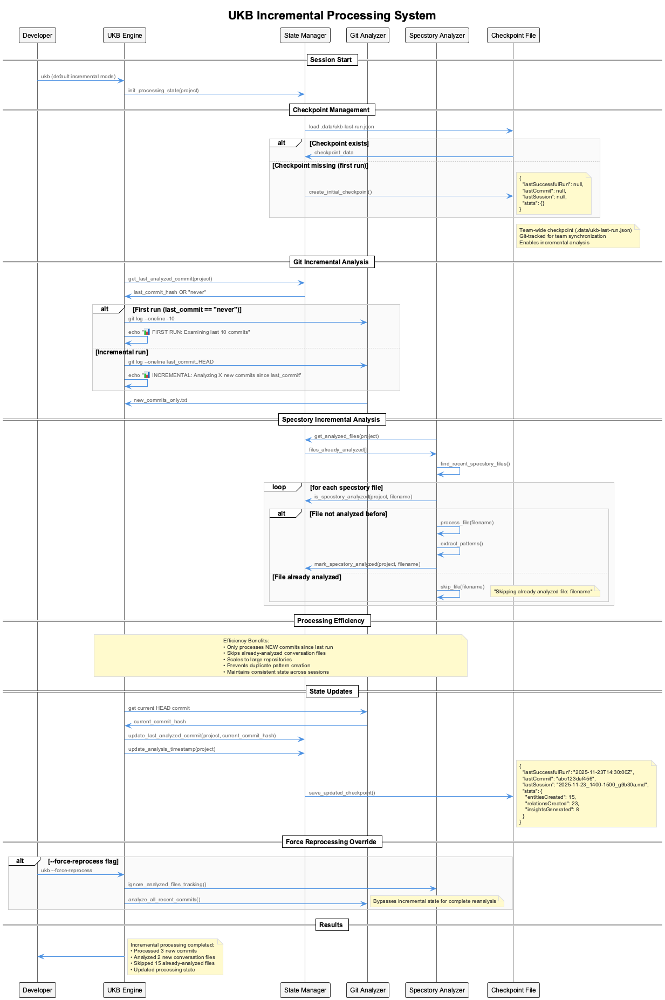

# UKB System Diagrams Reference

This document provides visual documentation of the UKB (Update Knowledge Base) system architecture, workflows, and processing modes.

## Architecture Diagrams

### System Architecture Overview



**Source**: [ukb-architecture.puml](puml/ukb-architecture.puml)

This diagram shows the complete UKB system architecture, including:

- **Input Sources**: Git repository, conversation logs, interactive input, code changes
- **Processing Engine**: Session analysis, git history analyzer, specstory analyzer, pattern extractor, significance scorer, schema manager
- **Processing Modes**: Incremental, full history, interactive, and agent modes
- **State Management**: Processing state, commit tracking, file tracking, schema versioning
- **Knowledge Storage**: MCP memory server, shared-memory.json, insight pages, processing state
- **Output & Visualization**: Knowledge graph, web visualizer, team collaboration

### Key Components

#### Processing Engine
- **Session Analysis**: Detects project context and main language
- **Git History Analyzer**: Categorizes commits and scores significance (1-10)
- **Specstory Analyzer**: Extracts problem-solution pairs from conversation files
- **Pattern Extractor**: Creates meaningful names and structured observations
- **Significance Scorer**: Ranks insights by importance and transferability
- **Schema Manager**: Handles version migration and data format evolution

#### State Management
- **Processing State**: Tracks per-project analysis progress in `~/.ukb-processing-state.json`
- **Commit Tracking**: Records last analyzed commit to enable incremental processing
- **File Tracking**: Prevents re-analysis of already processed conversation files
- **Schema Versioning**: Manages knowledge base format evolution

## Workflow Diagrams

### Complete Processing Workflow



**Source**: [ukb-workflow.puml](puml/ukb-workflow.puml)

This sequence diagram illustrates the complete UKB processing workflow:

1. **Initialization**: Session analysis, project detection, state loading
2. **Schema Check**: Automatic migration if needed
3. **Mode Selection**: Incremental vs full history processing
4. **Git Analysis**: Commit categorization and significance scoring
5. **Specstory Analysis**: Conversation file processing with domain extraction
6. **Pattern Creation**: Structured insight generation with quality validation
7. **Knowledge Storage**: Multiple output formats (MCP, JSON, Markdown)
8. **State Update**: Incremental processing state management

### Full History Analysis Deep Dive



**Source**: [ukb-full-history-analysis.puml](puml/ukb-full-history-analysis.puml)

This diagram shows the comprehensive full history analysis process:

#### Commit Processing (Chronological Order)
- **Architecture & Design**: Pattern detection, significance scoring (8-10)
- **Feature Development**: New capability tracking (6-8)
- **Technology Changes**: Migration and adoption analysis (7-9)
- **Performance Optimization**: Bottleneck resolution tracking (7-9)
- **Refactoring Events**: Code restructuring impact assessment (6-8)

#### Progress Tracking
- Shows analysis progress for large repositories (1000+ commits)
- Provides regular updates during processing
- Handles repositories with extensive history efficiently

#### Evolution Pattern Synthesis
- **Architectural Evolution**: Design decision timeline
- **Feature Timeline**: Capability development progression
- **Technology Adoption**: Framework and tool evolution
- **Performance Journey**: Optimization impact over time
- **Refactoring History**: Code quality improvement patterns

### Incremental Processing System



**Source**: [ukb-incremental-processing.puml](puml/ukb-incremental-processing.puml)

This diagram details the incremental processing system that enables efficient updates:

#### State File Management
```json
{
  "projects": {
    "project-name": {
      "last_commit_analyzed": "abc123def456",
      "specstory_files_analyzed": ["session1.md", "session2.md"],
      "last_analysis": "2025-06-16T14:30:00Z",
      "schema_version": "2.0.0"
    }
  },
  "global": {
    "last_updated": "2025-06-16T14:30:00Z",
    "version": "3.0.0"
  }
}
```

#### Efficiency Benefits
- **90% Time Savings**: Only processes new commits since last run
- **Scale Handling**: Efficient for repositories with 10,000+ commits
- **Consistency**: Prevents duplicate pattern creation
- **Reliability**: Maintains state across sessions

#### Force Reprocessing Override
- `--force-reprocess` flag bypasses incremental state
- Useful for complete re-analysis when needed
- Maintains all efficiency benefits during normal operation

## Processing Mode Comparisons

### Mode Selection Matrix

| Mode | Use Case | Processing Scope | Time Required | Output Focus |
|------|----------|------------------|---------------|--------------|
| **Incremental** (Default) | Daily development | New changes only | 5-30 seconds | Recent insights |
| **Full History** | Comprehensive understanding | Entire git history | 5-30 minutes | Evolution patterns |
| **Interactive** | Deep insight capture | Manual guidance | 10-30 minutes | High-quality patterns |
| **Agent** | AI-assisted analysis | Semantic extraction | 2-10 minutes | Automated patterns |

### Output Characteristics by Mode

#### Incremental Mode Output
```
📊 INCREMENTAL: Analyzing 3 new commits since abc123def
✅ Processing completed:
   • 3 new commits analyzed
   • 1 new conversation file processed
   • 2 patterns created
   • State updated
```

#### Full History Mode Output
```
📊 FULL HISTORY: Analyzing entire git history (1,247 commits)
✅ Comprehensive history analysis completed
   📐 Architecture events: 23
   🚀 Feature developments: 156
   🔧 Technology adoptions: 34
   ⚡ Performance improvements: 12
   🔄 Refactoring events: 45
```

#### Interactive Mode Features
- **Guided Prompts**: Structured insight capture with 8 questions
- **Quality Assurance**: Human oversight ensures high-value patterns
- **Context Richness**: Detailed problem-solution-outcome documentation
- **Domain Expertise**: Captures tacit knowledge and decision rationales

## Data Flow Architecture

### Input Processing Pipeline

```
Git Repository → Commit Analysis → Categorization → Significance Scoring → Pattern Creation
     ↓
Conversation Logs → Domain Extraction → Problem-Solution Pairs → Quality Filtering → Insight Generation
     ↓
Interactive Input → Guided Capture → Structured Documentation → Relationship Creation → Knowledge Integration
```

### Output Generation Pipeline

```
Structured Insights → MCP Memory (Runtime Knowledge Graph)
                   → shared-memory.json (Git-tracked Storage)
                   → Insight Pages (Detailed Documentation)
                   → Web Visualization (Interactive Browser)
```

### Knowledge Integration Flow

```
Individual Patterns → Relationship Detection → Project Context → Cross-Project Links → Team Knowledge Base
```

## Schema Evolution Diagrams

### Entity Structure Evolution

#### Version 1.0 (Simple String Observations)
```json
{
  "name": "PatternName",
  "entityType": "TransferablePattern",
  "observations": ["Simple string observation", "Another observation"],
  "significance": 8
}
```

#### Version 2.0 (Structured Observations)
```json
{
  "name": "PatternName",
  "entityType": "TransferablePattern",
  "problem": "Clear problem description",
  "solution": "Solution approach",
  "approach": "Implementation details",
  "observations": [
    {"type": "problem", "content": "...", "date": "..."},
    {"type": "solution", "content": "...", "date": "..."},
    {"type": "metric", "content": "...", "date": "..."}
  ],
  "significance": 8,
  "metadata": {
    "source": "git-history",
    "domain_context": "react,redux"
  }
}
```

### Migration Process Flow

```
Schema Detection → Backup Creation → Entity Migration → Relationship Preservation → Validation → Cleanup
```

## Performance Characteristics

### Repository Size vs Processing Time

| Repository Size | Incremental Mode | Full History Mode | Memory Usage |
|----------------|------------------|-------------------|--------------|
| < 100 commits | 5-10 seconds | 10-30 seconds | < 50MB |
| 100-1000 commits | 10-30 seconds | 1-5 minutes | 50-100MB |
| 1000-10000 commits | 15-45 seconds | 5-30 minutes | 100-500MB |
| 10000+ commits | 30-60 seconds | 30+ minutes | 500MB+ |

### Scaling Characteristics

- **Linear Scaling**: Processing time scales linearly with commit count
- **Memory Efficiency**: Streams data rather than loading all in memory
- **Progress Tracking**: Visual progress for long-running analyses
- **Depth Limiting**: `--history-depth N` for controlling scope

## Integration Points

### MCP Memory Integration
```
UKB Patterns → MCP Memory Server → Claude Code Sessions → Real-time Knowledge Access
```

### Git Integration
```
Git History → Commit Analysis → Evolution Patterns → Team Knowledge → Version Control
```

### Team Collaboration
```
Individual Analysis → shared-memory.json → Git Repository → Team Knowledge Sharing → Cross-Project Learning
```

### Web Visualization
```
Knowledge Base → JSON API → Web Visualizer → Interactive Graph → Pattern Discovery
```

## Diagram Usage Guidelines

### For Documentation
- Use architecture diagrams to explain system design
- Reference workflow diagrams for process understanding
- Include performance characteristics for capacity planning

### For Development
- Refer to processing flow diagrams for implementation guidance
- Use schema evolution diagrams for migration planning
- Consult integration diagrams for system interfaces

### For Training
- Start with architecture overview for system understanding
- Progress through workflow diagrams for operational knowledge
- Use mode comparison diagrams for usage guidance

---

*All diagrams are generated from PlantUML source files in the `puml/` directory and converted to PNG format for documentation inclusion.*