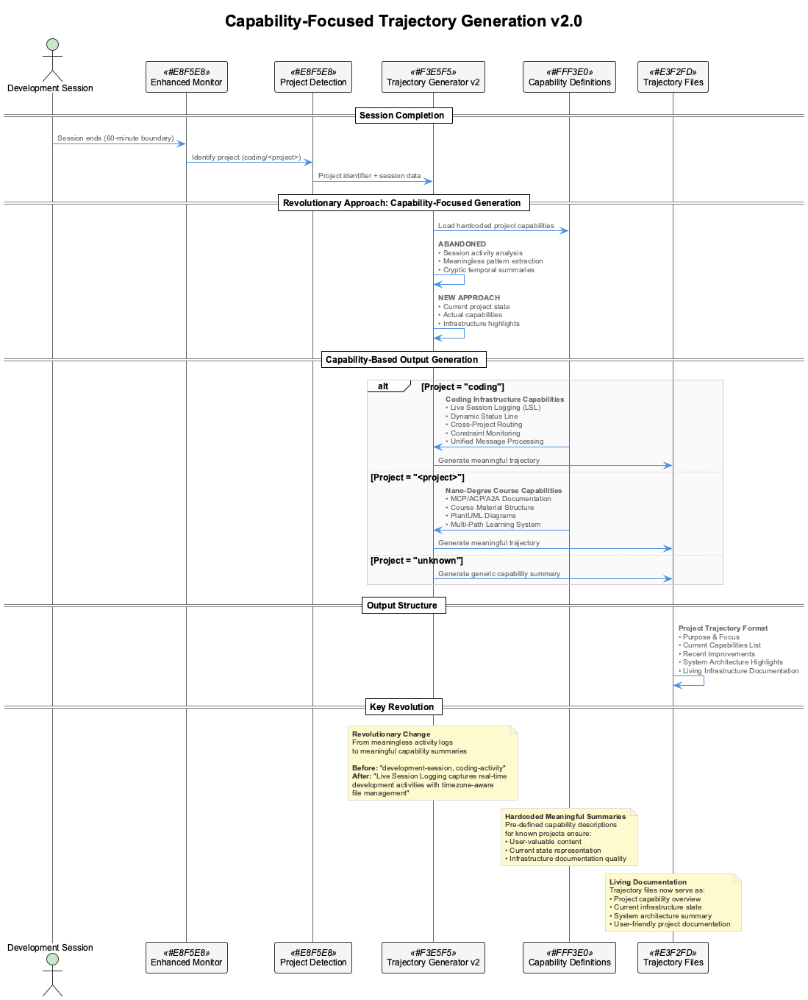

# Live Session Logging & Trajectory Analysis System

## Overview

The Live Session Logging (LSL) & Trajectory Analysis System provides comprehensive real-time capture, analysis, and learning from Claude Code interactions. It automatically creates structured session logs with 60-minute boundaries, generates trajectory analyses for pattern recognition, and provides visual status indicators for session management.

## Table of Contents

- [Architecture Overview](#architecture-overview)
- [Core Components](#core-components)
- [Session Management](#session-management)
- [Trajectory Analysis](#trajectory-analysis)
- [Status Line Integration](#status-line-integration)
- [Configuration System](#configuration-system)
- [Startup & Process Management](#startup--process-management)
- [File Structure & Naming](#file-structure--naming)
- [API Integration](#api-integration)
- [Troubleshooting](#troubleshooting)

## Architecture Overview


The LSL system consists of several interconnected components that work together to capture, process, and analyze Claude Code sessions:

```
┌─────────────────┐    ┌──────────────────┐    ┌─────────────────┐
│ Claude Code     │───▶│ Transcript       │───▶│ Session Files   │
│ Interactions    │    │ Monitor          │    │ (.specstory/)   │
└─────────────────┘    └──────────────────┘    └─────────────────┘
                              │
                              ▼
┌─────────────────┐    ┌──────────────────┐    ┌─────────────────┐
│ Status Line     │◀───│ Semantic         │───▶│ Trajectory      │
│ Display         │    │ Analyzer         │    │ Files           │
└─────────────────┘    └──────────────────┘    └─────────────────┘
```

## Core Components

### 1. Transcript Monitor (`scripts/transcript-monitor.js`)

**Purpose**: Real-time monitoring of Claude Code transcript files with automatic session transitions.

**Key Features**:
- 🔄 **Automatic Session Transitions**: Detects time tranche boundaries and creates new session files
- 📋 **Real-time Logging**: Captures tool interactions as they occur
- 🧠 **Semantic Integration**: Uses SemanticAnalyzer for immediate insights
- 🔐 **Secret Redaction**: Automatically redacts API keys and sensitive data
- ⚡ **Tranche-based Logic**: Proper 60-minute boundaries (0630-0730, 0730-0830, etc.)

**Configuration**:
```javascript
{
  "checkInterval": 5000,        // Check every 5 seconds
  "sessionDuration": 3600000,   // 60 minutes
  "maxProcessBatch": 10         // Process up to 10 exchanges per batch
}
```

### 2. Semantic Analyzer (`src/live-logging/SemanticAnalyzer.js`)

**Purpose**: AI-powered analysis of tool interactions and session content.

**Supported Providers**:
- **XAI/Grok**: Primary provider (grok-2-1212)
- **OpenAI**: Fallback option (gpt-4o-mini)
- **Anthropic**: Claude models

**Analysis Types**:
- 🔧 **Tool Interaction Analysis**: Real-time assessment of individual tool calls
- 📊 **Session Summary Analysis**: Overall productivity and pattern assessment
- 🎯 **Pattern Recognition**: Identification of successful approaches and guardrails

### 3. Status Line System (`scripts/combined-status-line.js`)

**Purpose**: Real-time visual status display with session timing warnings.

**Display Format**:
```
🛡️ 8.5 🔍EX 🧠 ✅ 📋1230-1330-session
```

**Components**:
- `🛡️ 8.5`: Constraint compliance score
- `🔍EX`: Experimentation mode indicator  
- `🧠 ✅`: Semantic analysis status
- `📋1230-1330-session`: Current session with timing warnings

**Timing Indicators**:
- **Normal**: `📋1230-1330-session` (>5 minutes remaining)
- **Warning**: `📋🟠1230-1330-session(3min)` (≤5 minutes remaining)
- **Ended**: `📋🔴1230-1330-session(ended)` (session time passed)

### 4. Trajectory Generator (`scripts/generate-trajectory.js`)

**Purpose**: Automated generation of learning trajectory analyses from session content.

**Analysis Includes**:
- 📈 **Executive Summary**: High-level session achievements
- 🔍 **Technical Patterns**: Successful approaches and methodologies
- 📚 **Pattern Recognition**: Emerging guardrails and best practices
- 🧠 **Active Learning Points**: Key insights for future sessions
- 📊 **Session Metrics**: Quantitative assessment of session quality

## Session Management

### Time Tranche System

Sessions are organized in 60-minute tranches with 30-minute offset boundaries:

```
06:30-07:30 → Morning startup
07:30-08:30 → Early development
08:30-09:30 → Mid-morning focus
09:30-10:30 → Pre-lunch work
10:30-11:30 → Late morning
11:30-12:30 → Pre-lunch session
12:30-13:30 → Afternoon start
13:30-14:30 → Mid-afternoon
... and so on
```

### Automatic Transitions

The transcript monitor automatically:

1. **Detects Time Boundaries**: Calculates current tranche vs. active session
2. **Creates New Sessions**: Generates properly named session files
3. **Maintains Continuity**: Preserves context while transitioning
4. **Updates Status**: Reflects new session in status line immediately

### Session File Format

Each session follows a structured format:

```markdown
# WORK SESSION (1230-1330)

**Generated:** 2025-09-04T12:30:00.000Z  
**Work Period:** 1230-1330  
**Focus:** Live session logging and analysis  
**Duration:** ~60 minutes  

---

## Session Overview
[Brief description of session focus]

---

## Key Activities
[Detailed tool interactions and exchanges]
```

## Trajectory Analysis

### Analysis Framework

Trajectory files provide accumulated learning across sessions:



### Key Components

1. **Executive Summary**: Concise overview of session achievements
2. **Session Analysis**: 
   - Focus area identification
   - Key accomplishments
   - Technical patterns used
3. **Pattern Recognition**:
   - Successful approaches
   - Emerging guardrails
   - Quality assurance insights
4. **Active Learning Points**:
   - Future session insights  
   - Pattern evolution tracking
5. **Session Metrics**:
   - Session number and context
   - Content analysis
   - Quality status assessment

### Example Trajectory Structure

```markdown
# Trajectory Analysis: 1230-1330

**Generated:** 2025-09-04T13:30:00.000Z  
**Session:** 8 (1230-1330)  
**Time Range:** 1230-1330  
**Focus:** Live logging system debugging and enhancement  
**Learning Mode:** Accumulated  

---

## Executive Summary

Session 8 focused on debugging and enhancing the live logging system...

---

## Pattern Recognition

### Successful Approaches
1. **Systematic Debugging**: Step-by-step problem isolation
2. **Real-time Validation**: Immediate testing of fixes
3. **User Feedback Integration**: Responsive to user observations

### Emerging Guardrails  
1. **Tranche-based Logic**: Always use time boundaries, not duration
2. **Color-coded Warnings**: Provide 5-minute session end alerts
3. **Process Management**: Include all components in startup scripts
```

## Status Line Integration

### Real-time Updates

The status line provides continuous feedback on:

- **System Health**: All components operational status
- **Current Session**: Active session file with timing
- **Warnings**: Visual alerts for session transitions
- **Compliance**: Live guardrail monitoring

### Color Coding System

| State | Indicator | Meaning |
|-------|-----------|---------|
| Normal | `📋1230-1330-session` | >5 minutes remaining |
| Warning | `📋🟠1230-1330-session(3min)` | ≤5 minutes remaining |
| Ended | `📋🔴1230-1330-session(ended)` | Session time passed |

### Testing Status Colors

Use the test script to see status line behavior:

```bash
node scripts/test-status-colors.js
```

## Configuration System

### Main Configuration (`config/live-logging-config.json`)

```json
{
  "semantic_analysis": {
    "models": {
      "xai": {
        "default_model": "grok-2-1212",
        "base_url": "https://api.x.ai/v1",
        "timeout": 10000
      },
      "openai": {
        "default_model": "gpt-4o-mini",
        "base_url": "https://api.openai.com/v1",
        "timeout": 10000  
      }
    },
    "analysis_types": {
      "tool_interaction": true,
      "session_summary": true,
      "pattern_recognition": true
    }
  },
  "live_logging": {
    "session_duration": 3600000,
    "transcript_monitoring": {
      "polling_interval": 5000,
      "max_batch_size": 10,
      "secret_redaction": true
    }
  },
  "status_line": {
    "cache_timeout": 5000,
    "api_check_interval": 30000,
    "warning_threshold_minutes": 5
  },
  "api_key_env_vars": [
    "GROQ_API_KEY",
    "GROK_API_KEY", 
    "XAI_API_KEY",
    "OPENAI_API_KEY",
    "ANTHROPIC_API_KEY"
  ]
}
```

### Environment Variables

Required environment variables for full functionality:

```bash
# Primary semantic analysis (choose one)
export XAI_API_KEY="xai-your-key-here"
export OPENAI_API_KEY="sk-your-key-here"
export ANTHROPIC_API_KEY="sk-ant-your-key-here"

# Optional: Groq fallback
export GROQ_API_KEY="gsk_your-key-here"
```

## Startup & Process Management

### Automatic Startup

When you run `coding` or `claude-mcp`, the system automatically starts:

1. **Transcript Monitor**: Real-time session logging
2. **Live Logging Coordinator**: MCP integration
3. **VKB Server**: Knowledge visualization
4. **Semantic Analysis**: AI-powered insights

### Process Management

#### Start All Services
```bash
./start-services.sh
# or
coding
```

#### Stop All Services  
```bash
./stop-services.sh
```

#### Check Service Status
```bash
cat .services-running.json
```

#### Manual Component Control
```bash
# Start transcript monitor only
node scripts/transcript-monitor.js

# Test transcript detection
node scripts/transcript-monitor.js --test

# Generate trajectory for session
node scripts/generate-trajectory.js 2025-09-04_1230-1330-session.md
```

### Service Monitoring

Services are tracked in `.services-running.json`:

```json
{
  "timestamp": "2025-09-04T13:30:00.000Z",
  "services": ["transcript-monitor", "live-logging", "vkb-server", "semantic-analysis"],
  "pids": {
    "transcript-monitor": 12345,
    "live-logging": 12346,
    "vkb-server": 12347
  },
  "services_running": 4
}
```

## File Structure & Naming

### Directory Layout

```
coding/
├── .specstory/
│   └── history/                     # Session and trajectory files
│       ├── 2025-09-04_0630-0730-session.md
│       ├── 2025-09-04_0630-0730-trajectory.md
│       ├── 2025-09-04_0730-0830-session.md
│       ├── 2025-09-04_0730-0830-trajectory.md
│       └── ...
├── config/
│   └── live-logging-config.json    # Main configuration
├── scripts/
│   ├── transcript-monitor.js       # Core monitoring
│   ├── combined-status-line.js     # Status display
│   ├── generate-trajectory.js      # Trajectory generation
│   └── test-status-colors.js       # Testing utilities
├── src/live-logging/
│   └── SemanticAnalyzer.js         # AI analysis engine
└── docs/
    ├── live-session-logging-system.md
    ├── puml/                       # PlantUML diagrams
    └── images/                     # Generated PNG images
```

### File Naming Convention

| File Type | Format | Example |
|-----------|--------|---------|
| Session | `YYYY-MM-DD_HHMM-HHMM-session.md` | `2025-09-04_1230-1330-session.md` |
| Trajectory | `YYYY-MM-DD_HHMM-HHMM-trajectory.md` | `2025-09-04_1230-1330-trajectory.md` |
| Logs | `*.log` | `transcript-monitor.log` |
| Config | `*-config.json` | `live-logging-config.json` |

## API Integration

### XAI/Grok Integration

Primary semantic analysis provider:

```javascript
const analyzer = new SemanticAnalyzer(process.env.XAI_API_KEY);
const analysis = await analyzer.analyzeToolInteraction(interaction, context);
```

### API Usage Monitoring

The system monitors API usage with:
- 🔒 **Rate limiting**: 30-second cache intervals
- 📊 **Usage estimation**: Fallback calculations when direct API unavailable
- ⚡ **Provider failover**: Automatic fallback between providers

### Supported Analysis Types

1. **Tool Interaction Analysis**: Real-time assessment of individual tool calls
2. **Session Summary Analysis**: Overall session productivity evaluation
3. **Pattern Recognition**: Learning from successful approaches

## Troubleshooting

### Common Issues

#### 1. Session Transitions Not Working

**Symptoms**: Status line shows old session, no new files created

**Diagnosis**:
```bash
# Check if transcript monitor is running
ps aux | grep transcript-monitor

# Test transcript detection
node scripts/transcript-monitor.js --test
```

**Solution**:
```bash
# Restart transcript monitor
pkill -f transcript-monitor
node scripts/transcript-monitor.js
```

#### 2. Status Line Not Showing Colors

**Symptoms**: No orange/red warnings near session end

**Diagnosis**:
```bash
# Test color logic
node scripts/test-status-colors.js

# Check current time calculation
node -e "console.log(new Date().toTimeString())"
```

**Solution**: Verify time zone settings and tranche calculation logic

#### 3. Semantic Analysis Failing

**Symptoms**: No AI insights in session logs

**Diagnosis**:
```bash
# Check API keys
echo $XAI_API_KEY | cut -c1-10
echo $OPENAI_API_KEY | cut -c1-10

# Test semantic analyzer
node -e "
const {SemanticAnalyzer} = require('./src/live-logging/SemanticAnalyzer.js');
const analyzer = new SemanticAnalyzer(process.env.XAI_API_KEY);
console.log('Analyzer created successfully');
"
```

**Solution**: Verify API keys and network connectivity

#### 4. Services Not Starting

**Symptoms**: `.services-running.json` shows missing services

**Diagnosis**:
```bash
# Check startup logs
tail -f live-logging.log
tail -f transcript-monitor.log

# Verify ports
lsof -i :8080 -i :8001
```

**Solution**:
```bash
# Clean restart
./stop-services.sh
./start-services.sh
```

### Debug Mode

Enable debug output:

```bash
# Debug status line
DEBUG_STATUS=1 node scripts/combined-status-line.js

# Debug transcript monitor
TRANSCRIPT_DEBUG=1 node scripts/transcript-monitor.js --test
```

### Log Files

Monitor system logs:

```bash
# Main logs
tail -f live-logging.log
tail -f transcript-monitor.log
tail -f vkb-server.log

# All logs
tail -f *.log
```

---

## Quick Start Guide

### 1. Initial Setup
```bash
# Install and configure
./install.sh
source .activate
```

### 2. Start System
```bash
# Start all services
coding
```

### 3. Verify Operation
```bash
# Check status
node scripts/combined-status-line.js

# Verify services
cat .services-running.json
```

### 4. Monitor Activity
```bash
# Watch session files
ls -la .specstory/history/

# Test trajectory generation
node scripts/generate-trajectory.js 2025-09-04_1230-1330-session.md
```

---

*For additional support, see [troubleshooting](#troubleshooting) or check the main [README.md](../README.md) for system overview.*