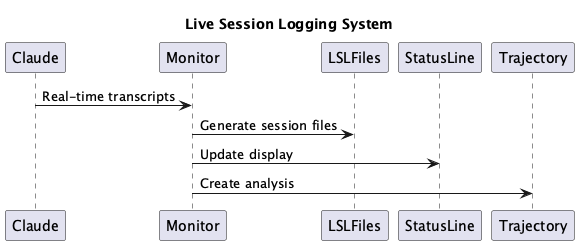

# Live Session Logging (LSL) System v2.0

## Overview

The Live Session Logging (LSL) System provides comprehensive real-time capture, cross-project routing, and semantic analysis of Claude Code interactions. This revamped system automatically creates structured session logs with timezone-aware 60-minute boundaries, intelligent content classification, and robust project detection.



## Table of Contents

- [Architecture Overview](#architecture-overview)
- [Core Components](#core-components)
- [Cross-Project Content Routing](#cross-project-content-routing)
- [Timezone & Time Window Management](#timezone--time-window-management)
- [Status Line Integration](#status-line-integration)
- [Enhanced Project Detection](#enhanced-project-detection)
- [File Structure & Naming](#file-structure--naming)
- [Configuration System](#configuration-system)
- [Troubleshooting](#troubleshooting)

## Architecture Overview

The LSL system v2.0 introduces several major improvements over the previous version:

### Key Enhancements
- **Cross-Project Routing**: Intelligent classification routes coding content from nano-degree sessions to coding project
- **Robust Project Detection**: Uses multiple detection methods (environment variables, .specstory directories, current working directory)
- **Centralized Timezone Handling**: Single source of truth for timezone configuration and conversions
- **Enhanced Status Line**: Real-time session monitoring with timing warnings and redirect status
- **Semantic Trajectory Analysis**: AI-powered trajectory generation using Grok/XAI

### System Flow
```
Claude Session → Enhanced Transcript Monitor → Content Classification → LSL Files
                                           ↓
Status Line Display ← Semantic Analysis ← Trajectory Generation
```

## Core Components

### 1. Enhanced Transcript Monitor (`scripts/enhanced-transcript-monitor.js`)

**Purpose**: Real-time monitoring with cross-project routing and robust project detection.

**Key Features**:
- 🔄 **Robust Project Detection**: Uses status line's proven project detection logic
- 🌐 **Cross-Project Routing**: Routes coding content from nano-degree to coding project  
- ⏰ **Timezone-Aware Processing**: Centralized timezone handling via `.env` configuration
- 📋 **Real-time LSL Generation**: Creates structured session files as interactions occur
- 🧠 **Semantic Integration**: Generates trajectory files with AI analysis
- 🔐 **Secret Redaction**: Automatically redacts sensitive information

**Configuration Environment Variables**:
```bash
CODING_TARGET_PROJECT=/path/to/nano-degree    # Source project to monitor
CODING_REPO=/path/to/coding                   # Target coding project  
TIMEZONE=Europe/Berlin                        # Timezone for file naming
```

### 2. Timezone Utilities (`scripts/timezone-utils.js`)

**Purpose**: Centralized timezone handling for consistent timestamp formatting.

**Key Functions**:
- `parseTimestamp(utcString)` - Convert UTC to local timezone
- `formatTimestamp(utcString, timezone)` - Format for display (both UTC and local)
- `getTimeWindow(timestamp)` - Determine 60-minute tranche  
- `getTimezone()` - Load timezone from `.env` configuration

**Display Format**: 
```
05/09/2025, 15:33 CEST (2025-09-05 13:33:47 UTC)
```

### 3. Combined Status Line (`scripts/combined-status-line.js`)

**Purpose**: Real-time visual status with session timing warnings and redirect information.

**Display Components**:
```
🛡️ 8.5 🔍EX 🧠 ✅ 🔀→coding 📋1530-1630-session
```

- `🛡️ 8.5` - Constraint compliance score
- `🔍EX` - Experimentation mode active
- `🧠 ✅` - Semantic analysis operational  
- `🔀→coding` - Content being redirected to coding project
- `📋1530-1630-session` - Current session with timing warnings

**Timing Warnings**:
- **Normal**: `📋1530-1630-session` (>5 minutes remaining)
- **Warning**: `📋🟠1530-1630-session(3min)` (≤5 minutes remaining)  
- **Ended**: `📋🔴1530-1630-session(ended)` (session time passed)

### 4. Content Classification System

**Purpose**: Intelligent routing of content based on context analysis.

**Classification Logic**:
- **Coding Content**: File paths containing `/coding/`, Git operations, development workflows
- **Project Content**: Content specific to the source project (nano-degree)
- **Mixed Content**: Sessions spanning both domains

**Routing Rules**:
```javascript
// Coding content → coding project LSL files
if (isToolOperationOnCodingFiles(exchange) || isGitOperation(exchange)) {
  route_to_coding_project(exchange);
}

// Project-specific content → source project LSL files  
if (isProjectSpecificContent(exchange)) {
  route_to_source_project(exchange);
}
```

## Cross-Project Content Routing

### Routing Architecture

The system monitors sessions in one project (e.g., nano-degree) and intelligently routes content to appropriate LSL files:

```
nano-degree session → Enhanced Monitor → Classification → {
  coding content → /coding/.specstory/history/*_from-nano-degree.md
  nano-degree content → /nano-degree/.specstory/history/*-session.md
}
```

### File Naming Convention

| Content Type | Location | Format |
|--------------|----------|--------|
| Source Project | `/nano-degree/.specstory/history/` | `2025-09-05_1530-1630-session.md` |
| Cross-Project | `/coding/.specstory/history/` | `2025-09-05_1530-1630_coding-session-from-nano-degree.md` |
| Trajectory | `/coding/.specstory/trajectory/` | `2025-09-05_1530-1630_coding-trajectory-from-nano-degree.md` |

### Redirect Status Tracking

The system maintains `.redirect-status` files to track active routing:

```json
{
  "timestamp": "2025-09-05T14:05:56.737Z",
  "tranche": "1530-1630", 
  "target": "coding"
}
```

This enables the status line to show `🔀→coding` when content is being actively routed.

## Timezone & Time Window Management

### Centralized Configuration

All timezone handling is centralized in `.env`:
```bash
TIMEZONE=Europe/Berlin
```

### Time Window System

Sessions use 60-minute tranches with 30-minute offsets:

| Time Tranche | File Suffix | Description |
|--------------|------------|-------------|
| 06:30-07:30 | `0630-0730` | Morning startup |
| 07:30-08:30 | `0730-0830` | Early development |
| 08:30-09:30 | `0830-0930` | Mid-morning focus |
| 09:30-10:30 | `0930-1030` | Pre-lunch work |
| 10:30-11:30 | `1030-1130` | Late morning |
| 11:30-12:30 | `1130-1230` | Pre-lunch session |
| 12:30-13:30 | `1230-1330` | Afternoon start |
| 13:30-14:30 | `1330-1430` | Mid-afternoon |
| 15:30-16:30 | `1530-1630` | Late afternoon |

### UTC to Local Conversion

All Claude transcript timestamps are in UTC and converted to local timezone for file naming and display:

```javascript
// UTC timestamp from Claude
"2025-09-05T13:33:47.123Z" 

// Converted to CEST (Europe/Berlin)
"05/09/2025, 15:33 CEST (2025-09-05 13:33:47 UTC)"

// File name uses local time tranche
"2025-09-05_1530-1630-session.md"
```

## Status Line Integration

### Real-Time Project Detection

The status line uses robust project detection that checks:
1. `CODING_TARGET_PROJECT` environment variable
2. Current working directory for `.specstory` folders
3. Coding repo directory as fallback

### Session Timing Logic

```javascript
function calculateTimeRemaining(sessionTimeRange) {
  // Parse session end time (e.g., "1530-1630" -> 16:30)
  // Compare with current local time
  // Return minutes remaining
  
  if (remainingMinutes > 5) return normal_display;
  if (remainingMinutes > 0) return orange_warning;
  return red_ended;
}
```

### Service Health Monitoring

The status line monitors:
- **Constraint Monitor**: Compliance scoring (`🛡️ 8.5`)
- **Semantic Analysis**: AI service status (`🧠 ✅`)
- **Live Session**: Current session status (`📋1530-1630-session`)
- **Content Routing**: Cross-project routing (`🔀→coding`)

## Enhanced Project Detection

### Detection Algorithm

The enhanced transcript monitor uses a three-tier detection approach:

```javascript
function getProjectPath() {
  const checkPaths = [
    process.env.CODING_TARGET_PROJECT,  // Explicit target (e.g., nano-degree)
    process.env.CODING_REPO,            // Coding repository
    process.cwd()                       // Current working directory
  ].filter(Boolean);
  
  // Look for .specstory directory to confirm valid project
  for (const checkPath of checkPaths) {
    if (fs.existsSync(path.join(checkPath, '.specstory'))) {
      return checkPath;
    }
  }
  
  return process.cwd(); // Fallback
}
```

### Validation Criteria

Projects are validated by checking for:
- `.specstory/` directory (primary indicator)
- `CLAUDE.md` file (secondary indicator)
- `package.json` or other project files (fallback)

## File Structure & Naming

### Directory Layout

```
project-root/
├── .specstory/
│   ├── history/                           # LSL session files
│   │   ├── 2025-09-05_1530-1630-session.md
│   │   ├── 2025-09-05_1530-1630_coding-session-from-nano-degree.md
│   │   └── ...
│   ├── trajectory/                        # Trajectory analysis files  
│   │   ├── 2025-09-05_1530-1630_coding-trajectory-from-nano-degree.md
│   │   └── ...
│   └── .redirect-status                   # Current routing status
├── .env                                   # Timezone configuration
└── scripts/
    ├── enhanced-transcript-monitor.js     # Core monitoring
    ├── combined-status-line.js           # Status display
    ├── timezone-utils.js                 # Timezone handling  
    └── generate-proper-lsl-from-transcripts.js
```

### LSL File Format

Each LSL file follows a structured markdown format:

```markdown
# WORK SESSION (1530-1630)

**Generated:** 2025-09-05T15:30:00.000Z
**Work Period:** 1530-1630 
**Focus:** Live session logging development
**Duration:** ~60 minutes

---

## Session Overview

This session captures real-time tool interactions and exchanges.

---

## Key Activities  

### User Prompt - 2025-09-05T15:33:47.123Z

**Request:** Update the LSL documentation with latest changes

**Claude Response:** I'll update the documentation to reflect...

**Tools Used:**
- Read: ✅ /path/to/file.md
- Edit: ✅ Updated documentation

**Analysis:** 📋 General activity

---
```

### Trajectory File Format

Trajectory files provide semantic analysis of session patterns:

```markdown  
# Trajectory Analysis: 1530-1630

**Generated:** 2025-09-05T16:30:00.000Z
**Session:** 1530-1630  
**Focus:** Documentation and system enhancement
**Source:** nano-degree project
**Target:** coding project

---

## Executive Summary

Session focused on updating Live Session Logging documentation and improving cross-project content routing...

---

## Technical Patterns Applied

1. **Systematic Documentation**: Complete rewrite of LSL system docs
2. **Cross-Project Integration**: Enhanced routing between nano-degree and coding
3. **Timezone Standardization**: Centralized timezone handling implementation

---

## Key Insights

- Robust project detection eliminates TBD status issues  
- Cross-project routing enables specialized content organization
- Centralized timezone handling prevents timestamp misalignment

---
```

## Configuration System

### Environment Variables (`.env`)

```bash
# Timezone Configuration
TIMEZONE=Europe/Berlin

# Project Paths
CODING_TARGET_PROJECT=/Users/q284340/Agentic/nano-degree
CODING_REPO=/Users/q284340/Agentic/coding

# API Keys for Semantic Analysis
XAI_API_KEY=xai-your-key-here
OPENAI_API_KEY=sk-your-key-here
GROQ_API_KEY=gsk_your-key-here

# Optional: Debugging
TRANSCRIPT_DEBUG=true
DEBUG_STATUS=true
```

### LSL Configuration (`config/live-logging-config.json`)

```json
{
  "live_logging": {
    "session_duration": 3600000,
    "timezone_from_env": true,
    "cross_project_routing": true,
    "transcript_monitoring": {
      "polling_interval": 2000,
      "max_batch_size": 10,
      "secret_redaction": true
    }
  },
  "semantic_analysis": {
    "models": {
      "xai": {
        "default_model": "grok-2-1212",
        "base_url": "https://api.x.ai/v1"
      }
    },
    "trajectory_generation": true,
    "max_tokens": 400,
    "temperature": 0.2
  },
  "status_line": {
    "cache_timeout": 5000,
    "warning_threshold_minutes": 5,
    "show_redirect_status": true
  }
}
```

## Usage Examples

### Starting the System

```bash  
# Set target project for monitoring
export CODING_TARGET_PROJECT="/Users/q284340/Agentic/nano-degree"

# Start enhanced transcript monitor
node /path/to/coding/scripts/enhanced-transcript-monitor.js

# Check status
/path/to/coding/scripts/combined-status-line.js
# Output: 🛡️ 8.5 🔍EX 🧠 ✅ 🔀→coding 📋1530-1630-session
```

### Generating LSL Files Manually

```bash
# Generate LSL files for specific project
CODING_TARGET_PROJECT="/Users/q284340/Agentic/nano-degree" \
node /path/to/coding/scripts/generate-proper-lsl-from-transcripts.js --project=coding

# Generate for nano-degree content  
node /path/to/coding/scripts/generate-proper-lsl-from-transcripts.js --project=nano-degree
```

### Testing Project Detection

```bash
# Test transcript monitor project detection
CODING_TARGET_PROJECT="/Users/q284340/Agentic/nano-degree" \
TRANSCRIPT_DEBUG=true \
node /path/to/coding/scripts/enhanced-transcript-monitor.js --test
```

## Troubleshooting

### Common Issues

#### 1. Status Line Shows TBD  

**Symptoms**: Status displays `📋1553_TBD` instead of session time

**Causes**: 
- Enhanced transcript monitor not running
- Project detection failing  
- No active transcript found

**Solution**:
```bash
# Check monitor status  
ps aux | grep enhanced-transcript-monitor

# Restart with proper environment
export CODING_TARGET_PROJECT="/path/to/source/project"
node scripts/enhanced-transcript-monitor.js

# Verify project detection
TRANSCRIPT_DEBUG=true node scripts/enhanced-transcript-monitor.js --test
```

#### 2. Cross-Project Routing Not Working

**Symptoms**: All content goes to source project, no `*_from-nano-degree.md` files created

**Causes**:
- Content classification logic not triggered
- Missing `.redirect-status` updates
- Environment variables not set

**Solution**:
```bash
# Check redirect status
cat .specstory/.redirect-status

# Verify environment
echo $CODING_TARGET_PROJECT  
echo $CODING_REPO

# Test content classification
node scripts/generate-proper-lsl-from-transcripts.js --project=coding
```

#### 3. Timezone Issues

**Symptoms**: Files created with wrong time windows, misaligned timestamps

**Causes**:
- Missing or incorrect `TIMEZONE` in `.env`  
- Timezone utilities not being used
- UTC vs local time confusion

**Solution**:
```bash
# Check timezone configuration
grep TIMEZONE .env

# Test timezone utilities
node -e "
const { formatTimestamp } = require('./scripts/timezone-utils.js');
console.log(formatTimestamp('2025-09-05T13:33:47.123Z'));
"
```

#### 4. Semantic Analysis Failing

**Symptoms**: No trajectory files generated, missing AI insights

**Causes**:
- Missing API keys
- Network connectivity issues
- API rate limiting

**Solution**:
```bash
# Check API keys  
echo ${XAI_API_KEY:0:10}
echo ${OPENAI_API_KEY:0:10}

# Test semantic analyzer
node -e "
const { SemanticAnalyzer } = require('./src/live-logging/SemanticAnalyzer.js');
const analyzer = new SemanticAnalyzer(process.env.XAI_API_KEY);
console.log('Analyzer initialized successfully');
"
```

### Debug Mode

Enable detailed logging:

```bash
# Enhanced transcript monitor debug
TRANSCRIPT_DEBUG=true node scripts/enhanced-transcript-monitor.js

# Status line debug
DEBUG_STATUS=true node scripts/combined-status-line.js  

# Combined debug mode
TRANSCRIPT_DEBUG=true DEBUG_STATUS=true \
CODING_TARGET_PROJECT="/path/to/project" \
node scripts/enhanced-transcript-monitor.js
```

### Log Files

Monitor system activity:

```bash
# Watch active logs
tail -f enhanced-transcript-monitor.log
tail -f combined-status-line.log

# Check service status
cat .services-running.json
```

---

## Quick Start Guide

### 1. Environment Setup
```bash
# Configure timezone in .env
echo "TIMEZONE=Europe/Berlin" >> .env

# Set monitoring target
export CODING_TARGET_PROJECT="/path/to/nano-degree"
```

### 2. Start Monitoring
```bash  
# Start enhanced transcript monitor  
node scripts/enhanced-transcript-monitor.js &

# Verify status
scripts/combined-status-line.js
```

### 3. Verify Operation
```bash
# Check for LSL files
ls -la .specstory/history/

# Check redirect status  
cat .specstory/.redirect-status

# View trajectory files
ls -la .specstory/trajectory/
```

### 4. Monitor Activity
```bash
# Real-time status monitoring
watch -n 5 scripts/combined-status-line.js

# Live file updates
watch -n 10 'ls -la .specstory/history/ | tail -5'
```

---

*For system overview and general usage, see the main [README.md](../README.md).*