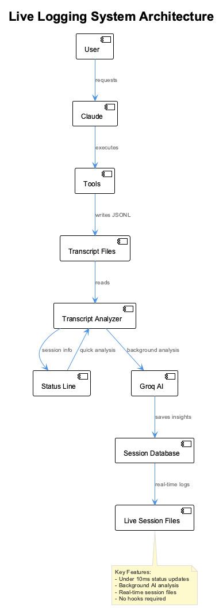
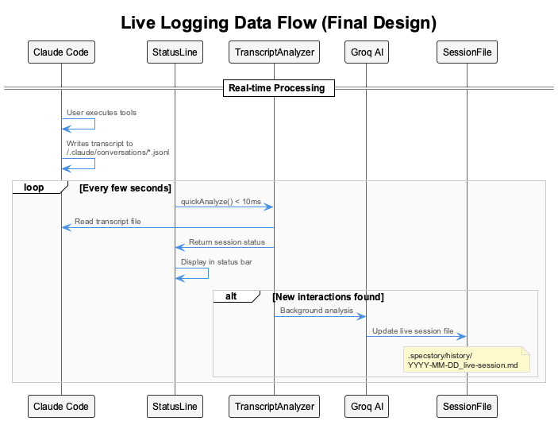

# Live Logging System

The Live Logging System provides real-time session monitoring and AI-powered analysis of Claude Code interactions through transcript-based monitoring.

## Architecture Overview



The system consists of four main components:

1. **Claude Code Session**: User interactions automatically generate transcript files
2. **Live Logging System**: Real-time analysis and status display  
3. **Storage & Output**: Session files and database storage
4. **External Services**: Groq API for AI analysis

## Data Flow



### Real-time Processing

1. **Claude Code** writes tool interactions to `~/.claude/conversations/*.jsonl`
2. **StatusLine** calls `TranscriptAnalyzer.quickAnalyze()` every few seconds (< 10ms)
3. **TranscriptAnalyzer** reads transcript files and extracts new tool interactions
4. **StatusLine** displays session information in the Claude Code status bar
5. **Background Analysis**: When new interactions are found, Groq AI provides detailed insights
6. **Live Session Files** are updated in real-time in `.specstory/history/`

## Key Features

### ⚡ Performance Optimized
- **Quick Analysis**: < 10ms status updates 
- **Background Processing**: Heavy AI analysis doesn't block UI
- **File-based**: No network dependencies for core functionality
- **Caching**: SQLite database stores analysis results

### 🤖 AI-Powered Insights  
- **Groq Integration**: Fast AI analysis using Llama models
- **Tool Understanding**: Recognizes and categorizes Claude Code tool usage
- **Progress Assessment**: Tracks coding session productivity
- **Pattern Recognition**: Identifies workflow patterns and improvements

### 📊 Real-time Monitoring
- **Status Bar Display**: Live session information in Claude Code
- **Session Tracking**: Duration, tool count, success rates
- **Activity Icons**: Visual indicators for recent tool usage
- **Processing Status**: Shows when AI analysis is running

### 📝 Comprehensive Logging
- **Live Session Files**: Real-time markdown logs with tool interactions
- **AI Insights**: Detailed analysis and observations included in logs
- **Structured Data**: JSON-based storage for programmatic access
- **Cross-Session**: Persistent storage across Claude Code sessions

## Configuration

### Environment Variables

```bash
# Required for AI analysis
export GROQ_API_KEY="your-groq-api-key"

# Optional debugging
export LIVE_LOGGING_DEBUG="true"
```

### Claude Code Settings

The system is automatically configured in `.claude/settings.local.json`:

```json
{
  "statusLine": {
    "type": "command", 
    "command": "node ./scripts/live-logging-status.js"
  }
}
```

## Implementation Details

### Core Components

#### TranscriptAnalyzer (`src/live-logging/TranscriptAnalyzer.js`)
- **Primary Function**: Reads Claude Code transcript files and extracts tool interactions
- **Performance**: Optimized for < 10ms analysis cycles
- **Features**: Session tracking, interaction extraction, background processing coordination

#### GroqAnalyzer (`src/live-logging/GroqAnalyzer.js`) 
- **Primary Function**: AI-powered analysis of tool interactions using Groq API
- **Model**: Llama-3.1-8b-instant for fast responses
- **Features**: Tool categorization, insight generation, session summaries

#### SessionDatabase (`src/live-logging/SessionDatabase.js`)
- **Primary Function**: Persistent storage for analysis results and session data
- **Storage**: File-based JSON storage (SQLite-compatible structure)
- **Features**: Interaction history, AI insights, session statistics

#### LiveLoggingStatus (`scripts/live-logging-status.js`)
- **Primary Function**: Status line integration for Claude Code
- **Performance**: Fast execution for responsive status updates  
- **Features**: Session display, activity icons, background analysis triggering

### File Structure

```
src/live-logging/
├── TranscriptAnalyzer.js    # Core transcript processing
├── GroqAnalyzer.js          # AI-powered analysis  
└── SessionDatabase.js       # Data persistence

scripts/
└── live-logging-status.js   # Status line integration

.specstory/history/
└── YYYY-MM-DD_HH-MM-SS_live-session.md  # Live session logs

.live-logging/
└── sessions.json            # Session database
```

## Status Line Display

The status line shows real-time session information:

- `📝 abc12345` - Session ID (last 8 chars of transcript file)
- `🔧 15` - Total tool interactions  
- `✨3` - New interactions since last check
- `⏱️45m` - Session duration
- `🤔` - AI analysis in progress
- `✏️✅` - Recent tool activity (Edit tool succeeded)

### Tool Icons

| Tool | Icon | Tool | Icon |
|------|------|------|------|
| Edit/MultiEdit | ✏️ | Read | 👀 |
| Write | 📄 | Bash | 💻 |  
| Grep | 🔍 | Glob | 📁 |
| WebFetch | 🌐 | TodoWrite | 📋 |
| MCP Memory | 🧠 | MCP Semantic | 🔬 |
| MCP Browser | 🌐 | MCP Constraints | 🛡️ |

## Live Session Files

Real-time session logs are created in `.specstory/history/` with the format:

```markdown
# Live Session Log

**Session ID:** abc12345-def67890  
**Started:** 2025-09-03T18:00:00Z  
**Type:** Live Transcript Analysis  

---

## Tool Interactions

### Edit
**Time:** 2025-09-03T18:05:30Z  
**Input:** ```json
{
  "file_path": "/path/to/file.js",
  "old_string": "old code",
  "new_string": "new code"
}
```
**Result:** ✅ Success
**AI Insight:** Code modification improved error handling pattern

---
```

## Troubleshooting

### Status Line Not Showing
1. Check Claude Code settings: `cat .claude/settings.local.json`
2. Test status script: `node scripts/live-logging-status.js`
3. Check for missing dependencies: `npm install groq-sdk`

### No Transcript Found
1. Ensure Claude Code is running and active session exists
2. Check transcript location: `ls ~/.claude/conversations/*.jsonl`
3. Verify file permissions and access

### AI Analysis Not Working
1. Check Groq API key: `echo $GROQ_API_KEY`
2. Test API connectivity: `curl -H "Authorization: Bearer $GROQ_API_KEY" https://api.groq.com/openai/v1/models`
3. Review debug logs: `LIVE_LOGGING_DEBUG=true node scripts/live-logging-status.js`

### Database Issues
1. Check database directory: `ls -la .live-logging/`
2. Clear database: `rm .live-logging/sessions.json`
3. Verify write permissions

## Performance Characteristics

- **Status Update Latency**: < 10ms for quick analysis
- **Memory Usage**: < 50MB for typical sessions  
- **Storage**: ~1KB per tool interaction
- **Network**: Only for Groq API (background analysis)
- **CPU**: Minimal impact on Claude Code performance

## Dependencies

- **Runtime**: Node.js 18+ 
- **Required**: groq-sdk
- **External**: Groq API access
- **Claude Code**: Compatible with all versions supporting statusLine

## Security Considerations

- **API Keys**: Groq API key stored in environment variables
- **Transcript Data**: Local file access only, no external transmission
- **Session Data**: Stored locally in project directory
- **Network**: Only outbound HTTPS to Groq API

---

*This documentation reflects the final, production-ready Live Logging System as of September 2025.*