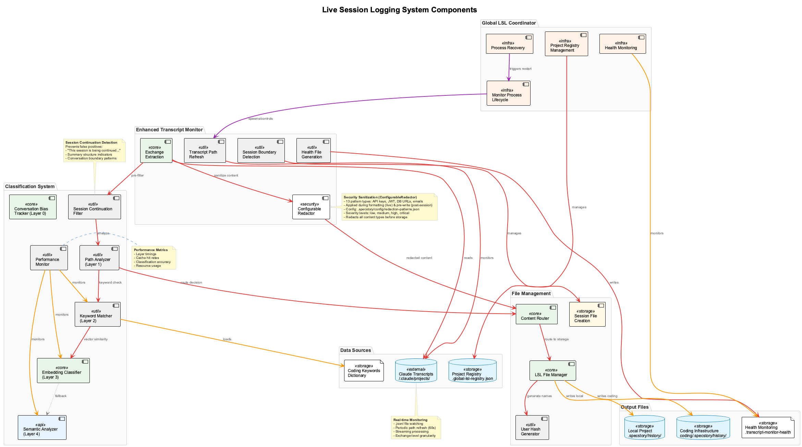
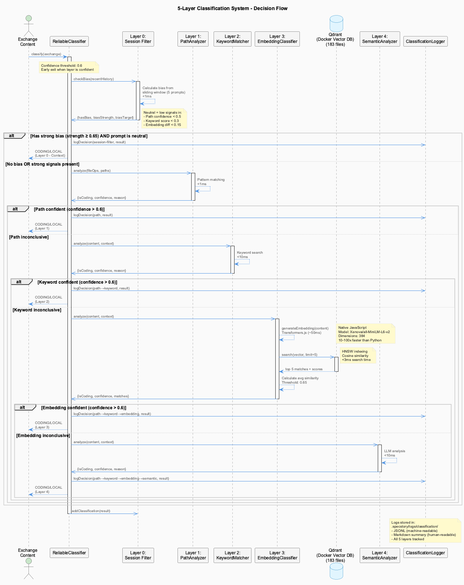
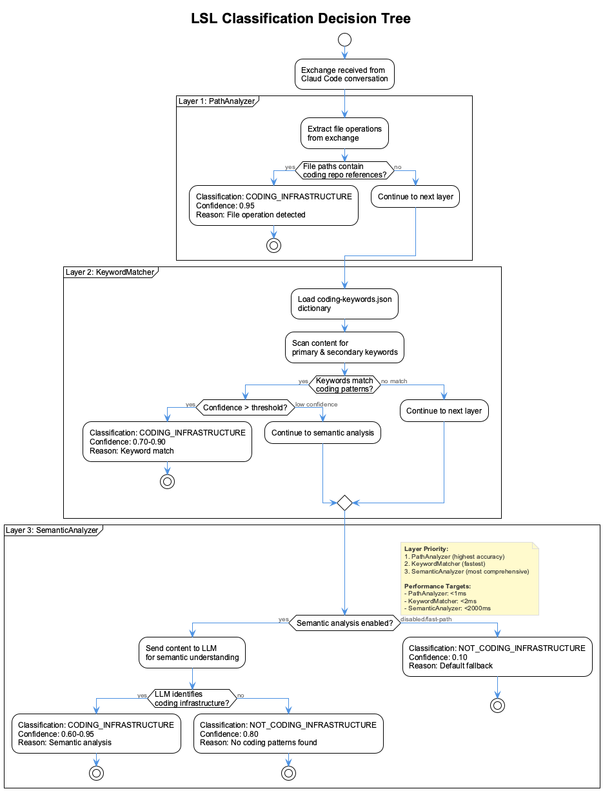
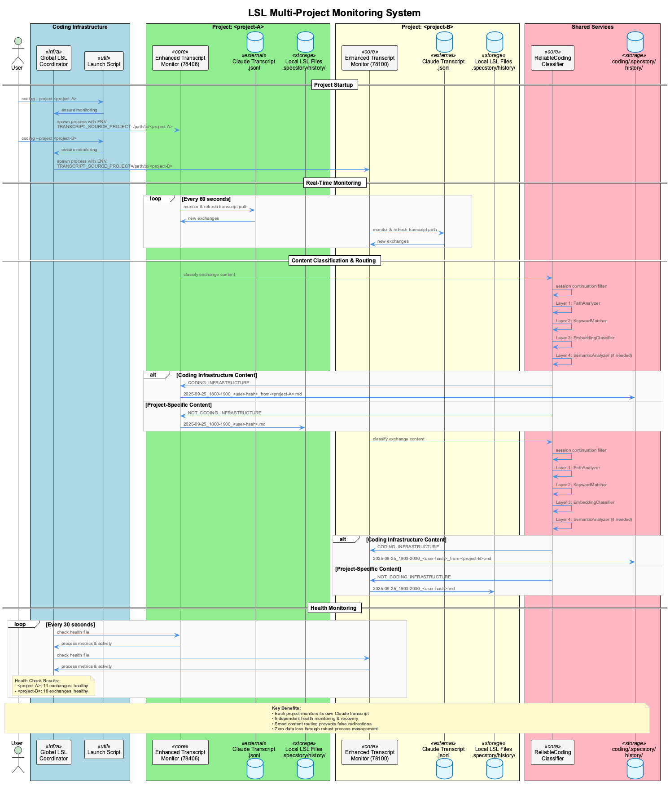

# LSL - Live Session Logging

Real-time conversation monitoring and intelligent classification that captures every development session with zero data loss.

## What It Does

The LSL system provides **intelligent session capture** with automatic content routing:

- **Real-Time Monitoring** - Captures every Claude conversation as it happens
- **Intelligent Classification** - 5-layer system determines content routing (LOCAL vs CODING)
- **Zero Data Loss** - 4-layer monitoring architecture ensures reliability
- **Multi-Project Support** - Handles multiple projects simultaneously with foreign session tracking
- **Security Redaction** - Automatic sanitization of API keys, passwords, and credentials

## Architecture

### System Overview



The LSL system consists of multiple layers working together to ensure reliable, real-time session logging with intelligent content classification and routing.

### 4-Layer Monitoring Architecture

The LSL system uses a **4-layer failsafe monitoring architecture** (distinct from the classification system):

**Layer 1: System-Level Watchdog** (`monitoring/global-monitor-watchdog.js`)
- Top-level supervisor monitoring all monitors
- Restarts failed monitoring processes
- Logs health status every 60 seconds

**Layer 2: Global Coordinator** (`monitoring/global-transcript-monitor-coordinator.js`)
- Manages monitoring across all projects
- Ensures exactly one monitor per project
- Coordinates monitor lifecycle and health checks

**Layer 3: Monitoring Verifier** (`monitoring/transcript-monitor-verifier.js`)
- Verifies monitor health for all active projects
- Detects suspicious activity (stuck processes)
- Health checks every 30 seconds

**Layer 4: Service-Level Self-Monitoring** (Enhanced Transcript Monitor)
- Each monitor generates `.transcript-monitor-health` file
- Real-time process metrics (memory, CPU, uptime)
- Exchange count and activity tracking

### Core Components

**Enhanced Transcript Monitor** (`scripts/enhanced-transcript-monitor.js`):
- Monitors Claude transcript files (`.jsonl`) in real-time
- Detects session boundaries and organizes into time windows
- Generates health files with process metrics
- Routes classified content to appropriate destinations

**ReliableCodingClassifier** (`src/live-logging/ReliableCodingClassifier.js`):
- 5-layer classification system (Layer 0-4)
- Determines if content is LOCAL (project-specific) or CODING (infrastructure)
- Progressive fallback from fast pattern matching to deep semantic analysis

**Security Redaction** (`src/live-logging/ConfigurableRedactor.js`):
- 13 redaction pattern types covering all common secrets
- Automatic sanitization before writing to disk
- Configurable patterns with severity levels
- <5ms overhead per exchange

**Classification Logger** (`scripts/classification-logger.js`):
- Comprehensive decision tracking across all 5 layers
- JSONL logs for programmatic analysis
- Markdown reports with clickable navigation
- Bidirectional routing (LOCAL stays local, CODING goes to coding repo)

## How It Works

### Real-Time Monitoring

Every project started via `coding/bin/coding` gets its own Enhanced Transcript Monitor:

1. **Exchange Detection**: Monitor detects new exchanges in Claude transcript files
2. **Periodic Refresh**: Every 60s, switches to newest transcript file
3. **Health Reporting**: Generates `.transcript-monitor-health` with process metrics
4. **Suspicious Activity**: Identifies stuck processes and processing issues

### Intelligent Classification (5-Layer System)



> **Note**: This is the **5-layer classification system** (Layers 0-4), distinct from the 4-layer **monitoring architecture**.

**Progressive Fallback Strategy**: Each layer attempts classification; if confident, decision is final. Otherwise, falls through to next layer.



**Layer 0: Session Filter** - Conversation context and bias tracking
- Maintains sliding window of recent classifications
- Calculates conversation bias (CODING vs LOCAL)
- Handles follow-up prompts ("continue", "looks good")
- Activates when: bias strength ≥ 0.65 and neutral prompt detected

**Layer 1: PathAnalyzer** - File operation pattern matching
- Analyzes file paths for direct coding infrastructure detection
- Two-step artifact checking (local → coding repo)
- Prevents false positives from ambiguous paths
- Response time: <1ms

**Layer 2: KeywordMatcher** - Fast keyword-based classification
- Intelligent keyword analysis for coding-related terms
- Immediate classification for clear coding infrastructure content
- Response time: <10ms

**Layer 3: EmbeddingClassifier** - Semantic vector similarity
- Native JavaScript embeddings (Transformers.js)
- Model: `Xenova/all-MiniLM-L6-v2` (384-dimensional)
- Qdrant vector database with HNSW indexing
- Searches against 183 indexed coding infrastructure files
- Similarity threshold: 0.65 (configurable)
- Response time: ~50ms

**Layer 4: SemanticAnalyzer** - LLM-powered deep understanding
- Direct Groq API calls (llama-3.3-70b, qwen-2.5)
- Used when embedding classification is inconclusive
- Temperature: 0.1 for consistent decisions
- Response time: <10ms with caching

**Early Exit Optimization**: Classification stops at first confident decision, minimizing cost and latency.

### Multi-Project Architecture



**How It Works**:

1. **Per-Project Monitors**: Each project gets its own Enhanced Transcript Monitor
2. **Global Coordination**: Coordinator ensures no duplicate monitors
3. **Watchdog Supervision**: System-level watchdog supervises all monitors
4. **Intelligent Routing**: Classification determines content destination
5. **Foreign Session Tracking**: CODING content automatically redirected to coding repo

**Example Flow**:
```
User works in curriculum-alignment →
Monitor detects CODING content →
Routes to: coding/.specstory/history/
  YYYY-MM-DD_HHMM-HHMM_<hash>_from-curriculum-alignment.md
```

### Content Routing and Storage

**LOCAL Content** (Project-Specific):
- Stored in: `project/.specstory/history/`
- Format: `YYYY-MM-DD_HHMM-HHMM_<userhash>.md`
- Classification logs: Stay in project

**CODING Content** (Infrastructure):
- Redirected to: `coding/.specstory/history/`
- Format: `YYYY-MM-DD_HHMM-HHMM_<userhash>_from-<project>.md`
- Classification logs: Copied to coding repo

**Classification Logs**:
- JSONL format: `YYYY-MM-DD_HHMM-HHMM_<userhash>.jsonl`
- Markdown reports: Separate for LOCAL and CODING decisions
- Status files: Aggregate statistics with clickable navigation

### Security Redaction

Before any content reaches storage:

1. **ConfigurableRedactor** processes all exchanges
2. **13 pattern types** detect secrets:
   - API keys and tokens
   - Passwords and credentials
   - URLs with embedded passwords
   - Email addresses
   - Corporate user IDs
3. **Matches replaced** with `<SECRET_REDACTED>`
4. **Applied in both**:
   - Live monitoring (before storage)
   - Post-session fallback (safety net)

**Example Redaction**:
```javascript
// Before redaction
ANTHROPIC_API_KEY=sk-ant-1234567890abcdef
"openaiApiKey": "sk-abcdef1234567890"

// After redaction
ANTHROPIC_API_KEY=<SECRET_REDACTED>
"openaiApiKey": "<SECRET_REDACTED>"
```

**Performance**: <5ms overhead per exchange, minimal impact on real-time processing.

## What It Monitors

### Transcript Files

**Claude Conversation Transcripts** (`.jsonl` format):
- Real-time exchange detection
- Periodic refresh to newest transcript (60s)
- Session boundary detection

**Session Boundaries**:
- Time-based windows (e.g., 1800-1900)
- Automatic session detection
- Window-based file organization

### Health Metrics

**Process Monitoring**:
```json
{
  "metrics": {
    "memoryMB": 9,
    "cpuUser": 7481974,
    "uptimeSeconds": 925,
    "processId": 78406
  }
}
```

**Activity Tracking**:
```json
{
  "activity": {
    "lastExchange": "82da8b2a-6a30-45eb-b0c7-5e1e2b2d54ee",
    "exchangeCount": 10,
    "isSuspicious": false
  }
}
```

**Suspicious Activity Detection**:
- Stale monitors (no activity for extended period)
- Stuck processes (exchange count not increasing)
- High memory usage
- Processing issues

## Key Files

**Core System**:
- `scripts/enhanced-transcript-monitor.js` - Core monitoring process
- `src/live-logging/ReliableCodingClassifier.js` - 5-layer classification
- `src/live-logging/ConfigurableRedactor.js` - Security redaction
- `scripts/classification-logger.js` - Decision tracking

**Monitoring Infrastructure**:
- `monitoring/global-monitor-watchdog.js` - System-level watchdog
- `monitoring/global-transcript-monitor-coordinator.js` - Global coordinator
- `monitoring/transcript-monitor-verifier.js` - Monitoring verifier

**Configuration**:
- `config/live-logging-config.json` - Classification thresholds and layer settings
- `.specstory/config/redaction-patterns.json` - Redaction pattern definitions

## Configuration

### Live Logging Config

**File**: `config/live-logging-config.json`

```json
{
  "session_filter": {
    "enabled": true,
    "bias_threshold": 0.65,
    "window_size": 5
  },
  "path_analyzer": {
    "enabled": true,
    "check_local_artifacts": true
  },
  "embedding_classifier": {
    "enabled": true,
    "similarity_threshold": 0.65,
    "model": "Xenova/all-MiniLM-L6-v2"
  },
  "semantic_analyzer": {
    "enabled": true,
    "provider": "groq",
    "model": "llama-3.3-70b",
    "temperature": 0.1
  }
}
```

### Redaction Patterns

**File**: `.specstory/config/redaction-patterns.json`

13 configurable pattern types:
- Environment variables (API_KEY=value)
- JSON API keys ("apiKey": "sk-...")
- sk- prefixed keys (OpenAI, Anthropic)
- xai- prefixed keys (XAI/Grok)
- Bearer tokens
- JWT tokens
- MongoDB connection strings
- PostgreSQL connection strings
- MySQL connection strings
- Generic URLs with credentials
- Email addresses
- Corporate user IDs

Each pattern includes:
- `id`: Unique identifier
- `name`: Human-readable name
- `pattern`: Regex pattern
- `severity`: low | medium | high | critical
- `enabled`: Toggle on/off

## Integration

**Related Systems**:
- [Health System](../health-system/) - Monitors LSL service health
- [Constraints](../constraints/) - Code quality enforcement
- [Knowledge Management](../knowledge-management/) - Online knowledge extraction from LSLs
- [Trajectories](../trajectories/) - Real-time trajectory analysis from LSL data

## Troubleshooting

**Monitor not starting?**
```bash
# Check if monitor is running
ps aux | grep enhanced-transcript-monitor

# Check health file
cat .health/coding-transcript-monitor-health.json

# Restart monitor via coding command
coding --restart-monitor
```

**LSL files not being generated?**

```bash
# Verify monitor is processing exchanges
tail -50 .logs/transcript-monitor-test.log

# Check if LSL files exist for today
ls -la .specstory/history/ | grep "$(date +%Y-%m-%d)"

# Recover missing LSL files from transcripts
PROJECT_PATH=/Users/q284340/Agentic/coding CODING_REPO=/Users/q284340/Agentic/coding \
  node scripts/batch-lsl-processor.js from-transcripts ~/.claude/projects/-Users-q284340-Agentic-coding
```

**Classification not working?**
```bash
# Check classification logs
ls -la .specstory/logs/classification/

# Verify configuration
cat config/live-logging-config.json | jq '.embedding_classifier'

# Test embedding generator
node src/knowledge-management/EmbeddingGenerator.js --test
```

**Foreign sessions not routing correctly?**
```bash
# Check classification status
cat .specstory/logs/classification/classification-status_<userhash>.md

# Verify CODING content in coding repo
ls -la /path/to/coding/.specstory/history/*_from-<project>.md
```

## Recovery Procedures

### Batch LSL Recovery

When LSL files are missing due to monitor issues, use the batch processor to recover from transcripts:

```bash
# Recover all LSL files from transcripts for this project
PROJECT_PATH=/path/to/project CODING_REPO=/Users/q284340/Agentic/coding \
  node /Users/q284340/Agentic/coding/scripts/batch-lsl-processor.js from-transcripts \
  ~/.claude/projects/-Users-q284340-Agentic-<project-name>

# Recover specific date range
PROJECT_PATH=/path/to/project CODING_REPO=/Users/q284340/Agentic/coding \
  node /Users/q284340/Agentic/coding/scripts/batch-lsl-processor.js retroactive 2024-12-01 2024-12-03
```

### Monitor Health Verification

The health system now includes transcript monitor health as a verification rule:

```bash
# Check monitor health via centralized health file
cat .health/coding-transcript-monitor-health.json | jq '{status, metrics, activity}'

# View in health dashboard
open http://localhost:3032
```

## See Also

This README provides comprehensive LSL documentation including classification architecture and multi-project handling.
