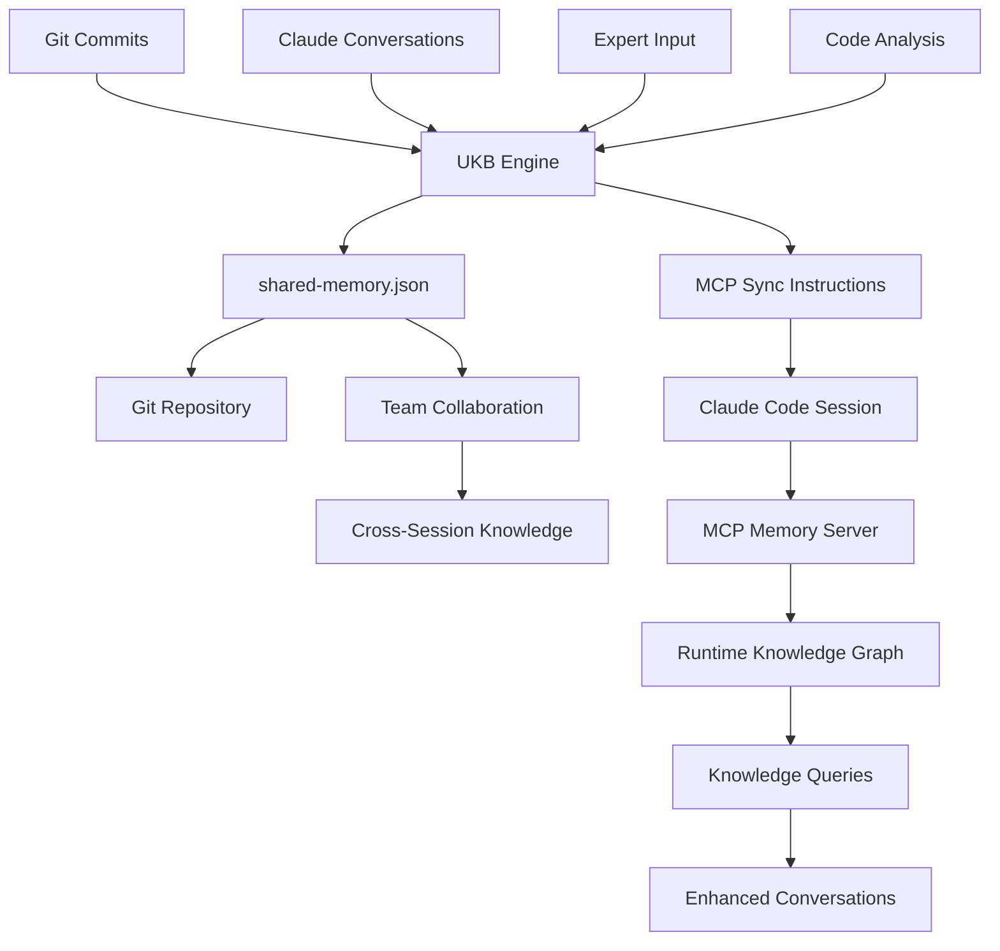
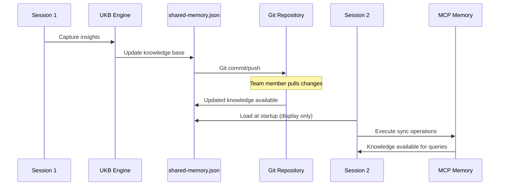

# MCP Memory Server Architecture

## Overview

The MCP (Model Context Protocol) Memory Server provides a runtime knowledge graph database that works alongside the file-based knowledge management system. This document explains how the MCP memory server integrates with Claude Code and enables cross-session knowledge persistence.

## Two-Layer Storage Architecture

### Layer 1: Authoritative Storage - `shared-memory.json`
- **Purpose**: Git-tracked authoritative knowledge base
- **Updated by**: UKB engine using direct `jq` commands
- **Shared via**: Git repository for team collaboration
- **Format**: Structured JSON with entities, relations, and metadata

### Layer 2: Runtime Storage - MCP Memory Server
- **Purpose**: Fast querying and real-time knowledge graph operations
- **Process**: Separate MCP server communicating via JSON-RPC over stdio
- **Persistence**: Survives Claude Code session restarts
- **Performance**: Optimized for graph queries and entity operations

## MCP Memory Server Tools

Claude Code has access to these MCP memory operations:

```typescript
// Available MCP Memory Tools
mcp__memory__create_entities    // Add new knowledge entities
mcp__memory__create_relations   // Link entities together
mcp__memory__search_nodes       // Query the knowledge graph
mcp__memory__read_graph         // Read current graph state
mcp__memory__add_observations   // Add details to existing entities
```

## Data Flow Architecture



## How UKB Engine Works with MCP Memory

### 1. Knowledge Extraction (UKB → shared-memory.json)
```bash
# UKB Engine Process
1. Analyze data sources (git, conversations, expert input)
2. Apply significance scoring (1-10 scale)
3. Structure insights as JSON entities/relations
4. Update shared-memory.json directly using jq
5. Create MCP sync instructions for Claude
```

### 2. Runtime Synchronization (Claude → MCP Memory)
```bash
# Claude Code Process
1. UKB creates /tmp/ukb-*/mcp_sync_operations.md
2. Claude executes: mcp__memory__create_entities
3. MCP memory server updates runtime graph
4. Future sessions can query via mcp__memory__search_nodes
```

## Cross-Session Knowledge Access

### Startup Knowledge Loading

When starting `claude-mcp`, the system:

1. **Loads Knowledge Base Summary**:
   ```bash
   # From claude-mcp startup script
   export CLAUDE_KNOWLEDGE_BASE="/path/to/shared-memory.json"
   echo "📚 Knowledge Base: 12 entities, 21 relations"
   echo "🔍 Key Patterns Available: [pattern list]"
   echo "✅ Startup pattern knowledge loaded"
   ```

2. **Activates MCP Memory Server**: 
   - Configured via `claude-code-mcp-processed.json`
   - Provides persistent knowledge graph operations
   - Enables real-time querying during conversations

3. **Current Limitation**: 
   - Startup script **displays** knowledge base content
   - But **automatic synchronization** from shared-memory.json to MCP memory is not implemented
   - Manual sync via UKB-generated instructions required

### Knowledge Persistence Across Sessions



## Access to Insights Documentation

### Current Capabilities
- **File System Access**: Claude can read insight markdown files via standard file tools
- **VKB Server**: Provides web visualization at `http://localhost:8080`
- **Documentation Links**: Entities include `documentation_link` properties pointing to detailed insights

### Documentation Structure
```
knowledge-management/insights/
├── MCPKnowledgePersistencePattern.md
├── ConditionalLoggingPattern.md
├── ViewportCullingPattern.md
├── images/
│   ├── knowledge-management-system-architecture.png
│   └── knowledge-visualizer-screenshot.png
└── puml/
    ├── knowledge-management-system-architecture.puml
    └── detailed-system-architecture.puml
```

### Access Patterns
1. **Direct File Reading**: Claude can use Read tool on any insight file
2. **VKB Visualization**: Web interface shows entities with documentation links
3. **Knowledge Graph Queries**: MCP memory search can find entities with documentation_link properties

## Use Cases for Cross-Session Knowledge

### 1. Pattern Recognition
```typescript
// Example: Claude recognizes similar architectural pattern
"I notice you're implementing state management. Based on previous 
sessions, we have a ReduxStateManagementPattern (significance: 9) 
that solved similar challenges. Would you like me to apply that pattern?"
```

### 2. Problem-Solution Matching
```typescript
// Example: Claude matches current problem to known solutions
"This performance issue resembles ViewportCullingPattern from a 
previous project. That solution improved rendering by 300%. 
Should we adapt that approach?"
```

### 3. Knowledge Building
```typescript
// Example: Claude builds on previous insights
"This debugging approach extends the ConditionalLoggingPattern. 
I'll update the knowledge base to capture this enhancement."
```

## Implementation Recommendations

### To Enable Full Cross-Session Knowledge Access:

1. **Automatic MCP Memory Loading**:
   ```bash
   # Add to claude-mcp startup
   load_knowledge_into_mcp() {
       # Convert shared-memory.json to MCP operations
       # Execute mcp__memory__create_entities for each entity
       # Execute mcp__memory__create_relations for each relation
   }
   ```

2. **Enhanced Startup Script**:
   ```bash
   # Enhanced claude-mcp startup
   echo "📚 Loading knowledge base into MCP memory..."
   load_knowledge_into_mcp
   echo "✅ Knowledge graph active: query-ready"
   ```

3. **Sync Verification**:
   ```bash
   # Verify MCP memory contains expected knowledge
   verify_mcp_knowledge() {
       # Use mcp__memory__read_graph to confirm loaded entities
       # Report any sync discrepancies
   }
   ```

## Current System Status

### ✅ Working Components:
- Git-tracked knowledge base (shared-memory.json)
- UKB engine for insight extraction
- MCP memory server infrastructure
- VKB visualization server
- Documentation generation

### ⚠️ Limitations:
- Manual sync required between shared-memory.json and MCP memory
- No automatic knowledge loading at startup
- Limited cross-session knowledge queries without explicit sync

### 🔄 Recommended Enhancements:
- Implement automatic MCP memory loading
- Add startup knowledge verification
- Create seamless sync between storage layers
- Enable proactive knowledge suggestions during conversations

## Benefits of This Architecture

### For Individual Developers:
- **Session Continuity**: Insights from previous sessions available immediately
- **Pattern Recognition**: Claude can suggest proven solutions from past work
- **Learning Acceleration**: Build on accumulated knowledge rather than starting fresh

### For Development Teams:
- **Institutional Knowledge**: Shared insights across all team members
- **Best Practice Propagation**: Successful patterns automatically available
- **Onboarding Acceleration**: New team members benefit from accumulated wisdom

### For Organizations:
- **Knowledge Retention**: Prevents knowledge loss when team members leave
- **Innovation Tracking**: Identifies and promotes breakthrough solutions
- **Cross-Project Learning**: Apply successful patterns across multiple projects

This architecture enables Claude Code to function as a truly intelligent development assistant that learns and grows with each session, making accumulated team knowledge immediately accessible for every new conversation.