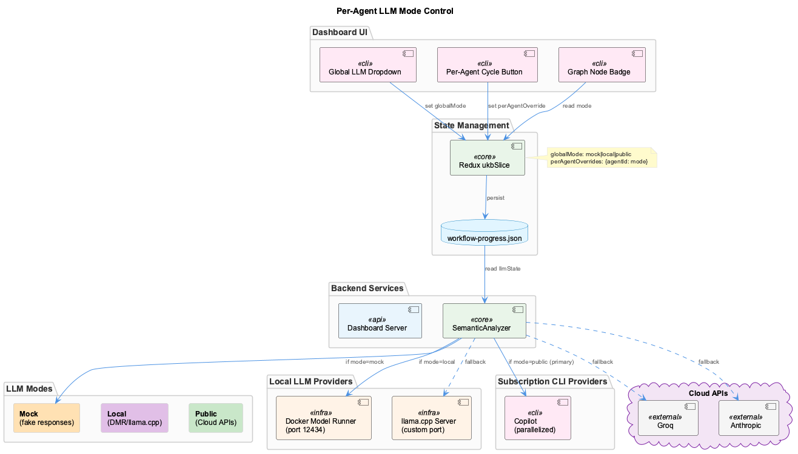
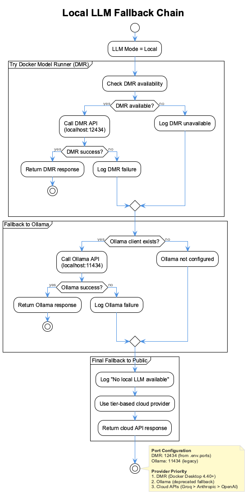

# Provider Configuration

The system is **completely provider-agnostic** - use any LLM provider you prefer!

## Quick Setup

### 1. Install Provider SDK(s)

Only install what you'll use:

```bash
npm install groq-sdk              # Groq (recommended - fastest, cheapest)
npm install @anthropic-ai/sdk     # Anthropic (high quality)
npm install openai                # OpenAI or local models
npm install @google/generative-ai # Google Gemini
```

### 2. Configure API Key(s)

Add to `.env`:

```bash
GROK_API_KEY=your-groq-key           # For Groq
ANTHROPIC_API_KEY=your-anthropic-key # For Anthropic
OPENAI_API_KEY=your-openai-key       # For OpenAI
GOOGLE_API_KEY=your-google-key       # For Gemini
LOCAL_MODEL_ENDPOINT=http://localhost:11434  # For llama.cpp/vLLM (legacy fallback)
```

### 3. Verify

```bash
node scripts/enhanced-transcript-monitor.js

# Check startup logs for: "[UnifiedInferenceEngine] <provider> SDK loaded"
```

## Supported Providers

| Provider | Best For | Cost | Privacy | Speed |
|----------|----------|------|---------|-------|
| **Groq** | Most tasks | 💰 Cheapest | ☁️ Cloud | ⚡ Fastest |
| **Anthropic** | Quality | 💰💰 Mid | ☁️ Cloud | ⚡⚡ Fast |
| **OpenAI** | GPT-4 | 💰💰💰 High | ☁️ Cloud | ⚡⚡ Fast |
| **Gemini** | Google | 💰💰 Mid | ☁️ Cloud | ⚡⚡ Fast |
| **Local** | Privacy | 🆓 Free | 🔒 Local | ⚡⚡⚡ Variable |

## Provider Priority

System automatically selects providers in this order:

1. **Groq** (cheapest, fastest)
2. **Anthropic** (high quality)
3. **OpenAI** (GPT-4)
4. **Gemini** (Google)
5. **Local** (DMR → llama.cpp fallback)

If a provider fails, automatic fallback to the next available provider.

## Per-Agent LLM Mode Control

The UKB workflow system supports three LLM modes that can be set globally or per-agent:

| Mode | Icon | Description | Use Case |
|------|------|-------------|----------|
| **Mock** | 🧪 Orange | Fake responses | Testing, development |
| **Local** | 🖥️ Purple | DMR/llama.cpp | Privacy, offline, cost savings |
| **Public** | ☁️ Green | Cloud APIs | Production quality |

### Dashboard Controls

1. **Global Dropdown** - Set default mode for all agents in the modal toolbar
2. **Per-Agent Button** - Override specific agents in the node sidebar
3. **Node Badge** - Shows current mode (M/L/P) on each graph node



### API Endpoints

```bash
# Get current LLM state
curl http://localhost:3033/api/ukb/llm-state

# Set global mode
curl -X POST http://localhost:3033/api/ukb/llm-mode/global \
  -H "Content-Type: application/json" \
  -d '{"mode": "local"}'

# Set per-agent override
curl -X POST http://localhost:3033/api/ukb/llm-mode/agent \
  -H "Content-Type: application/json" \
  -d '{"agentId": "semantic_analysis", "mode": "mock"}'

# Clear per-agent override
curl -X DELETE http://localhost:3033/api/ukb/llm-mode/agent/semantic_analysis
```

## Using with Different Agents

### Claude Code (Anthropic)

```bash
echo "ANTHROPIC_API_KEY=your-key" >> .env
npm install @anthropic-ai/sdk
coding
```

### GitHub CoPilot / Cursor (OpenAI)

```bash
echo "OPENAI_API_KEY=your-key" >> .env
npm install openai
# Use with your editor
```

### Any Agent + Groq

```bash
echo "GROK_API_KEY=your-key" >> .env
npm install groq-sdk
# Works with ANY coding agent!
```

### Local Models (Privacy-First)

#### Docker Model Runner (Recommended)

DMR uses llama.cpp via Docker Desktop - no separate installation needed.

**Cross-Platform Support:**

| Platform | GPU Acceleration | Notes |
|----------|------------------|-------|
| **macOS (Apple Silicon)** | Metal | Automatic, fastest option |
| **macOS (Intel)** | CPU | AVX2 optimized |
| **Linux + NVIDIA** | CUDA | Requires CUDA toolkit |
| **Linux + AMD** | ROCm/Vulkan | Requires ROCm drivers |
| **Linux (CPU)** | AVX2/AVX512 | Automatic fallback |
| **Windows + NVIDIA** | CUDA | Requires CUDA toolkit |
| **Windows (CPU)** | DirectML | Automatic fallback |

The `install.sh` script automatically:
1. Detects your platform and available GPU acceleration
2. Enables DMR on the correct port
3. Configures `DMR_HOST` for container access (Windows uses `host.docker.internal`)
4. Downloads the default model (`ai/llama3.2`)


**Manual Setup** (if not using install.sh):

```bash
# Enable DMR (requires Docker Desktop 4.40+)
docker desktop enable model-runner --tcp 12434

# Pull a model
docker model pull ai/llama3.2

# Verify it's running
curl http://localhost:12434/engines/v1/models
```

**CLI Usage** - Query DMR directly from terminal:

```bash
# Use the built-in llm command (installed with coding)
llm "What is a closure in JavaScript?"

# With options
llm -m ai/qwen2.5-coder "Review this code: $(cat file.js)"
llm -s "You are a code reviewer" "Check this function for bugs"
llm -t 500 "Summarize this in 100 words"

# Pipe input
cat README.md | llm "Summarize this document"
echo "Fix this SQL: SELCT * FORM users" | llm

# Raw JSON output
llm -r "Hello" | jq .usage
```

**Options**:
- `-m, --model MODEL` - Model to use (default: ai/llama3.2)
- `-t, --tokens N` - Max tokens (default: 1000)
- `-s, --system PROMPT` - System prompt
- `-r, --raw` - Output raw JSON

**Direct curl** (for scripts/automation):

```bash
curl -X POST http://localhost:12434/engines/v1/chat/completions \
  -H "Content-Type: application/json" \
  -d '{
    "model": "ai/llama3.2",
    "messages": [{"role": "user", "content": "Explain async/await"}],
    "max_tokens": 500
  }'
```

**Available Models**:
- `ai/llama3.2` - General purpose (default)
- `ai/qwen2.5-coder` - Code-focused
- `ai/llama3.2:3B-Q4_K_M` - Faster, smaller variant

**Configuration** (in `.env.ports`):
```bash
DMR_PORT=12434        # API port (default)
DMR_HOST=localhost    # Host for API access
```

**Windows Container Access:**
Windows containers need `host.docker.internal` to reach the host's DMR:
```bash
# In .env.ports on Windows:
DMR_HOST=host.docker.internal
```
The installer handles this automatically.



#### llama.cpp Direct (Legacy Fallback)

If DMR is unavailable, the system falls back to llama.cpp server:

```bash
# Build and run llama.cpp server
git clone https://github.com/ggerganov/llama.cpp
cd llama.cpp && make -j
./llama-server --model /path/to/model.gguf --host 0.0.0.0 --port 11434

# Configure
echo "LOCAL_MODEL_ENDPOINT=http://localhost:11434" >> .env
npm install openai  # llama.cpp uses OpenAI-compatible API
```

**Note**: DMR is preferred over direct llama.cpp as it's built into Docker Desktop and requires no separate installation.

## Troubleshooting

### "Cannot find package '@anthropic-ai/sdk'"

**This is normal** if you haven't installed that provider. The system will use other available providers.

To fix: Install the SDK you need

```bash
npm install @anthropic-ai/sdk
echo "ANTHROPIC_API_KEY=your-key" >> .env
```

### "No providers initialized"

You need at least ONE provider configured:

```bash
# Check .env file
cat .env

# Make sure you have at least one API key AND installed the SDK
npm install groq-sdk  # Or whichever provider you chose
```

### Trajectory analyzer not available

**This is normal** if no provider SDKs are installed yet. The monitor still works for basic logging. To enable trajectory analysis, install at least one provider SDK.

## Sensitive Data Routing

For sensitive data, the system automatically routes to local models:

```javascript
// Automatically uses local model
const result = await engine.infer(prompt, {
  operationType: 'sensitive-analysis'
});

// Or explicitly request local
const result = await engine.infer(prompt, {}, {
  privacy: 'local'
});
```

## Summary

✅ **Agent-Agnostic**: Works with Claude Code, CoPilot, Cursor, any coding agent
✅ **Provider-Agnostic**: Supports 5 different LLM providers
✅ **Optional Dependencies**: Install only what you need
✅ **Automatic Fallback**: Circuit breaker pattern for reliability
✅ **Privacy-First**: Route sensitive data to local models
✅ **Cost-Optimized**: Smart routing to cheapest provider

**You are NOT locked into Anthropic!** 🎉
