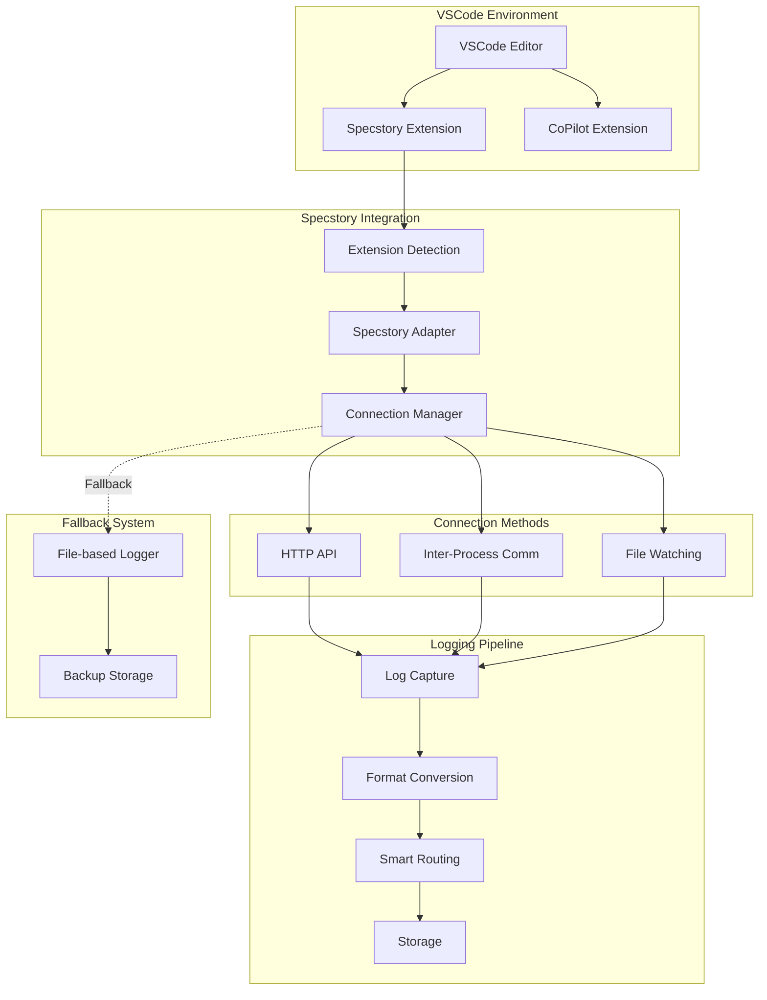
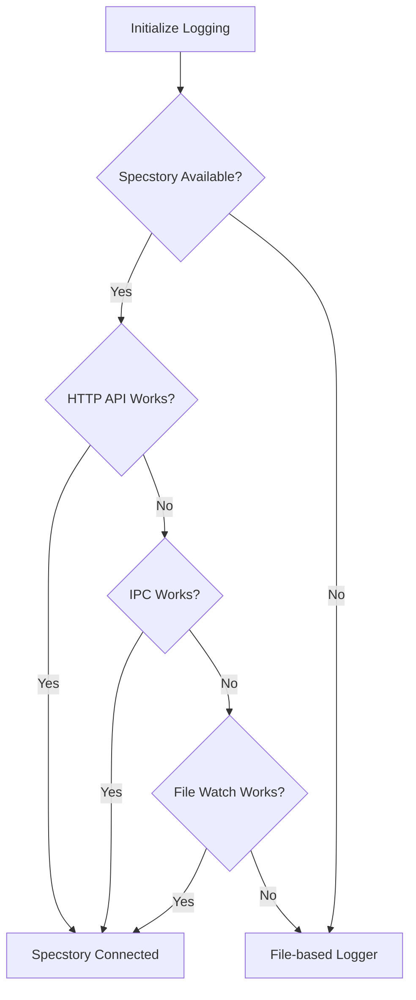

# Specstory Integration for GitHub CoPilot

This document describes the integration with the Specstory VSCode extension for enhanced conversation logging when using GitHub CoPilot with the agent-agnostic coding tools.

## Overview

Specstory is a VSCode extension that provides intelligent conversation logging and project context management. When using GitHub CoPilot, our system automatically detects and integrates with Specstory to provide superior logging capabilities compared to file-based fallbacks.

## Architecture



## Extension Detection

### Automatic Detection Process

```javascript
class SpecstoryDetector {
  constructor() {
    this.extensionPaths = this.getExtensionPaths();
  }

  getExtensionPaths() {
    const platform = process.platform;
    const home = require('os').homedir();
    
    switch (platform) {
      case 'win32':
        return [
          `${process.env.USERPROFILE}\\.vscode\\extensions`,
          `${process.env.USERPROFILE}\\.vscode-insiders\\extensions`
        ];
      case 'darwin':
        return [
          `${home}/.vscode/extensions`,
          `${home}/.vscode-insiders/extensions`
        ];
      default: // linux
        return [
          `${home}/.vscode/extensions`,
          `${home}/.vscode-insiders/extensions`,
          `${home}/.vscode-server/extensions`
        ];
    }
  }

  async detectSpecstory() {
    for (const extensionPath of this.extensionPaths) {
      try {
        const extensions = await fs.readdir(extensionPath);
        const specstoryExts = extensions.filter(ext => 
          ext.toLowerCase().includes('specstory')
        );
        
        if (specstoryExts.length > 0) {
          return {
            detected: true,
            path: extensionPath,
            extensions: specstoryExts,
            version: await this.getExtensionVersion(extensionPath, specstoryExts[0])
          };
        }
      } catch (error) {
        // Extension path doesn't exist or not accessible
        continue;
      }
    }
    
    return { detected: false };
  }

  async getExtensionVersion(basePath, extensionDir) {
    try {
      const packagePath = path.join(basePath, extensionDir, 'package.json');
      const packageInfo = JSON.parse(await fs.readFile(packagePath, 'utf8'));
      return packageInfo.version;
    } catch (error) {
      return 'unknown';
    }
  }
}
```

### Extension Validation

```javascript
class SpecstoryValidator {
  async validateExtension(extensionInfo) {
    const checks = {
      installation: await this.checkInstallation(extensionInfo),
      version: await this.checkVersion(extensionInfo),
      activation: await this.checkActivation(),
      api: await this.checkAPIAvailability()
    };
    
    return {
      valid: Object.values(checks).every(check => check.passed),
      checks
    };
  }

  async checkInstallation(extensionInfo) {
    const manifestPath = path.join(extensionInfo.path, 'package.json');
    
    try {
      const manifest = JSON.parse(await fs.readFile(manifestPath, 'utf8'));
      return {
        passed: manifest.publisher === 'specstory' && manifest.name.includes('specstory'),
        message: 'Extension properly installed'
      };
    } catch (error) {
      return {
        passed: false,
        message: `Installation check failed: ${error.message}`
      };
    }
  }

  async checkVersion(extensionInfo) {
    const minVersion = '1.0.0'; // Minimum required version
    
    try {
      const version = extensionInfo.version;
      const compatible = this.compareVersions(version, minVersion) >= 0;
      
      return {
        passed: compatible,
        message: compatible 
          ? `Version ${version} is compatible`
          : `Version ${version} is below minimum ${minVersion}`
      };
    } catch (error) {
      return {
        passed: false,
        message: `Version check failed: ${error.message}`
      };
    }
  }
}
```

## Connection Methods

### 1. HTTP API Connection

```javascript
class HTTPSpecstoryConnection {
  constructor(config = {}) {
    this.ports = config.ports || [7357, 7358, 7359];
    this.timeout = config.timeout || 5000;
    this.retryAttempts = config.retryAttempts || 3;
  }

  async connect() {
    for (const port of this.ports) {
      try {
        const connection = await this.attemptConnection(port);
        if (connection) {
          return {
            type: 'http',
            port,
            api: connection
          };
        }
      } catch (error) {
        console.debug(`HTTP connection failed on port ${port}:`, error.message);
        continue;
      }
    }
    
    return null;
  }

  async attemptConnection(port) {
    const http = require('http');
    
    // Test connection
    const testResponse = await this.makeRequest({
      hostname: 'localhost',
      port,
      path: '/api/health',
      method: 'GET',
      timeout: this.timeout
    });
    
    if (testResponse.includes('specstory')) {
      return {
        log: (data) => this.logViaHTTP(port, data),
        query: (params) => this.queryViaHTTP(port, params),
        status: () => this.getStatus(port)
      };
    }
    
    return null;
  }

  async logViaHTTP(port, data) {
    return await this.makeRequest({
      hostname: 'localhost',
      port,
      path: '/api/log',
      method: 'POST',
      headers: {
        'Content-Type': 'application/json'
      }
    }, JSON.stringify(data));
  }

  async makeRequest(options, data = null) {
    return new Promise((resolve, reject) => {
      const req = require('http').request(options, (res) => {
        let body = '';
        
        res.on('data', (chunk) => {
          body += chunk;
        });
        
        res.on('end', () => {
          if (res.statusCode >= 200 && res.statusCode < 300) {
            resolve(body);
          } else {
            reject(new Error(`HTTP ${res.statusCode}: ${body}`));
          }
        });
      });
      
      req.on('error', reject);
      req.on('timeout', () => reject(new Error('Request timeout')));
      
      if (data) {
        req.write(data);
      }
      
      req.end();
    });
  }
}
```

### 2. Inter-Process Communication (IPC)

```javascript
class IPCSpecstoryConnection {
  constructor(config = {}) {
    this.socketPath = this.getSocketPath();
    this.timeout = config.timeout || 5000;
  }

  getSocketPath() {
    const platform = process.platform;
    
    if (platform === 'win32') {
      return '\\\\.\\pipe\\specstory-vscode';
    } else {
      return '/tmp/specstory-vscode.sock';
    }
  }

  async connect() {
    const net = require('net');
    
    try {
      const connected = await new Promise((resolve, reject) => {
        const client = net.createConnection(this.socketPath);
        
        client.on('connect', () => {
          client.end();
          resolve(true);
        });
        
        client.on('error', () => {
          resolve(false);
        });
        
        setTimeout(() => resolve(false), this.timeout);
      });
      
      if (connected) {
        return {
          type: 'ipc',
          path: this.socketPath,
          api: {
            log: (data) => this.logViaIPC(data),
            query: (params) => this.queryViaIPC(params)
          }
        };
      }
    } catch (error) {
      console.debug('IPC connection failed:', error.message);
    }
    
    return null;
  }

  async logViaIPC(data) {
    return new Promise((resolve, reject) => {
      const net = require('net');
      const client = net.createConnection(this.socketPath);
      
      client.on('connect', () => {
        const message = JSON.stringify({
          action: 'log',
          data
        });
        
        client.write(message + '\n');
      });
      
      client.on('data', (response) => {
        try {
          const result = JSON.parse(response.toString());
          resolve(result);
        } catch (error) {
          reject(error);
        }
        client.end();
      });
      
      client.on('error', reject);
      
      setTimeout(() => {
        client.destroy();
        reject(new Error('IPC timeout'));
      }, this.timeout);
    });
  }
}
```

### 3. File Watching Connection

```javascript
class FileWatchSpecstoryConnection {
  constructor(config = {}) {
    this.watchDir = this.getWatchDirectory();
    this.pollInterval = config.pollInterval || 1000;
  }

  getWatchDirectory() {
    const home = require('os').homedir();
    return path.join(home, '.specstory', 'watch');
  }

  async connect() {
    try {
      // Ensure watch directory exists
      await fs.mkdir(this.watchDir, { recursive: true });
      
      // Test write permissions
      const testFile = path.join(this.watchDir, '.test-write');
      await fs.writeFile(testFile, 'test');
      await fs.unlink(testFile);
      
      return {
        type: 'file-watch',
        directory: this.watchDir,
        api: {
          log: (data) => this.logViaFile(data),
          query: (params) => this.queryViaFile(params)
        }
      };
    } catch (error) {
      console.debug('File watch connection failed:', error.message);
      return null;
    }
  }

  async logViaFile(data) {
    const timestamp = Date.now();
    const filename = `log-${timestamp}-${process.pid}.json`;
    const filepath = path.join(this.watchDir, filename);
    
    await fs.writeFile(filepath, JSON.stringify({
      timestamp: new Date().toISOString(),
      type: 'log',
      data
    }, null, 2));
    
    // Create notification file
    const notificationFile = path.join(this.watchDir, '.new-log');
    await fs.writeFile(notificationFile, filename);
    
    return {
      success: true,
      method: 'file-watch',
      file: filepath
    };
  }

  async queryViaFile(params) {
    const timestamp = Date.now();
    const filename = `query-${timestamp}-${process.pid}.json`;
    const filepath = path.join(this.watchDir, filename);
    
    await fs.writeFile(filepath, JSON.stringify({
      timestamp: new Date().toISOString(),
      type: 'query',
      params
    }, null, 2));
    
    // Wait for response (polling)
    const responseFile = filepath.replace('.json', '-response.json');
    
    for (let i = 0; i < 30; i++) { // Wait up to 30 seconds
      try {
        if (await fs.access(responseFile).then(() => true).catch(() => false)) {
          const response = await fs.readFile(responseFile, 'utf8');
          await fs.unlink(responseFile); // Cleanup
          return JSON.parse(response);
        }
      } catch (error) {
        // File not ready yet
      }
      
      await new Promise(resolve => setTimeout(resolve, this.pollInterval));
    }
    
    throw new Error('Query timeout - no response from Specstory');
  }
}
```

## Logging Integration

### Enhanced Conversation Logging

```javascript
class SpecstoryEnhancedLogger {
  constructor(connection) {
    this.connection = connection;
    this.sessionId = this.generateSessionId();
    this.contextTracker = new ContextTracker();
  }

  async logConversation(entry) {
    // Enhance entry with context information
    const enhancedEntry = await this.enhanceEntry(entry);
    
    // Log via Specstory
    const result = await this.connection.api.log(enhancedEntry);
    
    if (result.success) {
      return {
        success: true,
        method: 'specstory',
        entryId: result.entryId,
        url: result.url // Specstory may provide a direct link
      };
    }
    
    throw new Error('Specstory logging failed');
  }

  async enhanceEntry(entry) {
    const context = await this.contextTracker.getCurrentContext();
    
    return {
      ...entry,
      sessionId: this.sessionId,
      timestamp: entry.timestamp || new Date().toISOString(),
      agent: 'copilot',
      context: {
        project: context.project,
        workspace: context.workspace,
        activeFile: context.activeFile,
        gitBranch: context.gitBranch,
        ...context
      },
      metadata: {
        ...entry.metadata,
        toolVersion: this.getToolVersion(),
        environment: this.getEnvironment()
      },
      tags: this.generateTags(entry, context)
    };
  }

  generateTags(entry, context) {
    const tags = ['copilot', 'coding-tools'];
    
    // Add context-based tags
    if (context.project) tags.push(`project:${context.project}`);
    if (context.language) tags.push(`lang:${context.language}`);
    
    // Add content-based tags
    if (entry.content) {
      if (entry.content.includes('error')) tags.push('error');
      if (entry.content.includes('test')) tags.push('testing');
      if (entry.content.includes('debug')) tags.push('debugging');
    }
    
    return tags;
  }
}
```

### Context Tracking

```javascript
class ContextTracker {
  async getCurrentContext() {
    return {
      project: await this.getProjectName(),
      workspace: await this.getWorkspacePath(),
      activeFile: await this.getActiveFile(),
      gitBranch: await this.getGitBranch(),
      language: await this.getActiveLanguage(),
      timestamp: new Date().toISOString()
    };
  }

  async getProjectName() {
    try {
      const packageJson = path.join(process.cwd(), 'package.json');
      if (await fs.access(packageJson).then(() => true).catch(() => false)) {
        const pkg = JSON.parse(await fs.readFile(packageJson, 'utf8'));
        return pkg.name;
      }
    } catch (error) {
      // Fallback to directory name
      return path.basename(process.cwd());
    }
  }

  async getGitBranch() {
    try {
      const { executeCommand } = require('../utils/system');
      const branch = await executeCommand('git rev-parse --abbrev-ref HEAD');
      return branch.trim();
    } catch (error) {
      return 'unknown';
    }
  }

  async getActiveFile() {
    // This would need integration with VSCode API
    // For now, return current working directory
    return process.cwd();
  }
}
```

## Error Handling and Fallbacks

### Graceful Degradation



### Resilient Connection Manager

```javascript
class ResilientSpecstoryConnection {
  constructor() {
    this.connections = [
      new HTTPSpecstoryConnection(),
      new IPCSpecstoryConnection(),
      new FileWatchSpecstoryConnection()
    ];
    this.activeConnection = null;
    this.retryCount = 0;
    this.maxRetries = 3;
  }

  async connect() {
    for (const connection of this.connections) {
      try {
        const result = await connection.connect();
        if (result) {
          this.activeConnection = result;
          console.log(`✓ Connected to Specstory via ${result.type}`);
          return result;
        }
      } catch (error) {
        console.debug(`Connection method ${connection.constructor.name} failed:`, error.message);
      }
    }
    
    return null;
  }

  async logWithRetry(data, maxAttempts = 3) {
    for (let attempt = 1; attempt <= maxAttempts; attempt++) {
      try {
        if (!this.activeConnection) {
          await this.connect();
        }
        
        if (this.activeConnection) {
          return await this.activeConnection.api.log(data);
        }
      } catch (error) {
        console.warn(`Log attempt ${attempt} failed:`, error.message);
        
        if (attempt < maxAttempts) {
          // Try to reconnect
          this.activeConnection = null;
          await new Promise(resolve => setTimeout(resolve, 1000 * attempt));
        }
      }
    }
    
    throw new Error('All Specstory connection attempts failed');
  }
}
```

## Configuration

### Extension Configuration

```json
{
  "specstory": {
    "enabled": true,
    "autoDetect": true,
    "connectionMethods": ["http", "ipc", "file-watch"],
    "http": {
      "ports": [7357, 7358, 7359],
      "timeout": 5000
    },
    "ipc": {
      "socketPath": "auto",
      "timeout": 5000
    },
    "fileWatch": {
      "directory": "~/.specstory/watch",
      "pollInterval": 1000
    },
    "logging": {
      "enableContextTracking": true,
      "enableTagging": true,
      "includeMetadata": true
    },
    "fallback": {
      "enabled": true,
      "directory": ".specstory/history"
    }
  }
}
```

### Runtime Configuration

```javascript
class SpecstoryConfig {
  constructor(configPath) {
    this.config = this.loadConfig(configPath);
  }

  loadConfig(configPath) {
    const defaultConfig = {
      enabled: true,
      autoDetect: true,
      connectionMethods: ['http', 'ipc', 'file-watch'],
      http: { ports: [7357, 7358, 7359], timeout: 5000 },
      ipc: { timeout: 5000 },
      fileWatch: { pollInterval: 1000 },
      logging: {
        enableContextTracking: true,
        enableTagging: true,
        includeMetadata: true
      },
      fallback: { enabled: true }
    };

    try {
      const userConfig = JSON.parse(fs.readFileSync(configPath, 'utf8'));
      return { ...defaultConfig, ...userConfig.specstory };
    } catch (error) {
      return defaultConfig;
    }
  }

  get(key) {
    return this.config[key];
  }

  isEnabled() {
    return this.config.enabled;
  }
}
```

## Benefits of Specstory Integration

### Enhanced Features

| Feature | File-based Logging | Specstory Integration |
|---------|-------------------|----------------------|
| **Rich Context** | Basic | ✅ Full project context |
| **Visual Interface** | None | ✅ VSCode integrated UI |
| **Search & Filter** | Manual | ✅ Advanced search |
| **Tagging** | Manual | ✅ Automatic tagging |
| **Cross-session** | Limited | ✅ Full session tracking |
| **Collaboration** | Git-based | ✅ Real-time sharing |
| **Analytics** | None | ✅ Usage analytics |
| **Export Options** | JSON only | ✅ Multiple formats |

### Productivity Improvements

- **Seamless Integration**: Logs appear directly in VSCode
- **Intelligent Context**: Automatic project and file context
- **Enhanced Search**: Find conversations by project, language, or content
- **Visual Timeline**: See conversation flow over time
- **Collaborative Features**: Share insights with team members
- **Analytics Dashboard**: Track coding patterns and productivity

This Specstory integration provides CoPilot users with enterprise-grade conversation logging capabilities that rival or exceed what's available with Claude Code's MCP logging system.