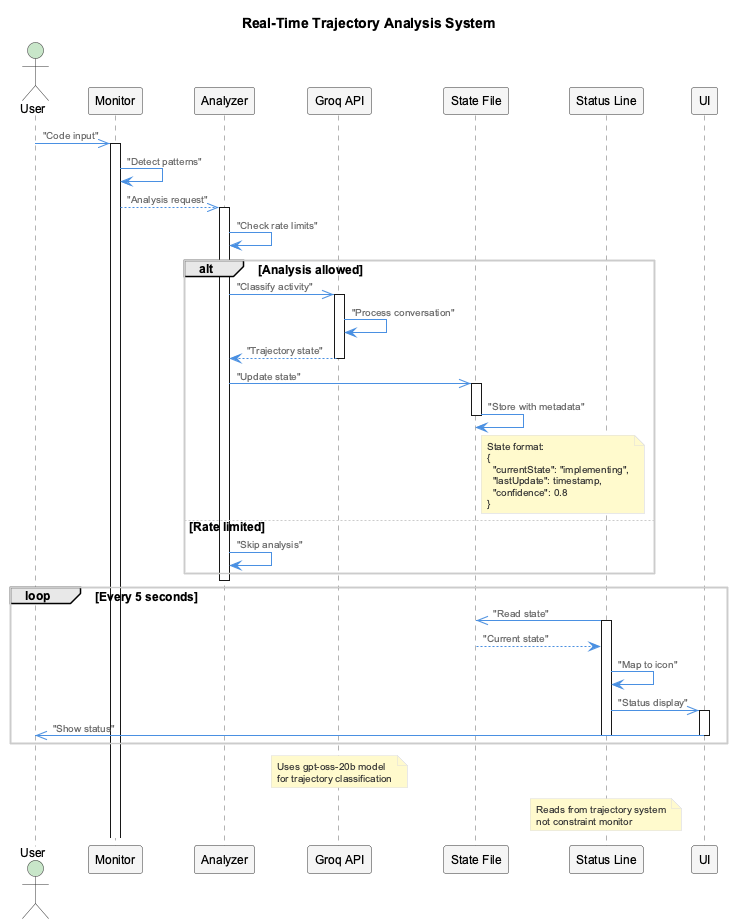

# Trajectories - Development State Analysis

AI-powered development activity tracking and comprehensive project capability documentation.

## What It Does

The Trajectory system provides **dual-mode analysis** for understanding development progress:

- **Real-Time State Tracking** - AI classifies current development activity (exploring, implementing, verifying, etc.)
- **Comprehensive Reports** - Automated project capability documentation through repository analysis
- **Status Line Integration** - Real-time trajectory state display in Claude Code status line
- **MCP-Powered Analysis** - Deep semantic understanding of code patterns and architecture

## Architecture

### Two Trajectory Systems

**1. Real-Time Trajectory Analysis** (`src/live-logging/RealTimeTrajectoryAnalyzer.js`):
- AI-powered session state classification during active development
- Integrated with LSL system for continuous monitoring
- Updates status line in real-time

**2. Trajectory Generation** (`scripts/repository-trajectory-generator.js`):
- Comprehensive project capability documentation
- Repository scanning with semantic analysis
- Light analysis (50 files) or deep analysis (200 files)


### Real-Time Trajectory Analysis Components

**RealTimeTrajectoryAnalyzer**:
- **AI Classification**: Groq `gpt-oss-20b` model analyzes conversation patterns
- **State Detection**: Classifies development activity into 6 trajectory states
- **Smart Analysis**: Configurable frequency limits (50 analyses/hour default)
- **Fallback System**: Groq → OpenAI for reliability

**Trajectory States**:
- `🔍 EX` (Exploring): Information gathering and analysis phase
- `📈 ON` (On Track): Productive trajectory progression
- `📉 OFF` (Off Track): Deviating from optimal path
- `⚙️ IMP` (Implementing): Active code modification
- `✅ VER` (Verifying): Testing and validation phase
- `🚫 BLK` (Blocked): Intervention preventing action

**State Persistence**:
- Location: `.specstory/trajectory/live-state.json`
- Format: JSON with timestamps and confidence scores
- State history tracking for analysis

### Trajectory Generation Components

**Repository Trajectory Generator**:
- **Orchestration**: Coordinates all trajectory generation activities
- **Analysis Tiers**: Light (quick insights) and deep (comprehensive reports)
- **MCP Integration**: Leverages semantic analysis services
- **Multi-Source**: Combines repository scanning, LSL data, change logs

**Capability Extraction Engine**:
- **Pattern Recognition**: Identifies code patterns and architectures
- **Capability Classification**: Categorizes features into groups
- **Documentation Generation**: Creates structured capability reports

**Capability Categories**:
- Core Infrastructure
- Development Tools
- Integration Systems
- User Features
- Data Management
- Security Features

## How It Works

### 1. Real-Time State Tracking



During active development sessions:

1. **Conversation Monitoring**: LSL system captures exchanges in real-time
2. **Smart Analysis**: Only significant exchanges trigger trajectory analysis
3. **AI Classification**: Groq model analyzes patterns and classifies state
4. **State Update**: Results written to `.specstory/trajectory/live-state.json`
5. **Status Line Display**: Current state shown in Claude Code status line

**Smart Analysis Features**:
- Skip consecutive read operations
- Only analyze significant exchanges
- Rate limiting (50 analyses/hour max)
- Fallback provider support

**Example Flow**:
```
User modifies code → LSL captures → Significant exchange detected →
Groq analyzes conversation → Classifies as "implementing" →
Updates live-state.json → Status line shows ⚙️ IMP
```

### 2. Comprehensive Report Generation

For project capability documentation:

1. **Repository Scan**: Analyzes file structure and code patterns
2. **MCP Semantic Analysis**: Deep code understanding via MCP services
3. **Capability Extraction**: Transforms raw data into structured capabilities
4. **Report Generation**: Creates comprehensive trajectory reports

**Analysis Levels**:
- **Light Analysis**: Quick scan (50 files max, ~2 min)
  - Basic patterns and capabilities
  - Quick project overview

- **Deep Analysis**: Comprehensive (200 files max, ~10 min)
  - Architectural insights
  - Technology stack analysis
  - Dependency mapping
  - Security patterns

**Report Structure**:
```markdown
# Project Trajectory Report

## System Capabilities
- Core infrastructure analysis
- Feature capabilities
- Integration points

## Architectural Insights
- Design patterns detected
- System architecture overview

## Technology Stack
- Dependencies and frameworks
- Development tools

## Recent Evolution
- Change log integration
- LSL session insights
```

### 3. Status Line Integration


**Critical Fix (2025-10-04)**: Status line now correctly reads from trajectory system instead of constraint monitor.

**Implementation**:
```javascript
getTrajectoryState() {
  const trajectoryPath = '.specstory/trajectory/live-state.json';
  const trajectoryData = JSON.parse(readFileSync(trajectoryPath));
  const currentState = trajectoryData.currentState || 'exploring';

  const stateIconMap = {
    'exploring': '🔍 EX',
    'on_track': '📈 ON',
    'off_track': '📉 OFF',
    'implementing': '⚙️ IMP',
    'verifying': '✅ VER',
    'blocked': '🚫 BLK'
  };

  return stateIconMap[currentState];
}
```

**Display Format**: `[🛡️ {compliance}% {trajectory}]`

Example: `[🛡️ 94% ⚙️ IMP]` shows 94% constraint compliance and "implementing" state.


## Configuration

### Real-Time Analysis Config

**File**: `config/live-logging-config.json`

**Key Settings**:
```json
{
  "trajectory_analysis": {
    "enabled": true,
    "inference_provider": "groq",
    "inference_model": "gpt-oss-20b",
    "fallback_provider": "openai",
    "fallback_model": "gpt-4o-mini",
    "analysis_interval": 5000,
    "smart_analysis": {
      "enabled": true,
      "only_significant_exchanges": true,
      "skip_consecutive_reads": true,
      "max_analyses_per_hour": 50
    },
    "intervention_threshold": 0.8
  }
}
```

### Trajectory Generation Config

**File**: `config/trajectory-analysis.json`

**Analysis Tiers**:
```json
{
  "light": {
    "max_files": 50,
    "focus": "patterns",
    "exclude_patterns": ["node_modules", "*.test.js", "dist"]
  },
  "deep": {
    "max_files": 200,
    "focus": "architecture",
    "include_semantic_analysis": true
  }
}
```

## Usage

### Real-Time Tracking (Automatic)

Real-time trajectory analysis runs automatically when:
- Enhanced Transcript Monitor is active
- Trajectory analysis is enabled in config
- LSL system is capturing conversations

**No manual intervention required** - just work normally and the status line will show current state.

### Generate Trajectory Reports (Manual)

**Light Analysis** (quick overview):
```bash
node scripts/repository-trajectory-generator.js --level=light
```

**Deep Analysis** (comprehensive):
```bash
node scripts/repository-trajectory-generator.js --level=deep
```

**With LSL Integration**:
```bash
node scripts/repository-trajectory-generator.js --include-lsl-data
```

**For Specific Project**:
```bash
TRANSCRIPT_SOURCE_PROJECT=/path/to/project \
  node scripts/repository-trajectory-generator.js --level=light
```

## Key Files

**Real-Time Analysis**:
- `src/live-logging/RealTimeTrajectoryAnalyzer.js` - AI-powered state classification
- `.specstory/trajectory/live-state.json` - Current trajectory state
- `scripts/combined-status-line.js` - Status line integration

**Trajectory Generation**:
- `scripts/repository-trajectory-generator.js` - Main orchestrator
- `config/trajectory-analysis.json` - Generation configuration
- `.specstory/comprehensive-project-trajectory.md` - Generated report

**Configuration**:
- `config/live-logging-config.json` - Real-time analysis settings

## Integration

**Related Systems**:
- [LSL](../lsl/) - Provides real-time conversation data for trajectory analysis
- [Health System](../health-system/) - Monitors trajectory system health
- [Constraints](../constraints/) - Status line shows both constraint compliance and trajectory state
- [Knowledge Management](../knowledge-management/) - Trajectory reports feed into knowledge base

## See Also

- [Real-Time Analysis Flow](../images/real-time-trajectory-analysis-flow.png) - Complete system flow diagram
