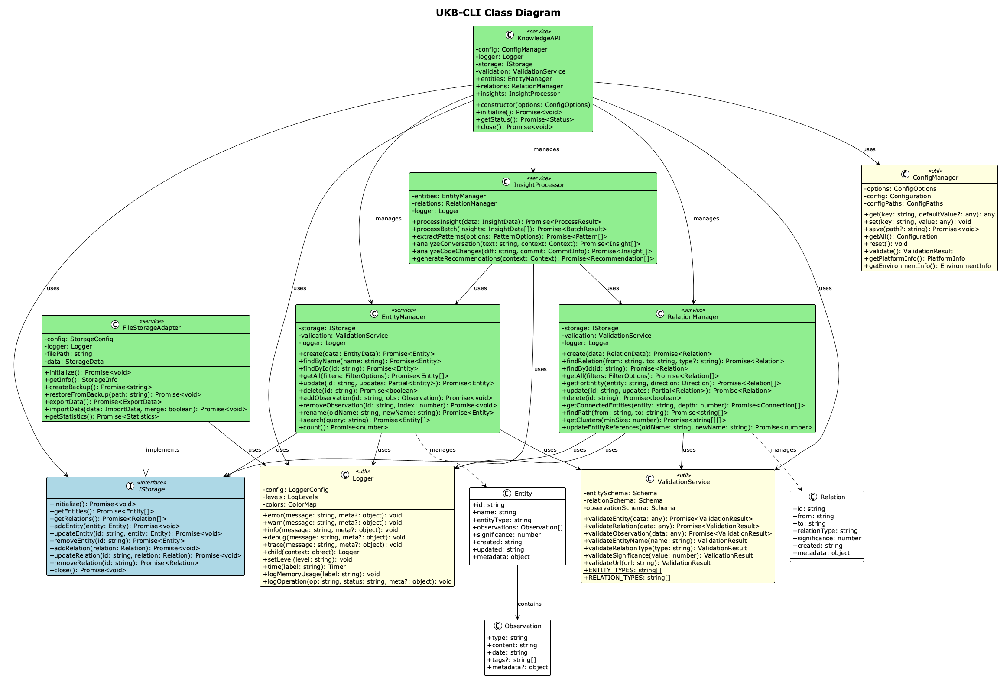
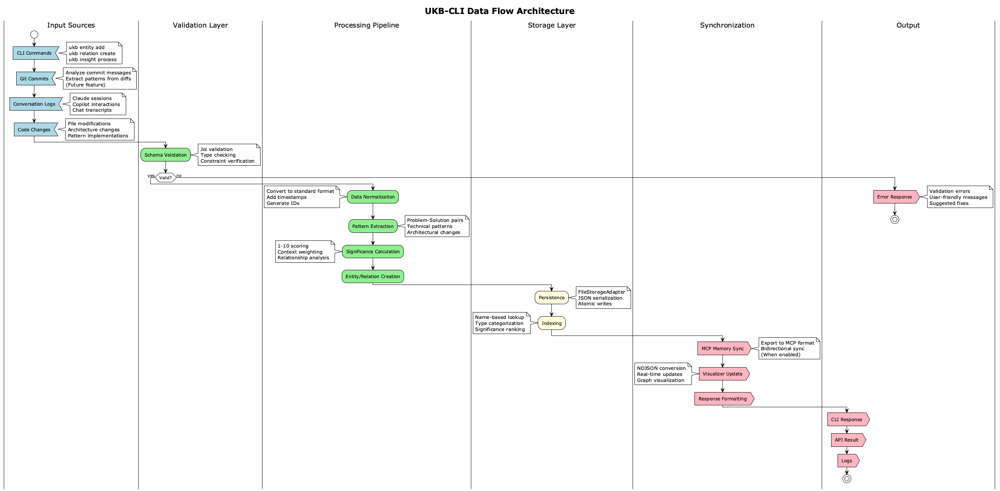

# UKB-CLI Architecture Documentation

## Overview

The UKB-CLI (Update Knowledge Base Command Line Interface) is a modern, agent-agnostic knowledge management system designed to replace the monolithic bash script with a modular, maintainable, and cross-platform solution.

## System Architecture


### Core Principles

1. **Separation of Concerns**: Each component has a single, well-defined responsibility
2. **Agent-Agnostic**: Works with any coding assistant (Claude, Copilot, etc.)
3. **Cross-Platform**: Node.js-based for Windows, macOS, and Linux compatibility
4. **Extensible**: Plugin architecture for new features
5. **Backwards Compatible**: Preserves existing workflows and data formats

## Component Architecture

### 1. CLI Layer (`bin/ukb-cli.js`)

The command-line interface provides:
- **Command Router**: Maps commands to API operations
- **Interactive Mode**: Guided workflows using inquirer.js
- **Output Formatting**: Colored, structured output with ora spinners
- **Error Handling**: User-friendly error messages

### 2. API Layer (`lib/knowledge-api/`)

The core API provides programmatic access to all functionality:

```
knowledge-api/
├── index.js              # Main API entry point
├── core/                 # Business logic
│   ├── entities.js       # Entity CRUD operations
│   ├── relations.js      # Graph relationship management
│   ├── insights.js       # Insight processing
│   └── validation.js     # Schema validation
├── adapters/             # Storage backends
│   └── file-storage.js   # JSON file persistence
└── utils/                # Cross-cutting concerns
    ├── config.js         # Configuration management
    └── logging.js        # Structured logging
```

### 3. Storage Layer

The storage layer is abstracted through adapters:

- **FileStorageAdapter**: JSON file-based storage (current)
- **Future adapters**: GraphDB, PostgreSQL, Cloud storage

### 4. Data Model

#### Entity Structure
```javascript
{
  id: "unique-identifier",
  name: "EntityName",
  entityType: "WorkflowPattern|Problem|Solution|...",
  observations: [
    {
      type: "problem|solution|insight",
      content: "Observation text",
      date: "ISO-8601 timestamp"
    }
  ],
  significance: 8,  // 1-10 scale
  created: "ISO-8601 timestamp",
  updated: "ISO-8601 timestamp",
  metadata: {
    created_by: "knowledge-api",
    version: "2.0.0",
    // Additional metadata
  }
}
```

#### Relation Structure
```javascript
{
  id: "unique-identifier",
  from: "SourceEntityName",
  to: "TargetEntityName",
  relationType: "implements|uses|solves|...",
  significance: 7,  // 1-10 scale
  created: "ISO-8601 timestamp",
  metadata: {
    // Additional metadata
  }
}
```

## Class Diagrams



### Key Classes

1. **KnowledgeAPI**: Main API orchestrator
2. **EntityManager**: Entity lifecycle management
3. **RelationManager**: Graph relationship operations
4. **InsightProcessor**: Automated insight extraction
5. **ValidationService**: Data integrity enforcement
6. **FileStorageAdapter**: File-based persistence
7. **ConfigManager**: Configuration handling
8. **Logger**: Structured logging

## Data Flow Architecture



### Input Sources
1. **CLI Commands**: Direct user input
2. **Git Commits**: Automated analysis (future)
3. **Conversation Logs**: Claude/Copilot sessions
4. **Code Changes**: Diff analysis

### Processing Pipeline
1. **Validation**: Input schema validation
2. **Normalization**: Data format standardization
3. **Analysis**: Pattern extraction
4. **Storage**: Persistence to backend
5. **Synchronization**: Cross-system updates

## Configuration Architecture

The system uses a layered configuration approach:

```
Priority (highest to lowest):
1. Constructor options
2. Environment variables
3. Project config (.knowledge-api.json)
4. User config (~/.config/knowledge-api/config.json)
5. Default configuration
```

### Configuration Schema
```javascript
{
  storage: {
    backend: "file",
    path: "./shared-memory.json"
  },
  integrations: {
    mcp: { enabled: true, auto_sync: true },
    visualizer: { enabled: true, path: "./dist/memory.json" }
  },
  analysis: {
    auto_commit_analysis: true,
    significance_threshold: 7
  },
  logging: {
    level: "info",
    console: true,
    file: false
  }
}
```

## Error Handling Architecture

### Error Hierarchy
1. **ValidationError**: Schema validation failures
2. **StorageError**: Persistence layer issues
3. **NotFoundError**: Entity/relation lookup failures
4. **ConflictError**: Duplicate entity names
5. **ConfigurationError**: Invalid configuration

### Error Flow
1. **Try-Catch Blocks**: At operation boundaries
2. **Error Transformation**: Technical to user-friendly messages
3. **Logging**: Structured error logging with context
4. **Recovery**: Graceful degradation where possible

## Plugin Architecture (Future)

The system is designed for extensibility:

### Plugin Types
1. **Storage Adapters**: New backend implementations
2. **Analyzers**: Custom insight extraction
3. **Exporters**: Output format plugins
4. **Validators**: Custom validation rules

### Plugin Interface
```javascript
export class AnalyzerPlugin {
  constructor(config) { }
  
  async analyze(input) {
    // Return extracted insights
  }
  
  get metadata() {
    return {
      name: "PluginName",
      version: "1.0.0",
      inputTypes: ["conversation", "code"]
    };
  }
}
```

## Performance Considerations

### Optimization Strategies
1. **Lazy Loading**: Load data on demand
2. **Caching**: In-memory cache for frequent operations
3. **Batch Operations**: Bulk insert/update support
4. **Indexing**: Name-based lookups optimized
5. **Async/Await**: Non-blocking I/O operations

### Scalability Limits
- **Current**: ~10,000 entities with file storage
- **Future**: Unlimited with database backends

## Security Architecture

### Data Protection
1. **Input Validation**: Prevent injection attacks
2. **File Permissions**: Secure file storage
3. **Sanitization**: Clean user input
4. **No Remote Execution**: Local operations only

### Privacy Considerations
1. **Local Storage**: All data stored locally
2. **No Telemetry**: No usage tracking
3. **User Control**: Full data ownership

## Migration Architecture

### From Legacy UKB
1. **Data Compatibility**: Existing JSON files work unchanged
2. **Command Mapping**: Legacy options supported
3. **Gradual Migration**: Side-by-side operation
4. **Rollback Support**: Keep legacy script available

### Schema Evolution
1. **Version Detection**: Automatic schema version check
2. **Migration Scripts**: Automated upgrades
3. **Backwards Compatibility**: Old schemas readable
4. **Data Preservation**: No data loss during migration

## Testing Architecture

### Test Layers
1. **Unit Tests**: Component isolation
2. **Integration Tests**: Component interaction
3. **E2E Tests**: Full workflow validation
4. **Performance Tests**: Scalability verification

### Test Coverage
- **Target**: 90%+ code coverage
- **Critical Paths**: 100% coverage
- **Edge Cases**: Comprehensive testing

## Deployment Architecture

### Distribution Methods
1. **NPM Package**: `npm install -g ukb-cli`
2. **Git Clone**: Direct repository usage
3. **Binary Distribution**: Packaged executables (future)

### Environment Support
- **Node.js**: 18.0.0+
- **Operating Systems**: Windows, macOS, Linux
- **Shell Integration**: Bash, Zsh, PowerShell

## Future Architecture Considerations

### Planned Enhancements
1. **Graph Database Backend**: Neo4j integration
2. **Real-time Sync**: WebSocket-based updates
3. **Web Interface**: Browser-based management
4. **API Server**: REST/GraphQL endpoints
5. **Cloud Storage**: Remote backend support

### Extensibility Points
1. **Storage Adapters**: Pluggable backends
2. **Analysis Engines**: ML-based insights
3. **Export Formats**: Multiple output types
4. **Import Sources**: Various input formats
5. **Visualization**: D3.js integration

## Architecture Decision Records (ADRs)

### ADR-001: Node.js over Bash
- **Decision**: Use Node.js instead of Bash
- **Rationale**: Cross-platform support, better testing, modern tooling
- **Consequences**: Requires Node.js runtime, easier maintenance

### ADR-002: JSON File Storage
- **Decision**: Start with JSON file storage
- **Rationale**: Simple, portable, backwards compatible
- **Consequences**: Limited scalability, plan for database migration

### ADR-003: Modular Architecture
- **Decision**: Separate concerns into modules
- **Rationale**: Maintainability, testability, reusability
- **Consequences**: More files, clear boundaries

### ADR-004: TypeScript-like with JSDoc
- **Decision**: Use JavaScript with TypeScript-like JSDoc
- **Rationale**: Type safety without build step
- **Consequences**: Better IDE support, inline documentation