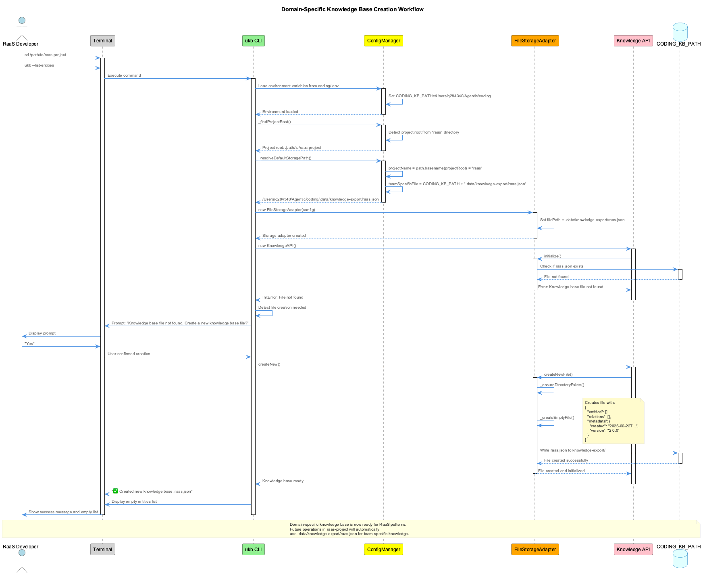

# UKB-CLI Use Cases and Examples

## Table of Contents
1. [Daily Development Workflows](#daily-development-workflows)
2. [Knowledge Capture Scenarios](#knowledge-capture-scenarios)
3. [Team Collaboration](#team-collaboration)
4. [Knowledge Discovery](#knowledge-discovery)
5. [Maintenance and Migration](#maintenance-and-migration)
6. [Integration Scenarios](#integration-scenarios)

## Daily Development Workflows

### Use Case 1: Capturing a Bug Fix Pattern

**Scenario**: You've just fixed a tricky bug related to React hooks dependency arrays.

```bash
# Interactive capture
$ ukb insight --interactive

? Insight type: Problem-Solution
? Problem description: useEffect infinite loop due to object dependency
? Solution description: Use useMemo to memoize object dependencies in useEffect

✅ Insight processed:
  Created entities:
    - UseEffectInfiniteLoopProblem (Problem, ★★★★★★★★)
    - UseMemoForEffectDependenciesSolution (Solution, ★★★★★★★★)
  Created relations:
    - UseMemoForEffectDependenciesSolution -[solves]-> UseEffectInfiniteLoopProblem

# Quick non-interactive capture
$ ukb entity add -n "ReactHooksDependencyPattern" -t "TechnicalPattern" -s 9 \
    -o "Always memoize object and array dependencies in hooks"
```

### Use Case 2: Documenting Architecture Decisions

**Scenario**: Your team decided to migrate from Redux to Zustand for state management.

```bash
# Create entities for the decision
$ ukb entity add -n "ReduxComplexityProblem" -t "Problem" -s 7 \
    -o "Redux boilerplate becoming unmaintainable with 50+ slices"

$ ukb entity add -n "ZustandMigrationSolution" -t "Solution" -s 8 \
    -o "Migrate to Zustand for simpler state management"

# Create the relationship
$ ukb relation add -f "ZustandMigrationSolution" -t "ReduxComplexityProblem" \
    -r "solves" -s 8

# Add implementation pattern
$ ukb entity add -n "ZustandStorePattern" -t "ArchitecturePattern" -s 9 \
    -o "Create focused stores with TypeScript interfaces"

$ ukb relation add -f "ZustandStorePattern" -t "ZustandMigrationSolution" \
    -r "implements"
```

### Use Case 3: Learning from Code Reviews

**Scenario**: During code review, you discover a reusable pattern for API error handling.

```bash
# Use interactive mode for detailed capture
$ ukb interactive

? What would you like to do? Process insight
? Insight type: Technical Pattern
? Pattern description: Centralized API error handling with retry logic and user notifications

# The pattern is now captured and can be discovered by teammates
$ ukb entity search "error handling"

Found 3 entities matching "error handling":
CentralizedApiErrorHandlingPattern    TechnicalPattern    ★★★★★★★★★
ApiRetryLogicPattern                  TechnicalPattern    ★★★★★★★
ErrorNotificationPattern              WorkflowPattern     ★★★★★★
```

## Knowledge Capture Scenarios

### Use Case 4: Post-Mortem Analysis

**Scenario**: After a production incident, capture learnings for future prevention.

```bash
# Create incident entity
$ ukb entity add -n "DatabaseConnectionPoolIncident2024" -t "Problem" -s 10 \
    -o "Production outage due to connection pool exhaustion"

# Add root cause
$ ukb entity add -n "MissingConnectionPoolMonitoring" -t "Problem" -s 9 \
    -o "No alerts configured for connection pool usage"

# Add solutions
$ ukb entity add -n "ConnectionPoolMetricsSolution" -t "Solution" -s 9 \
    -o "Implement Prometheus metrics for connection pool monitoring"

# Create relationships
$ ukb relation add -f "MissingConnectionPoolMonitoring" \
    -t "DatabaseConnectionPoolIncident2024" -r "causes"

$ ukb relation add -f "ConnectionPoolMetricsSolution" \
    -t "MissingConnectionPoolMonitoring" -r "solves"

# Add preventive pattern
$ ukb entity add -n "DatabaseMonitoringPattern" -t "Best Practice" -s 10 \
    -o "Monitor connection pools, query times, and lock waits"
```

### Use Case 5: Onboarding New Team Members

**Scenario**: Create a knowledge trail for new developers joining the project.

```bash
# Export project-specific patterns
$ ukb entity list -t "WorkflowPattern" > onboarding-patterns.txt

# Create onboarding checklist entity
$ ukb entity add -n "NewDeveloperOnboardingChecklist" -t "Documentation" -s 8

# Link to key patterns
$ ukb relation add -f "NewDeveloperOnboardingChecklist" \
    -t "LocalDevelopmentSetupPattern" -r "references"

$ ukb relation add -f "NewDeveloperOnboardingChecklist" \
    -t "CodeReviewWorkflowPattern" -r "references"

# Search for all onboarding-related knowledge
$ ukb entity search "onboarding"
```

### Use Case 6: Technology Evaluation

**Scenario**: Document the evaluation process for choosing a new testing framework.

```bash
# Create evaluation criteria entities
$ ukb entity add -n "TestingFrameworkEvaluation2024" -t "Project" -s 8

$ ukb entity add -n "JestFramework" -t "Tool" -s 7 \
    -o "Mature, good React integration, slow for large suites"

$ ukb entity add -n "VitestFramework" -t "Tool" -s 9 \
    -o "Fast, ESM native, compatible with Jest API"

# Add comparison relations
$ ukb relation add -f "VitestFramework" -t "JestFramework" -r "alternative_to"

$ ukb relation add -f "TestingFrameworkEvaluation2024" -t "VitestFramework" \
    -r "evaluates"

# Record decision
$ ukb entity add -n "AdoptVitestDecision" -t "ArchitecturePattern" -s 9 \
    -o "Migrate to Vitest for 10x faster test execution"
```

## Team Collaboration

### Use Case 7: Sharing Debug Techniques

**Scenario**: Share a debugging technique that saved hours of investigation.

```bash
# Capture the debugging pattern
$ ukb insight --interactive

? Insight type: Problem-Solution
? Problem: Memory leak in React component with WebSocket connections
? Solution: Use cleanup function in useEffect to close WebSocket on unmount

# Add debugging steps
$ ukb entity add -n "ReactMemoryLeakDebugging" -t "WorkflowPattern" -s 9

$ ukb entity add -o "Use React DevTools Profiler to identify leaking components" \
    -n "ReactMemoryLeakDebugging"

$ ukb entity add -o "Check useEffect cleanup functions for resource disposal" \
    -n "ReactMemoryLeakDebugging"

# Share with team
$ ukb export team-debugging-patterns.json
```

### Use Case 8: Cross-Project Learning

**Scenario**: Apply patterns learned from one project to another.

```bash
# Export patterns from project A
$ cd ~/projects/project-a
$ ukb entity list -t "TechnicalPattern" -s 8 > high-value-patterns.txt
$ ukb export project-a-patterns.json

# Import into project B
$ cd ~/projects/project-b
$ ukb import ~/projects/project-a/project-a-patterns.json --merge

# Find applicable patterns
$ ukb entity search "authentication"
$ ukb relation list -r "implements"
```

## Knowledge Discovery

### Use Case 9: Finding Solutions to Problems

**Scenario**: Encountering a performance issue and checking if it's been solved before.

```bash
# Search for performance-related problems
$ ukb entity search "performance" -t "Problem"

# Find solutions for a specific problem
$ ukb relation list -t "RenderPerformanceProblem" -r "solves"

# Get detailed information
$ ukb entity show "VirtualizationSolution" --verbose

# Find related patterns
$ ukb relation list -f "VirtualizationSolution"
```

### Use Case 10: Pattern Mining

**Scenario**: Identify recurring patterns across the codebase.

```bash
# Extract high-value patterns
$ ukb insight patterns --min-significance 8

Found 5 patterns:
1. Error Boundary Pattern (significance: 9)
   - Entities: ErrorBoundaryComponent, ReactErrorHandling, UserErrorFeedback
   - Used in: 12 components

2. Data Fetching Pattern (significance: 9)
   - Entities: SWRHooks, CacheInvalidation, OptimisticUpdates
   - Used in: 8 features

# Visualize pattern relationships
$ ukb relation list -e "ErrorBoundaryPattern" | ukb-visualize
```

## Maintenance and Migration

### Use Case 11: Knowledge Base Cleanup

**Scenario**: Remove outdated patterns and consolidate duplicates.

```bash
# Find potential duplicates
$ ukb entity list | sort | uniq -d

# Review low-significance entities
$ ukb entity list --max-significance 3

# Remove outdated entity
$ ukb entity remove -n "DeprecatedReduxPattern"

# Merge similar entities
$ ukb entity rename "ApiErrorHandling" "CentralizedErrorHandling"
$ ukb relation update-references "ApiErrorHandling" "CentralizedErrorHandling"
```

### Use Case 12: Schema Migration

**Scenario**: Upgrade knowledge base to support new features.

```bash
# Backup current data
$ ukb export backup-$(date +%Y%m%d).json

# Check current statistics
$ ukb status

Knowledge base status:
Storage: ./shared-memory.json
Entities: 234
Relations: 567
Last Updated: 2024-06-19T10:30:00Z
Version: 1.0.0

# Run migration (automatic on first use)
$ ukb entity list

# Verify migration
$ ukb status
```

## Integration Scenarios

### Use Case 13: CI/CD Integration

**Scenario**: Automatically capture patterns from commit messages.

```bash
#!/bin/bash
# In .git/hooks/post-commit

COMMIT_MSG=$(git log -1 --pretty=%B)

if [[ $COMMIT_MSG == *"[pattern]"* ]]; then
    # Extract pattern description
    PATTERN=$(echo "$COMMIT_MSG" | grep -oP '(?<=\[pattern\]).*?(?=\[/pattern\])')
    
    # Add to knowledge base
    ukb entity add -n "AutoCaptured_$(date +%s)" -t "TechnicalPattern" \
        -s 7 -o "$PATTERN"
fi
```

### Use Case 14: IDE Integration

**Scenario**: Access knowledge base from VS Code.

```bash
# Create VS Code task
cat > .vscode/tasks.json << EOF
{
  "version": "2.0.0",
  "tasks": [
    {
      "label": "Search Knowledge Base",
      "type": "shell",
      "command": "ukb entity search '\${input:searchTerm}'",
      "problemMatcher": []
    },
    {
      "label": "Add Pattern",
      "type": "shell", 
      "command": "ukb insight --interactive",
      "problemMatcher": []
    }
  ],
  "inputs": [
    {
      "id": "searchTerm",
      "type": "promptString",
      "description": "Search term"
    }
  ]
}
EOF
```

### Use Case 15: Reporting and Analytics

**Scenario**: Generate reports on knowledge base growth and usage.

```bash
# Monthly statistics
$ ukb status > reports/kb-stats-$(date +%Y-%m).txt

# High-value patterns report
$ ukb entity list -t "TechnicalPattern" --min-significance 8 \
    > reports/high-value-patterns.txt

# Relationship graph
$ ukb export - | jq '.relations | group_by(.relationType) | 
    map({type: .[0].relationType, count: length})' \
    > reports/relation-statistics.json

# Growth tracking
$ echo "$(date +%Y-%m-%d),$(ukb status | grep Entities | awk '{print $2}')" \
    >> reports/kb-growth.csv
```

## Domain-Specific Knowledge Management

### Use Case 16: Creating Domain-Specific Knowledge Bases

**Scenario**: Starting a new project in a specialized domain (e.g., Reprocessing as a Service - RaaS) and need to establish domain-specific knowledge while maintaining cross-project patterns.

```bash
# Step 1: Navigate to domain project directory
$ cd /path/to/raas-project

# Step 2: First ukb command automatically creates shared-memory-raas.json
$ ukb --list-entities
? Knowledge base file not found. Create a new knowledge base file? Yes
✅ Created new knowledge base: /Users/q284340/Agentic/coding/shared-memory-raas.json

# Step 3: Add first domain entity using piped input
$ echo "StreamProcessingPipeline
TechnicalPattern
8
Core pattern for real-time data reprocessing with event streaming architecture
Handles high-throughput data streams with fault tolerance and exactly-once semantics
Implemented using Apache Kafka + Apache Flink for stream processing
Essential for any reprocessing service requiring real-time data transformation" | ukb --add-entity

# Step 4: Add service architecture pattern
$ echo "MicroserviceReprocessingArchitecture
TechnicalPattern
9
Distributed architecture pattern for scalable reprocessing services
Uses container orchestration with Kubernetes for service deployment
Event-driven communication between reprocessing microservices
Implements circuit breaker and retry patterns for resilience
Auto-scaling based on queue depth and processing time metrics" | ukb --add-entity

# Step 5: Create relationships between patterns
$ ukb --add-relation
? From entity: MicroserviceReprocessingArchitecture
? To entity: StreamProcessingPipeline
? Relation type: implements
✅ Created relation: MicroserviceReprocessingArchitecture -[implements]-> StreamProcessingPipeline

# Step 6: Verify domain knowledge base
$ ukb --print
```

**Benefits:**
- **Domain isolation**: RaaS patterns don't pollute other team knowledge bases
- **Cross-project learning**: Architectural patterns can be shared via `shared-memory-coding.json`
- **Team-specific expertise**: Domain experts can build specialized knowledge repositories
- **Onboarding efficiency**: New RaaS team members get domain-specific guidance

**File Structure Result:**
```
/Users/q284340/Agentic/coding/
├── shared-memory-coding.json     # Cross-team patterns
├── shared-memory-raas.json       # RaaS domain knowledge
├── shared-memory-ui.json         # UI team knowledge
└── shared-memory-resi.json       # Resilience team knowledge
```

**Workflow Sequence:**



The diagram shows the complete workflow from project detection to knowledge base creation, highlighting how the system automatically determines the domain-specific file name and creates it in the centralized `CODING_KB_PATH` location.

### Use Case 17: Cross-Domain Pattern Discovery

**Scenario**: Finding reusable patterns across different domain knowledge bases.

```bash
# Search across all team knowledge bases
$ cd /Users/q284340/Agentic/coding
$ grep -l "MicroserviceArchitecture" shared-memory-*.json

shared-memory-raas.json
shared-memory-resi.json

# Extract domain-specific implementations
$ ukb --print --team raas | jq '.entities[] | select(.name | contains("Microservice"))'
$ ukb --print --team resi | jq '.entities[] | select(.name | contains("Microservice"))'

# Create cross-domain pattern in shared knowledge
$ cd /any/project
$ ukb entity add -n "CrossDomainMicroservicePattern" -t "ArchitecturePattern" -s 10 \
    -o "Microservice patterns applicable across RaaS and Resilience domains"
```

## Advanced Use Cases

### Use Case 18: Complex Pattern Networks

**Scenario**: Model complex architectural patterns with multiple components.

```bash
# Create microservice pattern entities
$ ukb entity add -n "MicroserviceArchitecture" -t "ArchitecturePattern" -s 9
$ ukb entity add -n "APIGatewayPattern" -t "TechnicalPattern" -s 8
$ ukb entity add -n "ServiceDiscoveryPattern" -t "TechnicalPattern" -s 8
$ ukb entity add -n "CircuitBreakerPattern" -t "TechnicalPattern" -s 9

# Create relationships
$ ukb relation add -f "APIGatewayPattern" -t "MicroserviceArchitecture" -r "part_of"
$ ukb relation add -f "ServiceDiscoveryPattern" -t "MicroserviceArchitecture" -r "part_of"
$ ukb relation add -f "CircuitBreakerPattern" -t "MicroserviceArchitecture" -r "part_of"
$ ukb relation add -f "CircuitBreakerPattern" -t "APIGatewayPattern" -r "implements"

# Find all components of the architecture
$ ukb relation list -t "MicroserviceArchitecture" -r "part_of"
```

### Use Case 17: Knowledge Base as Code

**Scenario**: Version control your team's knowledge base.

```bash
# Initialize knowledge base in git
$ git init
$ ukb export shared-memory.json
$ git add shared-memory.json
$ git commit -m "Initial knowledge base"

# Create PR for new patterns
$ git checkout -b add-caching-patterns
$ ukb entity add -n "RedisCachingPattern" -t "TechnicalPattern" -s 9
$ ukb entity add -n "CacheInvalidationStrategy" -t "WorkflowPattern" -s 8
$ git add shared-memory.json
$ git commit -m "Add caching patterns from sprint 23"
$ git push origin add-caching-patterns
```

## Best Practices

1. **Consistent Naming**: Use descriptive, searchable names
2. **Significance Scoring**: Rate based on reusability and impact
3. **Regular Reviews**: Periodically review and update entities
4. **Team Sync**: Share and merge knowledge bases regularly
5. **Automation**: Integrate with development workflow tools