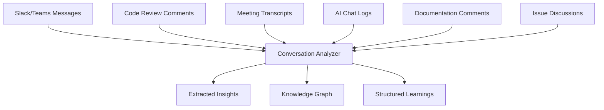

# Conversation Insight Extraction

Extracting valuable technical insights from team discussions, code reviews, and AI interactions to build organizational knowledge.

## Overview

The Semantic Analysis System can analyze conversations, code reviews, team discussions, and AI interactions to extract actionable technical insights. This automated insight extraction helps teams capture valuable knowledge that would otherwise be lost in chat logs, review comments, and meeting notes.

## Key Benefits

- **Knowledge Preservation**: Capture insights from informal discussions
- **Pattern Recognition**: Identify recurring themes and solutions
- **Decision Documentation**: Extract architectural decisions and rationale
- **Learning Acceleration**: Make tribal knowledge accessible to all team members
- **Continuous Improvement**: Track evolution of practices and approaches

## How It Works

### 1. Multi-Source Analysis

The system processes various conversation sources:



### 2. Automatic Insight Extraction

```javascript
// Extract insights from conversation data
const insights = await coordinator.extractConversationInsights({
  sources: [
    'slack-channels',
    'github-reviews', 
    'ai-chat-logs',
    'meeting-transcripts'
  ],
  analysisTypes: ['technical-decisions', 'problem-solutions', 'best-practices'],
  timeRange: '30days'
});
```

### 3. Knowledge Categorization

Insights are automatically categorized and structured:

- **Technical Solutions**: Code approaches and implementations
- **Architectural Decisions**: Design choices and their rationale
- **Best Practices**: Agreed-upon approaches and standards
- **Lessons Learned**: What worked, what didn't, and why
- **Process Improvements**: Workflow and collaboration enhancements

## Usage Examples

### Slack/Teams Integration

```javascript
// Analyze team discussions for technical insights
const slackInsights = await coordinator.analyzeTeamCommunications({
  platform: 'slack',
  channels: ['#engineering', '#architecture', '#code-review'],
  extractionFocus: 'technical-decisions',
  timeRange: '7days'
});
```

### Code Review Analysis

```javascript
// Extract insights from code review discussions
const reviewInsights = await coordinator.analyzeCodeReviews({
  repository: 'github.com/company/project',
  reviewTypes: ['pull-requests', 'merge-requests'],
  extractPatterns: ['performance-improvements', 'security-fixes', 'refactoring-decisions'],
  includeComments: true
});
```

### AI Chat Log Processing

```javascript
// Process AI interactions for valuable insights
const aiInsights = await coordinator.processAIChatLogs({
  chatSources: ['claude-sessions', 'copilot-interactions'],
  extractionTypes: ['problem-solving-patterns', 'code-generation-insights', 'debugging-approaches'],
  structuredOutput: true
});
```

### MCP Integration

```javascript
// Conversation analysis via MCP tools
const conversationAnalysis = await mcp.call('semantic_analyze_conversation', {
  conversationPath: './team-discussions.json',
  extractInsights: true,
  updateKnowledge: true,
  categories: ['technical', 'process', 'tooling']
});
```

## Insight Extraction Scenarios

### 1. Technical Problem Solving

Extract problem-solution patterns from conversations:

```javascript
const problemSolutions = await coordinator.extractProblemSolutions({
  conversations: 'all-technical-channels',
  patterns: [
    'problem-description → solution-approach → outcome',
    'issue-report → investigation → resolution',
    'performance-problem → optimization → metrics'
  ],
  minimumCompleteness: 0.8
});
```

### 2. Architectural Decision Records

Automatically create ADRs from design discussions:

```javascript
const architecturalDecisions = await coordinator.extractArchitecturalDecisions({
  sources: ['design-meetings', 'architecture-reviews', 'technical-rfcs'],
  structure: {
    context: 'problem-background',
    decision: 'chosen-approach',
    consequences: 'expected-outcomes',
    alternatives: 'considered-options'
  }
});
```

### 3. Best Practice Evolution

Track how team practices evolve through discussions:

```javascript
const practiceEvolution = await coordinator.trackPracticeEvolution({
  practices: ['testing-strategies', 'code-review-process', 'deployment-workflow'],
  conversationSources: 'all-team-channels',
  timeRange: '6months',
  trackChanges: true
});
```

## Insight Categories

### Technical Insights
- **Code Patterns**: Reusable code approaches discovered in discussions
- **Architecture Decisions**: Design choices and their reasoning
- **Performance Solutions**: Optimization techniques and their effectiveness
- **Bug Patterns**: Common issues and their resolutions
- **Tool Evaluations**: Team opinions and experiences with tools

### Process Insights
- **Workflow Improvements**: Process changes and their impact
- **Communication Patterns**: Effective collaboration approaches
- **Knowledge Gaps**: Areas where team needs more information
- **Learning Opportunities**: Skills development needs identified
- **Bottlenecks**: Process inefficiencies discovered

### Cultural Insights
- **Team Dynamics**: Collaboration patterns and preferences
- **Decision-Making**: How technical decisions are made
- **Knowledge Sharing**: Patterns of information exchange
- **Problem-Solving**: Team approaches to challenges
- **Innovation**: Creative solutions and experimentation

## Structured Insight Format

```javascript
{
  "conversationInsight": {
    "id": "performance-optimization-discussion-2024-01",
    "extractedFrom": {
      "source": "slack-engineering-channel",
      "participants": ["alice", "bob", "charlie"],
      "timestamp": "2024-01-15T10:30:00Z",
      "messageRange": "10:30-11:45"
    },
    "category": "technical-solution",
    "problem": {
      "description": "React app experiencing slow initial load times",
      "context": "Large bundle size affecting user experience",
      "metrics": {"initialLoad": "8.5s", "bundleSize": "2.3MB"}
    },
    "solution": {
      "approach": "Implement code splitting and lazy loading",
      "implementation": "React.lazy() + Suspense boundaries",
      "tools": ["webpack-bundle-analyzer", "react-loadable-visibility"]
    },
    "outcome": {
      "metrics": {"initialLoad": "3.2s", "bundleSize": "800KB"},
      "teamFeedback": "Significant improvement in user experience",
      "lessonsLearned": ["Analyze bundle before optimization", "Lazy load non-critical routes"]
    },
    "reusability": {
      "applicable": ["spa-applications", "react-projects"],
      "adaptations": ["adjust-splitting-strategy", "customize-loading-states"],
      "significance": 8
    }
  }
}
```

## Implementation Patterns

### 1. Continuous Monitoring

Set up automated conversation analysis:

```javascript
// Continuous insight extraction configuration
const continuousAnalysis = {
  schedule: 'daily',
  sources: {
    slack: {
      channels: ['#engineering', '#architecture'],
      messageTypes: ['threads', 'mentions', 'reactions']
    },
    github: {
      repositories: ['main-repo', 'shared-libs'],
      elements: ['pr-comments', 'issue-discussions', 'commit-messages']
    },
    ai_interactions: {
      platforms: ['claude', 'copilot'],
      sessionTypes: ['coding', 'debugging', 'architecture']
    }
  },
  processing: {
    extractPatterns: true,
    categorizeInsights: true,
    updateKnowledgeBase: true,
    generateAlerts: true
  }
};
```

### 2. Smart Filtering

Filter conversations for technical relevance:

```javascript
const smartFiltering = await coordinator.filterTechnicalConversations({
  conversations: 'all-recent',
  relevanceThreshold: 0.7,
  technicalIndicators: [
    'code-mentions',
    'error-discussions',
    'performance-metrics',
    'architecture-terms',
    'tool-evaluations'
  ],
  excludePatterns: ['social-chat', 'off-topic-discussions']
});
```

### 3. Context-Aware Extraction

Use conversation context to improve insight quality:

```javascript
const contextualExtraction = await coordinator.extractWithContext({
  conversation: 'target-discussion',
  contextSources: [
    'related-code-files',
    'relevant-documentation',
    'previous-discussions',
    'project-background'
  ],
  enrichmentLevel: 'high',
  crossReference: true
});
```

## Advanced Features

### Sentiment Analysis

Track team sentiment around technical decisions:

```javascript
const sentimentAnalysis = await coordinator.analyzeTechnicalSentiment({
  topics: ['new-framework-adoption', 'refactoring-project', 'tool-migration'],
  conversations: 'engineering-channels',
  timeRange: '3months',
  trackChanges: true
});
```

### Expertise Mapping

Identify team expertise based on conversation contributions:

```javascript
const expertiseMapping = await coordinator.mapTeamExpertise({
  conversationSources: 'all-technical-channels',
  expertiseAreas: ['frontend', 'backend', 'devops', 'security'],
  trackContributions: true,
  generateRecommendations: true
});
```

### Knowledge Gap Detection

Identify areas where team needs more knowledge:

```javascript
const knowledgeGaps = await coordinator.detectKnowledgeGaps({
  conversations: 'help-requests',
  patterns: ['repeated-questions', 'external-research', 'trial-and-error'],
  suggestLearning: true
});
```

## Integration with Knowledge Base

### Automatic Updates

Extracted insights automatically update the knowledge base:

```bash
# Configure automatic insight-to-knowledge transfer
ukb --configure --conversation-insights-enabled
ukb --set-extraction-schedule daily
ukb --set-insight-threshold 7
```

### Manual Review Workflow

Set up review process for extracted insights:

```javascript
const reviewWorkflow = {
  extractionTrigger: 'daily',
  reviewRequired: 'significance > 7',
  reviewers: ['tech-leads', 'domain-experts'],
  approvalProcess: 'consensus',
  autoApproval: 'significance < 5'
};
```

## Metrics and Success Tracking

### Insight Quality Metrics

```javascript
const insightMetrics = await coordinator.getInsightQualityMetrics({
  timeRange: '30days',
  metrics: [
    'extraction-accuracy',
    'insight-usefulness',
    'knowledge-reuse-rate',
    'team-adoption-rate'
  ]
});
```

### Conversation Coverage

Track how much valuable information is being captured:

```javascript
const coverageMetrics = {
  totalTechnicalConversations: 245,
  conversationsAnalyzed: 189,
  insightsExtracted: 67,
  knowledgeBaseUpdates: 45,
  coverageRate: 0.77
};
```

## Configuration

Configure conversation insight extraction in `config/agents.yaml`:

```yaml
agents:
  semantic-analysis:
    conversationInsights:
      enabled: true
      sources:
        slack:
          enabled: true
          channels: ['#engineering', '#architecture']
          apiToken: '${SLACK_API_TOKEN}'
        github:
          enabled: true
          repositories: ['main-repo']
          accessToken: '${GITHUB_TOKEN}'
        aiInteractions:
          enabled: true
          platforms: ['claude', 'copilot']
      processing:
        extractionSchedule: 'daily'
        relevanceThreshold: 0.7
        significanceThreshold: 6
        autoUpdateKnowledgeBase: true
      filtering:
        excludePatterns: ['social-chat', 'off-topic']
        technicalIndicators: ['code', 'error', 'performance']
        contextualEnrichment: true
```

This use case enables teams to automatically capture and structure valuable technical knowledge from their everyday conversations, ensuring that insights are preserved and made accessible to the entire organization.