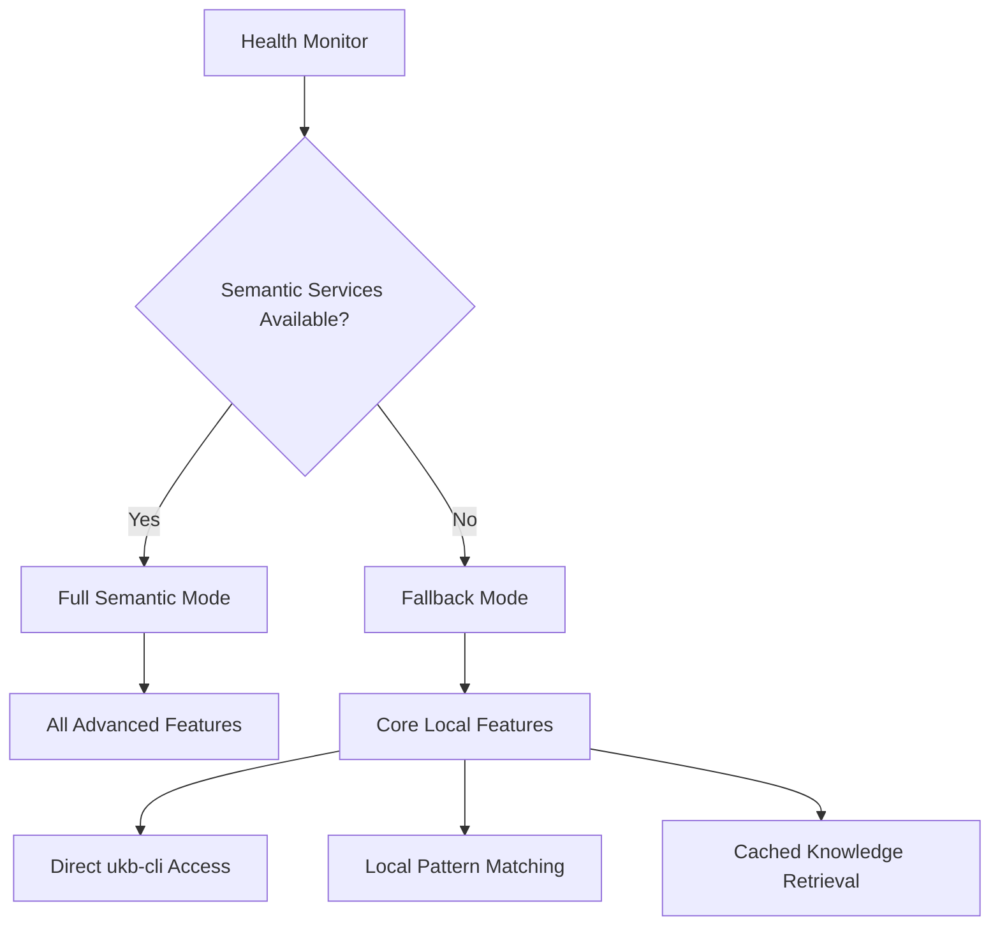

# Fallback Service Utilization

How the system gracefully degrades when semantic agents are unavailable, using direct ukb-cli access and fallback mechanisms to ensure continuous operation.

## Overview

The Semantic Analysis System is designed with resilience in mind. When semantic agents are unavailable due to network issues, service outages, or resource constraints, the system automatically falls back to lightweight, local alternatives that maintain core functionality. This ensures teams can continue working even when full semantic analysis capabilities are temporarily unavailable.

## Key Benefits

- **Continuous Operation**: Work continues even during service outages
- **Local Fallbacks**: Core functionality remains available offline
- **Graceful Degradation**: System smoothly transitions between full and limited modes
- **Automatic Recovery**: Seamless return to full functionality when services restore
- **Cost Management**: Reduce API costs during high-usage periods

## How It Works

### 1. Service Health Monitoring

The system continuously monitors semantic service availability:



### 2. Automatic Fallback Activation

```javascript
// Service availability checking and fallback activation
const serviceManager = await coordinator.initializeServiceManager({
  primaryServices: ['semantic-analysis', 'pattern-recognition', 'insight-extraction'],
  fallbackServices: ['local-ukb', 'cached-patterns', 'static-analysis'],
  healthCheckInterval: 30000, // 30 seconds
  fallbackThreshold: 3 // failures before fallback
});

// Automatic mode switching
serviceManager.onServiceUnavailable((service) => {
  console.log(`${service} unavailable, switching to fallback mode`);
  activateFallbackMode(service);
});
```

### 3. Fallback Service Hierarchy

```javascript
const fallbackHierarchy = {
  'semantic-analysis': [
    'cached-semantic-results',
    'pattern-based-analysis', 
    'ukb-direct-access',
    'static-file-analysis'
  ],
  'insight-extraction': [
    'local-pattern-matching',
    'rule-based-extraction',
    'ukb-search',
    'manual-mode'
  ],
  'cross-project-learning': [
    'local-knowledge-base',
    'cached-cross-references',
    'static-recommendations',
    'offline-mode'
  ]
};
```

## Fallback Mechanisms

### 1. Direct ukb-cli Access

When semantic services are unavailable, fall back to direct command-line tools:

```bash
# Direct ukb operations for knowledge management
ukb --search "performance optimization" --local-only
ukb --add-entity --name "LocalPattern" --type "Fallback" --significance 6
ukb --export --format json --output ./local-knowledge.json

# Local pattern matching without semantic analysis
ukb --find-patterns --in-project . --offline-mode
ukb --recommend --based-on-local-knowledge --project-type "react"
```

### 2. Cached Knowledge Retrieval

Use previously cached semantic analysis results:

```javascript
// Fallback to cached results when services unavailable
const cachedInsights = await fallbackManager.getCachedInsights({
  project: './current-project',
  cacheMaxAge: '7days',
  fallbackDepth: 'deep'
});

// Use cached pattern recognition
const cachedPatterns = await fallbackManager.getCachedPatterns({
  patternTypes: ['architectural', 'performance', 'security'],
  includeMetrics: true,
  localSearch: true
});
```

### 3. Local Pattern Matching

Implement lightweight pattern matching without cloud services:

```javascript
// Local pattern matching using static rules
const localPatternMatcher = {
  architectural: {
    'mvc-pattern': /controller.*model.*view/gi,
    'singleton-pattern': /class.*getInstance.*static/gi,
    'observer-pattern': /addEventListener|subscribe|notify/gi
  },
  performance: {
    'n-plus-one': /for.*each.*query|map.*async.*await/gi,
    'memory-leak': /setInterval.*clearInterval|addEventListener.*removeEventListener/gi
  },
  security: {
    'sql-injection': /query.*\+.*user|SELECT.*\${|exec.*input/gi,
    'xss-vulnerability': /innerHTML.*user|eval.*input/gi
  }
};
```

### 4. Offline Knowledge Base

Maintain local copies of knowledge for offline access:

```javascript
// Sync knowledge base for offline access
const offlineKB = await fallbackManager.syncForOffline({
  knowledgeTypes: ['patterns', 'solutions', 'best-practices'],
  projects: ['current', 'related'],
  updateFrequency: 'daily',
  compressionLevel: 'high'
});

// Access offline knowledge
const offlineInsights = await offlineKB.search({
  query: 'react performance optimization',
  localOnly: true,
  fuzzyMatching: true
});
```

## Fallback Usage Examples

### 1. Development Workflow Fallback

Continue development work when semantic services are down:

```bash
# Standard workflow with fallback capabilities
npm run dev  # Normal development continues

# Knowledge operations fall back to local tools
ukb --add-learning "Fixed memory leak in useEffect hook" --local-cache
ukb --search "memory leak patterns" --offline-mode

# Pattern detection continues with local rules
./scripts/detect-patterns.sh --local-only --rules ./config/local-patterns.json
```

### 2. Code Review Fallback

Perform code review assistance without cloud services:

```javascript
// Local code review assistance
const localReviewAssistant = await fallbackManager.createLocalReviewer({
  rules: './config/review-rules.json',
  patterns: './config/code-patterns.json',
  knowledgeBase: './cache/local-kb.json'
});

const reviewComments = await localReviewAssistant.reviewChanges({
  files: ['src/components/UserProfile.jsx'],
  focusAreas: ['performance', 'security', 'maintainability'],
  useLocalKnowledge: true
});
```

### 3. Architecture Decision Support

Get architectural guidance using cached knowledge:

```javascript
// Architecture decision support in fallback mode
const architectureSupport = await fallbackManager.getArchitectureGuidance({
  decision: 'state-management-choice',
  projectContext: {
    type: 'react-spa',
    complexity: 'medium',
    teamSize: 5
  },
  knowledgeSource: 'local-cache',
  includeReasons: true
});
```

## Fallback Service Implementation

### 1. Service Health Checker

```javascript
class ServiceHealthChecker {
  constructor(services, config) {
    this.services = services;
    this.config = config;
    this.healthStatus = new Map();
  }

  async checkHealth() {
    for (const service of this.services) {
      try {
        const response = await this.pingService(service);
        this.healthStatus.set(service, {
          available: response.ok,
          latency: response.latency,
          lastCheck: Date.now()
        });
      } catch (error) {
        this.healthStatus.set(service, {
          available: false,
          error: error.message,
          lastCheck: Date.now()
        });
      }
    }
  }

  async pingService(service) {
    const start = Date.now();
    const response = await fetch(`${service.endpoint}/health`);
    return {
      ok: response.ok,
      latency: Date.now() - start
    };
  }

  isServiceAvailable(serviceName) {
    const status = this.healthStatus.get(serviceName);
    return status && status.available;
  }
}
```

### 2. Fallback Manager

```javascript
class FallbackManager {
  constructor(fallbackConfig) {
    this.config = fallbackConfig;
    this.activeMode = 'full';
    this.fallbackServices = new Map();
  }

  async activateFallback(serviceName) {
    const fallbackChain = this.config.fallbacks[serviceName];
    
    for (const fallbackService of fallbackChain) {
      try {
        const service = await this.initializeFallbackService(fallbackService);
        this.fallbackServices.set(serviceName, service);
        break;
      } catch (error) {
        console.warn(`Fallback service ${fallbackService} failed:`, error);
        continue;
      }
    }
  }

  async initializeFallbackService(serviceName) {
    switch (serviceName) {
      case 'ukb-direct-access':
        return new UkbDirectAccess();
      case 'cached-patterns':
        return new CachedPatternService('./cache/patterns.json');
      case 'local-knowledge-base':
        return new LocalKnowledgeBase('./cache/knowledge.json');
      default:
        throw new Error(`Unknown fallback service: ${serviceName}`);
    }
  }
}
```

### 3. Local Knowledge Service

```javascript
class LocalKnowledgeService {
  constructor(knowledgeFilePath) {
    this.knowledgePath = knowledgeFilePath;
    this.knowledge = this.loadKnowledge();
  }

  loadKnowledge() {
    try {
      return JSON.parse(fs.readFileSync(this.knowledgePath, 'utf8'));
    } catch (error) {
      console.warn('Could not load local knowledge, using empty set');
      return { entities: [], patterns: [], insights: [] };
    }
  }

  search(query, options = {}) {
    const results = [];
    const queryLower = query.toLowerCase();

    // Search entities
    for (const entity of this.knowledge.entities) {
      if (entity.name.toLowerCase().includes(queryLower) ||
          entity.observations.some(obs => obs.toLowerCase().includes(queryLower))) {
        results.push({ type: 'entity', data: entity, relevance: 0.8 });
      }
    }

    // Search patterns
    for (const pattern of this.knowledge.patterns) {
      if (pattern.name.toLowerCase().includes(queryLower) ||
          pattern.description.toLowerCase().includes(queryLower)) {
        results.push({ type: 'pattern', data: pattern, relevance: 0.7 });
      }
    }

    return results.sort((a, b) => b.relevance - a.relevance);
  }

  addEntity(entity) {
    this.knowledge.entities.push({
      ...entity,
      timestamp: Date.now(),
      source: 'local-fallback'
    });
    this.saveKnowledge();
  }

  saveKnowledge() {
    fs.writeFileSync(this.knowledgePath, JSON.stringify(this.knowledge, null, 2));
  }
}
```

## Fallback Configuration

### Service Configuration

```yaml
# config/fallback-services.yaml
fallback:
  enabled: true
  healthCheckInterval: 30000
  fallbackThreshold: 3
  
  services:
    semantic-analysis:
      primary: "http://localhost:8080/semantic"
      fallbacks:
        - type: "cached-results"
          path: "./cache/semantic-results"
          maxAge: "7days"
        - type: "ukb-direct"
          command: "ukb"
          args: ["--local-only"]
        - type: "pattern-matching"
          rules: "./config/local-patterns.json"
    
    insight-extraction:
      primary: "http://localhost:8080/insights"
      fallbacks:
        - type: "local-extraction"
          patterns: "./config/insight-patterns.json"
        - type: "manual-mode"
          interactive: true

  cache:
    enabled: true
    directory: "./cache"
    maxSize: "500MB"
    retention: "30days"
```

### Local Pattern Rules

```json
{
  "patterns": {
    "performance": [
      {
        "name": "inefficient-loop",
        "pattern": "for\\s*\\(.*\\)\\s*{[^}]*for\\s*\\(",
        "severity": "medium",
        "suggestion": "Consider using array methods or optimizing nested loops"
      },
      {
        "name": "memory-leak-candidate", 
        "pattern": "setInterval\\s*\\([^}]*(?!clearInterval)",
        "severity": "high",
        "suggestion": "Ensure clearInterval is called to prevent memory leaks"
      }
    ],
    "security": [
      {
        "name": "potential-xss",
        "pattern": "innerHTML\\s*=\\s*.*\\+",
        "severity": "high",
        "suggestion": "Use textContent or proper sanitization"
      }
    ]
  }
}
```

## Monitoring and Alerts

### Fallback Status Dashboard

```javascript
// Monitor fallback service usage
const fallbackMonitor = {
  activeFallbacks: new Map(),
  fallbackUsage: new Map(),
  performanceMetrics: new Map(),

  recordFallbackActivation(service, reason) {
    this.activeFallbacks.set(service, {
      activatedAt: Date.now(),
      reason: reason,
      fallbackType: 'automatic'
    });
    
    // Update usage statistics
    const usage = this.fallbackUsage.get(service) || 0;
    this.fallbackUsage.set(service, usage + 1);
  },

  generateReport() {
    return {
      currentFallbacks: Array.from(this.activeFallbacks.entries()),
      usageStatistics: Array.from(this.fallbackUsage.entries()),
      uptime: this.calculateUptime(),
      performanceImpact: this.calculatePerformanceImpact()
    };
  }
};
```

### Alert Configuration

```javascript
const alertConfig = {
  fallbackActivation: {
    enabled: true,
    channels: ['slack-ops', 'email-team'],
    message: 'Semantic service {{service}} unavailable, fallback activated'
  },
  serviceRestoration: {
    enabled: true,
    channels: ['slack-ops'],
    message: 'Semantic service {{service}} restored, returning to full mode'
  },
  degradedPerformance: {
    enabled: true,
    threshold: 0.5, // 50% performance degradation
    message: 'Fallback mode causing {{degradation}}% performance impact'
  }
};
```

## Performance Considerations

### Fallback Performance Impact

```javascript
const performanceMetrics = {
  fullMode: {
    analysisTime: '2.3s',
    insightAccuracy: 0.92,
    patternDetection: 0.89
  },
  fallbackMode: {
    analysisTime: '5.1s',      // 121% slower
    insightAccuracy: 0.76,     // 17% less accurate
    patternDetection: 0.71     // 20% less effective
  },
  tradeoffs: {
    reliability: '+95%',        // Much more reliable
    availability: '+99%',       // Always available
    offlineCapability: 'Full'   // Works completely offline
  }
};
```

### Cache Optimization

```javascript
// Optimize cache for better fallback performance
const cacheOptimization = {
  preload: ['common-patterns', 'frequent-queries', 'recent-insights'],
  compression: 'gzip',
  indexing: ['name', 'type', 'timestamp', 'relevance'],
  purgeStrategy: 'lru', // Least Recently Used
  maxSize: '500MB'
};
```

## Recovery and Restoration

### Automatic Service Recovery

```javascript
class ServiceRecoveryManager {
  async attemptRecovery(serviceName) {
    const maxAttempts = 3;
    const backoffMs = 5000;
    
    for (let attempt = 1; attempt <= maxAttempts; attempt++) {
      try {
        await this.testServiceHealth(serviceName);
        await this.restoreService(serviceName);
        return true;
      } catch (error) {
        if (attempt < maxAttempts) {
          await this.delay(backoffMs * attempt);
        }
      }
    }
    return false;
  }

  async restoreService(serviceName) {
    // Gradually transition back to full service
    await this.syncFallbackChanges(serviceName);
    await this.validateServiceFunctionality(serviceName);
    await this.switchToFullMode(serviceName);
  }
}
```

This fallback system ensures that teams maintain productivity and knowledge management capabilities even when advanced semantic services are temporarily unavailable, providing a robust foundation for continuous operation.