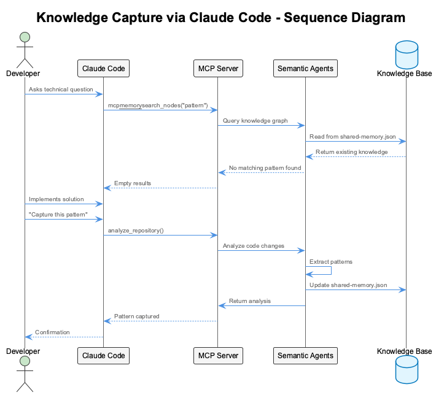
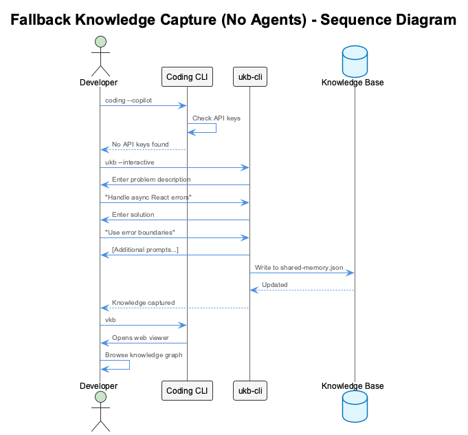

# Use Case: Managing Collective Knowledge Base

## Overview

This use case demonstrates how development teams use the semantic analysis system to capture, manage, and access their collective knowledge base through both Claude Code and GitHub CoPilot integrations.

## Actors

- **Developer** - Uses Claude Code or VSCode with CoPilot
- **Semantic Analysis System** - Multi-agent AI system
- **Knowledge Base** - Persistent storage (shared-memory-*.json files)
- **MCP Memory Service** - Runtime knowledge graph

## Scenarios

### Scenario 1: Knowledge Capture via Claude Code



### Scenario 2: Knowledge Capture via VSCode CoPilot


### Scenario 3: Fallback When Agents Unavailable



## Process Flow

### 1. Knowledge Discovery Flow


### 2. Knowledge Capture Flow


## Key Features

### Real-time Synchronization

1. **Claude Code**: Uses MCP memory service for instant updates
2. **VSCode CoPilot**: WebSocket notifications for live updates
3. **Fallback**: Manual refresh required

### Multi-Source Knowledge

Knowledge comes from multiple sources:

- Code analysis (git commits, file changes)
- Conversation analysis (team discussions, AI interactions)
- Manual entries (developer insights, lessons learned)
- Web research (technical documentation, best practices)

### Knowledge Types

The system captures various types of knowledge:

- **Patterns**: Reusable code patterns and architectures
- **Anti-patterns**: What to avoid and why
- **Insights**: Lessons learned from specific implementations
- **Solutions**: Specific solutions to common problems
- **Context**: When and why to use certain approaches

## Benefits

### For Individual Developers

- Instant access to team knowledge
- Learn from past solutions
- Avoid repeating mistakes
- Discover best practices

### For Teams

- Shared knowledge accumulation
- Consistent coding patterns
- Reduced onboarding time
- Preserved institutional knowledge

### For Organizations

- Knowledge retention across projects
- Standardized practices
- Improved code quality
- Reduced development time

## Implementation Details

### Claude Code Integration

```javascript
// MCP tools available in Claude Code
const tools = [
  'mcp__memory__create_entities',
  'mcp__memory__search_nodes',
  'mcp__semantic-analysis__analyze_repository',
  'mcp__semantic-analysis__analyze_conversation'
];
```

### VSCode CoPilot Integration

```javascript
// HTTP endpoints for CoPilot
const endpoints = {
  knowledge: {
    update: 'POST /api/knowledge/update',
    search: 'GET /api/knowledge/search',
    stats: 'GET /api/knowledge/stats'
  },
  semantic: {
    analyzeRepo: 'POST /api/semantic/analyze-repository',
    analyzeConv: 'POST /api/semantic/analyze-conversation',
    status: 'GET /api/semantic/status'
  }
};
```

### Direct CLI Fallback

```bash
# Direct knowledge management
ukb --interactive              # Capture knowledge
ukb --auto                    # Analyze git commits
vkb                          # View knowledge graph
ukb --migrate                # Upgrade knowledge format
```

## Success Metrics

1. **Knowledge Base Growth**: Entities created per day/week
2. **Knowledge Reuse**: Search queries and hit rate
3. **Pattern Detection**: Automated vs manual captures
4. **Team Adoption**: Active users across tools
5. **Quality Improvement**: Reduced bugs from known patterns
