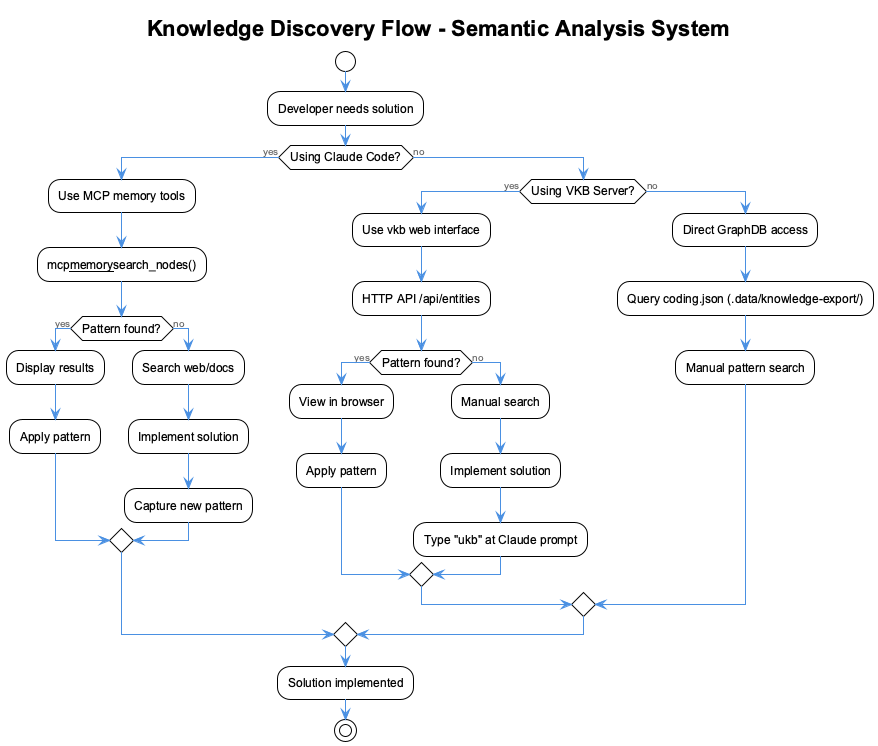
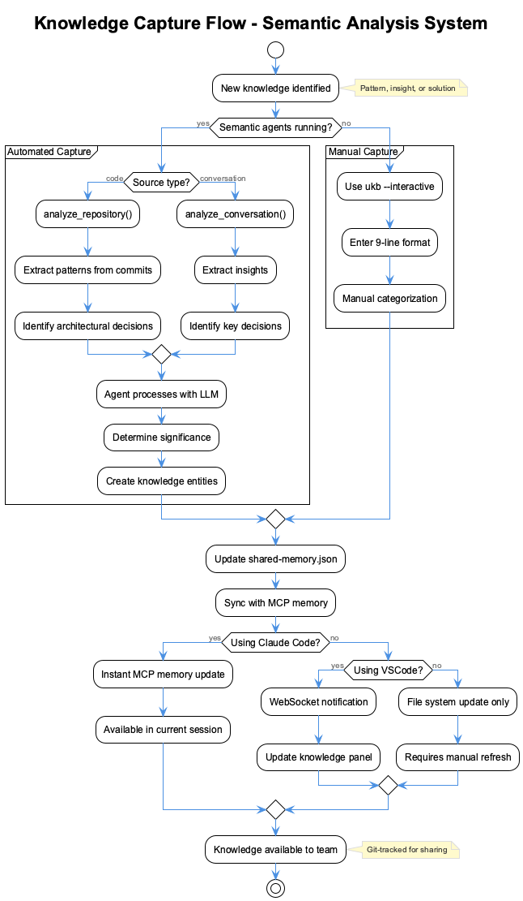

# Use Case: Managing Collective Knowledge Base

## Overview

This use case demonstrates how development teams use the semantic analysis system to capture, manage, and access their collective knowledge base through both Claude Code and GitHub CoPilot integrations.

## Actors

- **Developer** - Uses Claude Code or VSCode with CoPilot
- **Semantic Analysis System** - Multi-agent AI system
- **Knowledge Base** - Persistent storage (shared-memory-*.json files)
- **MCP Memory Service** - Runtime knowledge graph

## Scenarios

### Scenario 1: Knowledge Capture via Claude Code


### Scenario 2: Knowledge Capture via VSCode CoPilot


### Scenario 3: Fallback When Agents Unavailable


## Process Flow

### 1. Knowledge Discovery Flow



### 2. Knowledge Capture Flow



## Key Features

### Real-time Synchronization

1. **Claude Code**: Uses MCP memory service for instant updates
2. **VSCode CoPilot**: WebSocket notifications for live updates
3. **Fallback**: Manual refresh required

### Multi-Source Knowledge

Knowledge comes from multiple sources:

- Code analysis (git commits, file changes)
- Conversation analysis (team discussions, AI interactions)
- Manual entries (developer insights, lessons learned)
- Web research (technical documentation, best practices)

### Knowledge Types

The system captures various types of knowledge:

- **Patterns**: Reusable code patterns and architectures
- **Anti-patterns**: What to avoid and why
- **Insights**: Lessons learned from specific implementations
- **Solutions**: Specific solutions to common problems
- **Context**: When and why to use certain approaches

## Benefits

### For Individual Developers

- Instant access to team knowledge
- Learn from past solutions
- Avoid repeating mistakes
- Discover best practices

### For Teams

- Shared knowledge accumulation
- Consistent coding patterns
- Reduced onboarding time
- Preserved institutional knowledge

### For Organizations

- Knowledge retention across projects
- Standardized practices
- Improved code quality
- Reduced development time

## Implementation Details

### Claude Code Integration

```javascript
// MCP tools available in Claude Code
const tools = [
  'mcp__memory__create_entities',
  'mcp__memory__search_nodes',
  'mcp__semantic-analysis__analyze_repository',
  'mcp__semantic-analysis__analyze_conversation'
];
```

### VSCode CoPilot Integration

```javascript
// HTTP endpoints for CoPilot
const endpoints = {
  knowledge: {
    update: 'POST /api/knowledge/update',
    search: 'GET /api/knowledge/search',
    stats: 'GET /api/knowledge/stats'
  },
  semantic: {
    analyzeRepo: 'POST /api/semantic/analyze-repository',
    analyzeConv: 'POST /api/semantic/analyze-conversation',
    status: 'GET /api/semantic/status'
  }
};
```

### Direct CLI Fallback

```bash
# Direct knowledge management
ukb --interactive              # Capture knowledge
ukb --auto                    # Analyze git commits
vkb                          # View knowledge graph
ukb --migrate                # Upgrade knowledge format
```

## Step-by-Step Examples

### Example 1: Knowledge Capture in Claude Code

**Scenario**: You just implemented a new error handling pattern in React

**Steps:**
1. **Start Claude Code with semantic analysis:**
   ```bash
   claude-mcp
   ```

2. **Analyze your recent implementation:**
   ```
   analyze_repository {
     "repository": ".",
     "depth": 5,
     "significanceThreshold": 6
   }
   ```

3. **Search for similar patterns:**
   ```
   search_knowledge {
     "query": "React error handling",
     "maxResults": 5
   }
   ```

4. **Create a specific pattern entity:**
   ```
   create_knowledge_entity {
     "name": "ReactErrorBoundaryPattern",
     "entityType": "TechnicalPattern",
     "significance": 8,
     "observations": [
       "Use error boundaries to catch React component errors",
       "Implement fallback UI for better user experience",
       "Log errors to monitoring service for debugging"
     ]
   }
   ```

### Example 2: Knowledge Capture in VSCode CoPilot

**Scenario**: You're discussing a complex architectural decision in CoPilot chat

**Steps:**
1. **Start CoPilot with knowledge management:**
   ```bash
   coding --copilot
   ```

2. **During your chat session, capture insights:**
   ```
   @KM ukb "We decided to use Redux for state management because our app has complex nested component state that needs to be shared across multiple route components"
   ```

3. **Search for related patterns:**
   ```
   @KM search "Redux state management patterns"
   ```

4. **View your knowledge graph:**
   ```
   @KM vkb
   ```

5. **Get statistics on your knowledge base:**
   ```
   @KM stats
   ```

### Example 3: Workflow Orchestration

**Scenario**: Comprehensive analysis of a new project

**Claude Code Workflow:**
```
start_workflow {
  "workflowType": "repository-analysis",
  "parameters": {
    "repository": "/path/to/new-project",
    "depth": 20,
    "includeWebSearch": true,
    "technologies": ["React", "Node.js", "PostgreSQL"]
  }
}
```

**Check workflow progress:**
```
get_workflow_status {
  "workflowId": "repo-analysis-abc123"
}
```

**VSCode CoPilot API Workflow:**
```bash
# Via HTTP API
curl -X POST http://localhost:8765/api/semantic/analyze-repository \
  -H "Content-Type: application/json" \
  -d '{
    "repository": "/path/to/new-project",
    "depth": 20,
    "significanceThreshold": 5
  }'
```

### Example 4: Fallback Mode (No API Keys)

**Scenario**: Working without configured API keys

**Steps:**
1. **Direct knowledge entry:**
   ```bash
   ukb --interactive
   ```

2. **Follow the prompts:**
   ```
   Problem: How to handle database connection pooling in Node.js
   Solution: Use connection pooling with pg-pool for PostgreSQL
   Rationale: Prevents connection exhaustion and improves performance
   Key learnings: Pool size should be tuned based on concurrent users
   Applicability: All Node.js applications using PostgreSQL
   Technologies: Node.js,PostgreSQL,pg-pool
   References: https://node-postgres.com/features/pooling
   Files: database/connection.js,config/database.js
   Significance: 7
   ```

3. **View the knowledge graph:**
   ```bash
   vkb
   ```

## Success Metrics

1. **Knowledge Base Growth**: Entities created per day/week
2. **Knowledge Reuse**: Search queries and hit rate
3. **Pattern Detection**: Automated vs manual captures
4. **Team Adoption**: Active users across tools
5. **Quality Improvement**: Reduced bugs from known patterns
