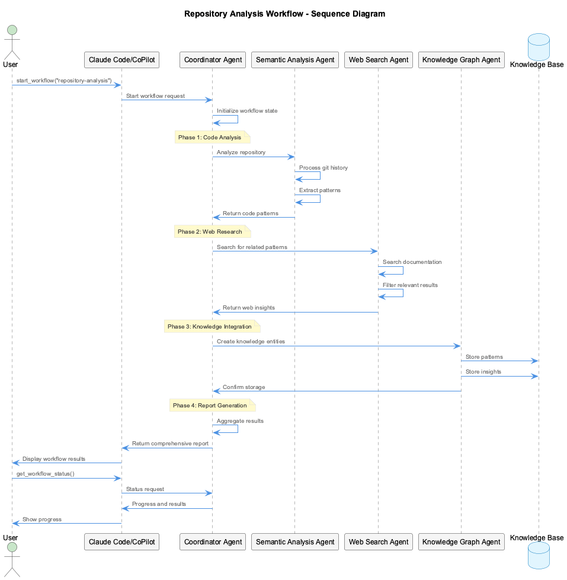
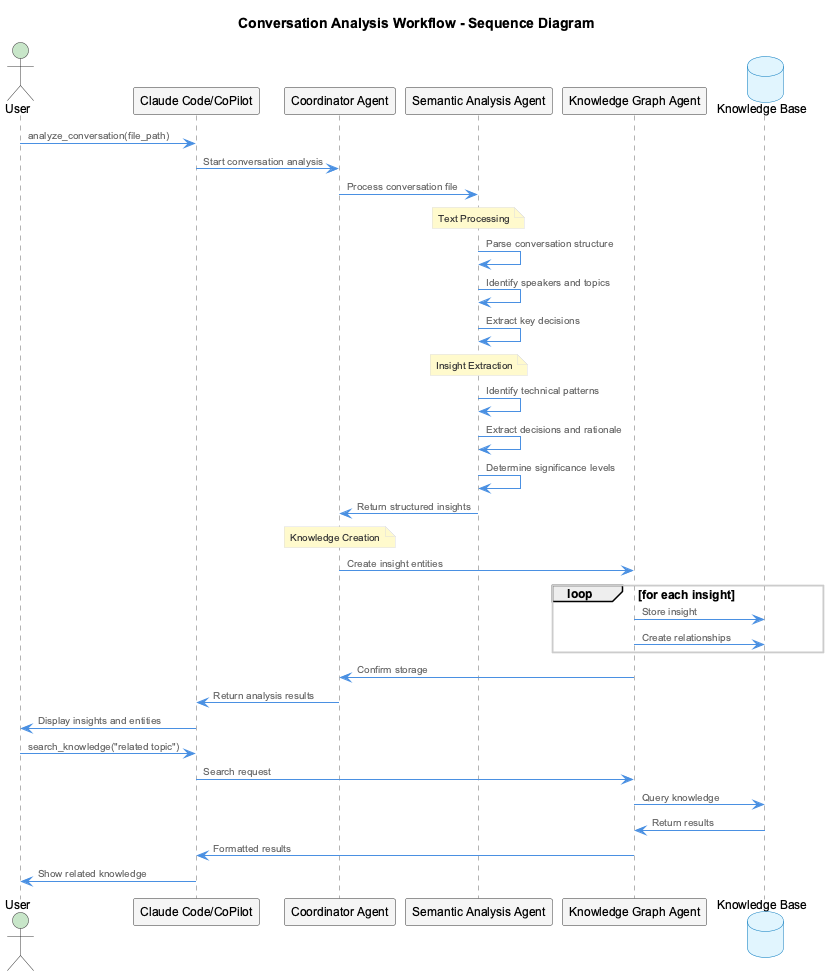
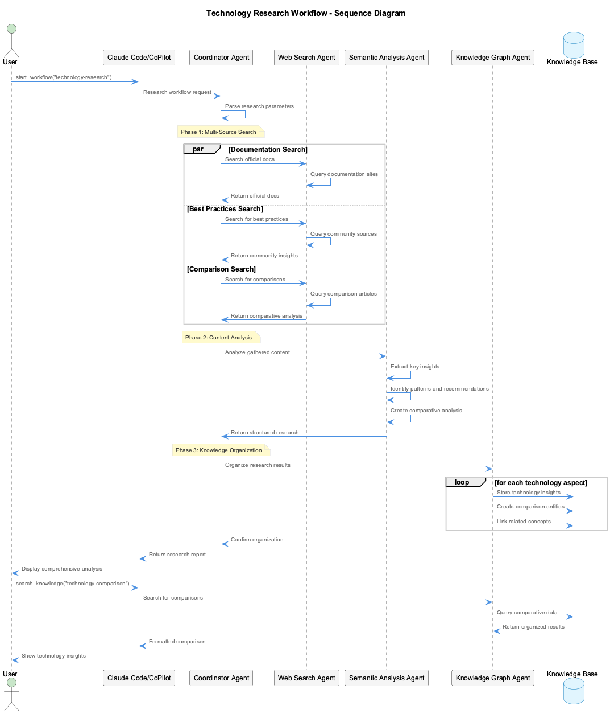

# Use Case: Semantic Analysis Workflows

## Overview

Semantic workflows orchestrate complex analysis tasks across multiple agents and systems. They provide automated, comprehensive analysis capabilities that go beyond single-shot operations.

## What Are Workflows?

Workflows are **predefined sequences of semantic analysis operations** that can:

- Analyze multiple aspects of a project simultaneously
- Coordinate between different types of analysis (code, documentation, web research)
- Provide comprehensive reports with actionable insights
- Run as scheduled tasks for continuous knowledge gathering

## Available Workflow Types

### 1. Repository Analysis Workflow

**Purpose**: Comprehensive analysis of a codebase including patterns, architecture, and best practices.



**What it does**:
1. Analyzes git history and commit patterns
2. Identifies architectural patterns and anti-patterns
3. Searches for relevant documentation and best practices
4. Creates knowledge entities automatically
5. Generates architectural insights report

### 2. Conversation Analysis Workflow

**Purpose**: Extract structured insights from team discussions, code reviews, and documentation.



**What it does**:
1. Processes conversation transcripts or logs
2. Identifies key decisions and rationale
3. Extracts technical patterns and solutions
4. Creates knowledge entities for future reference
5. Links insights to relevant code or documentation

### 3. Technology Research Workflow

**Purpose**: Comprehensive research on specific technologies, frameworks, or approaches.



**What it does**:
1. Searches multiple documentation sources
2. Gathers best practices and common patterns
3. Identifies potential issues and solutions
4. Creates comparative analysis
5. Builds knowledge base of technology insights

## Step-by-Step Examples

### Example 1: Repository Analysis (Claude Code)

**Scenario**: You want to understand the architecture of a new project you inherited

**Steps:**

1. **Start Claude Code:**
   ```bash
   claude-mcp
   ```

2. **Launch repository analysis workflow:**
   ```
   start_workflow {
     "workflowType": "repository-analysis",
     "parameters": {
       "repository": "/path/to/inherited-project",
       "depth": 25,
       "significanceThreshold": 6,
       "includeWebSearch": true,
       "technologies": ["React", "Express", "MongoDB"],
       "focusAreas": ["architecture", "patterns", "testing"]
     }
   }
   ```

3. **Monitor progress:**
   ```
   get_workflow_status {
     "workflowId": "repo-analysis-20241129-001"
   }
   ```

   **Response:**
   ```json
   {
     "id": "repo-analysis-20241129-001",
     "status": "running",
     "progress": 65,
     "currentStep": {
       "name": "Searching for React patterns documentation",
       "phase": "web-research"
     },
     "results": {
       "patternsFound": 12,
       "insightsExtracted": 8,
       "entitiesCreated": 15
     }
   }
   ```

4. **View results when complete:**
   ```
   search_knowledge {
     "query": "architecture patterns inherited-project",
     "entityType": "ArchitecturalPattern",
     "maxResults": 10
   }
   ```

### Example 2: Repository Analysis (VSCode CoPilot)

**Scenario**: Same analysis but using VSCode CoPilot integration

**Steps:**

1. **Start CoPilot with semantic analysis:**
   ```bash
   coding --copilot
   ```

2. **Trigger analysis via HTTP API:**
   ```bash
   curl -X POST http://localhost:8765/api/semantic/analyze-repository \
     -H "Content-Type: application/json" \
     -d '{
       "repository": "/path/to/inherited-project",
       "depth": 25,
       "significanceThreshold": 6,
       "includePatternAnalysis": true,
       "includeWebSearch": true
     }'
   ```

3. **Or use CoPilot chat commands:**
   ```
   @KM analyze repository "/path/to/inherited-project" --depth 25 --focus architecture
   ```

4. **View results:**
   ```
   @KM search "architecture patterns"
   @KM stats
   ```

### Example 3: Technology Research Workflow

**Scenario**: Your team is evaluating GraphQL vs REST for a new API

**Claude Code Approach:**
```
start_workflow {
  "workflowType": "technology-research",
  "parameters": {
    "technology": "GraphQL vs REST",
    "aspects": ["performance", "scalability", "developer-experience", "tooling"],
    "includeComparisons": true,
    "searchDomains": ["docs.", "blog.", "github.com"],
    "maxResults": 20
  }
}
```

**VSCode CoPilot Approach:**
```bash
# Multiple API calls for comprehensive research
curl -X POST http://localhost:8765/api/semantic/search-web \
  -H "Content-Type: application/json" \
  -d '{
    "query": "GraphQL vs REST performance comparison 2024",
    "maxResults": 10,
    "domains": ["docs.", "blog."]
  }'

curl -X POST http://localhost:8765/api/semantic/search-web \
  -H "Content-Type: application/json" \
  -d '{
    "query": "GraphQL scalability best practices",
    "maxResults": 10
  }'
```

### Example 4: Conversation Analysis Workflow

**Scenario**: You had a long architectural discussion and want to capture the insights

**Steps:**

1. **Save the conversation to a file:**
   ```bash
   # conversation.md
   echo "## Architecture Discussion - API Design
   
   **John**: We need to decide between GraphQL and REST for our new API
   **Sarah**: GraphQL gives us better flexibility for mobile clients
   **Mike**: But REST is simpler to cache and has better tooling
   **Sarah**: True, but our mobile team struggles with over-fetching in REST
   **John**: What about performance implications?
   **Mike**: GraphQL has query complexity issues, need rate limiting
   **Decision**: Go with GraphQL but implement query complexity analysis
   " > conversation.md
   ```

2. **Analyze with Claude Code:**
   ```
   analyze_conversation {
     "conversationPath": "./conversation.md",
     "extractInsights": true,
     "updateKnowledge": true,
     "focusAreas": ["decisions", "tradeoffs", "technical-requirements"]
   }
   ```

3. **Or with CoPilot API:**
   ```bash
   curl -X POST http://localhost:8765/api/semantic/analyze-conversation \
     -H "Content-Type: application/json" \
     -d '{
       "conversationPath": "./conversation.md",
       "extractInsights": true
     }'
   ```

## Workflow Benefits

### **Automated Orchestration**
- No need to manually run multiple analysis steps
- Coordinated execution across different agent types
- Automatic error recovery and retry logic

### **Comprehensive Coverage**
- Multiple analysis dimensions in single operation
- Web research integrated with code analysis
- Knowledge graph automatically updated

### **Time Efficiency**
- Background execution doesn't block your work
- Parallel processing across multiple agents
- Results accumulated over time

### **Consistent Results**
- Standardized analysis approaches
- Repeatable processes across projects
- Quality thresholds maintained automatically

## Advanced Workflow Features

### **Scheduled Workflows**
```
schedule_task {
  "taskName": "weekly-pattern-analysis",
  "taskType": "workflow",
  "schedule": {
    "type": "cron",
    "expression": "0 9 * * 1"
  },
  "config": {
    "workflowType": "repository-analysis",
    "parameters": {
      "repository": ".",
      "depth": 10,
      "significanceThreshold": 7
    }
  }
}
```

### **Custom Workflow Parameters**
```
start_workflow {
  "workflowType": "repository-analysis",
  "parameters": {
    "repository": ".",
    "depth": 30,
    "significanceThreshold": 5,
    "includeWebSearch": true,
    "excludePatterns": ["test/**", "node_modules/**"],
    "focusAreas": ["security", "performance", "maintainability"],
    "technologies": ["TypeScript", "React", "Express"],
    "outputFormat": "detailed"
  }
}
```

### **Workflow Chaining**
```
start_workflow {
  "workflowType": "conversation-analysis",
  "parameters": {
    "conversationPath": "./team-discussion.md",
    "followUpWorkflows": [
      {
        "type": "technology-research",
        "triggerOn": "new-technology-mentioned",
        "parameters": {
          "technology": "${mentioned_technology}",
          "aspects": ["documentation", "best-practices"]
        }
      }
    ]
  }
}
```

## When to Use Workflows

### **Use workflows when:**
- ✅ Analyzing large or complex codebases
- ✅ Need comprehensive analysis across multiple dimensions
- ✅ Want to research technologies or approaches thoroughly
- ✅ Have long conversations/documents to process
- ✅ Setting up recurring analysis for teams

### **Use direct commands when:**
- ✅ Quick single-purpose analysis
- ✅ Testing specific functionality
- ✅ Manual knowledge entry
- ✅ Immediate feedback needed

## Troubleshooting Workflows

### **Check workflow status:**
```
get_system_status {}
```

### **View active workflows:**
```
search_knowledge {
  "query": "workflow",
  "entityType": "WorkflowExecution"
}
```

### **Cancel running workflow:**
```bash
# Via API
curl -X DELETE http://localhost:8765/api/workflows/repo-analysis-20241129-001
```

Workflows provide the most powerful and efficient way to leverage the semantic analysis system for comprehensive knowledge gathering and pattern discovery.