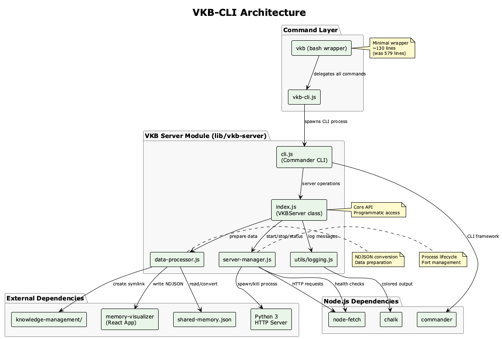

# VKB-CLI Documentation

## Overview

VKB-CLI (View Knowledge Base Command Line Interface) is a modern, cross-platform knowledge visualization server designed for development teams. It provides a stable, programmatic interface for serving interactive knowledge graph visualizations with real-time updates and comprehensive server lifecycle management.

## Documentation Structure

### 📐 [Architecture](./architecture.md)
Comprehensive technical architecture documentation including:
- System architecture diagrams
- Component design and integration
- Server lifecycle management
- Data processing pipeline
- Cross-platform compatibility

### 📚 [API Reference](./api-reference.md)
Complete API documentation covering:
- CLI commands and options
- Programmatic JavaScript API
- Server configuration options
- Health monitoring endpoints

### 🎯 [Use Cases](./use-cases.md)
Real-world scenarios and examples:
- Development workflow integration
- Server management operations
- Programmatic server control
- Team collaboration patterns

### 🔄 [Migration Guide](./migration-guide.md)
Step-by-step guide for migrating from legacy VKB:
- Installation instructions
- Command mapping
- Troubleshooting tips
- Best practices

## Quick Start

### Installation

```bash
# Clone the repository
git clone https://github.com/your-org/coding-tools.git
cd coding-tools

# Install dependencies
./install.sh

# Verify installation
vkb --version
```

### Basic Usage

```bash
# Start visualization server
vkb

# Check server status
vkb status

# View server logs
vkb logs

# Stop server
vkb stop

# Restart server
vkb restart
```

## Key Features

### 🌐 Cross-Platform
- Works on Windows, macOS, and Linux
- No bash dependencies for core functionality
- Pure Node.js server implementation

### 🧩 Modular Architecture
- Clean separation of concerns
- VKBServer class for programmatic control
- Pluggable data processors
- Extensible server management

### 🔍 Real-time Visualization
- Interactive knowledge graph display
- Live data synchronization
- Responsive web interface
- Mobile-friendly design

### 📊 Server Management
- Process lifecycle control
- Port management and conflict resolution
- Health monitoring and recovery
- Comprehensive logging

### 🤝 Team Collaboration
- Multi-user server support
- Session management
- Shared visualization state
- Remote access capabilities

### 🔌 Integration Ready
- Programmatic API
- CI/CD friendly
- Development tool integration
- Knowledge base synchronization

## Architecture Highlights



The system follows a layered architecture:
- **CLI Layer**: User interface and command routing
- **Server Management**: Process control and lifecycle management
- **Data Processing**: Knowledge base preparation and serving
- **Web Interface**: Interactive visualization and user interaction

## Common Workflows

### Starting Development Session

```bash
# Start server with automatic browser opening
vkb start

# Check if server is healthy
vkb status

# View recent activity
vkb logs -n 20
```

### Server Operations

```bash
# Start in foreground for debugging
vkb fg

# Check what's using port 8080
vkb port

# Restart with fresh data
vkb restart
```

### Programmatic Usage

```javascript
// Use as Node.js library
const { VKBServer } = require('vkb-server');

const server = new VKBServer({
  port: 8080,
  projectRoot: '/path/to/project'
});

await server.start();
console.log(`Server available at ${await server.getUrl()}`);
```

## Comparison with Legacy VKB

| Aspect | Legacy VKB | VKB-CLI |
|--------|------------|---------|
| Lines of Code | 579 (monolithic) | ~800 (modular) |
| Platform Support | Linux/macOS | Cross-platform |
| Testing | None | Unit tested |
| Architecture | Procedural bash | Object-oriented JS |
| Process Management | Basic PID tracking | Comprehensive lifecycle |
| Error Handling | Limited | Robust recovery |

## Contributing

We welcome contributions! Areas of focus:
- Server management improvements
- Data processing optimizations
- Visualization enhancements
- Documentation improvements
- Cross-platform compatibility

## Roadmap

### Near Term
- [ ] WebSocket support for live updates
- [ ] Multiple port support
- [ ] Enhanced health monitoring
- [ ] Browser cache management

### Long Term
- [ ] Distributed server support
- [ ] Authentication and authorization
- [ ] API gateway integration
- [ ] Performance analytics dashboard

## Support

- **Issues**: GitHub Issues
- **Discussions**: GitHub Discussions  
- **Documentation**: This directory
- **Examples**: See [use-cases.md](./use-cases.md)

## License

MIT License - see LICENSE file for details.