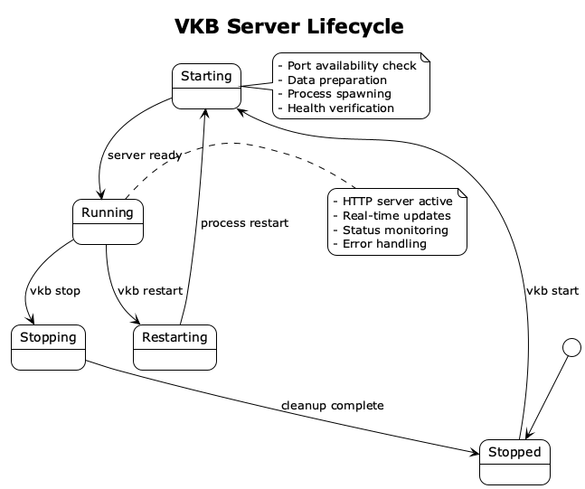

# VKB-CLI Architecture

## Overview

VKB-CLI is a Node.js-based server management system for knowledge base visualization, designed with a modular architecture that provides cross-platform reliability, robust process management, and comprehensive server lifecycle control.

## System Architecture


### High-Level Design

The VKB-CLI system is built on a layered architecture with clear separation of concerns:

1. **Command Layer**: Lightweight bash wrapper maintaining backward compatibility
2. **CLI Layer**: Commander.js-based interface with structured argument parsing
3. **Core Services**: VKBServer class providing programmatic API
4. **Server Manager**: Process lifecycle management and health monitoring
5. **Data Processor**: Memory data preparation and format conversion

## Component Architecture

### Directory Structure

```
vkb-server/
├── package.json          # Node.js dependencies and configuration
├── index.js              # VKBServer class - main API
├── cli.js                # Commander-based CLI interface
├── server-manager.js     # HTTP server lifecycle management
├── data-processor.js     # Memory data preparation and conversion
├── utils/
│   └── logging.js        # Structured logging utilities
└── README.md            # Module documentation
```

### Core Components

#### 1. VKBServer Class (`index.js`)

The central orchestrator providing programmatic control over the visualization server.

**Responsibilities:**
- Server lifecycle management (start, stop, restart)
- Configuration validation and setup
- Health monitoring and status reporting
- Integration with data processing pipeline
- Error handling and recovery

**Key Methods:**
```javascript
class VKBServer {
  async start(options = {})     // Start server with configuration
  async stop()                  // Graceful server shutdown
  async restart(options = {})   // Stop and restart server
  async status()                // Get current server status
  async logs(options = {})      // Retrieve server logs
  async refreshData()           // Reload knowledge base data
}
```

#### 2. CLI Interface (`cli.js`)

Commander.js-based command-line interface providing user-friendly access to VKBServer functionality.

**Features:**
- Structured argument parsing and validation
- Command routing to appropriate server methods
- Error handling with user-friendly messages
- Help system with detailed command documentation

#### 3. Server Manager (`server-manager.js`)

Low-level server process management and monitoring.

**Responsibilities:**
- HTTP server process spawning and control
- PID file management and cleanup
- Port availability checking and conflict resolution
- Process health monitoring and recovery
- Log file management and rotation

#### 4. Data Processor (`data-processor.js`)

Handles knowledge base data preparation and serving.

**Features:**
- Shared-memory.json to NDJSON conversion
- Enhanced observation format support
- Symlink management for file serving
- Data validation and integrity checking
- Asset preparation for visualization

## Server Lifecycle Management



### Startup Sequence

1. **Pre-startup Validation**
   - Environment dependency checking (Node.js, Python 3)
   - Project structure validation
   - Port availability verification
   - Existing process detection

2. **Data Preparation**
   - Knowledge base loading and parsing
   - Format conversion (JSON → NDJSON)
   - Symlink creation for file serving
   - Asset verification and preparation

3. **Server Initialization**
   - HTTP server process spawning
   - PID tracking and management
   - Health verification and monitoring
   - Browser integration (optional)

4. **Runtime Monitoring**
   - Process health checks
   - Log monitoring and rotation
   - Error detection and recovery
   - Resource usage tracking

### Shutdown Sequence

1. **Graceful Termination**
   - Server process signaling (SIGTERM)
   - Connection draining
   - Resource cleanup
   - PID file removal

2. **Forced Cleanup**
   - Process termination (SIGKILL if needed)
   - Port release verification
   - Temporary file cleanup
   - Log file finalization

## Data Flow Architecture

### Input Processing Pipeline

```
shared-memory.json → Data Processor → NDJSON Format → HTTP Server → Browser
                  ↓
            Validation & Conversion
                  ↓
            Symlink Management
                  ↓
            Asset Preparation
```

### Data Transformation Stages

1. **Input Validation**
   - JSON structure verification
   - Schema compliance checking
   - Content integrity validation
   - Error detection and reporting

2. **Format Conversion**
   - Enhanced observation format handling
   - NDJSON line-delimited conversion
   - Entity deduplication and merging
   - Relationship preservation

3. **Asset Management**
   - Knowledge-management directory symlink
   - Static file serving preparation
   - Cache invalidation handling
   - Resource optimization

4. **Output Generation**
   - HTTP response formatting
   - CORS header management
   - Content-type handling
   - Error response standardization

## Cross-Platform Compatibility

### Platform Abstraction

The system handles platform differences through:

1. **Path Resolution**
   - Normalized path handling across OS
   - Environment variable expansion
   - Relative path resolution
   - Directory separator handling

2. **Process Management**
   - Cross-platform PID handling
   - Signal management abstraction
   - Port checking utilities
   - Browser launching strategies

3. **File System Operations**
   - Atomic file operations
   - Permission handling
   - Symlink management
   - Temporary file cleanup

### Platform-Specific Features

#### Windows
- PowerShell integration for process management
- Windows-specific browser launching
- Registry-based configuration options
- File association handling

#### macOS
- LaunchServices integration
- Keychain integration potential
- Spotlight indexing support
- Native notification support

#### Linux
- systemd service integration potential  
- Desktop file management
- Package manager integration
- Distribution-specific optimizations

## Security Considerations

### Process Security

1. **Privilege Separation**
   - Non-root server execution
   - Limited file system access
   - Network binding restrictions
   - Resource usage limits

2. **Input Validation**
   - Command injection prevention
   - Path traversal protection
   - Content sanitization
   - Size limit enforcement

### Network Security

1. **Local Binding**
   - Default localhost-only binding
   - Configurable network interfaces
   - Port access control
   - Connection rate limiting

2. **Data Protection**
   - HTTPS support capability
   - Content security policies
   - Origin validation
   - Request validation

## Performance Optimization

### Server Performance

1. **Process Management**
   - Efficient PID tracking
   - Minimal resource overhead
   - Fast startup/shutdown cycles
   - Memory usage optimization

2. **Data Processing**
   - Streaming JSON processing
   - Incremental data updates
   - Caching strategies
   - Lazy loading implementation

### Client Performance

1. **Asset Serving**
   - Static file optimization
   - Compression support
   - Cache header management
   - CDN integration readiness

2. **Data Transfer**
   - Efficient serialization
   - Delta update support
   - Progressive loading
   - Bandwidth optimization

## Error Handling and Recovery

### Error Classification

1. **Startup Errors**
   - Dependency missing
   - Port conflicts
   - Permission issues
   - Configuration problems

2. **Runtime Errors**
   - Process crashes
   - Data corruption
   - Network issues
   - Resource exhaustion

### Recovery Strategies

1. **Automatic Recovery**
   - Process restart on crash
   - Port conflict resolution
   - Data reload on corruption
   - Service degradation handling

2. **Manual Recovery**
   - Clear error messaging
   - Recovery suggestions
   - Diagnostic information
   - Support contact guidance

## Integration Points

### Knowledge Base Integration

- **UKB-CLI Compatibility**: Seamless integration with ukb-generated data
- **Format Support**: Both legacy and enhanced observation formats
- **Real-time Updates**: Dynamic data refresh capabilities
- **Version Compatibility**: Backward and forward compatibility

### Development Tool Integration

- **IDE Support**: VS Code extension integration potential
- **CI/CD Integration**: Headless operation support
- **API Access**: RESTful endpoints for external tools
- **Webhook Support**: Event-driven integrations

### External System Integration

- **Authentication**: External auth provider support
- **Analytics**: Usage tracking and metrics
- **Monitoring**: Health check endpoints
- **Alerting**: Error notification systems

## Future Architecture Enhancements

### Version 2.0 Plans

1. **Microservice Architecture**
   - Service decomposition
   - API gateway integration
   - Load balancing support
   - Distributed deployment

2. **Real-time Features**
   - WebSocket integration
   - Live collaboration
   - Event streaming
   - Push notifications

3. **Scalability Improvements**
   - Horizontal scaling support
   - Database integration
   - Caching layers
   - Performance monitoring

### Long-term Vision

1. **Cloud-Native Architecture**
   - Container orchestration
   - Service mesh integration
   - Auto-scaling capabilities
   - Multi-tenant support

2. **Advanced Analytics**
   - Usage analytics
   - Performance metrics
   - User behavior tracking
   - Predictive insights

This architecture provides a solid foundation for reliable, scalable knowledge visualization while maintaining simplicity and ease of use for development teams.