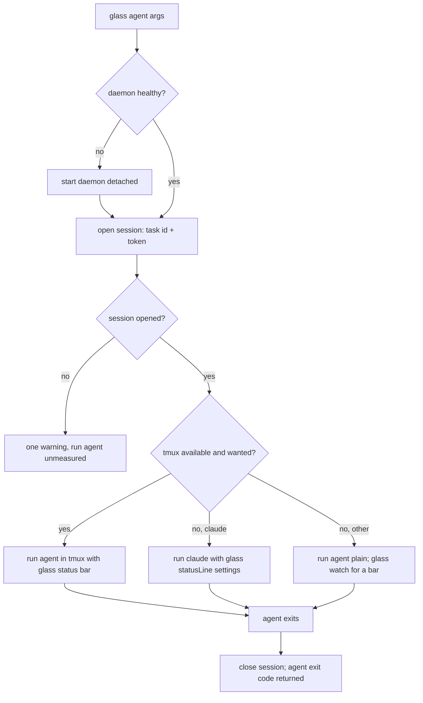
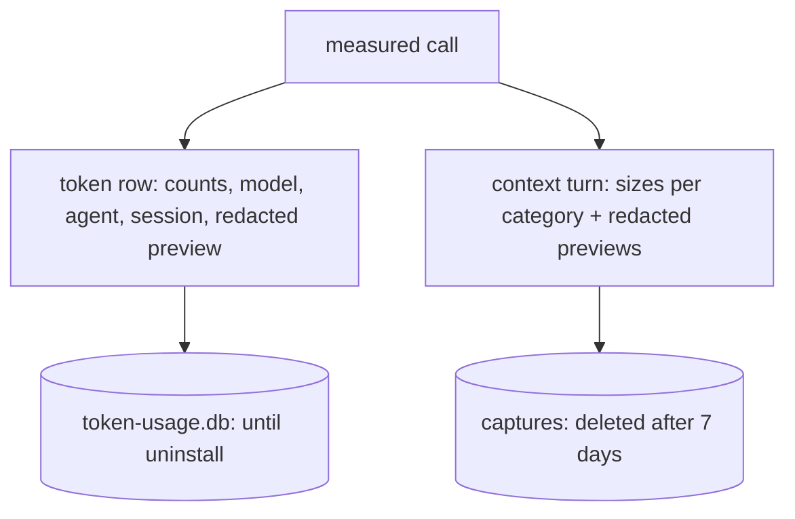

## Components

| Component | Role |
|---|---|
| `glass` CLI | Starts the daemon if needed, opens a measurement session, starts the agent with session-scoped environment variables, closes the session when the agent exits |
| Daemon | One Node.js process on 127.0.0.1 (default port 12445): forwarding, interception, measurement, the read API, the UI, the retention timer. Stops after 30 minutes idle |
| Anthropic forward | Receives Claude Code's `/v1/messages` calls (base URL) and forwards them to api.anthropic.com or the base URL you had set |
| Interception | Answers `CONNECT` for the model hosts with a certificate from the glass CA, reads the call, forwards it; every other host is a blind tunnel |
| Measurement | Reads usage from the response (streamed or not), writes one token row per call and a redacted context capture per turn, bound to the session |
| Read API + UI | Serves `/api/token-usage/*`, `/api/context-turns`, `/api/statusline` and the dashboards (`glass ui`) |
| `~/.glass` | Token database (SQLite), context captures, the CA, the log |

## A measured call, step by step

1. `glass copilot` makes sure the daemon runs and opens a session: the daemon returns a
   task id and a session token.
2. glass starts copilot with `HTTPS_PROXY=http://glass:<token>@127.0.0.1:12445` and
   `NODE_EXTRA_CA_CERTS=~/.glass/ca/ca.pem`.
3. copilot connects through the daemon. The token in `Proxy-Authorization` tells the
   daemon which session the call belongs to — concurrent sessions do not mix.
4. For a model host, the daemon completes the TLS handshake with a leaf certificate signed
   by the glass CA, reads the request, and sends it to the real host over a new, verified
   TLS connection — through your corporate proxy if you have one.
5. The response streams back unchanged. The daemon records the usage and the context
   composition.
6. When copilot exits, glass closes the session.

Claude Code skips steps 3–4: its base URL points at the daemon over plain HTTP on
127.0.0.1, so nothing needs to be decrypted.

## Session lifecycle

glass never blocks your agent: if the daemon cannot start, the agent runs unmeasured
after one warning line.

## What is stored, and for how long

Details: [Privacy & Data](privacy.md).

## Where glass comes from

glass is generated from two source repositories by an extraction script — it is not a
hand-maintained fork:

The measurement code is shared with the `coding` development environment and the
`rapid-llm-proxy`; glass adds the CLI, the daemon and a reduced UI.
[Development & Releases](development.md) describes the pipeline.
