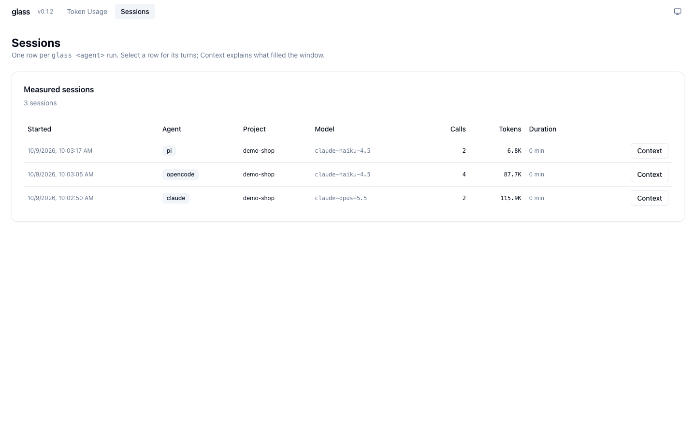

# Comparing Runs (A/B)

Run the same task with two agents, two models or two configurations, and compare what
each cost and how it used its context.

=== "⚡ Quick (~3 min)"

    ## Same task, two runs

    ```sh
    P="Read cart.js and cart.test.js, run 'node cart.test.js', and suggest one improvement."
    glass claude -p "$P"
    glass opencode run --model github-copilot/claude-haiku-4.5 "$P"
    ```

    Then `glass ui` → **Sessions**: both runs side by side — calls, tokens, model — and
    **Context** on each row for the window and cache comparison.

    

    glass has no automated experiment runner; you start the runs, glass measures them.

=== "📚 Deep Dive (full)"

    --8<-- "_tiers/comparing-runs.deep.md"
