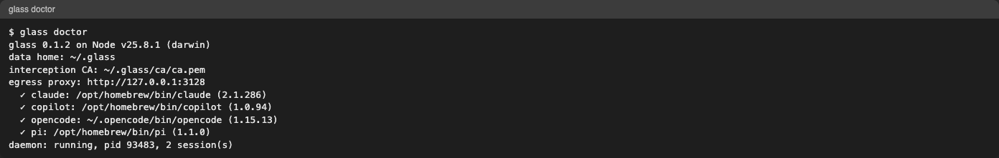

# Getting Started

Install glass from the release tarball, check the setup, run your first measured session.

=== "⚡ Quick (~3 min)"

    ## Install in three commands

    Needs Node.js ≥ 22.13 and read access to
    [AIMAAD/glass](https://bmw.ghe.com/AIMAAD/glass).

    ```sh
    gh release download --repo bmw.ghe.com/AIMAAD/glass --pattern 'glass-*.tgz'
    npm install -g ./glass-*.tgz
    glass doctor
    ```

    

    Then run an agent through glass — `glass claude`, `glass copilot`, `glass opencode`,
    `glass pi` — and open `glass ui`.

    **Update:** `glass update` (`--check` only reports a newer release).

    **Remove it again:** `glass uninstall` then `npm rm -g glass`.

=== "📚 Deep Dive (full)"

    --8<-- "_tiers/getting-started.deep.md"
