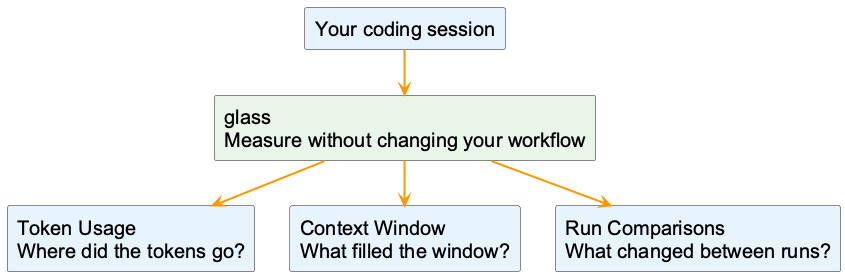
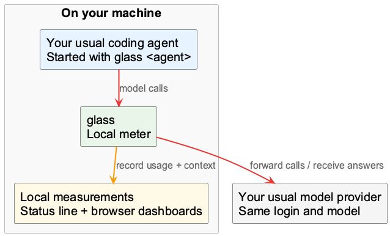
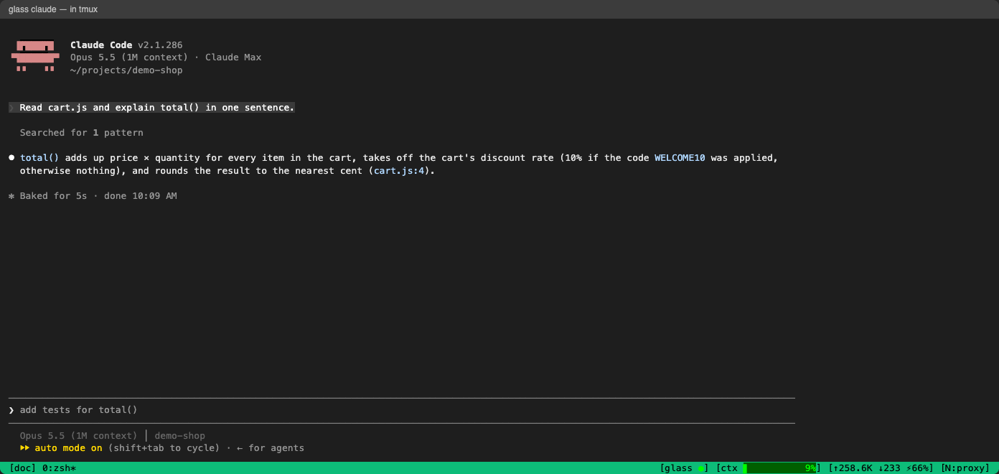
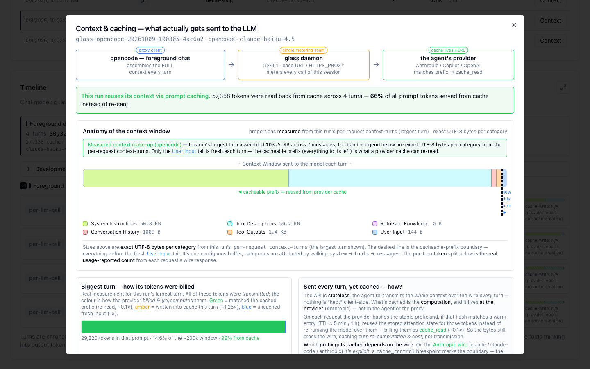

<div class="glass-overview" id="glass-overview" role="region" aria-label="Glass overview presentation" markdown="1">

<div class="overview-toolbar" hidden>
  <span class="overview-label">glass / in seven slides</span>
  <span class="overview-counter" role="status" aria-live="polite" aria-atomic="true"></span>
  <button type="button" data-fullscreen>Fullscreen</button>
</div>

<div class="overview-stage" markdown="1">

<section class="overview-slide overview-cover" id="slide-1" aria-labelledby="overview-title" markdown="1">
<div class="overview-copy" markdown="1">

<p class="overview-kicker">Your agent, made visible</p>

# See where your agent's tokens go {#overview-title}

Your coding agent does the work. **glass shows what it took**: tokens, model calls,
and what filled the context window.

<div class="overview-benefits" markdown="1">

**Measure**  
Which agent and model used the tokens?

**Understand**  
What's taking up the context window?

**Compare**  
Did a different setup need fewer tokens?

</div>

Use the agent you already know: **Copilot CLI, Claude Code, OpenCode or pi**.

</div>
<figure class="overview-figure" markdown="1">



<figcaption>One measured run. Three ways to understand it.</figcaption>
</figure>
<p class="overview-takeaway">Keep your workflow. Add visibility.</p>
</section>

<section class="overview-slide" id="slide-2" aria-labelledby="overview-flow" markdown="1">
<div class="overview-copy" markdown="1">

<p class="overview-kicker">How it works</p>

## A local meter, not another agent {#overview-flow}

Put `glass` in front of your normal agent command.

```sh
glass copilot
```

glass starts a local background service, measures the model calls, and shows the
results in your terminal and browser.

**Same agent. Same login. Same model provider.** Wiring applies to this run only,
not to your system settings.

Measurements stay on your machine. Your model requests still go to the provider
you already use.

</div>
<figure class="overview-figure" markdown="1">



<figcaption>glass measures the traffic; it does not choose your model or do the task.</figcaption>
</figure>
<p class="overview-takeaway" markdown="1">
Default measurement uses local TLS interception for Copilot CLI, OpenCode and pi.
If policy disallows it, use `--no-intercept` for fewer details.
[Privacy & data](privacy.md)
</p>
</section>

<section class="overview-slide" id="slide-3" aria-labelledby="overview-start" markdown="1">
<div class="overview-copy" markdown="1">

<p class="overview-kicker">Your first run</p>

## Install. Prefix. Work as usual. {#overview-start}

Needs **Node.js 22.13+**, a supported agent already logged in, and access to the
Glass repository. Copilot CLI needs **1.0.93+**.

```sh
gh release download --repo bmw.ghe.com/AIMAAD/glass --pattern 'glass-*.tgz'
npm install -g ./glass-*.tgz
glass doctor
```

Then, from your project:

```sh
glass copilot           # or claude, opencode, pi
glass ui                # in another terminal
```

`glass doctor` tells you what to fix if your setup isn't ready.

</div>
<figure class="overview-figure" markdown="1">

[](images/terminal-statusline-tmux.png){: target="_blank" rel="noopener" title="Open full-size screenshot" }

<figcaption>The status bar gives live context and token counts. With tmux, click a field for details. Without it, use <code>glass watch</code> in a split pane; Claude Code also has its own status line.</figcaption>
</figure>
<p class="overview-takeaway" markdown="1">
No Docker or build tools. [Installation and platform details](getting-started.md)
</p>
</section>

<section class="overview-slide" id="slide-4" aria-labelledby="overview-tokens" markdown="1">
<div class="overview-copy" markdown="1">

<p class="overview-kicker">Question 1 / Where did the tokens go?</p>

## Start with the big picture {#overview-tokens}

Run `glass ui` and open **Token Usage**.

**Overview**  
See usage by agent, provider and model. A larger area means more tokens.

**Evolution**  
See when usage grew over time.

**Recent Calls**  
Find individual calls, their tokens and latency.

Pick a time range to focus on the work you want to understand.

</div>
<figure class="overview-figure" markdown="1">

[](images/ui-token-usage-overview.png){: target="_blank" rel="noopener" title="Open full-size screenshot" }

<figcaption>Example runs, not a benchmark. Input, output and cached tokens are counted separately.</figcaption>
</figure>
<p class="overview-takeaway" markdown="1">
Find the biggest token consumer before changing your setup. Token totals are not a bill.
[Explore Token Usage](token-usage.md)
</p>
</section>

<section class="overview-slide" id="slide-5" aria-labelledby="overview-evolution" markdown="1">
<div class="overview-copy" markdown="1">

<p class="overview-kicker">Question 1 / When did the tokens go?</p>

## Then follow usage over time {#overview-evolution}

Open the **Evolution** tab in **Token Usage**.

The chart splits the time range into short buckets, **stacked by model, agent or
provider**. Hover a bucket for its numbers.

Below the chart, **Top Consumers** ranks the models of the time range by tokens,
with their calls and latency.

Drag the brush under the chart to zoom into one stretch of work.

</div>
<figure class="overview-figure" markdown="1">

[](images/ui-token-usage-evolution.png){: target="_blank" rel="noopener" title="Open full-size screenshot" }

<figcaption>Example runs on one machine, not a benchmark. Each peak is a session; the table shows each model's share of the time range.</figcaption>
</figure>
<p class="overview-takeaway" markdown="1">
Spot the spike, then open the session behind it in **Sessions**.
[Explore Token Usage](token-usage.md)
</p>
</section>

<section class="overview-slide" id="slide-6" aria-labelledby="overview-context" markdown="1">
<div class="overview-copy" markdown="1">

<p class="overview-kicker">Question 2 / Why is the context so large?</p>

## See what the model actually received {#overview-context}

In **Sessions**, click **Context** on a run.

The explainer separates **system instructions, tool descriptions, conversation
history, tool output and your input**.

It also shows how much input the **provider's prompt cache** served.
Caching avoids repeated computation, not sending the context.

Need to follow a spike? Click a session row for its timeline, then a turn for
its detail.

</div>
<figure class="overview-figure" markdown="1">

[](images/ui-context-explainer.png){: target="_blank" rel="noopener" title="Open full-size screenshot" }

<figcaption>In this example, instructions and tools take most of the space. The composition bar measures bytes; token usage comes from provider reports.</figcaption>
</figure>
<p class="overview-takeaway" markdown="1">
Don't assume your last prompt filled the window. Look at the whole context.
[Explore Context Window](context-window.md)
</p>
</section>

<section class="overview-slide" id="slide-7" aria-labelledby="overview-compare" markdown="1">
<div class="overview-copy" markdown="1">

<p class="overview-kicker">Question 3 / Which setup fits my task?</p>

## Same task. Two runs. Better evidence. {#overview-compare}

Try the same task from the same starting code with two agents, models or
configurations.

```sh
glass copilot -p "Explain total() in cart.js."
glass claude -p "Explain total() in cart.js."
```

In **Sessions**, compare **calls, tokens and model**. Open **Context** on each
run to understand the difference.

Judge the answer too: fewer tokens don't automatically mean a better result.
**You run the comparison; glass measures it.**

</div>
<figure class="overview-figure" markdown="1">

[](images/ui-sessions.png){: target="_blank" rel="noopener" title="Open full-size screenshot" }

<figcaption>One row per measured run. The sample rows show the UI, not an agent ranking.</figcaption>
</figure>
<p class="overview-takeaway" markdown="1">
Try it on your next real task: `glass <agent>`, then `glass ui`.
[Get started](getting-started.md) · [Compare runs](comparing-runs.md)
</p>
</section>

</div>

<nav class="overview-controls" aria-label="Presentation controls" hidden>
  <button type="button" data-prev>Previous</button>
  <div class="overview-dots" aria-label="Choose a slide"></div>
  <button type="button" data-next>Next</button>
  <span class="overview-help">Arrow keys to navigate / F for fullscreen</span>
</nav>
<p class="overview-message" role="status" aria-live="polite"></p>

</div>
