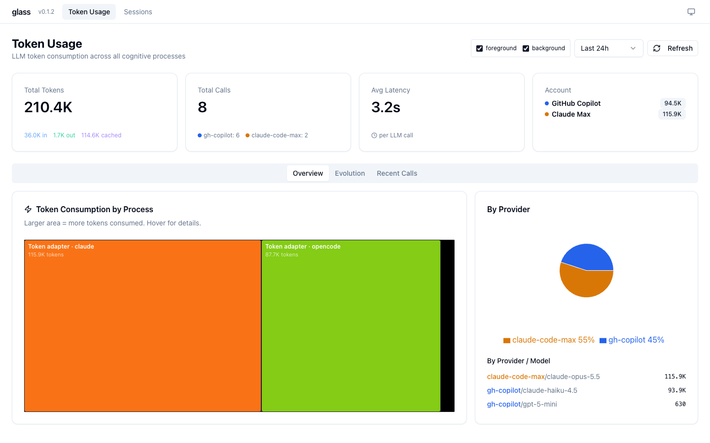
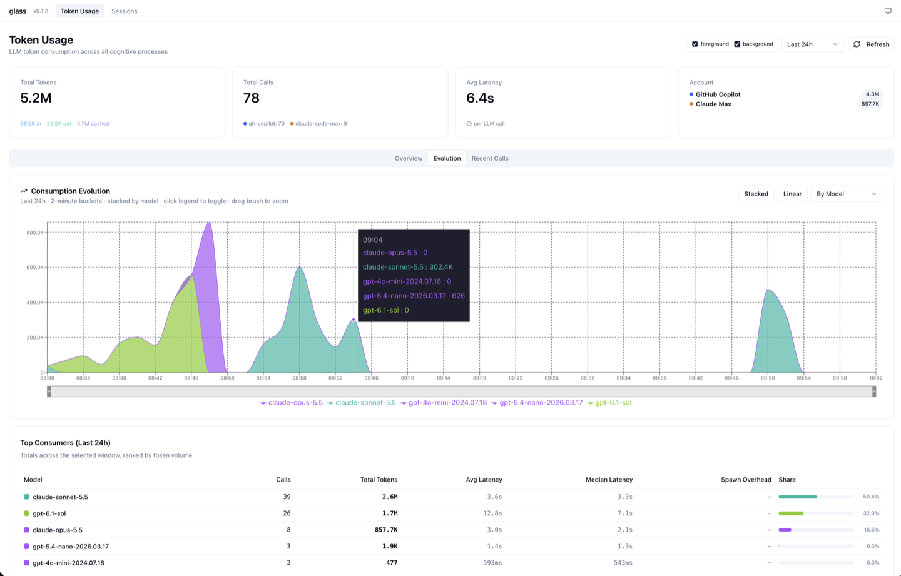

# Token Usage

How many tokens your agents used — totals, trends and every single call.

=== "⚡ Quick (~3 min)"

    ## Where the tokens went

    Open `glass ui` → **Token Usage**. The cards show total tokens (fresh input, output,
    cached), number of calls, average latency and the split per account (GitHub Copilot,
    Claude Max, OpenAI). Three tabs below:

    | Tab | Answers |
    |---|---|
    | Overview | Which agent and which model used the most? |
    | Evolution | When did usage happen, and how did it grow? |
    | Recent Calls | What exactly did each call cost? |

    

    

    Use the time range (top right) to look further back. **Next:** what filled those
    tokens — [Context Window](context-window.md).

=== "📚 Deep Dive (full)"

    --8<-- "_tiers/token-usage.deep.md"
