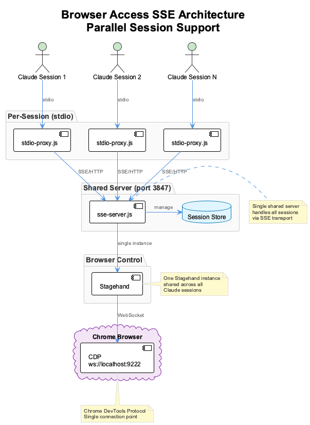

# Browser Access MCP Server for Claude Code

A customized Model Context Protocol (MCP) server that provides AI-powered web automation capabilities using [Stagehand](https://github.com/browserbase/stagehand), configured specifically for Claude Code and Anthropic's Claude models. This server enables Claude to interact with web pages, perform actions, extract data, and observe possible actions in a real browser environment.

## Architecture

The browser-access server uses a **shared SSE architecture** to support multiple parallel Claude Code sessions without conflicts:



### Key Components

| Component | Description | Transport |
|-----------|-------------|-----------|
| `stdio-proxy.js` | Lightweight proxy spawned per Claude session | stdio (to Claude) |
| `sse-server.js` | Shared server managing all sessions | SSE/HTTP (port 3847) |
| Stagehand | Browser automation library | Single shared instance |
| Chrome CDP | Chrome DevTools Protocol | WebSocket (port 9222) |

### Why SSE Architecture?

When multiple Claude Code sessions run simultaneously, each would normally spawn its own MCP server process. This caused conflicts because:

1. Multiple processes competed for the same Chrome DevTools Protocol connection
2. One session connecting could disrupt another session's browser control
3. The browser-access server would show as "failed" in subsequent sessions

The SSE architecture solves this by:

- Running a **single shared server** that all sessions connect to
- Using lightweight **stdio proxies** that Claude Code spawns
- Maintaining **one Stagehand instance** shared across all sessions

## Quick Setup

### Automatic (Recommended)

The `coding` launcher automatically starts the browser-access SSE server:

```bash
# Just use the coding command - it handles everything
coding --claude
```

### Manual Setup

1. **Build the server**:
   ```bash
   npm install && npm run build
   ```

2. **Start the SSE server** (run once, shared across all sessions):
   ```bash
   ./browser-access-server start
   ```

3. **Verify server is running**:
   ```bash
   curl http://localhost:3847/health
   # Returns: { "status": "ok", "sessions": 0, ... }
   ```

4. **Start Chrome in debug mode**:
   ```bash
   browser  # or ./start-chrome-debug.sh
   ```

5. **Start Claude Code** - the proxy will connect to the shared server

## Server Management

The `browser-access-server` script manages the shared SSE server:

```bash
./browser-access-server start    # Start the server (if not running)
./browser-access-server stop     # Stop the server
./browser-access-server status   # Check server status and health
./browser-access-server restart  # Restart the server
```

### Health Check

```bash
curl http://localhost:3847/health
```

Response:
```json
{
  "status": "ok",
  "sessions": 2,
  "stagehandInitialized": true,
  "uptime": 3600.5
}
```

## Environment Variables

| Variable | Description | Default |
|----------|-------------|---------|
| `BROWSER_ACCESS_PORT` | SSE server port | `3847` |
| `BROWSER_ACCESS_SSE_URL` | SSE server URL (for proxy) | `http://localhost:3847` |
| `LOCAL_CDP_URL` | Chrome DevTools Protocol URL | `ws://localhost:9222` |
| `ANTHROPIC_API_KEY` | Anthropic API key for Stagehand | Required |
| `BROWSERBASE_API_KEY` | Browserbase cloud API key | Optional |
| `BROWSERBASE_PROJECT_ID` | Browserbase project ID | Optional |

## Browser Setup Options

### Option 1: Local Browser (Recommended for development)

Start Chrome with debugging enabled using the provided script:
```bash
# Global command (available anywhere):
browser                    # Start Chrome in debug mode
browser google.com         # Start Chrome and navigate to Google

# Or run directly:
./start-chrome-debug.sh    # Start Chrome in debug mode
./start-chrome-debug.sh https://example.com  # Start and navigate to URL
```

### Option 2: Browserbase Cloud

Sign up at [Browserbase](https://www.browserbase.com/) and get your API key and project ID:
```bash
export BROWSERBASE_API_KEY="your-api-key"
export BROWSERBASE_PROJECT_ID="your-project-id"
```

## MCP Configuration

The server is configured in `~/.claude.json` to use the proxy:

```json
{
  "mcpServers": {
    "browser-access": {
      "command": "node",
      "args": ["/path/to/browser-access/dist/stdio-proxy.js"],
      "env": {
        "BROWSER_ACCESS_SSE_URL": "http://localhost:3847"
      }
    }
  }
}
```

## Available Tools

In Claude Code CLI, the tools are prefixed with `mcp__browser-access__`:

| Tool | Description |
|------|-------------|
| `stagehand_navigate` | Navigate to URLs |
| `stagehand_act` | Perform actions (click, type, etc.) |
| `stagehand_extract` | Extract data from web pages |
| `stagehand_observe` | Get page information and possible actions |
| `screenshot` | Take screenshots of the current page |

## Usage Examples

Once integrated with Claude Code, you can use natural language commands like:

- "Take a screenshot of google.com"
- "Navigate to example.com and click the login button"
- "Extract all the product names from this e-commerce page"
- "Fill out the contact form with my information"

## Workflow

1. **Start Chrome**: `browser` (or `browser <url>`)
2. **Start Claude Code**: `coding --claude` (auto-starts SSE server)
3. **Use browser automation** with natural language commands
4. **Stop Chrome**: `pkill -f 'remote-debugging-port=9222'`

## Docker Deployment

Browser-access is designed for containerized deployment as part of the coding infrastructure Docker setup.

### Container Configuration

In Docker mode, the browser-access SSE server runs inside the `coding-services` container:

```yaml
# docker-compose.yml excerpt
coding-services:
  ports:
    - "3847:3847"  # Browser-access SSE
  environment:
    - BROWSER_ACCESS_PORT=3847
```

### Port Mapping

| Port | Service | Description |
|------|---------|-------------|
| 3847 | SSE Server | Browser automation MCP server |
| 9222 | Chrome CDP | Chrome DevTools Protocol (external) |

### Health Check

```bash
curl http://localhost:3847/health
# {"status":"ok","sessions":0,"stagehandInitialized":false}
```

### Shared Browser Instance

In Docker mode, browser-access is particularly valuable because:
- **Single SSE server** serves multiple parallel Claude sessions
- **Shared Stagehand instance** avoids CDP conflicts
- **Persistent server** survives individual session restarts

See the parent [Docker Deployment Guide](../../docker/README.md) for full containerization setup.

## Troubleshooting

### Server shows as "failed" in MCP list

1. Check if SSE server is running: `./browser-access-server status`
2. Start it if not running: `./browser-access-server start`
3. Restart Claude Code to reconnect

### Multiple sessions conflict

This should not happen with the SSE architecture. If it does:
1. Stop all browser-access processes: `pkill -f browser-access`
2. Restart the SSE server: `./browser-access-server restart`
3. Restart Claude Code sessions

### Browser connection issues

1. Ensure Chrome is running with debug port: `browser`
2. Check CDP port: `lsof -i :9222`
3. Verify SSE server health: `curl http://localhost:3847/health`

### Build Issues

```bash
npm install
npm run build
```

## Development

### Project Structure

```
browser-access/
├── src/
│   ├── index.ts          # Original stdio server (legacy)
│   ├── sse-server.ts     # Shared SSE server
│   ├── stdio-proxy.ts    # Per-session stdio proxy
│   ├── server.ts         # MCP server implementation
│   ├── tools.ts          # Tool definitions
│   └── ...
├── dist/                 # Compiled JavaScript
├── docs/
│   ├── puml/            # PlantUML source files
│   └── images/          # Generated diagrams
├── logs/                # Server logs
├── browser-access-server # Server management script
└── package.json
```

### Building

```bash
npm run build    # Compile TypeScript
npm run watch    # Watch mode for development
```

### Testing

```bash
# Test SSE server health
curl http://localhost:3847/health

# Test proxy connection
BROWSER_ACCESS_SSE_URL=http://localhost:3847 node dist/stdio-proxy.js
```

## Ports Used

| Port | Service | Description |
|------|---------|-------------|
| 3847 | SSE Server | Browser-access shared MCP server |
| 9222 | Chrome CDP | Chrome DevTools Protocol |

## Credits

Based on the original Stagehand MCP server by Browserbase, modified for Claude Code integration with SSE architecture for parallel session support.
