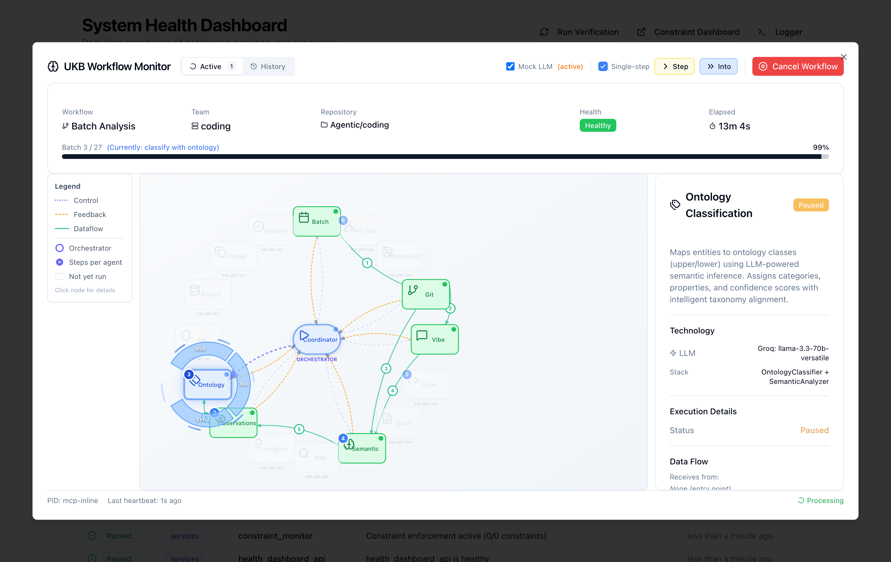

# System Health Dashboard

Real-time monitoring dashboard for system-level health checks including databases, services, processes, and LLM API quota monitoring.

## Architecture

- **Frontend**: Next.js 15.5.4 + React 19 + Redux Toolkit (MVI pattern)
- **Backend**: Express.js API server
- **Ports**:
  - Dashboard: 3032 (Next.js)
  - API: 3033 (Express)

## Features

- **Pre-Prompt Health Verification**: Automatic health check on every Claude prompt (via UserPromptSubmit hook)
- **Self-Monitoring**: Health API server monitors itself and auto-heals if down
- **Click-to-Restart Services**: One-click service restart buttons in the dashboard (NEW!)
- **Fast Health Detection**: 15-second verification interval for quick issue detection (improved from 60s)
- Real-time health monitoring (5s dashboard refresh)
- **4-Card Monitoring System**:
  - **Databases**: LevelDB, Qdrant
  - **Services**: VKB, Constraint Monitor, Dashboard, Health API
  - **Processes**: Stale PIDs, zombies, Process Registry (PSM)
  - **API Quota**: LLM provider usage (Groq, Google Gemini, Anthropic, OpenAI, X.AI)
- Auto-healing status and history
- Manual verification trigger
- Detailed violation reports with actionable restart buttons
- System recommendations
- Staleness detection (triggers verification if data >5 minutes old)

## Quick Start

### Development

```bash
# Install dependencies
pnpm install

# Start API server (port 3033)
node server.js

# Start dashboard (port 3032) - in another terminal
pnpm dev
```

### Production

```bash
# Build dashboard
pnpm build

# Start both services
node server.js & pnpm start
```

## Environment Variables

All ports are configured in `../../.env.ports`:

- `SYSTEM_HEALTH_DASHBOARD_PORT` - Dashboard frontend port (default: 3032)
- `SYSTEM_HEALTH_API_PORT` - API backend port (default: 3033)

## API Endpoints

### GET `/api/health-verifier/status`
Returns current health verification status

```json
{
  "status": "success",
  "data": {
    "overallStatus": "degraded",
    "violationCount": 1,
    "criticalCount": 0,
    "lastUpdate": "2025-11-08T13:00:00.000Z",
    "autoHealingActive": false,
    "status": "operational",
    "ageMs": 5234
  }
}
```

### GET `/api/health-verifier/report`
Returns detailed health verification report with all checks and violations

### GET `/api/health-verifier/api-quota`
Returns LLM provider API quota information

```json
{
  "status": "success",
  "data": {
    "providers": [
      {
        "provider": "groq",
        "name": "Groq",
        "abbrev": "Gq",
        "status": "healthy",
        "quota": {
          "remaining": 95,
          "used": "N/A",
          "limit": "7.2M tokens/day, 14.4K RPM",
          "unit": "requests"
        },
        "cost": null,
        "rateLimit": {
          "requestsPerMinute": 14400,
          "tokensPerDay": 7200000
        },
        "lastChecked": "2025-11-25T10:00:00.000Z",
        "cacheStrategy": "estimated"
      }
    ],
    "lastUpdate": "2025-11-25T10:00:00.000Z"
  }
}
```

### POST `/api/health-verifier/verify`
Triggers a manual health verification run

### POST `/api/health-verifier/restart-service`
Restarts a failed service with one click from the dashboard

**Request Body:**
```json
{
  "serviceName": "vkb_server",
  "action": "restart"
}
```

**Response:**
```json
{
  "status": "success",
  "message": "Service restart initiated: vkb_server",
  "data": {
    "service": "vkb_server",
    "action": "restart",
    "triggered_at": "2025-11-16T06:47:00.000Z",
    "note": "Health verification will run automatically to confirm service status"
  }
}
```

**Supported Services:**
- `vkb_server` - VKB visualization server (port 8080)
- `constraint_monitor` - Constraint monitor dashboard (port 3031)
- `dashboard_server` - System health dashboard (port 3030)

**Features:**
- ✅ **One-Click Restart**: Click the "Restart" button on any service error in the violations table
- ✅ **Visual Feedback**: Spinning icon during restart, success/error messages
- ✅ **Auto-Verification**: Health check runs automatically after restart (15s interval)
- ✅ **Tooltips**: Hover over restart button for detailed information
- ✅ **Smart Display**: Restart button only appears for service errors, not for warnings or database issues

**UI Behavior:**
1. Service violation appears in the "Active Violations" table
2. "Restart" button displayed in the "Actions" column (only for service errors)
3. Click button → service restarts in background
4. Button shows "Restarting..." with spinning icon
5. Success/error message appears below the issue description
6. Health verification runs automatically to update status
7. If successful, violation disappears within 15-30 seconds

## Redux Store Structure

```
healthStatus/       # Current health status state
  - overallStatus
  - violationCount
  - criticalCount
  - lastUpdate
  - autoHealingActive

healthReport/       # Detailed verification report
  - checks[]
  - violations[]
  - recommendations[]
  - summary

apiQuota/           # API quota monitoring (NEW)
  - providers[]
  - lastUpdate
  - loading
  - error

autoHealing/        # Auto-healing control
  - enabled
  - recentAttempts[]
  - triggeringVerification
```

### API Quota State

The `apiQuotaSlice` manages LLM provider quota data:

```typescript
interface ProviderQuota {
  provider: string
  name: string
  abbrev: string  // Gq, Ggl, A, O, X
  status: 'healthy' | 'moderate' | 'low' | 'critical' | 'degraded'
  quota: {
    remaining: number | string
    used: string
    limit: string
    unit: string
  }
  cost?: {
    total: number | string
    currency: string
    note?: string
  } | null
  rateLimit?: {
    requestsPerMinute?: number
    tokensPerDay?: number
  } | null
  lastChecked: string
  cacheStrategy: 'real-time' | 'estimated'
}
```

## Integration with Health Verifier

This dashboard consumes data from:
- `scripts/health-verifier.js` - Health verification engine
- `lib/api-quota-checker.js` - API quota checking (shared library)
- `.health/verification-status.json` - Quick status file
- `.health/verification-report.json` - Detailed report

### Pre-Prompt Health Hook

A UserPromptSubmit hook (`scripts/health-prompt-hook.js`) runs before every Claude prompt to ensure system health:

**Behavior:**
- Checks if verification data is stale (>5 minutes)
- Triggers async verification if needed (non-blocking)
- Provides health context to Claude in every response
- Blocks only critical failures (prevents work when system is broken)

**Configuration:**
The hook is configured in `~/.claude/settings.json`:

```json
{
  "hooks": {
    "UserPromptSubmit": [
      {
        "hooks": [
          {
            "type": "command",
            "command": "node /path/to/coding/scripts/health-prompt-hook.js",
            "timeout": 5
          }
        ]
      }
    ]
  }
}
```

**Self-Monitoring:**
The health verification system now monitors its own API server at `http://localhost:3033/api/health` and auto-heals if it goes down:
- Check rule: `config/health-verification-rules.json` → `services.health_dashboard_api`
- Auto-heal action: `scripts/health-remediation-actions.js` → `restartHealthAPI()`

This ensures the health system itself is resilient and failsafe.

## Development

The dashboard follows the same architecture patterns as the Constraint Monitor Dashboard:
- Redux Toolkit for state management
- MVI (Model-View-Intent) architecture
- Middleware for auto-refresh and API calls
- TypeScript strict mode
- Tailwind CSS for styling
- Radix UI components

## Links

- Constraint Monitor Dashboard: http://localhost:3030
- System Health Dashboard: http://localhost:3032
- System Health API: http://localhost:3033

## Accessing Dashboards

### Via Browser
Navigate directly to the dashboard URLs listed above to view the health status and use the click-to-restart functionality.

### Via Status Line
The Claude Code status line displays health status emojis (✅/⚠️/❌) for quick visibility:
- The status line is **display-only** and does not support click events
- To access dashboards, you must manually navigate to the URLs above
- This is a limitation of Claude Code's status line system

**Status Line Indicators:**
- 🏥 95% - Overall system health
- 🛡️ 94% - Constraint compliance
- ⚙️ IMP - Trajectory state (implementing)
- [Gq📊🟢95% A📊🟢 O📊🟢 X📊🟢85%] - API quota (Groq 95%, Anthropic, OpenAI, X.AI 85%)
- 📋🟠2130-2230(3min) - LSL window
- →coding - Active project

**API Quota Colors:**
- 🟢 Green - Healthy (>75% remaining)
- 🟡 Yellow - Moderate (25-75% remaining)
- 🟠 Orange - Low (10-25% remaining)
- 🔴 Red - Critical (<10% remaining)

For detailed violation information, one-click restart capabilities, and comprehensive API quota monitoring, visit the System Health Dashboard at http://localhost:3032

## UKB Workflow Monitor

The dashboard includes an interactive workflow visualization for debugging UKB (Universal Knowledge Base) analysis workflows.



### Accessing the Monitor

1. Open the System Health Dashboard at `http://localhost:3032`
2. Click the **UKB Workflow Monitor** button in the top navigation
3. The modal displays active and historical workflow executions

### Dashboard Controls

| Control | Description |
|---------|-------------|
| **Active** | Shows currently running workflows (count badge) |
| **History** | View completed/cancelled workflow executions |
| **Mock LLM** | When checked, uses mock responses instead of actual LLM calls (faster, no API costs) |
| **Single-step** | Enables step-by-step execution - workflow pauses after each step |
| **Step** | Advance to the next macro step (agent-level) |
| **Into** | Step into sub-steps within an agent (e.g., individual KG operators) |
| **Cancel Workflow** | Stop execution immediately |

### Visualization Components

**Graph View (Left Panel):**
- Interactive node graph showing workflow agents
- **Orchestrator** (center): Coordinates all agents
- **Agent nodes**: Color-coded by status (active=pulsing, completed=green, pending=gray)
- **Edge types**: Control (dotted), Feedback (dashed), Dataflow (solid)
- Numbered badges show execution order
- Sub-step indicators appear on agents with runtime sub-steps

**Details Sidebar (Right Panel):**
- Current step name and description
- **Execution stats**: Status, Duration, Tokens, Provider, LLM Calls
- **Inputs**: Data fed into the current step
- **Outputs**: Results produced (Live badge for streaming)

**Progress Bar:**
- Shows batch advancement (e.g., "Batch 5 / 27")
- Percentage completion indicator
- Workflow health status badge

### Starting a Debug Session

Via MCP tool:
```
mcp__semantic-analysis__execute_workflow
  workflow_name: "batch-analysis"
  async_mode: true
  debug: true
  parameters: {
    team: "coding",
    singleStepMode: true,
    mockLLM: true,
    stepIntoSubsteps: true
  }
```

### Interactive Debugging Flow

1. Start a workflow with debug parameters (see above)
2. Open the UKB Workflow Monitor modal
3. Verify checkboxes match your desired mode (Mock LLM, Single-step)
4. Click **Step** to advance to next agent, or **Into** to step through sub-steps
5. Watch the graph animate as nodes become active
6. Review step details in the sidebar
7. Console shows batch traces with entity/relation counts

### Sub-step Sequences

When using **Into** stepping, you can debug individual sub-steps within agents:

| Agent | Sub-steps |
|-------|-----------|
| **Semantic Analysis** | Content Parsing → Entity Transform |
| **KG Operators** | CONV → AGGR → EMBED → DEDUP → PRED → MERGE |
| **Observation** | Pattern Extraction → Insight Discovery → Accumulate |

### Debugging Tips

- Use **Mock LLM** during development to avoid API costs and speed up iteration
- Use **Into** to debug individual KG operators when investigating graph construction issues
- Watch the **Tokens** count to track LLM usage per step
- The graph highlights the active node with a pulsing animation
- Click on any node to see its details in the sidebar
- Progress bar shows overall batch advancement through the workflow
