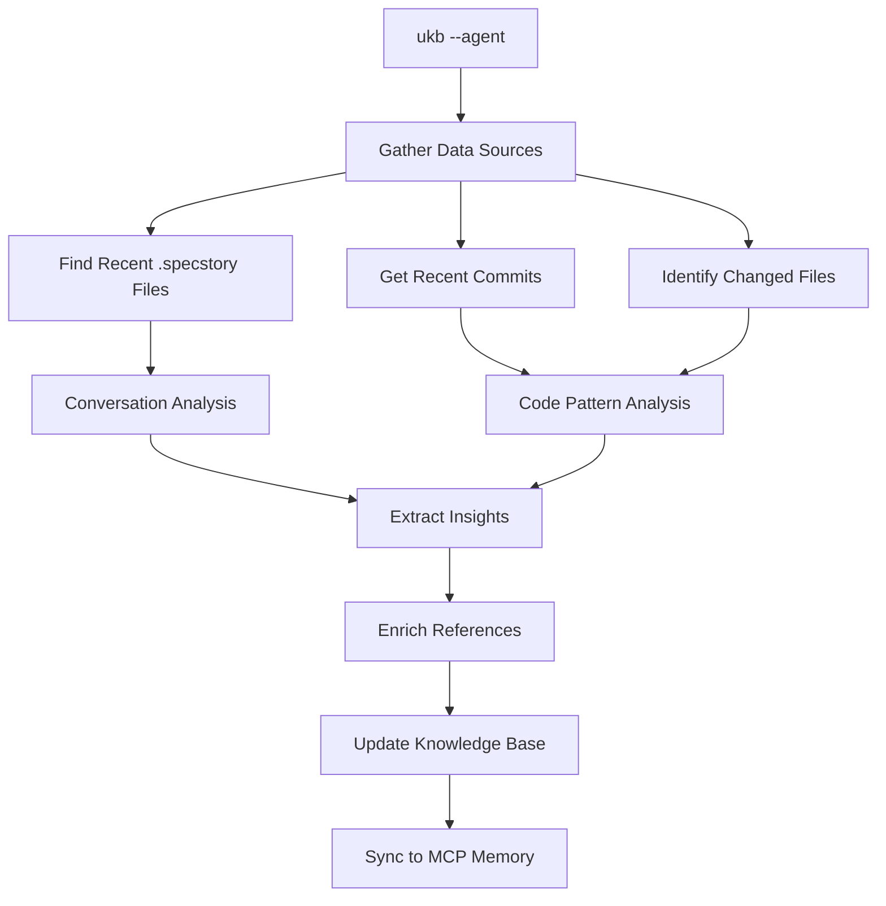

# Enhanced UKB Guide: Agent-Powered Knowledge Extraction

## Overview

The enhanced UKB (Update Knowledge Base) system now features sophisticated semantic analysis capabilities designed to work seamlessly with all coding agents (Claude, CoPilot, etc.). This addresses the key challenge of post-session logging by enabling deep analysis from within the coding agent session itself.

## Key Features

### 🎯 Agent Mode (`--agent`)
- **Semantic conversation analysis** from .specstory history files
- **Code pattern extraction** from recent file changes
- **Automated reference enrichment** with documentation links
- **Cross-session learning** from previous AI interactions
- **Works within any coding agent** (Claude, CoPilot, etc.)

### 🔧 Automated Analysis Scripts
- **Conversation Analyzer**: Extracts transferable patterns from AI conversations
- **Code Analyzer**: Identifies architectural patterns in code changes
- **Reference Enricher**: Adds authoritative documentation links

### 📋 Standardized Templates
- **Pattern Template**: Consistent structure for all transferable patterns
- **Structured Insights**: Uniform format with problem-solution-applicability

## Quick Start

### For Claude Code Users

```bash
# Start semantic analysis from within Claude session
ukb --agent

# The system will automatically:
# 1. Analyze recent conversation files
# 2. Extract code patterns from changes  
# 3. Enrich with reference documentation
# 4. Update knowledge base
```

### For Other Agents (CoPilot, etc.)

```bash
# Run agent mode (will provide instructions for manual completion)
ukb --agent

# Follow the provided instructions to complete analysis
```

## Technical Architecture

### Agent Mode Workflow



### Data Sources Analyzed

1. **Conversation History** (.specstory/history/)
   - Problem-solution pairs
   - Tool usage workflows
   - Debugging methodologies
   - Architectural discussions

2. **Code Changes** (Git diffs)
   - Architectural patterns
   - Design patterns
   - Performance optimizations
   - Error handling strategies

3. **Project Structure**
   - MVC patterns
   - Microservices architecture
   - Monorepo organization
   - Code hotspots

## Semantic Analysis Capabilities

### Conversation Pattern Recognition

The system automatically identifies and extracts:

```javascript
// Example patterns detected
{
  problemSolution: /(?:problem|issue|challenge)[\s\S]{0,500}?(?:solution|fixed|resolved)/gi,
  architecture: /(?:architecture|design|pattern|structure)[\s\S]{0,300}?(?:implement|create)/gi,
  performance: /(?:performance|optimize|speed)[\s\S]{0,300}?(?:improve|reduce|enhance)/gi,
  debugging: /(?:debug|troubleshoot|diagnose)[\s\S]{0,300}?(?:found|discovered|root cause)/gi,
  toolUsage: /\[Tool: (\w+)\][\s\S]{0,200}?(?:successfully|completed|fixed)/gi,
  keyLearning: /(?:key (?:insight|learning|takeaway)|learned that|discovered that)/gi
}
```

### Code Pattern Detection

Automatically recognizes:

- **React Patterns**: Hooks, Context, Redux, Performance optimization
- **Python Patterns**: OOP, Decorators, Async programming
- **Rust Patterns**: Traits, Error handling, Memory management
- **Shell Patterns**: Error handling, Modularization, Dependencies
- **Architectural Patterns**: MVC, Microservices, Monorepo structures

### Reference Enrichment

Automatically adds documentation links for:

```javascript
// Technology references
'React': [
  'https://react.dev/',
  'https://react.dev/learn',
  'https://react.dev/reference/react'
],
'TypeScript': [
  'https://www.typescriptlang.org/docs/',
  'https://www.typescriptlang.org/docs/handbook/intro.html'
],
// ... plus 20+ more technologies
```

## Agent Mode: Addressing Post-Session Logging

### The Challenge

Traditional knowledge capture faces a timing issue:
- **During session**: Current conversation not yet logged to .specstory
- **After session**: Coding agent no longer available for semantic analysis

### The Solution: Agent Mode

```bash
ukb --agent
```

**How it works:**

1. **Excludes current session** (not yet logged)
2. **Analyzes previous sessions** (already in .specstory/history)
3. **Leverages agent capabilities** for semantic understanding
4. **Extracts transferable patterns** using AI reasoning
5. **Works in any coding agent** (Claude, CoPilot, etc.)

### Example Analysis Output

```json
{
  "type": "entity",
  "name": "DebuggingWorkflowPattern",
  "entityType": "TroubleshootingPattern", 
  "problem": "Complex debugging requires systematic approach",
  "solution": "Sequential tool usage: Read → Grep → Edit → Test",
  "approach": "Tool workflow: Read → Grep → Edit → Bash → Read",
  "applicability": "Similar multi-step debugging tasks",
  "technologies": ["Claude Code", "Development Tools"],
  "observations": [
    "Tool sequence: Read → Grep → Edit → Bash → Read",
    "Extracted from: 2025-06-15_18-25-44_post-logged-coding-session.md",
    "Pattern type: Tool workflow",
    "Total tools used: 5",
    "Significance: 7/10"
  ],
  "significance": 7
}
```

## Integration with All Coding Agents

### Claude Code
```bash
# Full automation available
ukb --agent
# → Automatically completes semantic analysis
```

### GitHub CoPilot / Other Agents
```bash
# Guided workflow
ukb --agent
# → Provides analysis instructions and templates
# → Agent follows instructions to complete analysis
# → Run: ukb --agent-complete <session-dir>
```

### Manual Completion (Any Agent)
```bash
# 1. Start analysis
ukb --agent

# 2. Agent receives analysis instructions at:
#    /tmp/ukb-<session>/agent_analysis_request.json
#    /tmp/ukb-<session>/insight_template.json

# 3. Agent analyzes files and creates insights in:
#    /tmp/ukb-<session>/insights.json

# 4. Complete the analysis
ukb --agent-complete /tmp/ukb-<session>
```

## Pattern Template Usage

All captured patterns follow a standardized template:

```markdown
# [Pattern Name]

**Pattern Type:** [TransferablePattern|ArchitecturalPattern|etc.]
**Applicability:** [Where this applies]
**Technologies:** [Tech stack]
**Significance:** [1-10]/10

## Problem Statement
[Clear description of challenge]

## Solution Overview  
[High-level approach]

## Implementation Pattern
[Detailed implementation with code examples]

## Performance Impact
[Measurable improvements]

## Transferable Applications
[Where else this can be applied]
```

## Best Practices

### When to Use Agent Mode

✅ **Use Agent Mode When:**
- Working within a coding agent session
- Want deep semantic analysis of conversations
- Need to extract complex architectural patterns
- Require reference documentation enrichment

❌ **Don't Use Agent Mode When:**
- Want quick commit-based insights (`ukb --auto`)
- Need interactive deep capture (`ukb --interactive`)
- Working outside a coding agent

### Optimizing Results

1. **Let conversations accumulate** - More .specstory files = better patterns
2. **Use descriptive commit messages** - Helps with code pattern detection
3. **Include problem descriptions** in conversations - Improves solution extraction
4. **Document architectural decisions** - Creates transferable patterns

### Cross-Agent Compatibility

The enhanced UKB system is designed to work with any coding agent:

| Agent | Capability | Method |
|-------|-----------|--------|
| Claude Code | Full automation | `ukb --agent` |
| GitHub CoPilot | Guided workflow | Manual completion |
| Cursor | Guided workflow | Manual completion |
| Other agents | Template-based | Manual completion |

## Advanced Features

### Web Research Integration

```bash
# Generate research instructions for agents
node scripts/enrich-references.js research insights.json

# Apply known reference patterns
node scripts/enrich-references.js enrich insights.json
```

### Code Analysis Standalone

```bash
# Analyze code patterns independently
node scripts/analyze-code.js <session-directory>
```

### Conversation Analysis Standalone

```bash
# Extract conversation patterns independently  
node scripts/analyze-conversations.js <session-directory>
```

## Output and Results

### Knowledge Base Updates

Agent mode automatically:
- ✅ **Adds new entities** to shared-memory.json
- ✅ **Creates relationships** between patterns and projects
- ✅ **Updates MCP memory** for persistence
- ✅ **Maintains significance ranking** for pattern importance
- ✅ **Links to detailed documentation** when available

### Visualization

View results:
```bash
vkb  # Start visualization server
# → Open http://localhost:8080
```

### Statistics

After running `ukb --agent`:
```
✅ Agent analysis completed successfully!
📊 Total entities: 24
🔗 Total relations: 26
💾 Shared memory: /path/to/shared-memory.json

📈 Significance Distribution:
  High (7-10):   22 insights
  Medium (4-6):  2 insights  
  Low (1-3):     0 insights
```

## Troubleshooting

### Common Issues

**Issue**: No insights generated
**Solution**: Ensure .specstory/history files exist and contain conversations

**Issue**: Pattern names appear garbled  
**Solution**: Check conversation content quality - improve problem descriptions

**Issue**: Agent mode hangs
**Solution**: Verify Node.js is available and scripts are executable

### Debug Mode

```bash
# Enable detailed logging
export DEBUG=1
ukb --agent
```

## Future Enhancements

The enhanced UKB system provides a foundation for:

1. **Real-time pattern recognition** during conversations
2. **Cross-project pattern matching** and recommendations  
3. **Automated documentation generation** from patterns
4. **Team knowledge sharing** across different coding agents
5. **Pattern quality metrics** and improvement suggestions

---

## Summary

The enhanced UKB system transforms knowledge capture from a manual, post-session activity into an intelligent, agent-powered semantic analysis system. By working within coding agent sessions and analyzing rich conversation history, it extracts far more valuable and transferable insights than traditional commit-based approaches.

**Key Benefits:**
- 🎯 **Works with any coding agent** (Claude, CoPilot, etc.)
- 🔍 **Deep semantic analysis** of conversations and code
- 📚 **Automatic reference enrichment** with documentation
- 🔄 **Cross-session learning** from AI interaction history
- 📋 **Standardized templates** for consistent documentation
- 🌐 **Agent-agnostic design** for universal compatibility

The system addresses the core challenge of post-session logging by enabling sophisticated analysis from within the coding agent session itself, ensuring no valuable insights are lost.