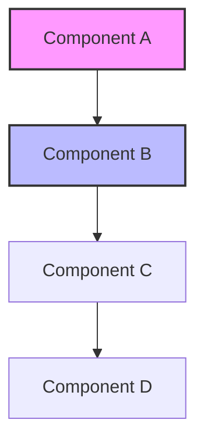

# [Pattern Name]

**Pattern Type:** [TransferablePattern|ArchitecturalPattern|PerformancePattern|WorkflowPattern|etc.]  
**Applicability:** [Where and when this pattern should be used]  
**Technologies:** [List of relevant technologies]  
**Significance:** [1-10]/10  
**Origin Project:** [Optional - where this pattern was first discovered]  
**Author:** [Pattern documenter]  
**Date Created:** [YYYY-MM-DD]  
**Last Updated:** [YYYY-MM-DD]

## Table of Contents

1. [Problem Statement](#problem-statement)
2. [Solution Overview](#solution-overview)
3. [Implementation Pattern](#implementation-pattern)
4. [Architecture Diagram](#architecture-diagram)
5. [Code Examples](#code-examples)
6. [Performance Impact](#performance-impact)
7. [Anti-Patterns to Avoid](#anti-patterns-to-avoid)
8. [Transferable Applications](#transferable-applications)
9. [Related Patterns](#related-patterns)
10. [References](#references)

## Problem Statement

[Provide a clear, detailed description of the problem this pattern solves. Include:
- The specific challenge or pain point
- Why existing approaches fall short
- The impact of not addressing this problem
- Real-world scenarios where this problem occurs]

### Example Problem Scenario

```
[Concrete example of the problem in action]
```

## Solution Overview

[High-level description of the solution approach. Include:
- The core insight or principle
- Why this approach works
- Key benefits of this solution
- Trade-offs to consider]

### Key Principles

1. **[Principle 1]:** [Description]
2. **[Principle 2]:** [Description]
3. **[Principle 3]:** [Description]

## Implementation Pattern

[Detailed implementation guide with step-by-step instructions]

### Prerequisites

- [Prerequisite 1]
- [Prerequisite 2]
- [Prerequisite 3]

### Implementation Steps

1. **[Step 1 Title]**
   ```[language]
   // Code for step 1
   ```
   [Explanation of what this step does and why]

2. **[Step 2 Title]**
   ```[language]
   // Code for step 2
   ```
   [Explanation of what this step does and why]

3. **[Step 3 Title]**
   ```[language]
   // Code for step 3
   ```
   [Explanation of what this step does and why]

## Architecture Diagram



[Explanation of the architecture and component interactions]

## Code Examples

### Basic Implementation

```[language]
// Complete, working code example demonstrating the pattern
// Should be copy-pasteable and functional

[Full code implementation]
```

### Advanced Usage

```[language]
// More complex example showing advanced features
// Include error handling and edge cases

[Advanced implementation]
```

### Integration Example

```[language]
// Example of how to integrate this pattern into existing code

[Integration code]
```

## Performance Impact

### Metrics

| Metric | Before Pattern | After Pattern | Improvement |
|--------|---------------|---------------|-------------|
| [Metric 1] | [Value] | [Value] | [%] |
| [Metric 2] | [Value] | [Value] | [%] |
| [Metric 3] | [Value] | [Value] | [%] |

### Benchmarks

```[language]
// Benchmark code or results
```

### Performance Considerations

- [Consideration 1]
- [Consideration 2]
- [Consideration 3]

## Anti-Patterns to Avoid

### ❌ Anti-Pattern 1: [Name]

```[language]
// Example of what NOT to do
```

**Why this is problematic:** [Explanation]

### ❌ Anti-Pattern 2: [Name]

```[language]
// Example of what NOT to do
```

**Why this is problematic:** [Explanation]

### ✅ Correct Approach

```[language]
// The right way to implement this
```

## Transferable Applications

This pattern can be applied in the following contexts:

1. **[Context 1]:** [How to apply the pattern here]
2. **[Context 2]:** [How to apply the pattern here]
3. **[Context 3]:** [How to apply the pattern here]

### Industry Examples

- **[Industry/Domain 1]:** [Specific use case]
- **[Industry/Domain 2]:** [Specific use case]
- **[Industry/Domain 3]:** [Specific use case]

## Related Patterns

- **[Related Pattern 1]:** [Brief description and relationship]
- **[Related Pattern 2]:** [Brief description and relationship]
- **[Related Pattern 3]:** [Brief description and relationship]

### Pattern Combinations

[Describe how this pattern works with other patterns]

## References

### Official Documentation
- [Technology 1 Docs](https://example.com/docs)
- [Technology 2 Docs](https://example.com/docs)

### Articles and Tutorials
- [Article Title](https://example.com/article) - [Brief description]
- [Tutorial Title](https://example.com/tutorial) - [Brief description]

### Related Resources
- [Resource 1](https://example.com) - [Description]
- [Resource 2](https://example.com) - [Description]

### Code Repositories
- [Example Implementation](https://github.com/example/repo)
- [Production Usage](https://github.com/example/repo)

---

## Metadata

```json
{
  "pattern_id": "[unique-pattern-id]",
  "version": "1.0.0",
  "tags": ["tag1", "tag2", "tag3"],
  "difficulty": "beginner|intermediate|advanced",
  "time_to_implement": "[estimated time]",
  "maintenance_burden": "low|medium|high"
}
```