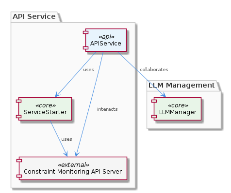
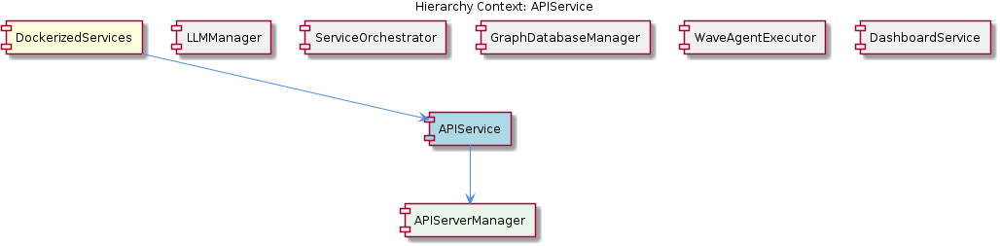

# APIService

**Type:** SubComponent

The APIService might be designed to work with other sub-components, such as the LLMManager, to manage complex workflows.

## What It Is  

APIService is a **sub‑component** that lives inside the `DockerizedServices` container and is responsible for the lifecycle management of the system’s API server.  The service is defined in the DockerizedServices code‑base (the exact file that houses the implementation is not listed in the observations, but its parent component lives alongside other sub‑components such as **LLMManager**, **ServiceOrchestrator**, **GraphDatabaseManager**, **WaveAgentExecutor**, and **DashboardService**).  Within APIService a dedicated child component, **APIServerManager**, encapsulates the low‑level details of starting, stopping, and monitoring the API process.  

The primary purpose of APIService is to provide a **robust, easy‑to‑use entry point** for other parts of the application (for example the LLMManager) that need to interact with the constraint‑monitoring API server.  It abstracts away the complexities of service startup, error handling, and graceful shutdown, allowing callers to focus on business logic rather than infrastructure concerns.

---

## Architecture and Design  

The design of APIService follows a **service‑starter pattern** that is explicitly referenced in the observations: it leverages the `ServiceStarter` class located at `lib/service-starter.js`.  This class supplies retry logic, timeout handling, and graceful degradation, which together form the backbone of APIService’s **robust startup and shutdown** strategy.  By delegating these concerns to `ServiceStarter`, APIService keeps its own code focused on orchestration rather than low‑level fault tolerance.

APIService is **composed** of a single child component, **APIServerManager**, which likely implements the concrete commands to launch the API server process (e.g., spawning a Node.js/Express instance, configuring ports, and wiring health‑check endpoints).  The parent‑child relationship is a classic **composition** design: APIService coordinates the overall lifecycle while APIServerManager handles the specifics.  

Because APIService lives inside `DockerizedServices`, it inherits the **dependency‑injection** approach described for the parent component.  This means that the concrete implementation of APIServerManager (or any other collaborator) can be swapped at runtime, facilitating testing and future extension without changing APIService’s core logic.  The sibling components—most notably **ServiceOrchestrator**, which also uses `ServiceStarter`—share this same robust startup mechanism, indicating a **cross‑component consistency** in how services are brought online.

---

## Implementation Details  

The heart of APIService’s implementation is the call to `new ServiceStarter(...)` from `lib/service-starter.js`.  Although the exact constructor signature is not listed, the observations tell us that `ServiceStarter` provides **retry, timeout, and graceful degradation** capabilities.  APIService likely creates a `ServiceStarter` instance, passing in a function that invokes APIServerManager’s `start()` method.  The `ServiceStarter` then repeatedly attempts to start the API server until either a successful start is reported or a configured retry limit is reached.

APIServerManager, as the child component, is expected to expose at least two public methods: `start()` and `shutdown()`.  `start()` would configure the API server (binding to the appropriate port, loading any required middleware, and registering routes that expose the constraint‑monitoring functionality).  `shutdown()` would handle graceful termination, ensuring that in‑flight requests are completed before the process exits.  Error handling is baked into this flow: any exception thrown by APIServerManager during `start()` or `shutdown()` is caught by `ServiceStarter`, which can then trigger a retry or log a fatal error, satisfying the observation that “APIService may handle errors and exceptions during API server startup and shutdown.”

Because APIService “may be designed to work with other sub‑components, such as the LLMManager, to manage complex workflows,” it likely exposes a small public API (e.g., `initialize()`, `dispose()`) that other components call during their own initialization phases.  This keeps the coupling loose: LLMManager does not need to know how the API server is started—it simply asks APIService to ensure the server is running.

---

## Integration Points  

APIService sits at the intersection of several system boundaries:

* **Parent – DockerizedServices**: DockerizedServices uses dependency injection to wire APIService into the container environment.  This means APIService can receive configuration values (such as the API port, health‑check URLs, or Docker network settings) from the parent without hard‑coding them.

* **Sibling – ServiceOrchestrator**: Both ServiceOrchestrator and APIService rely on `ServiceStarter`.  This shared dependency suggests that orchestration scripts may coordinate the startup order—e.g., ServiceOrchestrator could wait for APIService’s `initialize()` promise to resolve before launching downstream agents.

* **Sibling – LLMManager**: LLMManager may call into APIService to ensure the constraint‑monitoring API is available before issuing LLM requests that depend on those constraints.  The interaction is likely a simple method call rather than a network request, because both reside in the same Docker container.

* **Child – APIServerManager**: All low‑level server operations flow through this child.  Any change to the underlying server technology (switching from Express to Fastify, for example) would be confined to APIServerManager, leaving APIService’s public contract untouched.

* **External – Constraint Monitoring API Server**: The observations note that APIService “likely interacts with the constraint monitoring API server to provide easy startup and management.”  This implies that APIServerManager may proxy or wrap calls to an external monitoring service, exposing them via the internal API surface.

---

## Usage Guidelines  

1. **Initialize Early, Dispose Late** – Call `APIService.initialize()` (or the equivalent startup method) as part of the application bootstrap sequence, preferably before any component that depends on the API server (e.g., LLMManager).  When the application is shutting down, invoke `APIService.dispose()` to trigger the graceful shutdown path handled by `ServiceStarter`.

2. **Leverage Configuration via DI** – Do not hard‑code ports or time‑outs inside APIService.  Supply these values through DockerizedServices’ dependency‑injection container so that the service can be re‑configured for different environments (development, staging, production) without code changes.

3. **Respect Retry Semantics** – The `ServiceStarter` retry logic is intentional; avoid adding additional manual retry loops around APIService calls.  If a start attempt fails, let `ServiceStarter` manage the back‑off and eventual success or fatal error.

4. **Handle Errors at the Boundary** – While `ServiceStarter` catches most startup exceptions, any runtime errors that surface after the server is running should be propagated to the caller.  Implement listeners on APIServerManager’s error events and surface them through APIService’s public error‑reporting API.

5. **Test with Mocked APIServerManager** – Because APIService composes APIServerManager, unit tests should replace the real manager with a mock that records start/shutdown calls.  This isolates the retry and timeout logic in `ServiceStarter` for focused testing.

---

### Architectural patterns identified
- **Service‑Starter pattern** (robust startup with retry, timeout, graceful degradation via `lib/service-starter.js`)
- **Composition** (APIService → APIServerManager)
- **Dependency Injection** (inherited from DockerizedServices)

### Design decisions and trade‑offs
- Centralising retry/timeout logic in `ServiceStarter` reduces duplication but couples all services to a single startup strategy.
- Using a child manager (APIServerManager) isolates server‑specific code, improving modularity at the cost of an extra indirection layer.
- Exposing a thin public API keeps coupling low but requires disciplined initialization ordering among siblings.

### System structure insights
- APIService is a leaf sub‑component within `DockerizedServices`, directly managing a single child (APIServerManager) while sharing infrastructure (ServiceStarter) with siblings.
- The parent’s DI container provides configuration, enabling runtime flexibility across environments.
- Sibling components coordinate via shared startup semantics, suggesting a coordinated orchestration layer.

### Scalability considerations
- The retry/timeout logic in `ServiceStarter` supports transient failures, which aids horizontal scaling when multiple containers start concurrently.
- Because APIService encapsulates a single API server instance, scaling out would involve deploying additional DockerizedServices containers; the design does not impose a single‑point bottleneck within the service itself.
- Configuration‑driven ports and health‑check endpoints allow load balancers to route traffic to multiple APIService instances.

### Maintainability assessment
- Clear separation of concerns (startup logic vs. server specifics) makes the codebase approachable for new developers.
- Shared `ServiceStarter` reduces code churn but creates a single point of change; updates to its behavior must be vetted against all dependent services.
- Dependency injection from DockerizedServices promotes testability and future refactoring (e.g., swapping APIServerManager implementations).

## Hierarchy Context

### Parent
- [DockerizedServices](./DockerizedServices.md) -- [LLM] The DockerizedServices component utilizes dependency injection to manage complex workflows and handle multiple requests efficiently. This is evident in the lib/llm/llm-service.ts file, where the LLMService class is used for high-level LLM operations, including mode routing, caching, and provider fallback. The use of dependency injection allows for loose coupling between components, making it easier to test and maintain the codebase. Furthermore, the ServiceStarter class in lib/service-starter.js provides robust service startup with retry, timeout, and graceful degradation, ensuring that the component can recover from failures and provide a responsive user experience.

### Children
- [APIServerManager](./APIServerManager.md) -- The parent analysis suggests the existence of an APIServerManager, which is a common pattern in API server implementations.

### Siblings
- [LLMManager](./LLMManager.md) -- LLMManager utilizes the LLMService class in lib/llm/llm-service.ts for high-level LLM operations.
- [ServiceOrchestrator](./ServiceOrchestrator.md) -- ServiceOrchestrator uses the ServiceStarter class in lib/service-starter.js to provide robust service startup with retry, timeout, and graceful degradation.
- [GraphDatabaseManager](./GraphDatabaseManager.md) -- GraphDatabaseManager likely uses Graphology and LevelDB to provide persistence and data storage capabilities.
- [WaveAgentExecutor](./WaveAgentExecutor.md) -- WaveAgentExecutor likely uses a specific constructor and execution pattern to execute wave-based agents.
- [DashboardService](./DashboardService.md) -- DashboardService likely interacts with the constraint monitoring dashboard to provide easy startup and management.

---

*Generated from 7 observations*
