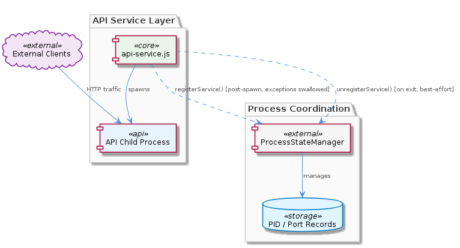
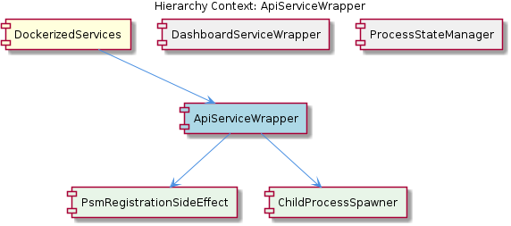

# ApiServiceWrapper

**Type:** SubComponent

Any exception thrown by ProcessStateManager.registerService() in scripts/api-service.js is explicitly caught and swallowed, allowing the API service to continue running even if PSM is unavailable

# ApiServiceWrapper — Technical Insight Document

## What It Is

`ApiServiceWrapper` is a SubComponent implemented in `scripts/api-service.js`, responsible for owning the full lifecycle of the API service child process within the broader `DockerizedServices` parent component. It is the sole file that houses both the spawn step (delegated conceptually to its child `ChildProcessSpawner`) and the subsequent `ProcessStateManager.registerService()` invocation (its child `PsmRegistrationSideEffect`). In effect, the wrapper is a thin orchestration shim: it brings up the API service as an OS-level child process, then attempts — non-critically — to publish its identity (PID/port) into a shared registry maintained by `ProcessStateManager`.

The wrapper's defining characteristic is that it treats `ProcessStateManager` (PSM) as a coordination facility, not a startup gate. Registration happens *after* the child process is already spawned and live, and any exception raised during registration is explicitly caught and swallowed. As a result, the API service will start and serve traffic regardless of PSM's state or availability.

## Architecture and Design

The architectural pattern visible in `scripts/api-service.js` is **spawn-then-register with best-effort coordination**. The wrapper performs work in a strict ordering: first the child process is spawned and becomes operationally live, then PSM registration is attempted as a *side effect* — captured in the modeled child `PsmRegistrationSideEffect`. This ordering is intentional and forms the core design contract of `ApiServiceWrapper`: the service is available before any acknowledgment from PSM, ensuring that a degraded coordination layer never blocks service availability.

This design closely mirrors its sibling `DashboardServiceWrapper` (implemented in `scripts/dashboard-service.js`), which follows the identical post-spawn PSM registration pattern. Together, both wrappers form a consistent convention under `DockerizedServices`: every wrapped service treats PSM as a non-blocking coordination sink. The sibling `ProcessStateManager` itself exposes `registerService()` as the entry point both wrappers call, recording service identity in the registry. The symmetry between `ApiServiceWrapper` and `DashboardServiceWrapper` means a developer familiar with one wrapper can reason about the other without surprises.

The key trade-off embedded in this architecture is **availability of individual services over centralized orchestration correctness**. By catching and swallowing PSM exceptions, the wrapper guarantees that a misbehaving or unavailable PSM cannot induce a startup deadlock or cascading failure on the API service. The cost is that PSM's registry may become inconsistent with reality — either because registration silently failed at startup, or because cleanup on shutdown did not occur. This is acceptable in the local development container context where `DockerizedServices` runs, since zombie or stale registry entries are easier to tolerate than services that refuse to start.

## Implementation Details

The implementation in `scripts/api-service.js` proceeds in three logical phases. First, the child process is spawned (the `ChildProcessSpawner` responsibility). Because spawning happens before PSM is contacted, the service binds to its port and is capable of serving traffic immediately. Second, `ProcessStateManager.registerService()` is invoked to record the spawned service's identity. Critically, this call is wrapped in exception handling that swallows any thrown error — there is no retry, no fallback, and no propagation. If PSM is unavailable (for example, because its backing store or IPC channel is down), the wrapper simply continues, and the API service remains running unregistered.

The third phase is the cleanup path: `scripts/api-service.js` binds a process exit handler that calls `PSM.unregisterService()` to remove the PID and port records when the process terminates gracefully. This cleanup is itself best-effort — it relies on a normal exit signal being delivered and the handler running to completion. On a hard crash (SIGKILL, segfault, or abrupt container termination), this handler will not execute, and PSM's registry will retain stale entries for the crashed service. The wrapper makes no attempt to recover from this scenario; instead, it leaves staleness reconciliation as a concern external to `ApiServiceWrapper`.

The two modeled children of `ApiServiceWrapper` — `PsmRegistrationSideEffect` and `ChildProcessSpawner` — both live within this single file. `ChildProcessSpawner` represents the spawn step that produces a live child process before any coordination is attempted. `PsmRegistrationSideEffect` represents the post-spawn `registerService()` invocation, explicitly modeled as a *side effect* to emphasize that it does not affect the success or failure of the wrapper's primary mission. This co-location in `scripts/api-service.js` makes the wrapper the sole owner of the spawn-then-register lifecycle pattern for the API service.

## Integration Points

`ApiServiceWrapper` integrates upward into its parent `DockerizedServices`, where it sits alongside `DashboardServiceWrapper` and `ProcessStateManager` as a peer. Its integration with `ProcessStateManager` is one-directional and loosely coupled: the wrapper calls `registerService()` after spawn and `unregisterService()` on exit, but it does not subscribe to PSM events, does not query PSM for state, and does not depend on PSM's availability to function. This is a deliberately asymmetric relationship — PSM is an *observer* of the wrapper's lifecycle, not a participant in it.

The wrapper's interaction surface with `ProcessStateManager` is narrow: two method calls (`registerService` and `unregisterService`), both invoked with PID/port identity information. Because PSM's failures are silently absorbed, the contract between `ApiServiceWrapper` and `ProcessStateManager` is effectively "fire-and-forget at startup, fire-and-forget at shutdown." Any consumer of PSM data downstream — for example, a developer inspecting PSM for service health — must understand that the registry reflects *last-known state*, not guaranteed live state.

Within the wrapper, the integration between `ChildProcessSpawner` and `PsmRegistrationSideEffect` is sequential and unidirectional: spawn completes, then registration is attempted. The spawned child process itself is the actual API service binary and is not aware of PSM; coordination is entirely the wrapper's concern. This separation keeps the API service implementation oblivious to the surrounding `DockerizedServices` orchestration.

## Usage Guidelines

When working with or extending `scripts/api-service.js`, developers should preserve the post-spawn ordering: PSM registration must never become a precondition for the service starting. Any change that introduces a `registerService()` call *before* the child process is spawned, or that allows PSM exceptions to propagate and abort startup, would violate the wrapper's core availability guarantee and break the convention shared with `DashboardServiceWrapper`.

Developers inspecting PSM for service status should be aware that the registry can become stale in two scenarios: (1) startup registration silently failed due to PSM unavailability, leaving a running service unregistered; and (2) the service crashed hard without invoking the exit handler, leaving a defunct entry in the registry. PSM should therefore be treated as advisory, not authoritative — if precise liveness is required, an independent health check against the service itself is the correct approach, not a PSM lookup.

When adding new wrapped services to `DockerizedServices`, the established convention is to mirror the `ApiServiceWrapper` and `DashboardServiceWrapper` pattern exactly: spawn first, register second as a side effect, swallow registration exceptions, and bind a best-effort exit handler for `unregisterService()`. Deviating from this convention introduces an inconsistency in how `DockerizedServices` components handle coordination failures, which complicates reasoning about the system as a whole.

## Architectural Patterns Identified

- **Spawn-then-register lifecycle**: the wrapper brings up the service before announcing it to any coordination layer.
- **Best-effort coordination sink**: PSM is treated as a non-blocking observer; failures are swallowed.
- **Side-effect decomposition**: the wrapper's responsibilities are modeled as a primary action (`ChildProcessSpawner`) plus a side effect (`PsmRegistrationSideEffect`), making the criticality boundary explicit in the component model.
- **Symmetric wrapper convention**: the pattern is shared identically with `DashboardServiceWrapper`, forming a uniform contract across `DockerizedServices`.

## Design Decisions and Trade-offs

The central decision is favoring **service availability over registry consistency**. This is appropriate for a local development container, where a running service with a stale PSM entry is more useful than a service blocked from starting because PSM is degraded. The trade-off is reduced trust in PSM's registry — it cannot be used as an authoritative source of truth for which services are live, only as a snapshot of last-known state.

A second decision is the **lack of retry or recovery logic** for PSM registration. The wrapper does not attempt to re-register on PSM recovery, nor does it log structured diagnostics that would allow external observers to reconcile state. This keeps the wrapper simple but pushes reconciliation responsibility entirely outside the component.

## System Structure Insights

`ApiServiceWrapper` is structurally a leaf-level orchestration script in the `DockerizedServices` hierarchy, with two modeled children (`PsmRegistrationSideEffect`, `ChildProcessSpawner`) that exist as logical phases within a single file rather than as separate modules. Its siblings (`DashboardServiceWrapper`, `ProcessStateManager`) define the coordination surface in which the wrapper operates. The structure is intentionally flat and convention-driven: each wrapper is self-contained, and `ProcessStateManager` is shared infrastructure that none of the wrappers strongly depend on.

## Scalability Considerations

The wrapper's design scales horizontally by convention: adding a new service simply means adding a new wrapper script that follows the spawn-then-register pattern. There is no central registration coordinator that would become a bottleneck — PSM is contacted asynchronously and tolerably. However, the design does not scale to environments where registry accuracy is critical (e.g., production orchestration), because the swallowed-exception model is fundamentally incompatible with strong consistency guarantees. The pattern is fit-for-purpose in a local development container and would need to be reconsidered if `DockerizedServices` were to evolve toward production-grade orchestration.

## Maintainability Assessment

The wrapper is highly maintainable due to its small surface area (`scripts/api-service.js` is a single file with a clear three-phase lifecycle) and its direct convention sharing with `DashboardServiceWrapper`. A developer who understands one wrapper understands both. The primary maintainability risk is the silent failure mode of PSM registration: because exceptions are swallowed, regressions in the PSM integration may go unnoticed unless explicit logging or diagnostics are added. Future maintainers should consider whether the swallowed-exception path warrants at least a debug-level log entry so that PSM integration health remains observable without compromising the availability guarantee.

## Hierarchy Context

### Parent
- [DockerizedServices](./DockerizedServices.md) -- [LLM] **Process State Manager (PSM) as a Non-Critical Registration Sink**

The service wrapper scripts (`scripts/api-service.js` and `scripts/dashboard-service.js`) treat registration with the `ProcessStateManager` singleton as a best-effort, non-critical side effect rather than a prerequisite for service startup. Concretely, `ProcessStateManager.registerService()` is called after the child process is spawned, but any error thrown during registration is explicitly swallowed — the wrapper continues regardless. This design decision reflects a deliberate architectural stance: PSM is a coordination facility for coordinated startup/shutdown introspection, not a gating mechanism. If PSM fails (e.g., because its backing store or IPC channel is unavailable), the individual service still runs. Conversely, on process exit, the wrapper calls `PSM.unregisterService()` to clean up the PID/port records, again in a best-effort fashion. This means PSM's state can become stale in crash scenarios — a developer inspecting PSM for health should be aware that the registry reflects last-known state, not guaranteed live state. The tradeoff favors availability of individual services over centralized orchestration correctness, which is appropriate for a local development container where zombie processes are more easily tolerated than startup deadlocks.

### Children
- [PsmRegistrationSideEffect](./PsmRegistrationSideEffect.md) -- scripts/api-service.js calls ProcessStateManager.registerService() only after the child process has been successfully spawned, as explicitly described in the ApiServiceWrapper sub-component — the service is operationally live before PSM acknowledgment occurs.
- [ChildProcessSpawner](./ChildProcessSpawner.md) -- scripts/api-service.js is the single file identified in the sub-component description as housing both the child process spawning step and the subsequent ProcessStateManager.registerService() call, making it the sole owner of the spawn-then-register lifecycle pattern.

### Siblings
- [DashboardServiceWrapper](./DashboardServiceWrapper.md) -- scripts/dashboard-service.js follows the same post-spawn PSM registration pattern as scripts/api-service.js, treating PSM as a non-blocking coordination sink
- [ProcessStateManager](./ProcessStateManager.md) -- ProcessStateManager.registerService() is the entry point called by both scripts/api-service.js and scripts/dashboard-service.js after child process spawn, recording service identity in the registry

---

*Generated from 4 observations*
