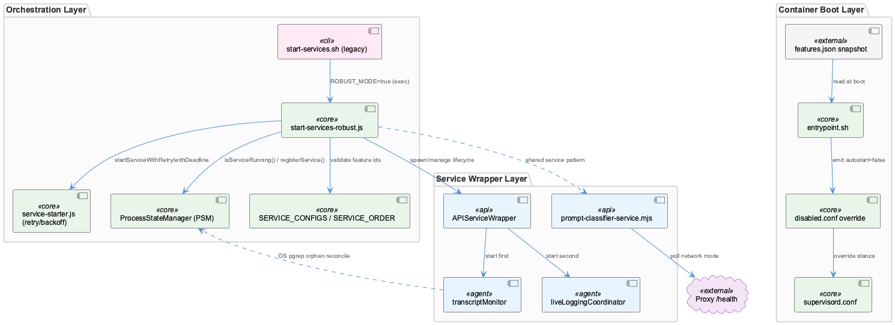
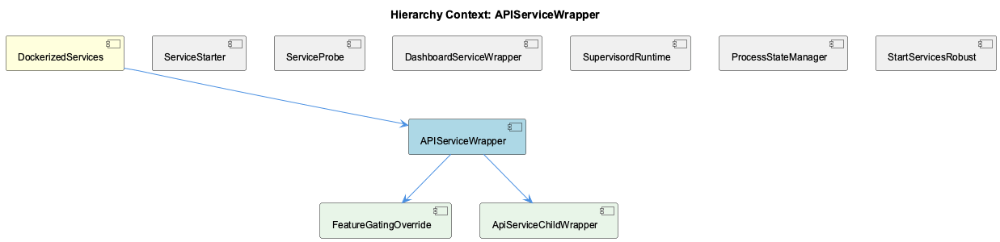

# APIServiceWrapper

**Type:** SubComponent

[Code References] docker/entrypoint.sh:79-140 - feature snapshot parsing and supervisord autostart override via PROGRAM_FEATURES mapping; docker/entrypoint.sh:96-108 - T2 egress lockdown: .env loading explicitly strips *_API_KEY/*_TOKEN/*_MANAGEMENT_KEY; start-services.sh:9-24 - ROBUST_MODE dispatch into scripts/start-services-robust.js, legacy bash path retained below; scripts/start-services-robust.js:isProcessRunningByScript() - OS-level pgrep fallback for orphaned process detection; scripts/start-services-robust.js:killProcessOnPortAndWait() - SIGTERM-then-SIGKILL escalation with polling; scripts/start-services-robust.js:waitForPortBindable() - throwaway net.createServer() probe to avoid EADDRINUSE race; scripts/start-services-robust.js SERVICE_CONFIGS.transcriptMonitor.startFn - triple-layer liveness check (PSM global, PSM per-project, OS pgrep) with orphan re-registration; tests/features/service-gating.test.mjs:24-33 - featureSet() test helper mirroring loadFeatures() output shape; tests/features/service-gating.test.mjs:53-59 - assertion that SERVICE_ORDER and SERVICE_CONFIGS cover each other exactly; tests/features/service-gating.test.mjs:61-67 - assertion that <AWS_SECRET_REDACTED> must be first in SERVICE_ORDER; tests/features/service-gating.test.mjs:87-94 - disabled vs degraded status distinction test; scripts/prompt-classifier-service.mjs loadConfig() - mtime-gated YAML hot reload with fail-toward-last-good-config; scripts/prompt-classifier-service.mjs currentNetwork() - polls proxy /health rather than independently sensing network mode; scripts/prompt-classifier-service.mjs:~90-110 - empty-string env var stripping before process.loadEnvFile() to avoid masked-as-set secrets

# APIServiceWrapper — Technical Insight Document

## What It Is

APIServiceWrapper is the umbrella SubComponent that normalizes how heterogeneous services (Express APIs, Next.js dev servers, Python services) are started, monitored, and stopped, spanning both container-side and host-side orchestration paths. Its concrete implementations live in `docker/entrypoint.sh` (container-boot feature gating), `scripts/start-services-robust.js` (host-native orchestration), and the legacy `start-services.sh` (bash fallback). It sits under DockerizedServices, which itself is architected around a dual-mode execution model — supervisord-managed processes in a single container versus host-native Node subprocesses tracked by ProcessStateManager — and APIServiceWrapper is the layer that makes both modes speak a common start/stop/health contract. Its two named children, FeatureGatingOverride and ApiServiceChildWrapper, both describe the same `docker/entrypoint.sh` mechanism from complementary angles: one as an additive supervisord-include generator, the other as a pure translation layer with no decision-making authority.

## Architecture and Design

The dominant pattern is wrapper/adapter: a single lifecycle contract (start/stop/health) wraps disparate service types, letting ServiceProbe (a sibling) remain a "pure protocol-level health <COMPANY_NAME_REDACTED>" blind to process ownership. Feature gating is deliberately layered *on top of* existing orchestration rather than rewritten into it — `docker/entrypoint.sh` never touches `supervisord.conf`'s `[program:...]` blocks; it only emits `autostart=false` overrides into `/etc/supervisor/features.d/disabled.conf`, consumed via supervisord's `[include]` directive. This is the FeatureGatingOverride child's core insight: an additive-diff design that regenerates the override directory unconditionally (`rm -f *.conf` then rebuild) rather than diffing against previous state, keeping the blast radius of a bug small.

A second major pattern is the coexistence of legacy and current implementations in the same tree: `start-services.sh` dispatches into `scripts/start-services-robust.js` when `ROBUST_MODE` (default true) is set, with ~150 lines of bash-based docker-compose/manual-container fallback logic retained purely as an escape hatch — dead code under normal operation but not deleted.

A third pattern, shared with sibling ServiceStarter, is required-vs-optional service classification enabling graceful degradation: `transcriptMonitor` and `liveLoggingCoordinator` are `required: true` with hard-fail retry semantics, while dashboard/graphify-type services are optional, per DashboardServiceWrapper's documented asymmetry.

## Implementation Details

On the container side, `docker/entrypoint.sh:79-140` parses `/coding/.coding/runtime/features.json` and iterates the `PROGRAM_FEATURES` mapping (`semantic-analysis:knowledge`, `graphify:codegraph`, `constraint-monitor:constraints`, etc.), using `node -e` rather than `jq` (not installed in the image) to evaluate each flag. The ApiServiceChildWrapper framing is explicit that this loop is a translation layer only — it reads a pre-computed boolean, it does not compute feature resolution itself, because the real logic (layered defaults → `config/features.yaml` → `~/.coding/features.yaml` → `CODING_FEATURE_*` env vars) lives entirely on the host and is structurally unreachable from inside the container.

On the host side, `scripts/start-services-robust.js` implements `SERVICE_CONFIGS`/`SERVICE_ORDER`, each service declaring a mandatory `feature` field checked against `FEATURE_IDS` from `lib/features/catalogue.cjs`. Liveness checking is triple-layered — PSM (`psm.isServiceRunning()`), then OS-level `isProcessRunningByScript()` via `pgrep -lf`, then re-registration of any OS-level orphan back into ProcessStateManager — treating PSM as an eventually-consistent cache rather than ground truth. Port lifecycle races are handled by `killProcessOnPortAndWait()` (SIGTERM, then SIGKILL after half of `maxWaitMs`, polling `lsof -ti:<port>`) and `waitForPortBindable()` (a throwaway `net.createServer().listen()` probe to dodge a lingering-socket EADDRINUSE race) — both added reactively per inline comments, not part of original design.

## Integration Points

APIServiceWrapper's status/error semantics interlock tightly with test infrastructure: `tests/features/service-gating.test.mjs` asserts `SERVICE_ORDER` and `SERVICE_CONFIGS` "cover each other exactly," and separately enforces that `transcriptMonitor`/`liveLoggingCoordinator` must be the first two entries in `SERVICE_ORDER` since later services register against them — a load-bearing ordering constraint enforced only in CI, not at runtime. The orchestrator also distinguishes `results.disabled` from `results.degraded`, mirroring the project-wide fail-open/fail-closed asymmetry: display/status surfaces fail open toward "intentionally off," while start actions fail closed.

Container-side gating (JSON snapshot) and host-side gating (`lib/features/catalogue.cjs`/`FEATURE_IDS`) are two separate enforcement points reading different sources, coordinated only by shared naming convention and cross-checking tests rather than one schema — a drift risk explicitly called out by sibling ServiceStarter. The retry/backoff mechanics delegate to `service-starter.js`'s `startServiceWithRetry`/`withDeadline`, and health reachability is deliberately kept separate from declared config (as in `prompt-classifier-service.mjs`'s `runtime` Map vs `config`), reflecting the broader convention of not conflating "declared" with "currently reachable" — consistent with ServiceProbe's protocol-agnostic health checking.

## Usage Guidelines

Any new feature flag must be wired into both the container path (`PROGRAM_FEATURES` in `docker/entrypoint.sh`) and the host path (`SERVICE_CONFIGS`/`FEATURE_IDS`), or the two deployment modes will drift silently. When adding or reordering entries in `SERVICE_ORDER`, remember the <AWS_SECRET_REDACTED>-first constraint is only test-enforced — misclassifying either as optional or moving them later would silently break the observability pipeline other services register against. Prefer treating PSM lookups as advisory rather than authoritative; the orphan-reconciliation pattern (`pgrep` fallback + re-registration) exists because PSM bookkeeping can miss crashes. Avoid deleting the legacy `start-services.sh` bash path casually — it's retained deliberately as a `ROBUST_MODE=false` escape hatch. Finally, respect the fail-open default in feature gating (absent/unreadable snapshot or unknown key = enabled) as an intentional debuggability trade-off, not a bug to "fix" toward stricter defaults.

## Hierarchy Context

### Parent
- [DockerizedServices](./DockerizedServices.md) -- [LLM] The DockerizedServices layer is architected around a dual-mode execution model: services can run either as supervisord-managed processes inside a single Docker container (per docker/docker-compose.yml, Dockerfile.coding-services, supervisord.conf) or as host-native Node subprocesses managed by lib/service-starter.js and PID-tracked via ProcessStateManager. This duality means developers must understand that 'starting a service' has two entirely separate code paths depending on deployment target, and that health-checking logic (service-probe.js) is written to be agnostic to which path is in effect — it only cares about HTTP/TCP reachability, not process ownership. This design avoids needing separate health-monitoring logic for containerized vs local services, but it also means Docker-specific failures (e.g., supervisord misconfiguration killing a service inside the container) surface identically to host-side crashes, requiring log inspection to disambiguate.

### Children
- [FeatureGatingOverride](./FeatureGatingOverride.md) -- [LLM] docker/entrypoint.sh implements the feature gate as a generated supervisord *include* rather than a templated supervisord.conf: it always does `rm -f "$FEATURES_DIR"/*.conf` then rebuilds `/etc/supervisor/features.d/disabled.conf` from scratch on every container start, iterating the space-delimited `PROGRAM_FEATURES` string (`semantic-analysis:knowledge embedding-listener:knowledge graphify:codegraph constraint-monitor:constraints constraint-dashboard:constraints constraint-dashboard-api:constraints health-dashboard:health health-dashboard-frontend:health`) and splitting each `program:feature` pair with bash parameter expansion (`${pair%%:*}` / `${pair##*:}`). This means supervisord.conf's `[program:...]` blocks are the single source of truth for command/logging, and features.d only ever emits `autostart=false` overrides — an additive-diff design that keeps the override surface small enough to regenerate unconditionally instead of diffing against a previous run.
- [ApiServiceChildWrapper](./ApiServiceChildWrapper.md) -- [LLM] docker/entrypoint.sh's feature-gating block (the `PROGRAM_FEATURES` loop and its `node -e` snippet) is deliberately built as a translation layer rather than a decision-maker: it does not compute whether a feature should be on, it only reads a pre-computed boolean out of `/coding/.coding/runtime/features.json` and converts it into a supervisord `autostart=false` stanza written to `/etc/supervisor/features.d/disabled.conf`. This separation exists because the actual feature-resolution logic (layered defaults → `config/features.yaml` → `~/.coding/features.yaml` → `CODING_FEATURE_*` env vars) lives entirely on the host and cannot run inside the container, since `~/.coding/features.yaml` is never mounted in. The container is thus structurally incapable of being the source of truth for its own feature state — a boundary that is easy to violate accidentally (e.g. by someone later adding container-side override logic) but is currently held cleanly by keeping the container a pure consumer of a flat snapshot.

### Siblings
- [ServiceStarter](./ServiceStarter.md) -- [LLM] scripts/start-services-robust.js implements a feature-gated service catalogue via SERVICE_CONFIGS and SERVICE_ORDER, where each service declares a 'feature' string that is checked against a loaded feature set (loadFeatures from lib/features/index.mjs) before startOneService() decides to skip, start, or block. This is a formalization of the docker/entrypoint.sh PROGRAM_FEATURES mapping seen for the containerized path — both the host and container execution paths implement the same feature-gating concept but via entirely separate mechanisms (JS object config vs shell/supervisord conf generation), meaning any new feature must be wired into both places or the two deployment modes will drift, a risk explicitly guarded against by tests/features/service-gating.test.mjs's 'SERVICE_ORDER and SERVICE_CONFIGS cover each other exactly' assertion.
- [ServiceProbe](./ServiceProbe.md) -- [LLM] service-probe.js is architected as a pure protocol-level health <COMPANY_NAME_REDACTED> that is deliberately blind to process ownership, deployment topology, and service identity beyond a URL or port. Per the parent context, probeHttpHealth() and probeTcpPort() implement SPEC R6's strict three-state model (running/stopped/unknown), and this component's inclusion in DockerizedServices is evidence that the same probing logic is reused for supervisord-managed containerized processes (docker/entrypoint.sh, Dockerfile.coding-services) and host-native subprocesses (scripts/start-services-robust.js via lib/service-starter.js). The trade-off documented in the parent observations is real and visible in the code here: docker/entrypoint.sh's wait_for_service() function implements its own ad-hoc TCP probing (bash /dev/tcp check) rather than delegating to service-probe.js, meaning there are at least two independent health-probing implementations in this codebase — one for container-internal database readiness (Qdrant/Redis) at entrypoint time, and one (service-probe.js) for post-startup ongoing health polling.
- [DashboardServiceWrapper](./DashboardServiceWrapper.md) -- [LLM] The wrapper-script pattern is asymmetric between service types: `scripts/start-services-robust.js` treats the Live Logging pair (`transcriptMonitor`, `liveLoggingCoordinator`) as `required: true` with `maxRetries: 3` and a hard-fail path, while services like the dashboard/graphify are expected to be `optional` per the module's own header comment ("Implements retry-with-timeout and graceful degradation for all services"). This means a bug in `startServiceWithRetry()` (imported from `../lib/service-starter.js`) that mis-marks a service's required flag has very different blast radii depending on which service it touches — misclassifying `transcriptMonitor` as optional would silently break the observability pipeline that most other services register against, since `tests/features/service-gating.test.mjs` explicitly asserts `SERVICE_ORDER.slice(0, 2)` must be `['transcriptMonitor', 'liveLoggingCoordinator']` because 'later services register against' them.
- [SupervisordRuntime](./SupervisordRuntime.md) -- [LLM] docker/entrypoint.sh implements a fail-open feature-gating layer that sits in front of supervisord rather than inside it: it reads a host-written snapshot at /coding/.coding/runtime/features.json (mounted read-only) and, for each entry in the PROGRAM_FEATURES mapping (e.g. `semantic-analysis:knowledge`, `graphify:codegraph`, `constraint-monitor:constraints`, `health-dashboard:health`), shells out to `node -e` to read the flag and writes a `[program:<name]\nautostart=false` stanza into /etc/supervisor/features.d/disabled.conf when a feature is off. Because supervisord.conf's `[include]` directive pulls in that directory, the override never touches the canonical program definitions — it only flips autostart. The script deliberately treats an absent snapshot, an unreadable snapshot, or an unknown feature key as 'enabled' (comment: 'starts everything — the historical behaviour'), which is a conscious fail-open decision to avoid a container that silently runs nothing because a JSON file arrived late.
- [ProcessStateManager](./ProcessStateManager.md) -- [CGR] ProcessStateManager (class) in process-state-manager.js
- [StartServicesRobust](./StartServicesRobust.md) -- [LLM] scripts/start-services-robust.js implements a two-class service model — REQUIRED (transcriptMonitor, liveLoggingCoordinator) vs OPTIONAL (everything else) — that is enforced not by a flag on the service itself but by how startOneService() (referenced in tests/features/service-gating.test.mjs) interprets the `required: true` field on SERVICE_CONFIGS entries. The test 'a required failure blocks, so downstream services do not start' confirms that a required-service failure sets `out.blocked = true` and halts SERVICE_ORDER iteration, while an optional failure is recorded in `results.failed` or `results.degraded` without stopping subsequent services. This is the concrete mechanism behind the parent-context claim that the toolkit 'should remain usable in a degraded state' — degradation is implemented as a loop-continuation decision, not a separate code path.

---

*Generated from 11 observations*
