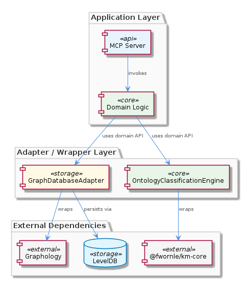
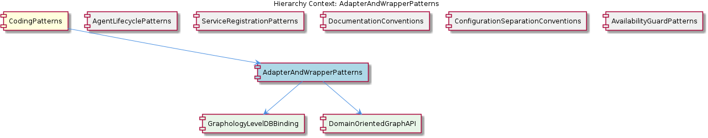

# AdapterAndWrapperPatterns

**Type:** SubComponent

Both adapters perform storage probing at initialization time (not lazily), as documented in the AvailabilityGuardPatterns context — this is a deliberate choice to fail fast rather than fail on first use.

# AdapterAndWrapperPatterns

## What It Is

AdapterAndWrapperPatterns is a SubComponent of the broader CodingPatterns family within the `integrations/mcp-server-semantic-analysis/` codebase, documenting how third-party libraries are mediated through dedicated wrapper classes before being exposed to the rest of the system. The canonical implementations live under an infrastructure-oriented directory — for example, `storage/graph-database-adapter.ts` houses the `GraphDatabaseAdapter` class — and the overall pattern is formally described in `integrations/mcp-server-semantic-analysis/docs/architecture/integration.md`.

Two concrete adapters anchor this pattern. `GraphDatabaseAdapter` wraps the Graphology graph library together with LevelDB persistence, presenting a single domain-oriented surface rather than exposing either underlying library directly. `OntologyClassificationEngine` wraps the `@fwornle/km-core` package, providing a domain-specific classification interface that insulates the rest of the codebase from `km-core`'s evolving API surface. Both serve the same architectural purpose: to confine knowledge of any given third-party API to exactly one class.

## Architecture and Design

The pattern is a textbook application of the Adapter (a.k.a. Wrapper) design pattern, but with a specific local interpretation: adapters here are *domain-oriented*, not merely interface-translating. The `DomainOrientedGraphAPI` child component captures this principle explicitly — method naming and granularity on `GraphDatabaseAdapter` are dictated by the semantics of the application's domain (ontology graphs, knowledge management nodes, classification edges), not by the verbs that Graphology or LevelDB happen to offer. This means clients never call `graph.addNode(id, attrs)` directly; they call methods that express domain intent and let the adapter translate that into the appropriate Graphology mutations and LevelDB writes.

A second architectural decision evident in `GraphDatabaseAdapter` is the deliberate *co-wrapping* of two distinct third-party systems within a single boundary. The `GraphologyLevelDBBinding` child component documents this pairing: Graphology handles in-memory graph operations while LevelDB handles on-disk persistence, and the adapter is responsible for keeping the two in coherent alignment. By treating the in-memory and persistence layers as a single atomic concern at the boundary, the rest of the codebase is freed from ever reasoning about cache coherence, write-through semantics, or load-on-demand strategies — those are entirely the adapter's problem.

The pattern also dictates *eager initialization* behavior. As cross-referenced with the sibling component `AvailabilityGuardPatterns`, both `GraphDatabaseAdapter` and `OntologyClassificationEngine` perform storage probing at initialization time rather than lazily on first use. This is a fail-fast posture: if the underlying LevelDB store is unreachable or the `@fwornle/km-core` backing data is missing, the system surfaces the failure at adapter construction rather than mid-request. Notably, this contrasts with the lazy `ensureLLMInitialized()` contract enforced for agents under the parent `CodingPatterns` umbrella — adapters and agents make opposite trade-offs because they have opposite failure economics.

## Implementation Details

`GraphDatabaseAdapter` in `storage/graph-database-adapter.ts` is the reference implementation. At construction time it instantiates a Graphology graph instance for in-memory representation and opens a LevelDB store for persistence. The initialization probe — aligned with patterns documented in `AvailabilityGuardPatterns` — verifies that the LevelDB path is accessible and that the on-disk format is readable before the adapter reports itself as ready. The adapter then exposes a domain-oriented method surface; any Graphology- or LevelDB-specific types are translated into domain types at the boundary, so callers never import from either library.

`OntologyClassificationEngine` follows the same template against a different dependency: `@fwornle/km-core`. Its constructor wires up the km-core client and performs whatever probing is needed to confirm km-core's classification corpus is loaded and usable. Clients of `OntologyClassificationEngine` ask for classifications in domain terms (e.g., classifying a code symbol against the ontology) and receive domain results; they never see km-core's request/response shapes, parameter conventions, or error taxonomy.

Because there are zero code symbols indexed for this SubComponent at the documentation layer, the pattern is best understood as a *convention enforced by code review and architecture documentation* rather than a framework class hierarchy. There is no `AbstractAdapter` base class; each adapter is a hand-written wrapper that obeys the same conventions: (1) one class per third-party dependency, (2) domain-oriented method surface, (3) eager initialization probing, (4) zero leakage of third-party types into the broader codebase.

## Integration Points

The adapters are the integration seam between the rest of `integrations/mcp-server-semantic-analysis/` and three external dependencies: Graphology, LevelDB, and `@fwornle/km-core`. By contract, no other file in the codebase should `import` from those packages — they reach those capabilities only by depending on `GraphDatabaseAdapter` or `OntologyClassificationEngine`. This makes the dependency graph extremely shallow at the integration boundary: a change in any of the three upstream libraries requires modifications in exactly one file each.

This component coexists with several sibling patterns under `CodingPatterns`. It works hand-in-hand with `AvailabilityGuardPatterns`, which justifies and standardizes the eager-probing behavior at adapter construction. It complements `AgentLifecyclePatterns` and the broader lazy-LLM contract by occupying the opposite end of the initialization spectrum — adapters initialize eagerly because their failure modes are deterministic and discoverable, whereas LLM agents initialize lazily because their resource cost is high and their use is selective. It is orthogonal to `ServiceRegistrationPatterns` (which governs process-level liveness signaling) and `ConfigurationSeparationConventions` (which governs how `config/agent-profiles.json` is structured). The pattern's full prose specification lives alongside other architectural documents at `integrations/mcp-server-semantic-analysis/docs/architecture/integration.md`, parallel to the `agents.md` document that defines the agent lifecycle conventions.

The two child components — `GraphologyLevelDBBinding` and `DomainOrientedGraphAPI` — together describe the internal anatomy of `GraphDatabaseAdapter`: the former documents the deliberate two-library pairing, the latter documents the domain-driven naming discipline imposed on the exposed API.

## Usage Guidelines

When adding a new third-party dependency to the codebase, contributors must introduce a new adapter class rather than importing the dependency from arbitrary call sites. The adapter should live alongside `GraphDatabaseAdapter` in an infrastructure directory such as `storage/` and should expose only domain-oriented methods — if the adapter's method names read like the underlying library's API, the abstraction is incomplete and will leak. Translation of types at the boundary is mandatory: third-party request, response, and error types must be converted to domain equivalents before crossing out of the adapter.

Initialization should probe the underlying resource eagerly, in line with the sibling `AvailabilityGuardPatterns`. This means the adapter's constructor (or an explicit initializer called immediately after construction) must verify that the wrapped resource is reachable and usable. Deferring this check to first use is explicitly discouraged for adapters; the project prefers loud, immediate failure at startup over silent, delayed failure during a user request. This is the opposite of the agent lifecycle contract documented in `agents.md`, and contributors should not conflate the two — agents are lazy because connections are expensive and conditional, while adapters are eager because storage probes are cheap and unconditional.

Finally, when a wrapped library releases a breaking change, the migration work is confined to a single adapter file. Reviewers should reject pull requests that propagate Graphology, LevelDB, or `@fwornle/km-core` types beyond the adapter boundary, even transitively. If a domain need genuinely requires a capability that the current adapter does not expose, the correct response is to extend the adapter's domain-oriented surface — not to bypass it. Following this discipline preserves the architectural property that motivated the pattern in the first place: third-party API churn never propagates beyond a single class per dependency.

## Hierarchy Context

### Parent
- [CodingPatterns](./CodingPatterns.md) -- [LLM] The project enforces a strict three-phase lazy initialization contract for all LLM-backed agents, documented in integrations/mcp-server-semantic-analysis/docs/architecture/agents.md. The contract mandates the sequence: constructor(repoPath, team) → ensureLLMInitialized() → execute(input). In the constructor phase, the agent captures only its configuration context (repository path and team assignment) without touching LLM infrastructure. The second phase, ensureLLMInitialized(), is an idempotent guard method that performs the actual LLM client instantiation and is designed to be safe to call multiple times — only the first call allocates resources. The third phase, execute(input), is the sole public entry point for agent work and implicitly relies on ensureLLMInitialized() having been called (either explicitly by a harness or at the top of execute() itself). This pattern is a deliberate trade-off: it keeps agent construction cheap for cases where agents are instantiated in bulk but only a subset are actually invoked, preventing unnecessary LLM connection overhead. A new contributor adding an agent must not acquire LLM connections in the constructor — doing so would break the lifecycle contract and cause resource exhaustion in orchestrator scenarios that pre-instantiate agents.

### Children
- [GraphologyLevelDBBinding](./GraphologyLevelDBBinding.md) -- GraphDatabaseAdapter (described in AdapterAndWrapperPatterns) explicitly co-wraps two distinct third-party systems — Graphology for in-memory graph operations and LevelDB for on-disk persistence — rather than using either library in isolation, which is an intentional architectural pairing.
- [DomainOrientedGraphAPI](./DomainOrientedGraphAPI.md) -- The AdapterAndWrapperPatterns description explicitly states the adapter exposes 'a domain-oriented API rather than the raw Graphology or LevelDB interfaces directly', indicating that method naming and granularity are driven by domain semantics, not library capabilities.

### Siblings
- [AgentLifecyclePatterns](./AgentLifecyclePatterns.md) -- BaseAgent subclasses documented in integrations/mcp-server-semantic-analysis/docs/architecture/agents.md all follow a constructor(repoPath, team) signature that captures only configuration context, explicitly forbidding any LLM client instantiation at this stage.
- [ServiceRegistrationPatterns](./ServiceRegistrationPatterns.md) -- scripts/api-service.js calls ProcessStateManager.registerService() immediately after process spawn, establishing the registration as the canonical signal that a service is live and trackable.
- [DocumentationConventions](./DocumentationConventions.md) -- All architecture diagrams are stored as .puml files under docs/puml/ directories, as evidenced by the documentation listing showing integrations/mcp-server-semantic-analysis/docs/architecture/ containing multiple .md files that reference PlantUML sources.
- [ConfigurationSeparationConventions](./ConfigurationSeparationConventions.md) -- config/agent-profiles.json holds runtime behavioral configuration for agents (model selection, parameters, capabilities), deliberately separated from topology concerns.
- [AvailabilityGuardPatterns](./AvailabilityGuardPatterns.md) -- isServerAvailable() is called before dynamic imports of VkbApiClient, ensuring the optional external API client is never loaded if its backing server cannot be reached.

---

*Generated from 6 observations*
