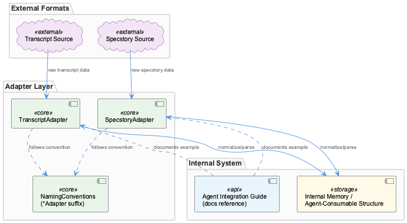
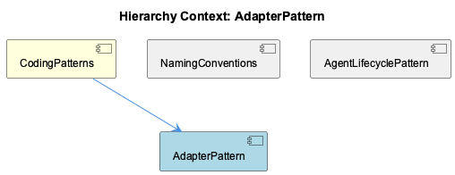

# AdapterPattern

**Type:** SubComponent

This pattern addresses integration of heterogeneous external formats, suggesting each adapter likely exposes a normalize/parse-style entry point converting raw input into the system's internal memory or agent-consumable structures

# AdapterPattern: Technical Insight Document

## What It Is

AdapterPattern is a conceptual, recurring design pattern documented within the Coding project's `docs/agent-integration-guide.md`, rather than a single centralized module or shared interface. It is best understood through its concrete instances: **TranscriptAdapter** and **SpecstoryAdapter**, both of which exist to convert external, format-specific data (transcripts, specstory data) into a common internal shape consumable by the system's memory or agent infrastructure. As a member of the CodingPatterns grouping, AdapterPattern is not owned by any single subsystem—like its parent, it is a retroactively identified convention observed across the codebase rather than a browsable, standalone component.

## Architecture and Design

The defining architectural characteristic of AdapterPattern is its **decentralization**: adapters are "recurring" rather than centralized in a shared interface or base class. This means TranscriptAdapter and SpecstoryAdapter are each implemented independently, following a similar structural shape without inheriting from or implementing a common formal contract. This is a deliberate (or emergent) trade-off—favoring implementation flexibility and low coupling over enforced consistency via abstraction.

Each adapter's implicit responsibility is to expose a normalize/parse-style entry point that ingests raw, heterogeneous external input and outputs the system's internal, agent-consumable structures. This positions AdapterPattern as an integration-boundary pattern: it isolates the complexity of external formats at the edge of the system, shielding downstream consumers (memory, agents) from format-specific variance.

## Implementation Details

Because no formal shared interface exists, the "implementation" of AdapterPattern is really the aggregate behavior of its instances. TranscriptAdapter handles transcript-formatted external data, while SpecstoryAdapter handles specstory-formatted data—both presumably implementing similar parse/normalize logic tailored to their respective input formats. The lack of a unifying abstract class or interface means each adapter's internal mechanics (parsing logic, error handling, output shaping) must be inferred from its own source rather than a shared contract. This is consistent with the broader CodingPatterns philosophy: patterns are named and recognized post-hoc based on structural similarity, not enforced through shared code.

## Integration Points

AdapterPattern has a direct structural relationship with the **NamingConventions** sub-component: the `*Adapter` naming suffix is itself one of the classifying suffixes (`*Manager`, `*Service`, `*Adapter`, `*Provider`) that NamingConventions uses to categorize classes by name rather than by directory location. This overlap means adapters are identifiable purely by their naming convention, reinforcing that classification in this system is name-driven, not structure-driven. AdapterPattern also sits alongside **AgentLifecyclePattern** as a sibling under CodingPatterns—both are inferred from repeated structural similarity across the codebase rather than from a shared interface, suggesting a broader project-wide tendency toward convention-based rather than contract-based architecture. Documented within `docs/agent-integration-guide.md`, AdapterPattern is explicitly tied to the agent integration surface of the system.

## Usage Guidelines

New adapters should be added by following the existing TranscriptAdapter and SpecstoryAdapter examples as templates rather than expecting or requiring a formal abstract base class or interface contract. Developers should name new adapter classes with the `*Adapter` suffix to remain consistent with NamingConventions and to preserve discoverability. Each new adapter should implement a normalize/parse-style entry point converting its specific external format into the system's common internal shape. Because there is no enforced contract, developers should exercise discipline in mirroring the structure of existing adapters to maintain consistency, and should consult `docs/agent-integration-guide.md` and `docs/architecture/` for onboarding rather than searching for a dedicated AdapterPattern module, since—like its parent CodingPatterns—this pattern has no dedicated source directory of its own.

## Hierarchy Context

### Parent
- [CodingPatterns](./CodingPatterns.md) -- [LLM] CodingPatterns has no dedicated source directory or module of its own within the Coding project; it exists purely as a conceptual grouping label applied during component analysis to catch conventions that recur across many subsystems but are not owned by any single one. A new developer searching for 'CodingPatterns.ts' or 'patterns/' will find nothing—the actual pattern implementations live scattered inside the real subsystems (wave agents, adapters, managers) and are only retroactively categorized as 'CodingPatterns' during architecture synthesis. This means any onboarding effort to understand this component should redirect to CLAUDE.md and docs/architecture/ rather than expecting a browsable codebase location.

### Siblings
- [NamingConventions](./NamingConventions.md) -- The convention classifies classes by suffix pattern (e.g., *Manager, *Service, *Adapter, *Provider) rather than by directory location, meaning classification is name-driven not structure-driven
- [AgentLifecyclePattern](./AgentLifecyclePattern.md) -- The pattern is described as 'potentially used' by wave/agent components, indicating it was inferred from repeated structural similarity rather than a shared interface or abstract class

---

*Generated from 5 observations*
