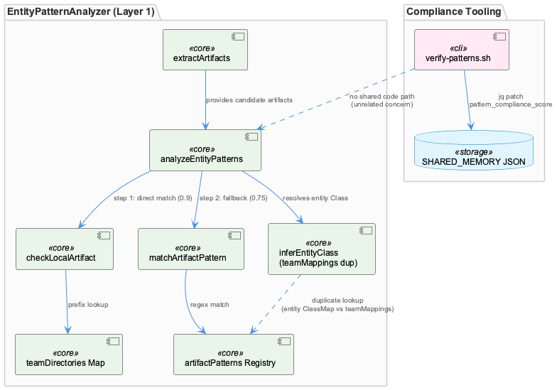
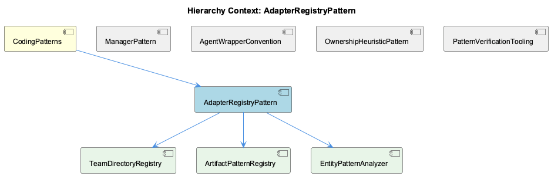

# AdapterRegistryPattern

**Type:** SubComponent

[Architecture Notes] EntityPatternAnalyzer.ts has no external dependencies beyond its own types.js import — all classification data (directories, regex patterns, class maps) is inlined in the constructor rather than loaded from config, contrasting with the config-driven design attributed to <AWS_SECRET_REDACTED> in the parent context; Confidence scores (0.9 direct match, 0.75 pattern match) are hardcoded constants in the method bodies rather than named class constants or config values; verify-patterns.sh performs its own ad hoc metrics gathering (ripgrep counts) and writes results directly into a shared JSON file via jq, without going through EntityPatternAnalyzer or any shared classification component — indicating no shared code path between the TS classification logic and the shell-script compliance checks despite both being nominally under 'knowledge-management'; Performance is explicitly tracked in analyzeEntityPatterns via `performance.now()` deltas attached to the returned LayerResult, suggesting this analyzer is one 'layer' in a multi-layer pipeline (the file's own header comment says 'Layer 1: File/Artifact Detection'), implying sibling Layer 2+ analyzers exist elsewhere but are not present in the provided code files

# AdapterRegistryPattern — Technical Insight Document

## What It Is

AdapterRegistryPattern is a SubComponent of CodingPatterns whose primary concrete realization lives in `src/ontology/heuristics/EntityPatternAnalyzer.ts`. It represents a "data-driven registry" variant of the classic adapter-registry idiom: rather than instantiating adapter objects (as implied by naming like ProviderRegistryManager or SpecstoryAdapter/TranscriptAdapter elsewhere in the system), the component encodes its registries as plain data structures — a `Map` and array literals — consulted by lookup methods. Its children, TeamDirectoryRegistry and ArtifactPatternRegistry, are the two concrete tables that make up this registry (`teamDirectories` and `artifactPatterns` respectively), while EntityPatternAnalyzer is the class that owns and traverses them. A second, structurally unrelated artifact — `scripts/knowledge-management/verify-patterns.sh` — is also grouped under this SubComponent, though observations indicate it has no code-level relationship to the TypeScript classification logic.

## Architecture and Design

The core architectural decision is to represent team/entity ownership knowledge as immutable, hand-authored data rather than polymorphic adapter classes. `teamDirectories` (a `Map<string, string[]>`) and `artifactPatterns` (an array of `{team, patterns: RegExp[], entityClassMap}` records) are both built once in the EntityPatternAnalyzer constructor (lines 31-77) and never mutated — the "intelligence" of the analyzer is data, not control flow, echoing the config-over-code philosophy attributed to sibling Classifier components (<AWS_SECRET_REDACTED>) in the parent CodingPatterns context.

Resolution follows a chain-of-responsibility / tiered-confidence pattern inside `analyzeEntityPatterns` (lines 90-127): `checkLocalArtifact` performs a direct prefix match against TeamDirectoryRegistry's `teamDirectories` map (confidence 0.9), and only on a miss does `matchArtifactPattern` fall back to regex matching against ArtifactPatternRegistry's `artifactPatterns` (confidence 0.75). This encodes an explicit trust hierarchy: directory placement (enforced by repo structure) is trusted more than naming conventions (which can drift) — a defensible, if hardcoded, design choice.

Notably, this pattern diverges from the parent's Manager-suffix convention: as the ManagerPattern sibling observes, EntityPatternAnalyzer has no init/start/stop lifecycle, no mutable counters, and no connect/disconnect semantics — it's a stateless classifier over frozen construction-time data, showing that the Manager naming convention is not universal across CodingPatterns.

## Implementation Details

`extractArtifacts` (lines 136-158) runs four independent regex passes — file paths, npm scoped packages, class names matching a Service|Agent|Manager|Engine|Handler|Analyzer|Classifier|Filter|Monitor suffix set, and bare directory prefixes — accumulating results into a single `Set<string>` for deduplication. This suffix enumeration is simultaneously a consumer and a validator of the naming convention CodingPatterns documents as informal architecture: the file uses the convention to detect ownership, which is itself evidence the convention is machine-detectable.

`checkLocalArtifact` (lines 166-179) does an O(teams) prefix match via `Array.prototype.startsWith` against TeamDirectoryRegistry. `inferEntityClass` (from ~line 200, truncated in the excerpt) hardcodes a `teamMappings` record covering Coding, RaaS, ReSi, Agentic, and UI teams — this duplicates the `entityClassMap` fields already embedded in ArtifactPatternRegistry's records, creating two parallel, manually-synchronized sources of truth for team→entityClass associations. Confidence values (0.9, 0.75) are hardcoded magic numbers in method bodies rather than named constants or config, a further departure from the config-driven philosophy of sibling classifiers.

The unrelated `verify-patterns.sh` (lines 26-45, 150-165) operates independently: it greps for `console.log` vs `Logger.*` and `useState` vs Redux usage, scores compliance, and patches `metadata.last_pattern_verification`/`pattern_compliance_score` into a shared JSON file via `jq` when `$SHARED_MEMORY` exists — entirely disjoint from EntityPatternAnalyzer's classification logic.

## Integration Points

EntityPatternAnalyzer.ts has no external dependencies beyond its own `types.js` import — all classification data is inlined rather than loaded from config, contrasting with the config-driven design of parent-context classifiers. The analyzer tracks its own performance via `performance.now()` deltas attached to a returned `LayerResult`, and its header comment identifies it as "Layer 1: File/Artifact Detection," implying sibling Layer 2+ analyzers exist in the broader ontology/heuristics pipeline but are not present in the provided files.

The PatternVerificationTooling and OwnershipHeuristicPattern siblings both describe the same `checkLocalArtifact`/`matchArtifactPattern` cascade, confirming this analyzer is the shared implementation point for multiple conceptual framings (ownership heuristics, pattern verification, agent-wrapper conventions) layered atop the same code. The xaml_viewmodel WPF test fixtures under `integrations/graphify/tests/fixtures` are unrelated to this component's logic and appear co-located only incidentally.

## Usage Guidelines

Developers extending team or entity coverage should add entries to the existing `teamDirectories` and `artifactPatterns` tables directly in the constructor — there is no polymorphic extension point (no adapter classes to register), so "adding a team" means editing this file, not registering a new object elsewhere. Critically, any new team must be added to **both** `entityClassMap` (in artifactPatterns) and `teamMappings` (in `inferEntityClass`) to avoid the duplicated-source-of-truth drift already flagged as a maintenance risk. Given the hardcoded confidence scores and inlined data, teams considering a move toward the config-driven approach used by <AWS_SECRET_REDACTED> should treat this as a known technical-debt item. Finally, when navigating this SubComponent, keep in mind it bundles two genuinely unrelated concerns — semantic team/entity classification (EntityPatternAnalyzer and its registries) and static-analysis linting (verify-patterns.sh) — so changes to one should not be assumed to affect the other.

## Hierarchy Context

### Parent
- [CodingPatterns](./CodingPatterns.md) -- [LLM] The Manager-suffix naming convention observed across LLMServiceProvider, MockModeManager, CachingMechanism, CircuitBreakerManager, and BudgetTracker reflects a deliberate architectural choice to encapsulate stateful, cross-cutting concerns behind a consistent interface shape. New developers should expect any class named *Manager to expose lifecycle methods (init/start/stop or similar), own some internal mutable state (cache entries, circuit state, budget counters), and be instantiated once per service boundary rather than per-request. This convention makes it easy to locate resilience and resource-control logic by grep'ing for 'Manager' across the codebase, and it implies that when adding a new cross-cutting concern (e.g., rate limiting), the idiomatic approach is to add a RateLimitManager sibling rather than embedding the logic inline in provider code.

### Children
- [TeamDirectoryRegistry](./TeamDirectoryRegistry.md) -- [LLM] EntityPatternAnalyzer.ts implements a two-tier team-classification heuristic entirely through data structures rather than polymorphism: `teamDirectories` (a `Map<string, string[]>`) drives `checkLocalArtifact` via `Array.prototype.startsWith` prefix matching, while `artifactPatterns` (an array of `ArtifactPattern` objects each holding `RegExp[]` plus an `entityClassMap`) drives `matchArtifactPattern` via `RegExp.test`. Both are private readonly fields populated once in the constructor and never mutated afterward, so the class behaves as an immutable, hand-authored lookup table wrapped in a thin traversal API — the entire 'intelligence' of the Layer-1 analyzer is data, not logic.
- [ArtifactPatternRegistry](./ArtifactPatternRegistry.md) -- [LLM] `EntityPatternAnalyzer` (src/ontology/heuristics/EntityPatternAnalyzer.ts) implements a data-driven registry rather than an object-oriented adapter registry: `teamDirectories` is a `Map<string, string[]>` built once in the constructor, and `artifactPatterns` is an `ArtifactPattern[]` array literal combining `RegExp[]` with an `entityClassMap`. No adapter classes are instantiated — the 'registry' is just structured data consulted by two private methods (`checkLocalArtifact`, `matchArtifactPattern`), which keeps the component allocation-free and trivially serializable, but also means there is no polymorphic extension point: adding a new team requires editing this file directly rather than registering a new adapter object elsewhere.
- [EntityPatternAnalyzer](./EntityPatternAnalyzer.md) -- [CGR] EntityPatternAnalyzer (class) in EntityPatternAnalyzer.ts

### Siblings
- [ManagerPattern](./ManagerPattern.md) -- [LLM] EntityPatternAnalyzer (src/ontology/heuristics/EntityPatternAnalyzer.ts) is suffixed 'Analyzer', not 'Manager', yet it structurally resembles the Manager convention described for the parent: it builds two readonly, immutable collections in its constructor — `teamDirectories` (a `Map<string, string[]>`) and `artifactPatterns` (an array of `{team, patterns: RegExp[], entityClassMap}` objects) — and exposes exactly one lifecycle-free public method, `analyzeEntityPatterns()`. Unlike the CircuitBreakerManager/BudgetTracker pattern described in the parent observations, there is no init/start/stop, no mutable counters, and no connect/disconnect semantics; the class is effectively a stateless classifier over data frozen at construction time. This is evidence the 'Manager' suffix convention is NOT universal — naming diverges for components whose job is pure classification rather than owning a stateful external resource.
- [AgentWrapperConvention](./AgentWrapperConvention.md) -- [LLM] src/ontology/heuristics/EntityPatternAnalyzer.ts implements a two-step, confidence-scored team-attribution heuristic: analyzeEntityPatterns() first calls extractArtifacts() to pull file paths, npm scopes, class names (via a Service|Agent|Manager|Engine|Handler|Analyzer|Classifier|Filter|Monitor suffix regex), and bare directory prefixes out of free-text knowledge content, then tries checkLocalArtifact() (directory-prefix match against the teamDirectories Map, confidence 0.9) before falling back to matchArtifactPattern() (regex match against artifactPatterns, confidence 0.75). This mirrors the parent's documented Classifier-suffix convention (<AWS_SECRET_REDACTED>) but is notably NOT YAML-driven — the team directories and regex patterns are hardcoded TypeScript literals in the constructor, contradicting the 'classification thresholds and categories are treated as data, not code' philosophy described for prompt-classifier.yaml elsewhere in the system.
- [OwnershipHeuristicPattern](./OwnershipHeuristicPattern.md) -- [LLM] EntityPatternAnalyzer (src/ontology/heuristics/EntityPatternAnalyzer.ts) implements the ownership heuristic as a two-step cascade inside analyzeEntityPatterns(): step (a) checkLocalArtifact() does an O(teams) prefix match against a hardcoded teamDirectories Map (e.g. 'src/ontology', 'src/knowledge-management', 'src/live-logging', 'scripts', '.specstory' → 'Coding'), and only if that misses does step (b) matchArtifactPattern() fall back to a set of per-team RegExp arrays (artifactPatterns) keyed on class-name suffixes like *Manager, *Classifier, *Analyzer. This ordering encodes an explicit confidence hierarchy: a direct path match returns confidence 0.9 while a naming-convention match returns 0.75, meaning the heuristic trusts 'where a file lives' strictly more than 'what a class is called' — a defensible choice given that directory placement is enforced by repo structure while naming conventions can drift.
- [PatternVerificationTooling](./PatternVerificationTooling.md) -- [LLM] EntityPatternAnalyzer (src/ontology/heuristics/EntityPatternAnalyzer.ts) implements the PatternVerificationTooling component's core classification logic as a two-step, two-layer detector: `checkLocalArtifact` performs a direct team-directory prefix match (via the `teamDirectories` Map, confidence 0.9) before falling back to `matchArtifactPattern`, which runs a table of per-team regexes (`artifactPatterns`, confidence 0.75) against extracted artifact strings. This mirrors the 'Manager wraps external resource lifecycle' and 'registry + adapter' idioms noted in the parent context: rather than a single monolithic dispatcher, ownership resolution is data-driven (the `entityClassMap` and `teamDirectories` tables) so adding a new team means appending to a table, not editing `analyzeEntityPatterns`'s control flow — the same config-over-code philosophy attributed to <AWS_SECRET_REDACTED> in the parent observations.

---

*Generated from 9 observations*
