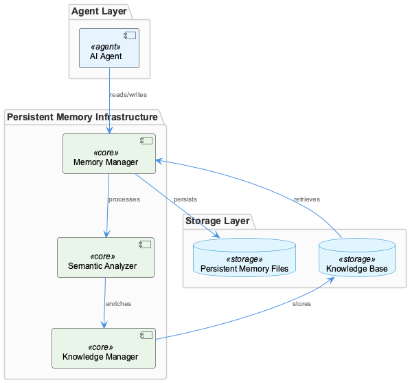
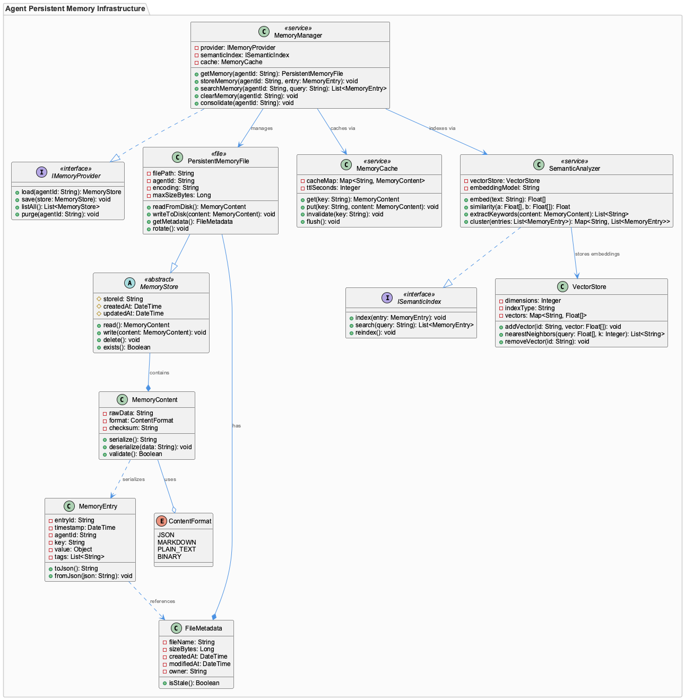
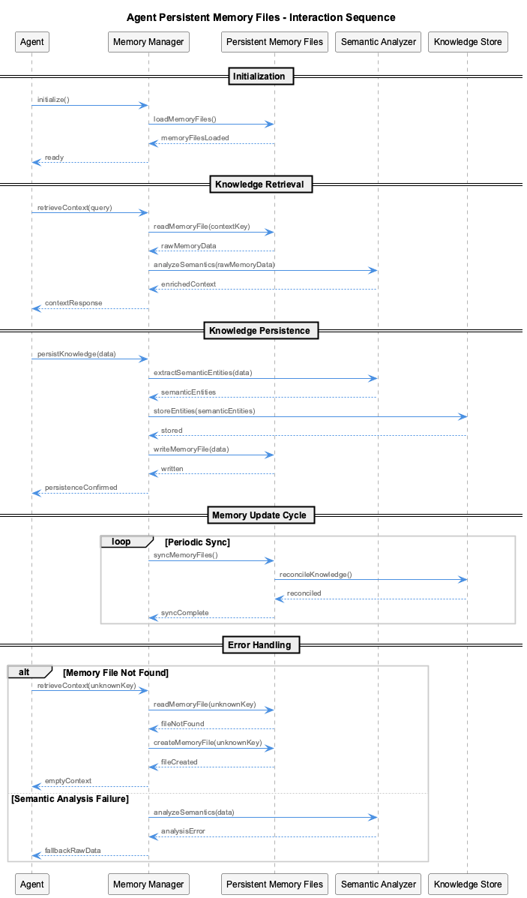
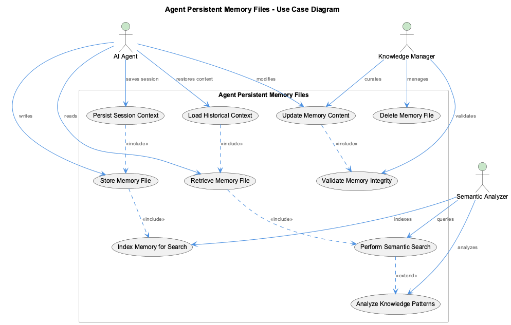

# Agent Persistent Memory Files

**Type:** Detail

Agent Persistent Memory Files is part of the semantic analysis and knowledge management infrastructure

# Agent Persistent Memory Files — Technical Insight Document

## What It Is

Agent Persistent Memory Files are part of the semantic analysis and knowledge management infrastructure. Full implementation details — specific file paths, class names, and functions — are pending complete codebase analysis, so this document reflects what is currently observed rather than speculating beyond that.

## Architecture and Design

The concept of persistent memory files for agents implies a file-backed storage mechanism that allows agents to retain context across sessions. This positions it within the knowledge management layer of the system.

Without confirmed code paths, specific architectural patterns cannot be grounded. Further codebase analysis is needed to identify the actual storage format, read/write patterns, and structural decisions.

## Implementation Details

Implementation details are pending full codebase analysis. Key questions to resolve include: what file format is used for persistence, how memory files are scoped per agent, and what read/write lifecycle governs updates.

## Integration Points

As part of the semantic analysis and knowledge management infrastructure, these files likely integrate with agent runtime components and any retrieval or indexing systems. Specific interfaces and dependencies remain to be documented.

## Usage Guidelines

Guidelines will be defined once implementation details are confirmed. Developers should watch for documentation updates as codebase analysis completes.

---

## Architectural Analysis Summary

1. **Architectural patterns identified:** File-backed persistence for agent state (to be confirmed).
2. **Design decisions and trade-offs:** Insufficient grounded data to assess.
3. **System structure insights:** Sits within the knowledge management infrastructure layer.
4. **Scalability considerations:** Depend on storage format and per-agent scoping strategy — TBD.
5. **Maintainability assessment:** Cannot be assessed without concrete implementation paths. Priority is completing codebase analysis to ground future documentation.

---

*Generated from 2 observations*
