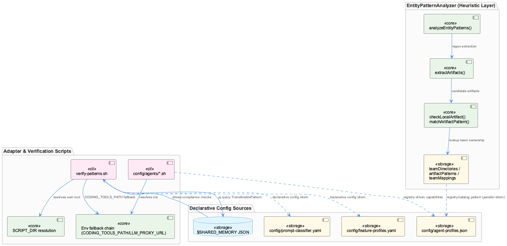
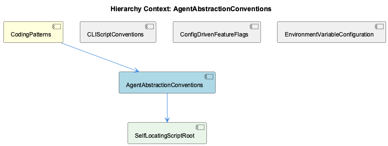

# AgentAbstractionConventions

**Type:** SubComponent

[Code References] src/ontology/heuristics/EntityPatternAnalyzer.ts - teamDirectories map and artifactPatterns array define declarative team-ownership rules; src/ontology/heuristics/EntityPatternAnalyzer.ts - analyzeEntityPatterns() method: Layer-1 entry point returning LayerResult with confidence/evidence; src/ontology/heuristics/EntityPatternAnalyzer.ts - extractArtifacts() private method: regex-based file path/npm package/class name extraction; src/ontology/heuristics/EntityPatternAnalyzer.ts - checkLocalArtifact() and matchArtifactPattern() private methods: two-tier confidence match logic; src/ontology/heuristics/EntityPatternAnalyzer.ts - inferEntityClass() teamMappings object: contains 'Agentic' team entry absent from teamDirectories/artifactPatterns; scripts/knowledge-management/verify-patterns.sh - SCRIPT_DIR/DEFAULT_REPO/CLAUDE_REPO resolution block: relocatable path convention; scripts/knowledge-management/verify-patterns.sh - jq query against $SHARED_MEMORY for TransferablePattern entities driving dynamic pattern checks

# AgentAbstractionConventions

## What It Is

AgentAbstractionConventions is the SubComponent of CodingPatterns that generalizes the vendor-normalization idea introduced by the `config/agents/*.sh` adapter scripts (`claude.sh`, `copilot.sh`, `opencode.sh`, `pi.sh`) into a set of reusable conventions applied elsewhere in the codebase. Two concrete manifestations anchor this entity: `scripts/knowledge-management/verify-patterns.sh`, a Bash pattern-compliance auditor, and `src/ontology/heuristics/EntityPatternAnalyzer.ts`, a TypeScript Layer-1 classification engine that maps artifacts to owning teams. Both demonstrate how the same normalization and self-location ideas established for agent adapters recur at different layers of the system — shell tooling and in-process heuristics alike.

## Architecture and Design

The defining architectural trait shared with sibling components CLIScriptConventions and EnvironmentVariableConfiguration is the environment-variable-with-fallback idiom: `verify-patterns.sh` resolves its repo root via `CLAUDE_REPO="${CODING_TOOLS_PATH:-${CODING_REPO:-$DEFAULT_REPO}}"`, mirroring the `LLM_PROXY_URL`/`RAPID_LLM_PROXY_URL` fallback chain used by the agent adapter scripts. This makes any `bin/`- or `scripts/`-level executable relocatable and safely invocable from CI, cron, or an arbitrary submodule checkout. The child component SelfLocatingScriptRoot documents the underlying mechanism: `SCRIPT_DIR="$(cd "$(dirname "${BASH_SOURCE[0]}")" && pwd)"` followed by a two-level-up walk to derive `DEFAULT_REPO`, a solution that is correct only as long as the script remains at its assumed path depth.

A second pattern — registry/catalog-driven behavior over hardcoded branching — appears in both implementations. `verify-patterns.sh` reads `$SHARED_MEMORY` via `jq -r '.entities[] | select(.entityType == "TransferablePattern" and .significance >= 8) | .name'`, meaning its verification scope is extensible by editing a JSON knowledge-base entity rather than the script itself. `EntityPatternAnalyzer` echoes this with declarative lookup tables (`teamDirectories`, `artifactPatterns`) rather than conditional logic — but, notably, as sibling ConfigDrivenFeatureFlags observes, this is an *inversion* of the file-driven convention: the "config" lives in TypeScript object literals, not an external YAML/JSON file, diverging from the config-first pattern used by OntologyClassifier and SensitivityClassifier elsewhere.

## Implementation Details

`EntityPatternAnalyzer.extractArtifacts` performs layered regex extraction — file paths, npm scoped packages, class names ending in `Service|Agent|Manager|Engine|Handler|Analyzer|Classifier|Filter|Monitor`, and bare directory prefixes — accumulating candidates into a `Set<string>` to dedupe. `analyzeEntityPatterns` then iterates candidates and returns on the first Layer-1 match, timing itself with `performance.now()` to honor the documented sub-millisecond response contract. Classification uses a two-tier confidence design: `checkLocalArtifact` yields 0.9 confidence for direct directory/path matches, while `matchArtifactPattern` yields 0.75 for fuzzy class-name regex matches (e.g., `LSL(Session|Monitor|Classifier)` → `Coding` team). This keeps the heuristic cheap enough to run ahead of costlier classification layers without requiring ML/embeddings.

A structural weakness is that team/entity mappings are duplicated across three data structures in the same file — `teamDirectories`, `artifactPatterns`, and `teamMappings` inside `inferEntityClass` — and these have already drifted: an `Agentic` team entry exists in `teamMappings` with no counterpart in `teamDirectories` or `artifactPatterns`.

`verify-patterns.sh` complements this by strictly separating detection from mutation: it never edits source files, only writing to a temp report and the `$SHARED_MEMORY` metadata file, and instead suggests a follow-up remediation command (e.g., `rg "console\.log" ... | xargs sed -i ''`) for the user to run manually.

## Integration Points

This entity sits beneath parent CodingPatterns alongside CLIScriptConventions, ConfigDrivenFeatureFlags, and EnvironmentVariableConfiguration, sharing the fallback-chain and single-purpose-executable idioms with each. Its child, SelfLocatingScriptRoot, supplies the concrete root-resolution mechanism that `verify-patterns.sh` depends on. `EntityPatternAnalyzer` performs no I/O, is purely regex/data-table driven, and integrates as an early, cheap Layer-1 stage ahead of more expensive downstream classification. `verify-patterns.sh` integrates with the knowledge base through `$SHARED_MEMORY` JSON, coupling its behavior to `TransferablePattern` entities of sufficient significance.

## Usage Guidelines

When extending team-ownership rules in `EntityPatternAnalyzer`, all three internal tables (`teamDirectories`, `artifactPatterns`, `teamMappings`) must be updated consistently — the existing `Agentic` drift is a cautionary example of what happens otherwise; consider consolidating into a single source of truth or externalizing to config, consistent with the pattern used elsewhere for OntologyClassifier. New verification checks should be added via `$SHARED_MEMORY` entities rather than editing `verify-patterns.sh` directly. Scripts built under this convention should follow SelfLocatingScriptRoot's self-location approach but should be aware of its brittleness relative to alternatives like `git rev-parse --show-toplevel`. Finally, tools intended for unattended/CI execution should preserve the detection/remediation separation demonstrated by `verify-patterns.sh` — reporting problems via metadata files rather than mutating source directly.

## Hierarchy Context

### Parent
- [CodingPatterns](./CodingPatterns.md) -- [LLM] The config/agents/*.sh scripts (claude.sh, copilot.sh, opencode.sh, pi.sh) implement a uniform adapter pattern where each script normalizes a different vendor CLI into a common invocation contract described in docs/architecture/agent-abstraction-api.md. Concretely, each script accepts the same positional arguments and environment variables (e.g., LLM_PROXY_URL, CODING_OPENCODE_MODEL), performs argument translation specific to its backend binary, and emits output in a shared format consumable by the orchestrator layer. This lets the rest of the system (e.g., wave-controller.ts or any dispatcher invoking these scripts) remain agnostic to which underlying agent CLI is actually installed—new agents can be onboarded by adding a new script that satisfies the same contract rather than modifying core dispatch logic, as described in docs/architecture/adding-new-agent.md.

### Children
- [SelfLocatingScriptRoot](./SelfLocatingScriptRoot.md) -- [LLM] `scripts/knowledge-management/verify-patterns.sh` establishes its own root via `SCRIPT_DIR="$(cd "$(dirname "${BASH_SOURCE[0]}")" && pwd)"` and then derives `DEFAULT_REPO` by walking two levels up (`dirname "$(dirname "$SCRIPT_DIR")"`), with an explicit comment documenting the assumed depth ('This script is at: scripts/knowledge-management/verify-patterns.sh / Coding root is 2 levels up'). This is a brittle-by-construction form of self-location: it is correct only as long as the script stays at exactly that path depth, and unlike a `git rev-parse --show-toplevel` approach, a future file move would silently compute the wrong root rather than fail loudly, since `DEFAULT_REPO` is only ever a fallback and errors would surface downstream (e.g. a missing `.data/knowledge-export` directory) rather than at the point of computation.

### Siblings
- [CLIScriptConventions](./CLIScriptConventions.md) -- [LLM] The config/agents/*.sh adapter pattern described in the parent context is one instance of a broader convention visible in scripts/knowledge-management/verify-patterns.sh: shell scripts in this codebase are written as self-contained, idempotent CLI tools that resolve their own root directory via `SCRIPT_DIR="$(cd "$(dirname "${BASH_SOURCE[0]}")" && pwd)"` and then derive a repo-relative path (`DEFAULT_REPO="$(dirname "$(dirname "$SCRIPT_DIR")")"`), overridable via `CODING_TOOLS_PATH`/`CODING_REPO` env vars. This mirrors the env-var-driven configuration idiom (LLM_PROXY_URL, QWEN_LOCAL_API_KEY) at the shell-script layer: no script hardcodes an absolute path, so the same script works whether invoked from bin/, cron, or CI.
- [ConfigDrivenFeatureFlags](./ConfigDrivenFeatureFlags.md) -- [LLM] The EntityPatternAnalyzer class in src/ontology/heuristics/EntityPatternAnalyzer.ts embodies the config-driven feature flags idea from the parent context, but inverted: instead of an external YAML/JSON file like config/feature-profiles.yaml, the classification rules are hardcoded as in-memory data structures (`teamDirectories: Map<string, string[]>` and `artifactPatterns: ArtifactPattern[]`) built inside the constructor. This is a notable deviation from the declarative-config convention described for OntologyClassifier and SensitivityClassifier elsewhere in the codebase — here the 'declarative catalog' is TypeScript object literals rather than a parseable file, meaning changes to team ownership (e.g., adding a new team or artifact pattern) require a code change and rebuild rather than a config PR, undermining the stated goal of behavior changes shipping without TypeScript/JS edits.
- [EnvironmentVariableConfiguration](./EnvironmentVariableConfiguration.md) -- [LLM] The parent context describes environment-variable-driven configuration (LLM_PROXY_URL, RAPID_LLM_PROXY_URL, QWEN_LOCAL_API_KEY, QWEN_LAPTOP_API_BASE_URL, GSD_BROWSER_BROWSER_PATH) as a pervasive but informally-enforced convention with no central schema validator. This is corroborated by scripts/knowledge-management/verify-patterns.sh, which itself resolves its own root path via an environment-variable fallback chain: `CLAUDE_REPO="${CODING_TOOLS_PATH:-${CODING_REPO:-$DEFAULT_REPO}}"`. This is the same PROVIDER_ROLE_PURPOSE-style layering described for LLM integrations, but applied to repo-root discovery — a script that must run correctly whether invoked from CI, a cron job, or a developer's shell, none of which can be assumed to have identical environment setup.

---

*Generated from 9 observations*
