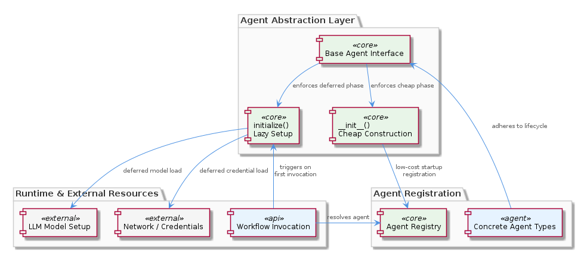
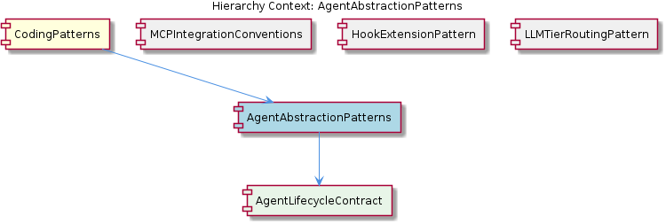

# AgentAbstractionPatterns

**Type:** SubComponent

docs/puml/agent-integration-flow.puml diagrams the sequence where agent objects are registered at startup but LLM setup is deferred until the first workflow invocation, illustrating why eager construction would break startup performance

# AgentAbstractionPatterns — Technical Insight Document

## What It Is

AgentAbstractionPatterns is a SubComponent within the broader CodingPatterns hierarchy that codifies the abstraction layer governing how agent objects are defined, constructed, and brought to a ready-to-execute state. Its canonical references live in `docs/puml/agent-abstraction-architecture.puml`, which captures the base agent interface, and `docs/puml/agent-integration-flow.puml`, which traces the temporal sequence of agent registration versus first invocation. Complementary prose documentation resides under `integrations/mcp-server-semantic-analysis/docs/architecture/agents.md` (describing the Agent Architecture and its initialization lifecycle) and `integrations/mcp-server-semantic-analysis/docs/architecture/integration.md` (covering Integration Patterns that rely on cheaply constructable agents).

At its core, this pattern enforces a two-phase lifecycle for every agent type: a lightweight constructor responsible only for storing configuration references, followed by an explicit `initialize()` method (or equivalent lazy property) that performs the expensive setup work. This separation is not optional — it is the contract that the surrounding system assumes when registering large numbers of agent classes at startup.

As a child of CodingPatterns, AgentAbstractionPatterns inherits and operationalizes the parent's "Agent Lazy-Initialization Pattern" — providing the concrete abstraction surface through which that idiom is enforced. In turn, it contains AgentLifecycleContract as its sole child, which encapsulates the formal constructor/initialize() split documented in the PlantUML class diagram.

## Architecture and Design

The architectural approach evident from the observations follows a deferred-initialization design pattern, expressed through a common base interface. The base agent interface defined in `docs/puml/agent-abstraction-architecture.puml` is the shared contract that all concrete agent implementations must adhere to. This interface deliberately splits object existence from object readiness — a distinction that matters because instantiation cost must remain negligible while readiness cost (network calls, credential validation, model loading) is allowed to be expensive.

The sequence captured in `docs/puml/agent-integration-flow.puml` makes the rationale explicit: agent objects are registered at startup, but LLM setup is deferred until the first workflow invocation actually requires that agent. If construction were eager, registering N agent types would mean paying N times the connection-setup cost during boot, even though only a subset of those agents will be invoked in any given workflow. The architecture therefore treats the registry as a cheap catalog and the `initialize()` call as the moment of resource acquisition.

This design parallels what its siblings establish in other architectural dimensions. While MCPIntegrationConventions standardizes directory structure for integrations, HookExtensionPattern standardizes data formats between Claude Code and consumers, and LLMTierRoutingPattern standardizes model-tier selection, AgentAbstractionPatterns standardizes the *temporal lifecycle* of agent objects. Together these siblings form a coherent set of conventions covering layout, contracts, routing, and lifecycle.

## Implementation Details

The implementation centers on a base agent interface (diagrammed in `docs/puml/agent-abstraction-architecture.puml`) that prescribes the constructor/initialize() split. Concrete agent types inherit from this interface and are obligated to honor the contract: the `__init__` body must contain no network calls, no credential validation, and no model loading. All such operations are relegated to `initialize()`, `setup()`, or a lazy property that triggers on first access.

The integration flow shown in `docs/puml/agent-integration-flow.puml` reveals the runtime mechanics. At system startup, the registration phase instantiates every available agent class — but because constructors only store configuration references, this phase completes <USER_ID_REDACTED> regardless of how many agent types exist. When a workflow first invokes a specific agent, that agent's `initialize()` method runs, establishing the LLM connection lazily. Subsequent invocations within the same workflow reuse the already-initialized state.

The AgentLifecycleContract child entity formalizes this mechanism. It is the concrete encoding of the constructor/initialize() split within the abstraction layer, and it is what `docs/puml/agent-abstraction-architecture.puml` ultimately documents at the class level. New agent implementations satisfy AgentAbstractionPatterns precisely by implementing AgentLifecycleContract correctly.

## Integration Points

AgentAbstractionPatterns connects to the rest of the system through two primary surfaces. First, the prose documentation at `integrations/mcp-server-semantic-analysis/docs/architecture/agents.md` describes how the initialization lifecycle is expected to be implemented by all agent classes within that integration, anchoring the pattern in a concrete deployment context. Second, `integrations/mcp-server-semantic-analysis/docs/architecture/integration.md` documents how Integration Patterns depend on agents being cheaply constructable — meaning the broader integration layer is a downstream consumer of the guarantees that AgentAbstractionPatterns provides.

The upward dependency points to CodingPatterns, the parent component that articulates the lazy-initialization idiom in general terms across the entire Coding project. AgentAbstractionPatterns is the specific abstraction surface through which that project-wide idiom is enforced for agent classes. The downward dependency points to AgentLifecycleContract, which is the concrete contract that any agent subclass must implement.

Horizontally, the pattern coexists with the MCP-related conventions established by its siblings. While MCPIntegrationConventions, HookExtensionPattern, and LLMTierRoutingPattern govern different aspects of the integration architecture, all four siblings share the same documentation conventions and live within the broader `integrations/mcp-server-semantic-analysis/` and `integrations/mcp-constraint-monitor/` documentation trees.

## Usage Guidelines

When implementing a new agent that must conform to AgentAbstractionPatterns, the cardinal rule is unambiguous: **all network calls, credential validation, and model-loading logic must reside inside `initialize()` or a lazy property — never inside `__init__` or any constructor body**. The constructor's only legitimate work is storing configuration references such as model identifiers, prompt templates, or routing parameters. Violating this convention will break the startup performance characteristics that the rest of the system assumes, because the registration phase batches construction across many agent types.

Developers should consult `docs/puml/agent-abstraction-architecture.puml` to confirm the exact shape of the base interface before subclassing, and review `docs/puml/agent-integration-flow.puml` to understand when their `initialize()` method will be invoked relative to registration and workflow execution. The prose in `integrations/mcp-server-semantic-analysis/docs/architecture/agents.md` provides the authoritative description of the expected initialization lifecycle, and any new agent should be reviewed against that document.

For scalability, the lazy pattern means the system can register an arbitrarily large catalog of agent types with constant-time-per-agent startup cost. Initialization cost is paid only for agents actually invoked, on demand, distributing the load across workflow execution rather than concentrating it at boot. This trade-off accepts a small first-invocation latency penalty for each agent in exchange for fast startup and reduced resource consumption when many registered agents go unused.

For maintainability, the abstraction's strength lies in its uniformity: because every agent honors the same lifecycle contract via AgentLifecycleContract, integration code can treat all agents polymorphically — registering them, invoking `initialize()` on first use, and dispatching workflow calls without special-casing. The principal maintenance risk is the silent erosion of the contract: a contributor who places expensive work in `__init__` will not immediately break tests but will gradually degrade startup performance. Code review and documentation references to `docs/puml/agent-abstraction-architecture.puml` are the primary defenses against this drift.

## Hierarchy Context

### Parent
- [CodingPatterns](./CodingPatterns.md) -- [LLM] Agent Lazy-Initialization Pattern: Across the Coding project's agent implementations, a consistent lazy-initialization idiom is applied where LLM client setup is deferred until actual execution rather than performed at construction time. This pattern is documented in docs/puml/agent-integration-flow.puml and docs/puml/agent-abstraction-architecture.puml. The motivation is to avoid paying the cost of LLM connection setup (which may involve network calls, credential validation, and model loading) when an agent object is instantiated—particularly important in systems where many agent types are registered but only a subset are invoked per workflow. A new developer working on an agent should expect a two-phase lifecycle: a lightweight constructor that stores configuration references, followed by an initialize() or setup() method (or equivalent lazy property) that establishes the actual LLM connection on first use. Violating this convention by eagerly connecting in the constructor would break the startup performance characteristics that the rest of the system assumes.

### Children
- [AgentLifecycleContract](./AgentLifecycleContract.md) -- docs/puml/agent-abstraction-architecture.puml documents the base agent interface that enforces the constructor/initialize() split as the canonical lifecycle contract for all agent types

### Siblings
- [MCPIntegrationConventions](./MCPIntegrationConventions.md) -- integrations/mcp-server-semantic-analysis/ follows the canonical MCP integration directory structure with subdirectories docs/architecture/, docs/api/, docs/installation/, and docs/configuration.md, establishing the expected layout new integrations must mirror
- [HookExtensionPattern](./HookExtensionPattern.md) -- integrations/mcp-constraint-monitor/docs/CLAUDE-CODE-HOOK-FORMAT.md documents the data format Claude Code emits at hook points, defining the contract between the hook producer and constraint-monitor consumer
- [LLMTierRoutingPattern](./LLMTierRoutingPattern.md) -- integrations/mcp-server-semantic-analysis/docs/TIERED-MODEL-PROPOSAL.md documents the formal proposal for tiered model selection, establishing the rationale and design that llm-providers.yaml implements

---

*Generated from 5 observations*
