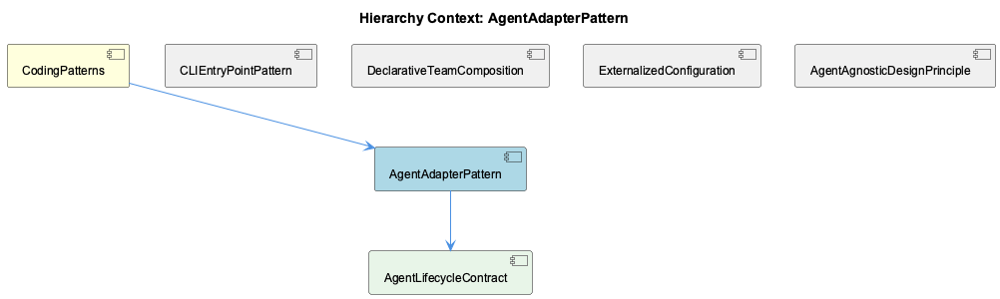
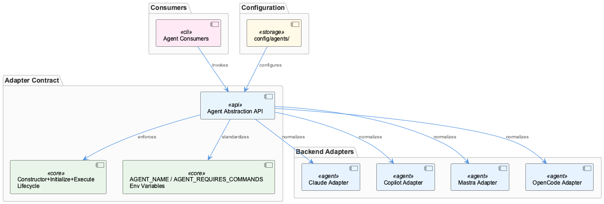

# AgentAdapterPattern

**Type:** SubComponent

docs/agent-integration-guide.md describes integration patterns for connecting Claude, Copilot, Mastra, and OpenCode under a shared interface, confirming multi-backend normalization as the core adapter responsibility

# AgentAdapterPattern

## What It Is

AgentAdapterPattern is a structural design pattern implemented across the Coding project that normalizes multiple AI backends — Claude, Copilot, Mastra, and OpenCode — behind a single unified interface. Its implementation is grounded in several key locations: the contract is defined in `docs/architecture/agent-abstraction-api.md`, onboarding procedures are codified in `docs/architecture/adding-new-agent.md`, integration patterns across all four backends are described in `docs/agent-integration-guide.md`, and per-agent runtime configuration lives in the `config/agents/` directory.

The pattern exists as a named subcomponent within CodingPatterns, the project's architectural catch-all for cross-cutting conventions. Its single child, AgentLifecycleContract, represents the concrete interface specification that every adapter must satisfy. Together they encode the project's commitment to backend interchangeability as a first-class concern.

## Architecture and Design

The core architectural decision is to impose a strict adapter boundary between AI backends and the rest of the system. Every backend, regardless of its native API shape, must be wrapped so that it presents the same surface to consumers. This is the Adapter pattern in its classical form: heterogeneous external systems are translated into a homogeneous internal interface without modifying either the consumer or the backend.

The interface contract itself is captured in `docs/architecture/agent-abstraction-api.md`, which AgentLifecycleContract directly implements. The contract enforces a three-phase invocation sequence — **constructor → initialize → execute** — documented in `CLAUDE.md` and enforced at the adapter layer. This lifecycle decomposition is a deliberate design choice: construction separates instantiation from readiness, initialization allows async setup (credential validation, connection establishment, model loading), and execution is the sole entry point for runtime work. Adapters for all four backends must map their native invocation sequences onto this three-phase shape.

Capability declaration is standardized through two environment variables — `AGENT_NAME` and `AGENT_REQUIRES_COMMANDS` — that each adapter exposes to the runtime. This makes backend identity and capability requirements discoverable without inspecting adapter internals, enabling the runtime to make routing and orchestration decisions uniformly across all backends.

The sibling pattern AgentAgnosticDesignPrinciple documents the philosophical commitment that motivates this structure: backend independence is a first-class architectural constraint, not an emergent property. AgentAdapterPattern is the mechanical implementation of that principle.

## Implementation Details

The `config/agents/` directory externalizes per-agent configuration, meaning the adapter code itself carries no backend-specific constants. Switching from one backend to another requires only a configuration change, not a code modification — a direct consequence of the ExternalizedConfiguration sibling pattern applied at the agent level. This separation means adapter classes are environment-agnostic; the same adapter binary can target different model endpoints or credential sets purely through config.

The `docs/architecture/adding-new-agent.md` document implies a fixed, step-by-step onboarding checklist, which in turn implies the adapter interface is stable and well-bounded. New adapters are not free-form implementations; they must satisfy the AgentLifecycleContract interface defined in `docs/architecture/agent-abstraction-api.md`. The existence of a formal onboarding guide signals that the adapter boundary has been designed to be crossed repeatedly, with low friction, by different implementors.

The two standardized environment variables (`AGENT_NAME`, `AGENT_REQUIRES_COMMANDS`) serve as a lightweight capability registry. Rather than a central registry service, each adapter self-declares its identity and requirements at startup. This keeps the adapter pattern decentralized — each adapter is self-contained — while still giving the runtime the metadata it needs for coordination.

## Integration Points

AgentAdapterPattern connects upward to CodingPatterns as one of several cross-cutting conventions that govern the project. It connects downward to AgentLifecycleContract, which is the concrete interface specification adapters must implement. Horizontally, it depends on ExternalizedConfiguration (credentials and endpoint URLs come from environment, not code) and enables DeclarativeTeamComposition (teams defined in `config/teams/` reference agents by name, relying on the adapter layer to make those names resolve to interchangeable backends).

The CLIEntryPointPattern sibling is also relevant: `bin/` scripts proxy to underlying services, and those underlying services interact with backends through the adapter interface. The adapter boundary is therefore the handoff point between CLI delegation and backend execution.

## Usage Guidelines

When adding a new backend, `docs/architecture/adding-new-agent.md` is the authoritative starting point. The adapter must implement the three-phase lifecycle (constructor, initialize, execute) as defined in AgentLifecycleContract, expose `AGENT_NAME` and `AGENT_REQUIRES_COMMANDS` as environment variables, and place its configuration in `config/agents/` rather than hardcoding values.

The configuration-over-code principle is strict: backend switching should never require modifying adapter source. If a code change is needed to switch backends, that is a signal the adapter has leaked backend-specific logic outside the `config/agents/` boundary. Similarly, capability declarations belong in environment variables, not in consumer code — consumers should query `AGENT_NAME` and `AGENT_REQUIRES_COMMANDS` rather than branching on known backend names.

The three-phase lifecycle is not optional. Collapsing initialization into construction, or skipping the initialize phase, breaks the contract that consumers depend on. The phase separation exists precisely because some backends require async setup that cannot complete synchronously during construction, and the execute phase must be guaranteed to run only after initialization is complete. Any new adapter must respect this ordering even if the backend's native API does not require it.

## Hierarchy Context

### Parent
- [CodingPatterns](./CodingPatterns.md) -- CodingPatterns serves as the architectural catch-all component for the Coding project, capturing cross-cutting programming conventions, design patterns, and best practices that permeate the entire codebase. The project follows consistent patterns visible across its configuration, tooling, and documentation: agent abstractions use a constructor+initialize+execute lifecycle, shell scripts in bin/ follow a proxy/delegation pattern to underlying services, and configuration is externalized into config/ YAML/JSON files rather than hardcoded values. The system emphasizes agent-agnostic design, enabling multiple AI backends (Claude, Copilot, Mastra, OpenCode) to operate under a unified interface.

### Children
- [AgentLifecycleContract](./AgentLifecycleContract.md) -- docs/architecture/agent-abstraction-api.md defines the unified Agent Abstraction API that all backends must conform to, establishing the interface contract adapters must satisfy

### Siblings
- [CLIEntryPointPattern](./CLIEntryPointPattern.md) -- CLAUDE.md describes bin/ scripts as proxies that delegate to underlying services, establishing delegation as the explicit architectural intent rather than an implementation detail
- [DeclarativeTeamComposition](./DeclarativeTeamComposition.md) -- config/teams/ directory holds JSON files that define which agents participate in a team and their roles, as described in the architecture documentation
- [ExternalizedConfiguration](./ExternalizedConfiguration.md) -- LLM_PROXY_URL, RAPID_LLM_PROXY_URL, OPENAI_API_KEY, and ANTHROPIC_API_KEY are all documented as environment variables rather than in-code constants, enforcing externalization at the credential level
- [AgentAgnosticDesignPrinciple](./AgentAgnosticDesignPrinciple.md) -- CLAUDE.md explicitly names agent-agnostic design as a core architectural principle, making backend independence a first-class documented constraint rather than an emergent property

---

*Generated from 6 observations*
