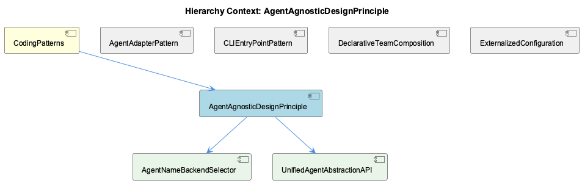
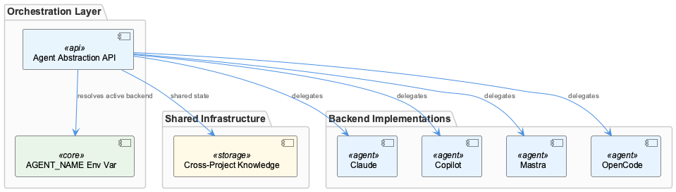

# AgentAgnosticDesignPrinciple

**Type:** SubComponent

The four supported backends (Claude, Copilot, Mastra, OpenCode) are all documented in README.md as interchangeable under the unified interface, validating the principle at the product level

# AgentAgnosticDesignPrinciple

## What It Is

AgentAgnosticDesignPrinciple is a first-class architectural constraint documented in `CLAUDE.md` and formalized across `docs/architecture/agent-abstraction-api.md` and `docs/architecture/cross-project-knowledge.md`. It mandates that orchestration logic, shared state infrastructure, and tooling remain decoupled from any specific AI backend implementation. Rather than emerging organically from implementation choices, backend independence is an explicitly named, documented principle within the broader CodingPatterns component — sitting alongside siblings like AgentAdapterPattern and ExternalizedConfiguration as one of the project's core cross-cutting conventions.

The principle is validated at the product level by the four interchangeable backends documented in `README.md`: Claude, Copilot, Mastra, and OpenCode. These are not treated as alternative implementations of different contracts — they operate under a single unified interface, confirming that the principle holds end-to-end from documentation through runtime behavior.

## Architecture and Design

The principle is architecturally realized through two child components: AgentNameBackendSelector and UnifiedAgentAbstractionAPI. Together they form a clean two-layer separation — a runtime selection mechanism and a structural interface contract — that prevents backend-specific logic from leaking into calling code.

The UnifiedAgentAbstractionAPI, canonically specified in `docs/architecture/agent-abstraction-api.md`, defines the abstraction boundary that all backends must conform to. This is the contract that makes interchangeability possible. The sibling AgentAdapterPattern is the structural mechanism that enforces this contract — each backend is wrapped in an adapter that translates backend-specific invocation details into the unified interface. The design decision here is deliberate: orchestration code never calls a backend directly; it calls through the abstraction, keeping conditionals and backend-specific knowledge out of the business logic layer.

The AgentNameBackendSelector operationalizes selection at runtime through the `AGENT_NAME` environment variable. This is architecturally consistent with the ExternalizedConfiguration sibling pattern — just as `LLM_PROXY_URL`, `OPENAI_API_KEY`, and `ANTHROPIC_API_KEY` are externalized as environment variables rather than hardcoded values, so too is backend identity. The calling code reads `AGENT_NAME` to know which backend is active without encoding that logic as in-code conditionals. This is a significant design decision: it means swapping backends requires no code changes, only environment reconfiguration.

The cross-project knowledge system described in `docs/architecture/cross-project-knowledge.md` extends the principle beyond invocation: shared state infrastructure is also backend-agnostic. This confirms that the principle is not scoped narrowly to API call boundaries but applies to the entire runtime environment that agents operate within.

## Implementation Details

The mechanical implementation rests on two pillars. First, `AGENT_NAME` as a documented, first-class configuration point: by naming the active backend through an environment variable rather than a build flag or configuration file, the system achieves runtime flexibility without recompilation or redeployment. AgentNameBackendSelector reads this variable and routes accordingly — the selector is the single place where backend identity is known, keeping that knowledge from spreading.

Second, the Agent Abstraction API defined in `docs/architecture/agent-abstraction-api.md` serves as the canonical reference for what all adapters must implement. The parent CodingPatterns context notes that agent abstractions follow a constructor+initialize+execute lifecycle — this lifecycle is the concrete shape of the unified interface. Each of the four backends (Claude, Copilot, Mastra, OpenCode) must expose this lifecycle through its adapter, making them structurally substitutable.

No code symbols were surfaced in the analysis, so the implementation mechanics are understood primarily through documentation artifacts rather than direct code inspection. The authoritative sources are `CLAUDE.md` for the principle declaration, `docs/architecture/agent-abstraction-api.md` for the interface contract, and `README.md` for the product-level validation of interchangeability.

## Integration Points

AgentAgnosticDesignPrinciple integrates directly with AgentAdapterPattern, which provides the structural mechanism (the adapters themselves) that makes the abstraction contract real. Without adapters conforming to the UnifiedAgentAbstractionAPI, the principle would be aspirational rather than enforced. The CLIEntryPointPattern sibling is also relevant: `bin/` scripts delegate to underlying services without encoding backend logic, meaning the CLI layer respects the same abstraction boundary.

The DeclarativeTeamComposition sibling connects at the team configuration level — `config/teams/` JSON files define which agents participate in a team without specifying backend details, confirming that team orchestration is also insulated from backend specifics. ExternalizedConfiguration reinforces the principle by ensuring that backend-identifying credentials and URLs are environment-driven, not hardcoded.

The cross-project knowledge infrastructure documented in `docs/architecture/cross-project-knowledge.md` represents the broadest integration point: shared state that spans agent backends must itself be backend-neutral, meaning the principle propagates into data and memory layers, not just invocation layers.

## Usage Guidelines

Developers working within this system should treat `AGENT_NAME` as the single authoritative signal for backend identity. Any code that needs to vary behavior by backend should consult AgentNameBackendSelector through the established mechanism rather than introducing new backend-detection logic. Introducing backend-specific conditionals outside of the adapter layer violates the principle and undermines the interchangeability guarantee documented in `README.md`.

New backends should be introduced exclusively by implementing a new adapter conforming to the UnifiedAgentAbstractionAPI lifecycle (constructor+initialize+execute), registering with AgentNameBackendSelector, and documenting the backend in `README.md`. No changes to orchestration code, team composition files, or shared state infrastructure should be required — if they are, that signals a leakage of backend-specific assumptions that needs to be resolved at the adapter boundary.

The principle's documentation in `CLAUDE.md` as an explicit architectural constraint means it carries the same weight as other named patterns in CodingPatterns. It should be treated as a reviewer-enforceable rule, not a preference: pull requests that introduce backend-specific logic outside the adapter layer should be flagged as violations of a documented architectural principle, not merely style suggestions.

## Hierarchy Context

### Parent
- [CodingPatterns](./CodingPatterns.md) -- CodingPatterns serves as the architectural catch-all component for the Coding project, capturing cross-cutting programming conventions, design patterns, and best practices that permeate the entire codebase. The project follows consistent patterns visible across its configuration, tooling, and documentation: agent abstractions use a constructor+initialize+execute lifecycle, shell scripts in bin/ follow a proxy/delegation pattern to underlying services, and configuration is externalized into config/ YAML/JSON files rather than hardcoded values. The system emphasizes agent-agnostic design, enabling multiple AI backends (Claude, Copilot, Mastra, OpenCode) to operate under a unified interface.

### Children
- [AgentNameBackendSelector](./AgentNameBackendSelector.md) -- AGENT_NAME is listed as a key documented component in the project documentation, indicating it is a first-class configuration point for backend selection
- [UnifiedAgentAbstractionAPI](./UnifiedAgentAbstractionAPI.md) -- docs/architecture/agent-abstraction-api.md is titled 'Agent Abstraction API Reference', confirming it is the canonical specification for the backend-neutral interface

### Siblings
- [AgentAdapterPattern](./AgentAdapterPattern.md) -- docs/architecture/agent-abstraction-api.md defines the unified Agent Abstraction API that all backends must conform to, serving as the contract between adapters and consumers
- [CLIEntryPointPattern](./CLIEntryPointPattern.md) -- CLAUDE.md describes bin/ scripts as proxies that delegate to underlying services, establishing delegation as the explicit architectural intent rather than an implementation detail
- [DeclarativeTeamComposition](./DeclarativeTeamComposition.md) -- config/teams/ directory holds JSON files that define which agents participate in a team and their roles, as described in the architecture documentation
- [ExternalizedConfiguration](./ExternalizedConfiguration.md) -- LLM_PROXY_URL, RAPID_LLM_PROXY_URL, OPENAI_API_KEY, and ANTHROPIC_API_KEY are all documented as environment variables rather than in-code constants, enforcing externalization at the credential level

---

*Generated from 5 observations*
