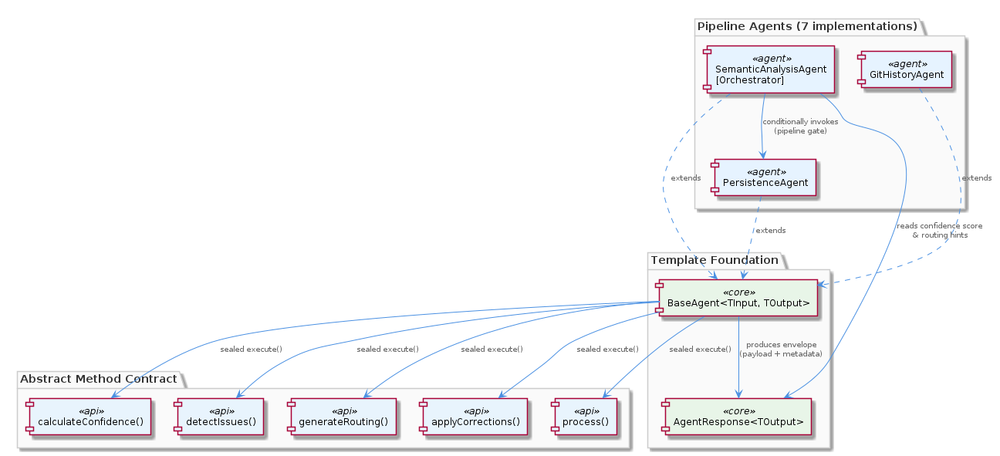
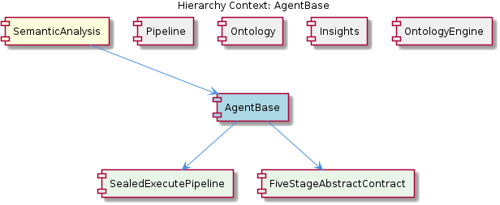

# AgentBase

**Type:** SubComponent

BaseAgent<TInput, TOutput> in integrations/mcp-server-semantic-analysis/src/agents/base-agent.ts uses a template-method pattern where execute() is sealed and unconditionally calls all five abstract methods: process(), calculateConfidence(), detectIssues(), generateRouting(), and applyCorrections()

# AgentBase — Technical Insight Document

## What It Is

`AgentBase` is implemented as the generic class `BaseAgent<TInput, TOutput>` in `integrations/mcp-server-semantic-analysis/src/agents/base-agent.ts`. It serves as the foundational abstract superclass for every specialized agent in the `SemanticAnalysis` subsystem, defining a rigid, uniform lifecycle that all concrete agents must honor. As a SubComponent of `SemanticAnalysis`, it provides the structural backbone that allows the seven specialized agents—`GitHistoryAgent`, `VibeHistoryAgent`, `CodeGraphAgent`, `OntologyClassificationAgent`, `SemanticAnalysisAgent`, `ContentValidationAgent`, and `PersistenceAgent`—to interoperate through a single, predictable contract.

The class establishes two complementary structural guarantees, modeled explicitly as its child entities: `SealedExecutePipeline` (the non-overridable top-level control flow) and `FiveStageAbstractContract` (the five typed semantic stages every agent must implement). Together these enforce both *what* an agent does and *in what order* it does it, producing a consistent `AgentResponse<TOutput>` envelope on every invocation.

## Architecture and Design

The architectural pattern at the core of `AgentBase` is the **template method pattern**, executed in a particularly strict form. The public `execute()` method is sealed—no concrete subclass can override it, reorder its steps, skip stages, or short-circuit the flow. Internally, `execute()` unconditionally invokes five protected abstract methods in fixed order: `process()`, `calculateConfidence()`, `detectIssues()`, `generateRouting()`, and `applyCorrections()`. This sealing behavior, captured by the child entity `SealedExecutePipeline`, is the key design lever that guarantees every agent run produces a fully-populated `AgentResponse<TOutput>` with consistent metadata.

The result envelope, `AgentResponse<TOutput>`, is a uniform wrapper carrying both the domain payload (`TOutput`) and pipeline metadata: timestamps, confidence score, detected issues, and routing hints. This envelope embodies what the architecture documentation (`docs/architecture/agents.md`) calls a **consistent observability contract**. Because the envelope shape is identical across all seven agents, monitoring, logging, and orchestration tooling can be written once and applied universally—there is no need for agent-specific telemetry adapters.

The design pairs this template structure with **dispatch-by-metadata**: the `routing` field returned by `generateRouting()` lets the orchestrating `SemanticAnalysisAgent` make conditional pipeline decisions—skipping persistence when confidence is low, re-running classification after corrections, etc.—without ever needing to know an individual agent's internals. Similarly, the `confidence` score from `calculateConfidence()` acts as a **pipeline gate**: the coordinator inspects it to decide whether to proceed to persistence or abort. This converts what could have been hard-coded conditional coupling into a declarative, metadata-driven flow.

## Implementation Details

The implementation centers on a single file: `integrations/mcp-server-semantic-analysis/src/agents/base-agent.ts`. Two generic type parameters, `TInput` and `TOutput`, parameterize the class so each concrete agent declares precise input/output types while still conforming to the shared envelope shape. The sealed `execute(input: TInput): AgentResponse<TOutput>` method composes the five stages in this canonical sequence:

1. **`process()`** — Data transformation. The core domain logic that converts `TInput` into a candidate `TOutput`. This is where each agent does its real work (e.g., `GitHistoryAgent` analyzes commits, `OntologyClassificationAgent` matches entities to the ontology schema).
2. **`calculateConfidence()`** — <USER_ID_REDACTED> scoring. Produces a numeric confidence value attached to the response, used downstream as a gating signal.
3. **`detectIssues()`** — Fault detection. Surfaces problems found during processing, populating `detectedIssues` in the envelope.
4. **`generateRouting()`** — Dispatch logic. Emits routing hints that inform the coordinator how the pipeline should proceed.
5. **`applyCorrections()`** — Self-healing. Allows the agent to remediate detected issues before finalizing output.

These five methods are codified as the `FiveStageAbstractContract` child entity. They are declared abstract with no opt-out mechanism: every agent must implement all five, even when a particular stage is a trivial no-op for its use case. For example, an agent with no self-healing concept must still implement `applyCorrections()`, typically as a pass-through. This is structurally enforced because `execute()` calls every method unconditionally, and TypeScript's abstract-method requirement prevents instantiation without all implementations.

The `AgentResponse<TOutput>` envelope is the unified return type. It wraps the `TOutput` payload alongside `timestamps`, `confidence`, `detectedIssues`, and `routing` fields. Because the envelope shape is invariant across agents, downstream consumers—the orchestrator, telemetry, and `PersistenceAgent`—can write generic code against `AgentResponse<unknown>` patterns.

## Integration Points

`AgentBase` sits at the heart of the `SemanticAnalysis` parent component and is consumed by every agent in the `Pipeline` sibling component. The `Pipeline` is orchestrated by a coordinator that sequences specialized agents (`GitHistoryAgent`, `VibeHistoryAgent`, `CodeGraphAgent`, etc.)—all of which extend `BaseAgent<TInput, TOutput>` and therefore expose the uniform `execute()` entry point. The orchestrator, which is itself the `SemanticAnalysisAgent`, leans on the metadata envelope to wire conditional flow without coupling to any agent's internals.

Two sibling components are direct downstream consumers. `Ontology`, via `OntologyClassificationAgent`, implements all five `BaseAgent` abstract methods to match entities against the ontology schema; it relies on `OntologyConfigManager` (from the `OntologyEngine` sibling, located in `src/ontology/`) to load definitions, keeping file I/O out of the agent itself. `Insights` operates further downstream still, consuming enriched `AgentResponse` payloads from `OntologyClassificationAgent` and `CodeGraphAgent` to synthesize higher-level patterns. Because all those payloads arrive wrapped in the same envelope, `Insights` can rely on uniform metadata access regardless of which agent produced the data.

The `confidence` and `routing` fields form the principal integration contract between agents and the orchestrator. The pipeline coordinator inspects `confidence` as a gate—deciding, for example, whether `PersistenceAgent` should be invoked at all—and reads `routing` hints to choose between alternative paths such as re-running classification after `applyCorrections()` produced changes. This metadata-driven coupling is the only integration surface the orchestrator needs to know about; agents remain opaque otherwise.

## Usage Guidelines

When adding a new agent to the `SemanticAnalysis` subsystem, developers must extend `BaseAgent<TInput, TOutput>` in `integrations/mcp-server-semantic-analysis/src/agents/` and implement all five abstract methods—`process()`, `calculateConfidence()`, `detectIssues()`, `generateRouting()`, and `applyCorrections()`. There is no mechanism to opt out: if a stage is meaningless for your agent, implement it as a deliberate no-op (for instance, returning the input unchanged from `applyCorrections()` or returning an empty array from `detectIssues()`). Do not attempt to override `execute()`; it is sealed by design (see `SealedExecutePipeline`) precisely to preserve the observability contract.

Treat `calculateConfidence()` with care because its output is a pipeline gate, not just decorative metadata. A miscalibrated score can cause the coordinator to wrongly skip `PersistenceAgent` or trigger unnecessary re-runs. Likewise, `generateRouting()` should emit only declarative hints the orchestrator already understands—do not invent ad-hoc routing tokens that the `SemanticAnalysisAgent` cannot interpret, as this would silently break conditional flow.

Always return data through the `AgentResponse<TOutput>` envelope rather than raw payloads. This envelope is what unifies monitoring and logging across all seven agents; bypassing it would break the consistent observability contract documented in `docs/architecture/agents.md`. When designing `TInput` and `TOutput` types, prefer narrow, well-defined shapes so the generic parameters carry real type safety into the orchestrator and downstream `Insights` consumers.

Finally, remember that the rigid lifecycle is a deliberate trade-off. It costs developers some boilerplate—every agent implements all five methods—in exchange for guaranteed uniformity, predictable telemetry, and metadata-driven orchestration that scales to any number of additional agents without coordinator changes. New agents should embrace this contract rather than work around it; the architecture's maintainability depends on every agent looking the same from the outside, even when their internal logic differs dramatically.

## Hierarchy Context

### Parent
- [SemanticAnalysis](./SemanticAnalysis.md) -- [LLM] The `BaseAgent<TInput, TOutput>` class defined in `integrations/mcp-server-semantic-analysis/src/agents/base-agent.ts` establishes a rigid, template-method-style lifecycle that all concrete agents must honor. The public `execute()` method is not meant to be overridden; instead it sequences five protected steps—`process()`, `calculateConfidence()`, `detectIssues()`, `generateRouting()`, and `applyCorrections()`—before wrapping the result in a typed `AgentResponse<TOutput>` envelope that carries both the domain payload and pipeline metadata (timestamps, confidence score, detected issues, routing hints). This design choice enforces a consistent observability contract across all seven specialized agents (`GitHistoryAgent`, `VibeHistoryAgent`, `CodeGraphAgent`, `OntologyClassificationAgent`, `SemanticAnalysisAgent`, `ContentValidationAgent`, and `PersistenceAgent`). A new developer adding an agent must implement all five abstract methods even if some steps are trivial no-ops for their use case; skipping them is structurally impossible because `execute()` calls them unconditionally. The metadata envelope returned by every agent means the orchestrating `SemanticAnalysisAgent` can make routing decisions—such as skipping persistence when confidence is too low or re-running classification after corrections—without knowing anything about each agent's internal logic.

### Children
- [SealedExecutePipeline](./SealedExecutePipeline.md) -- In `integrations/mcp-server-semantic-analysis/src/agents/base-agent.ts`, `execute()` is defined as sealed on `BaseAgent<TInput, TOutput>`, meaning no concrete subclass can override the top-level control flow or reorder, skip, or short-circuit any of the five stages.
- [FiveStageAbstractContract](./FiveStageAbstractContract.md) -- Declared in `integrations/mcp-server-semantic-analysis/src/agents/base-agent.ts`, the five abstract methods partition agent behavior into typed semantic stages: data transformation (`process`), <USER_ID_REDACTED> scoring (`calculateConfidence`), fault detection (`detectIssues`), dispatch logic (`generateRouting`), and self-healing (`applyCorrections`).

### Siblings
- [Pipeline](./Pipeline.md) -- The pipeline is orchestrated by a coordinator agent that sequences specialized agents (GitHistoryAgent, VibeHistoryAgent, CodeGraphAgent, etc.) defined in integrations/mcp-server-semantic-analysis/src/agents/
- [Ontology](./Ontology.md) -- OntologyClassificationAgent in integrations/mcp-server-semantic-analysis/src/agents/ implements all five BaseAgent abstract methods to classify entities against the defined ontology schema
- [Insights](./Insights.md) -- Insight generation operates downstream of classification, consuming enriched AgentResponse payloads from OntologyClassificationAgent and CodeGraphAgent to synthesize higher-level patterns
- [OntologyEngine](./OntologyEngine.md) -- OntologyConfigManager in src/ontology/ is responsible for loading and managing ontology configuration, making ontology definitions available to agents without requiring direct file I/O in each agent

---

*Generated from 6 observations*
